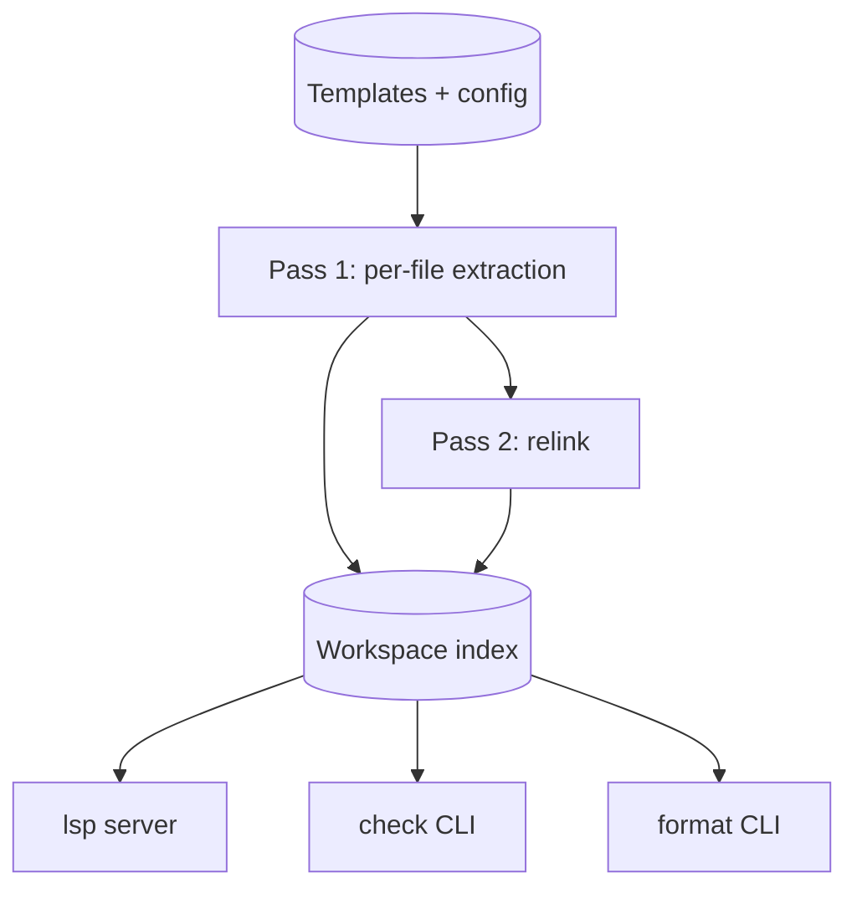

# jinja-lsp — Overview

> **Status:** Approved
>
> **Version:** 1.0   ·   **Last updated:** 2026-06-24
>
> **Purpose:** What jinja-lsp is, who it's for, and the shape of the whole thing — in plain language, before any technical detail.

---

## 1. What it is

jinja-lsp is a language server for **Jinja2 templates**. It watches your templates as you edit them and tells you, in your editor, when something is wrong — an undefined variable, a filter that doesn't exist, a block that doesn't match its parent — and helps you write them faster with completions, hover docs, jump-to-definition, and more.

It is a **specialist** server: it understands Jinja deeply and runs *alongside* your editor's existing language support, never replacing it. It reads templates statically — it never runs your code or renders a template — so it's safe to point at any project.

## 2. Who it's for

Developers writing Jinja2 templates in Python web projects — Flask, Starlette/FastAPI, or plain Jinja2. The running example throughout the suite is **`starlette-blog`**, a small Starlette blog with a base layout, post pages, a shared macro file, and an email digest. See the [constitution](constitution.md) for the full example cast.

## 3. What it does

- **Diagnostics** — 21 checks for undefined symbols, unused imports, duplicate/shadowed names, broken inheritance, bad calls, and missing templates. See [F01-diagnostics](features/F01-diagnostics.md).
- **Rich editing** — completions, hover docs (with 113 embedded built-in docs), signature help, go-to-definition, find-references, document & workspace symbols, highlights, folding, semantic tokens, inlay hints, and code lenses. See [F05](features/F05-completions.md)–[F16](features/F16-call-hierarchy.md).
- **Fixes & formatting** — quick-fixes and refactors driven by the diagnostics, plus a Jinja-aware formatter. See [F17-code-actions](features/F17-code-actions.md) and [F18-formatting](features/F18-formatting.md).
- **Framework awareness** — extension packs for Flask, Starlette, Starlette-Babel, and Starlette-Flash, plus user hint files for your own macros, filters, and context variables. See [F03-extension-packs](features/F03-extension-packs.md) and [F04-user-hints](features/F04-user-hints.md).
- **CLI** — the same engine as a headless linter (`check`) and formatter (`format`) for CI. See [F19-cli-linter](features/F19-cli-linter.md).

## 4. How it's shaped

One Rust binary with three front-ends — the `lsp` server, the `check` linter, and the `format` command — over a single shared pipeline. The pipeline extracts facts from each template's tree-sitter syntax tree (Pass 1), links them into a workspace index (Pass 2), and answers every request as a pure read of that index. See [E01-architecture](foundations/E01-architecture.md) for the detail.

## 5. What it is not

- **Not a renderer or runtime** — it never executes templates or Python (P1).
- **Not an HTML/host-language tool** — it formats and analyzes the Jinja layer only; HTML, SQL, and surrounding text are left to their own tools (P5).
- **Not a replacement for your Python LSP** — it's a companion that fires only inside Jinja constructs (P5).
- **Not a code generator or refactoring suite for the host language** — see the constitution §4.7 Non-Goals.

## 6. Cross-References

- **Related:** [roadmap](roadmap.md), [constitution](constitution.md), [E01-architecture](foundations/E01-architecture.md), [index](index.md).

## 7. Changelog

- **2026-06-24** — Initial overview.
- **2026-06-24** — Use the canonical pack identifiers (Starlette-Babel, Starlette-Flash) instead of "Babel, Flash".
