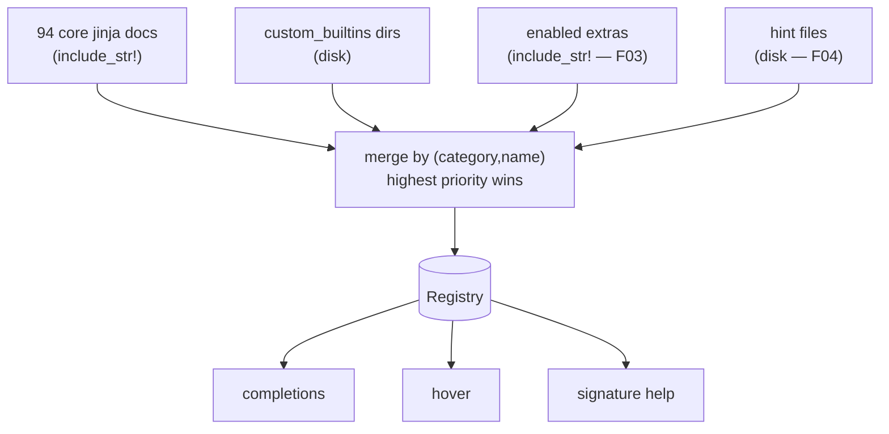

# F02 — Built-in Registry

> **Status:** Draft
>
> **Version:** 0.1   ·   **Last updated:** 2026-06-24
>
> **Purpose:** The unified documentation registry — one keyed store that merges core Jinja built-ins, extension packs, custom builtins, and user hints — and the embedded-markdown doc format every other feature reads to power completions, hover, and signature help.

> **Depends on:** [constitution](../constitution.md), [E03-tech-stack](../foundations/E03-tech-stack.md), [E15-app-config](../foundations/E15-app-config.md)   ·   **Related:** [F03-extension-packs](F03-extension-packs.md), [F04-user-hints](F04-user-hints.md), [F05-completions](F05-completions.md), [F06-hover](F06-hover.md), [F07-signature-help](F07-signature-help.md)

> Requirement tag: **BLTN**

---

## 1. Purpose & Scope

The registry is jinja-lsp's memory of what every filter, function, test, and variable *means*. When you hover `truncate`, complete after a `|`, or ask for signature help inside `url_for(`, the answer comes from here. It is one in-memory store, keyed by `(category, name)`, that merges four documentation sources into a single lookup.

This spec covers:

- The registry struct, its `(category, name)` key, and the four-source merge with its priority order.
- The **core doc format** — the YAML frontmatter and markdown body of a built-in `.md` file.
- **Attribute docs** — child entries like `loop.index`, stored as `(parent, attr)`.
- The **113** hand-written built-in doc files, embedded via `include_str!()`, preserving the `<category>/<type>_<name>.md` path convention.
- The **custom builtins** loader (the `custom_builtins` config key).

## 2. Non-Goals / Out of Scope

- The framework extension packs (`flask`, `starlette`, `starlette-babel`, …) — owned by [F03-extension-packs](F03-extension-packs.md).
- User hint files and the `context_variable` category — owned by [F04-user-hints](F04-user-hints.md).
- How completions, hover, and signature help consume the registry — owned by [F05](F05-completions.md), [F06](F06-hover.md), [F07](F07-signature-help.md).
- Config discovery and validation of `custom_builtins` / `extras` — owned by [E15-app-config](../foundations/E15-app-config.md).

## 3. Background & Rationale

jinja-lsp ships 113 hand-written markdown docs for Jinja built-ins and a few framework extras, each with a small YAML header. The interactive features (completions, hover, signature help) all need to read the *same* documentation. So instead of a flat list, we build one **registry**: every source — core, packs, custom builtins, hints — flows into a single keyed store, and every feature reads that store. One source of truth, four contributors.

Embedding the docs at compile time (`include_str!()`) keeps jinja-lsp a single binary with no runtime file I/O for built-ins and zero startup cost (ADR-004).

## 4. Concepts & Definitions

- **Built-in registry** — the unified, in-memory documentation store keyed by `(category, name)`. (Canonical definition in [glossary](../glossary.md).)
- **Doc entry** — one parsed `.md` file: YAML frontmatter (metadata) plus a markdown body (prose shown on hover).
- **Category** — `filter`, `function`, `test`, or `variable` in the core format; [F04](F04-user-hints.md) adds `context_variable`.
- **Attribute doc** — a child entry of a `variable`, keyed by `(parent, attr)`, e.g. `loop.index`.
- **Custom builtins** — user-supplied built-in-format docs loaded from `custom_builtins` directories. (Canonical definition in [glossary](../glossary.md).)

## 5. Detailed Specification

### 5.1 The registry and its key

At its heart the registry is a map. Every documented symbol is found by what *kind* of thing it is and its name — so `upper` the filter and `upper` the test (both exist in Jinja) never collide.

**REQ-BLTN-01 — The registry is keyed by `(category, name)`.**

Top-level entries are keyed by the pair `(category, name)` where category is one of `filter | function | test | variable` (plus `context_variable` from [F04](F04-user-hints.md)). Two symbols may share a name across categories; they are distinct entries. Lookup is by exact `(category, name)`; features that don't yet know the category (e.g. an identifier inside `{{ }}`) may scan by name across categories.

```rust
// src/builtins/registry.rs
pub struct Registry {
    entries: HashMap<(Category, String), DocEntry>,
    attributes: HashMap<(String, String), AttrDoc>, // (parent, attr)
}

pub struct DocEntry {
    pub name: String,
    pub category: Category,
    pub signature: Option<String>,
    pub since: Option<String>,
    pub params: Vec<Param>,
    pub body: String,        // markdown, rendered on hover
    pub source: Source,      // Core | Pack(name) | Custom | Hint
}

pub struct Param {
    pub name: String,
    pub ty: Option<String>,
    pub default: Option<String>,
    pub required: bool,
}
```

The `source` field records who contributed the entry — it is what makes the merge order (§5.2) auditable and lets [F03](F03-extension-packs.md) hide a disabled pack's symbols.

### 5.2 The four-source merge

The registry is assembled once at startup (and rebuilt on config/hint reload) by layering four sources. When two sources document the same `(category, name)`, the higher-priority one wins outright.

**REQ-BLTN-02 — Sources merge in priority order, highest wins.**

Sources are merged in this order, where a later (higher-priority) entry replaces an earlier one for the same key:

1. **Core** Jinja built-ins (the 94 embedded `jinja/` docs) — lowest priority.
2. **Custom builtins** (the `custom_builtins` config dirs).
3. **Extension packs** (the `extras` config — [F03](F03-extension-packs.md)).
4. **User hints** (sidecar + `hints` dirs — [F04](F04-user-hints.md)) — highest priority.

So a project that hints its own `join` overrides the built-in `join` ([F04](F04-user-hints.md)); a pack's `url_for` overrides a custom one; and core is the fallback floor. The merge is deterministic: same inputs, same registry.

> **Note:** "Priority hints > packs > custom_builtins > core" is the rule of thumb. Read it as *hints beat packs beat custom builtins beat core* — the list above is the authoritative order.

### 5.3 The core doc format

Every built-in is a markdown file with a YAML frontmatter header and a prose body. The header is the machine-readable metadata; the body is what you see on hover. Here is the `truncate` filter doc:

```markdown
<!-- src/builtins/docs/jinja/filter_truncate.md -->
---
name: "truncate"
category: "filter"
signature: "truncate(s, length=255, killwords=False, end='...', leeway=None)"
since: "2.0"
params:
  - name: "length"
    type: "int"
    default: "255"
    required: false
  - name: "killwords"
    type: "bool"
    default: "False"
    required: false
  - name: "end"
    type: "string"
    default: "'...'"
    required: false
  - name: "leeway"
    type: "int"
    default: "None"
    required: false
---

Truncates a string to a given length. If `killwords` is false, it will
cut at the last word boundary.

## Usage

```jinja
{{ "This is a long text" | truncate(10) }}
{{ text | truncate(50, killwords=True) }}
```
```

**REQ-BLTN-03 — Frontmatter fields and their meaning.**

The YAML frontmatter is parsed with `serde_yaml` ([E03](../foundations/E03-tech-stack.md)) into the `DocEntry`/`Param` types of §5.1. The fields are:

| Field | Required | Meaning |
|---|---|---|
| `name` | yes | the identifier (`truncate`) |
| `category` | yes | `filter` \| `function` \| `test` \| `variable` |
| `signature` | no | a Jinja2-style signature string, shown in hover/signature help |
| `since` | no | the Jinja version the symbol appeared in |
| `params` | no | a list of `{name, type, default, required}` for signature help ([F07](F07-signature-help.md)) |

Everything after the closing `---` is the markdown body, stored verbatim and rendered as `MarkupContent` on hover ([F06](F06-hover.md)).

**REQ-BLTN-04 — `serde_yaml` parses frontmatter only.**

`serde_yaml` is used **only** to parse this frontmatter block — never for config (config is TOML, [E15](../foundations/E15-app-config.md)). A doc file with malformed frontmatter is logged and skipped, never fatal (P3, §5.6).

### 5.4 Attribute docs

Some variables carry a tree of attributes. The classic case is `loop` inside a `` — `loop.index`, `loop.first`, `loop.last`, and the rest. The doc format records these in an `attrs:` list on a `variable` doc.

**REQ-BLTN-05 — Attribute docs are keyed `(parent, attr)`.**

A `variable` doc may declare an `attrs:` list. Each attribute becomes a separate entry keyed by `(parent_name, attr)` in the registry's attribute map. These power attribute completions (after `.`) in [F05](F05-completions.md) and attribute hover (`loop.index`) in [F06](F06-hover.md). Here is the `loop` doc, header only:

```yaml
# src/builtins/docs/jinja/var_loop.md (frontmatter)
name: "loop"
category: "variable"
scope: "for"
since: "2.0"
attrs:
  - name: "index"
    type: "int"
  - name: "first"
    type: "bool"
  - name: "last"
    type: "bool"
  # … index0, revindex, revindex0, length, cycle, depth, depth0,
  #   previtem, nextitem, changed
```

The optional `scope` field (e.g. `for`) records where the variable is available; features may use it to offer `loop.*` only inside a loop. [F04](F04-user-hints.md)'s `context_variable` reuses this same attribute mechanism for user-declared types like `post.title`.

### 5.5 The 113 built-in docs

jinja-lsp authors and ships every built-in doc file, embedding each one at compile time with its path layout intact.

**REQ-BLTN-06 — All 113 docs are embedded via `include_str!()`, paths preserved.**

The path convention is `<category>/<type>_<name>.md`, where `<category>` is the framework folder and `<type>` is the singular category prefix (`filter_`, `func_`, `test_`, `var_`). This spec owns the **94 core jinja** docs; the **19 pack docs** belong to [F03](F03-extension-packs.md) but are listed here for the full count:

| Folder | Owner | Count | Examples |
|---|---|---|---|
| `jinja/` | **F02 (this spec)** | **94** | `filter_upper.md`, `func_range.md`, `test_defined.md`, `var_loop.md` |
| `flask/` | [F03](F03-extension-packs.md) | 6 | `func_url_for.md`, `var_request.md` |
| `starlette/` | [F03](F03-extension-packs.md) | 2 | `func_url_for.md`, `var_request.md` |
| `starlette_babel/` | [F03](F03-extension-packs.md) | 10 | `filter_datetime.md`, `func__.md` |
| `starlette_flash/` | [F03](F03-extension-packs.md) | 1 | `func_get_flashed_messages.md` |
| | | **113** | |

The 94 core jinja docs break down as **50 filters**, **8 functions**, **31 tests**, and **5 variables** (`caller`, `kwargs`, `loop`, `self`, `varargs`). Each is loaded into the registry as a `Source::Core` entry at startup. Because the files are embedded, there is no runtime I/O and no way for a missing file to break startup (ADR-004).

> **Warning:** The doc names and prose are part of the user-visible contract; changing them is a user-visible change, not an internal refactor.

### 5.6 The custom builtins loader

Beyond the embedded core, a project can ship its own built-in-format docs — say, for a shared in-house filter library — via the `custom_builtins` config key.

**REQ-BLTN-07 — `custom_builtins` loads built-in-format docs from disk, non-fatally.**

Each directory in the `custom_builtins` list ([E15](../foundations/E15-app-config.md)) is scanned for `.md` files using the **same core format** as §5.3. They load at startup and on config reload, entering the registry as `Source::Custom` (priority above core, below packs and hints — §5.2). A malformed or unreadable custom doc is logged and skipped; it never aborts loading the others (P3, "degrade, don't fail"). Custom builtins are **not** an extension pack — packs are compiled in ([F03](F03-extension-packs.md)); custom builtins are read from disk.

## 6. UI Mockups

### 6.1 Rendered doc card

The doc card is the rendered form of a `DocEntry` — its signature, `since`, and markdown body. It is what [F06-hover](F06-hover.md) shows on hover and what [F05-completions](F05-completions.md) shows in the resolved documentation pane. Here it is for the `truncate` filter:

```
╭─ truncate ─────────────────────────────────── filter · since 2.0 ─╮
│  truncate(s, length=255, killwords=False, end='...', leeway=None)  │
│                                                                    │
│  Truncates a string to a given length. If killwords is false, it   │
│  will cut at the last word boundary.                               │
│                                                                    │
│  Usage                                                             │
│    {{ "This is a long text" | truncate(10) }}                      │
│    {{ text | truncate(50, killwords=True) }}                       │
╰────────────────────────────────────────────────────────────────────╯
```

States: full card (frontmatter + body) · body-only (no `signature`/`since`) · attribute card (a `(parent, attr)` entry, e.g. `loop.index — int`).

## 7. Visualizations

The startup assembly of the registry, as a flow:



## 8. Data Shapes

A parsed `DocEntry`, as it sits in the registry after loading `filter_truncate.md`:

```json
{
  "name": "truncate",
  "category": "filter",
  "signature": "truncate(s, length=255, killwords=False, end='...', leeway=None)",
  "since": "2.0",
  "params": [
    {"name": "length", "ty": "int", "default": "255", "required": false},
    {"name": "killwords", "ty": "bool", "default": "False", "required": false},
    {"name": "end", "ty": "string", "default": "'...'", "required": false},
    {"name": "leeway", "ty": "int", "default": "None", "required": false}
  ],
  "body": "Truncates a string to a given length…",
  "source": "Core"
}
```

## 9. Examples & Use Cases

In `starlette-blog`, a developer types `{{ post.title | tr` inside `templates/blog/post.html`. Completions ([F05](F05-completions.md)) scan the registry's `filter` entries by name prefix and offer `trim`, `truncate`. Selecting `truncate` and hovering it later shows the §6.1 doc card, rendered from the embedded `jinja/filter_truncate.md` body. If the team had its own `excerpt` filter, dropping an `excerpt.md` in a `custom_builtins` dir makes it appear in the same list with the same card — no code change, no restart beyond config reload.

## 10. Edge Cases & Failure Modes

- **Two sources document the same `(category, name)`** → the higher-priority source wins (§5.2); the loser is dropped, not merged field-by-field.
- **Malformed frontmatter in a core doc** → can't happen at runtime (embedded + tested at build), but the parser still degrades gracefully if it ever does.
- **Malformed or unreadable custom doc** → logged and skipped; sibling docs still load (REQ-BLTN-07).
- **A `variable` doc with no `attrs`** → loads fine; it simply contributes no `(parent, attr)` entries.
- **Same name as both a filter and a test** (e.g. `upper`) → two distinct entries; never collide (REQ-BLTN-01).

## 11. Testing

The registry is verified by unit tests over the embedded docs (parse + count + merge) plus integration tests that load custom builtins from a fixture.

### 11.1 Scope & coverage

Target: **100% of this spec's behavior is covered.** Every `REQ-BLTN-NN` maps to at least one test; the 94 core docs are asserted to parse and the 113-file path layout is asserted present. See the policy in [E17-testing](../foundations/E17-testing.md#2-coverage-policy).

### 11.2 Test plan

| Behavior / scenario | Type | Fixtures | Verifies |
|---|---|---|---|
| All 94 core docs parse; counts (50/8/31/5) match | unit | embedded docs | REQ-BLTN-03, REQ-BLTN-06 |
| All 113 doc paths exist under `<category>/<type>_<name>.md` | unit | embedded docs | REQ-BLTN-06 |
| Lookup by `(category, name)`; `upper` filter ≠ `upper` test | unit | embedded docs | REQ-BLTN-01 |
| `loop` produces `(loop, index)` … attribute entries | unit | embedded docs | REQ-BLTN-05 |
| Merge: hint > pack > custom > core for a shared key | unit | [starlette-blog](../foundations/E17-testing.md#5-fixtures-registry), user-hints | REQ-BLTN-02 |
| `custom_builtins` dir loads `.md` docs into the registry | integration | user-hints | REQ-BLTN-07 |
| Malformed custom doc is skipped, siblings still load | unit | user-hints | REQ-BLTN-07, REQ-BLTN-04 |

### 11.3 Fixtures

- Reuses [user-hints](../foundations/E17-testing.md#5-fixtures-registry) (a `custom_builtins` dir) and [starlette-blog](../foundations/E17-testing.md#5-fixtures-registry) for merge tests. The 113 embedded docs are themselves the unit-test corpus.

### 11.4 Requirement coverage

| Requirement | Covered by |
|---|---|
| REQ-BLTN-01 | `(category,name)` key + name-collision test |
| REQ-BLTN-02 | merge-priority test |
| REQ-BLTN-03 | frontmatter-parse test |
| REQ-BLTN-04 | malformed-frontmatter degrade test |
| REQ-BLTN-05 | `loop` attribute-doc test |
| REQ-BLTN-06 | doc-count + path-layout tests |
| REQ-BLTN-07 | custom-builtins load + skip tests |

## 12. End-to-End Test Plan

The registry has no LSP request of its own; it is exercised end to end through the features that read it — hover ([F06](F06-hover.md)) and completion ([F05](F05-completions.md)) — via `pytest-lsp` ([E29](../foundations/E29-e2e-testing.md)).

### 12.1 Coverage target

**100% of the registry's user-visible effect**, through the consuming features: a built-in's doc appears on hover, and a custom builtin appears in completions.

### 12.2 Scenarios

| # | Journey | Path | Expected outcome |
|---|---|---|---|
| E2E-01 | Hover `truncate` in a template | happy | hover body contains the `truncate` doc prose |
| E2E-02 | Complete after `\|` with a `custom_builtins` filter present | happy | the custom filter appears in the completion list |
| E2E-03 | Project hints a `join` filter | happy | hover on `join` shows the hint body, not the built-in (merge order) |

## 13. Non-Functional Requirements

### 13.1 Security & Privacy

- **Access & authorization** — local process, no auth boundary. Core/pack docs are compiled in; `custom_builtins` reads only the configured directories ([E15](../foundations/E15-app-config.md)).
- **Input & validation** — custom doc files are untrusted input: parsed with `serde_yaml`, never executed, and skipped on error (P1, P3).
- **Data sensitivity** — none; docs are documentation. Nothing leaves the machine (no network).

### 13.2 Accessibility

- **N/A** — no GUI; the editor renders all hover/completion UI (constitution §4.6).

### 13.4 Performance & Scale

- **Latency** — the registry is built once at startup (and on reload) and read by pure-function handlers; lookups are O(1) `HashMap` hits, well inside the < 100 ms completion budget (P6).
- **Volume & scale** — 113 embedded docs plus a handful of custom/hint entries; the whole registry fits in memory with negligible footprint.

## 15. Open Questions & Decisions

- **Decided** — docs are embedded at compile time (ADR-004); `serde_yaml` parses doc frontmatter only, config stays TOML; the 113 built-in docs ship embedded with their path layout.

## 16. Cross-References

- **Depends on:** [constitution](../constitution.md) — one-source-of-truth principle; [E03-tech-stack](../foundations/E03-tech-stack.md) — `serde_yaml` and `include_str!`; [E15-app-config](../foundations/E15-app-config.md) — the `custom_builtins` key.
- **Related:** [F03-extension-packs](F03-extension-packs.md) — the 19 pack docs and `extras`; [F04-user-hints](F04-user-hints.md) — hint docs and the highest-priority merge layer; [F05-completions](F05-completions.md), [F06-hover](F06-hover.md), [F07-signature-help](F07-signature-help.md) — the readers of this registry.

## 17. Changelog

- **2026-06-24** — Initial draft.
