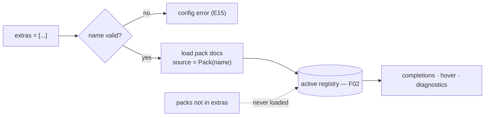

# F03 — Extension Packs

> **Status:** Draft
>
> **Version:** 0.1   ·   **Last updated:** 2026-06-24
>
> **Purpose:** The framework extension packs — `flask`, `starlette`, `starlette-babel`, and `starlette-flash` — that teach jinja-lsp the globals and filters a web framework injects, activated through the `extras` config key.

> **Depends on:** [constitution](../constitution.md), [F02-builtin-registry](F02-builtin-registry.md), [E15-app-config](../foundations/E15-app-config.md)   ·   **Related:** [F04-user-hints](F04-user-hints.md), [F05-completions](F05-completions.md), [F06-hover](F06-hover.md), [F01-diagnostics](F01-diagnostics.md)

> Requirement tag: **EXT**

---

## 1. Purpose & Scope

Web frameworks inject their own globals into every template — Flask gives you `url_for` and `request`, Starlette its own `request`, Babel its date filters. None of that is plain Jinja, so without help jinja-lsp would flag `url_for` as undefined. Extension packs fix that: turn one on via `extras` and its symbols become known to completions, hover, and diagnostics.

This spec covers:

- The four packs and their exact symbol catalogs (19 docs).
- How packs activate through the `extras` config key, and how they enter the registry.
- The activation contract: a disabled pack is invisible everywhere.

## 2. Non-Goals / Out of Scope

- The registry struct, merge order, and core doc format — owned by [F02-builtin-registry](F02-builtin-registry.md).
- `custom_builtins` and user hints (which are *not* packs — they load from disk) — owned by [F02](F02-builtin-registry.md) / [F04](F04-user-hints.md).
- `extras` config parsing and validation — owned by [E15-app-config](../foundations/E15-app-config.md) (this spec defines what counts as a valid name).
- How completions/hover read pack symbols — owned by [F05](F05-completions.md) / [F06](F06-hover.md).

## 3. Background & Rationale

jinja-lsp ships framework docs for Flask, Starlette, and two Starlette add-ons — 19 markdown files in the core built-in format. These aren't always-on built-ins, they're **opt-in packs** gated by `extras`, so a Flask project doesn't get Starlette's `request` and vice-versa.

Like core docs, pack docs are embedded at compile time via `include_str!()` (ADR-004) — a pack is just a named bundle of compiled-in doc entries.

## 4. Concepts & Definitions

- **Extension pack (extra)** — a named bundle of framework globals/filters activated via `extras`. (Canonical definition in [glossary](../glossary.md).)
- **Pack symbol** — one `DocEntry` ([F02](F02-builtin-registry.md)) contributed by a pack, carrying `source = Pack(name)`.
- **Active set** — the registry view containing only enabled packs' symbols, the only view features ever read.

## 5. Detailed Specification

### 5.1 Activation via `extras`

A pack does nothing until you name it. The `extras` config key ([E15](../foundations/E15-app-config.md)) is a list of pack names; each one switches its bundle on.

**REQ-EXT-01 — `extras` activates packs; unknown names are config errors.**

`extras` accepts these names and no others: `flask`, `starlette`, `starlette-babel`, `starlette-flash`. An unknown name (e.g. `extras = ["fastapi"]`) is a **config error** reported by [E15](../foundations/E15-app-config.md) — not silently ignored. The `starlette-blog` fixture sets `extras = ["starlette"]`, which is why `request` resolves in its templates.

**REQ-EXT-02 — Pack docs are embedded and enter the registry as `Pack(name)`.**

Every pack doc is embedded via `include_str!()` at compile time. When a pack is active, its docs load into the unified registry ([F02](F02-builtin-registry.md)) with `source = Pack(name)`, at pack priority — above `core` and `custom_builtins`, below `hints` (the merge order is owned by [F02 §5.2](F02-builtin-registry.md)). So a pack's `url_for` overrides the absence of one in core, but a user hint still wins.

### 5.2 The activation contract

The whole point of opt-in is isolation: turning a pack off must make it as if the pack never existed.

**REQ-EXT-03 — A disabled pack's symbols are invisible everywhere.**

If a pack is not in `extras`, none of its symbols appear in completions ([F05](F05-completions.md)), produce hover docs ([F06](F06-hover.md)), or suppress diagnostics ([F01](F01-diagnostics.md)). Concretely: with no `extras`, using `{{ url_for('index') }}` raises `JINJA-E103 undefined-function`; adding `extras = ["flask"]` clears it, because `url_for` is now a known function. Features only ever read the active set (§4).

### 5.3 The framework packs (19 docs)

These four packs are authored in the core doc format ([F02 §5.3](F02-builtin-registry.md)).

**REQ-EXT-04 — The four framework packs ship their full catalogs.**

| Pack | Folder | Docs | Symbols |
|---|---|---|---|
| **flask** | `flask/` | 6 | `func_url_for`, `func_get_flashed_messages`, `var_request`, `var_session`, `var_g`, `var_config` |
| **starlette** | `starlette/` | 2 | `func_url_for`, `var_request` |
| **starlette-babel** | `starlette_babel/` | 10 | `filter_date`, `filter_datetime`, `filter_time`, `filter_timedelta`, `filter_number`, `filter_currency`, `filter_percent`, `filter_scientific`, `func__`, `func__p` |
| **starlette-flash** | `starlette_flash/` | 1 | `func_get_flashed_messages` |

That is **19** pack docs. Note `flask` and `starlette` both define `url_for` and `request` with framework-specific bodies — they're different docs in different folders, and you only get the one whose pack is active (and turning on both is a user choice whose merge follows [F02 §5.2](F02-builtin-registry.md)).

### 5.4 Pack vs custom builtins vs hints

It's worth being precise about what a pack is *not*, because three things contribute framework-ish symbols.

**REQ-EXT-05 — Packs are compiled-in; custom builtins and hints are not.**

A **pack** is a compiled-in bundle gated by `extras`. **Custom builtins** ([F02 §5.6](F02-builtin-registry.md)) load built-in-format docs from `custom_builtins` *directories* on disk. **Hints** ([F04](F04-user-hints.md)) load project-local docs from sidecars and `hints` dirs. All three land in the same registry, but only packs are part of the binary and only packs are toggled by `extras`.

## 6. UI Mockups

### 6.1 Pack symbol catalog

A read-only catalog of what each pack contributes — the view a user consults to decide which `extras` to enable, and the same data completions draw from when a pack is active. Rendered here as the doc-browser / `--list-extras` style table:

```
 extras = ["starlette", "starlette-babel"]          (2 of 4 packs active)
 ┌──────────────────┬──────────┬──────────────────────────────────────────┐
 │ pack             │ kind     │ symbol                                    │
 ├──────────────────┼──────────┼──────────────────────────────────────────┤
 │ ● starlette      │ function │ url_for(name, **path_params)              │
 │ ● starlette      │ variable │ request                                   │
 │ ● starlette-babel│ filter   │ datetime · date · time · timedelta        │
 │ ● starlette-babel│ filter   │ number · currency · percent · scientific  │
 │ ● starlette-babel│ function │ _(message) · _p(singular, plural, n)      │
 ├──────────────────┼──────────┼──────────────────────────────────────────┤
 │ ○ flask          │ —        │ disabled — symbols invisible              │
 │ ○ starlette-flash│ —        │ disabled — symbols invisible              │
 └──────────────────┴──────────┴──────────────────────────────────────────┘
   ● active     ○ disabled (REQ-EXT-03: invisible to completions/hover/diag)
```

States: some active · all active · none active (registry is core-only) · unknown name in `extras` (config error banner from [E15](../foundations/E15-app-config.md)).

## 7. Visualizations

How `extras` gates which docs reach the active registry:



## 8. Data Shapes

A pack doc, once parsed, is an ordinary `DocEntry` ([F02 §8](F02-builtin-registry.md)) tagged with its pack source:

```json
{
  "name": "url_for",
  "category": "function",
  "signature": "url_for(name, **path_params)",
  "params": [
    {"name": "name", "ty": "string", "required": true},
    {"name": "**path_params", "ty": "any", "required": false}
  ],
  "body": "Generates a URL for the given route name…",
  "source": "Pack(starlette)"
}
```

## 9. Examples & Use Cases

The `starlette-blog` cast sets `extras = ["starlette"]`. In `templates/email/digest.html`, the line `{{ url_for('post', slug=post.slug) }}` resolves cleanly: `url_for` is a known Starlette function, so no `JINJA-E103` fires, hover shows the Starlette `url_for` doc, and completion offers it after typing `url_`. If the developer removed `starlette` from `extras`, that same line would immediately raise `JINJA-E103 undefined-function` — the pack's invisibility is what makes the diagnostic correct (REQ-EXT-03).

## 10. Edge Cases & Failure Modes

- **Unknown name in `extras`** → config error from [E15](../foundations/E15-app-config.md); valid packs in the same list still activate.
- **Both `flask` and `starlette` enabled** → both contribute a `url_for`/`request`; the merge follows [F02 §5.2](F02-builtin-registry.md) (deterministic, last-loaded pack wins for the shared key).
- **`starlette-flash` alone** → contributes only `get_flashed_messages`; harmless overlap if `flask` (which also defines it) is on.
- **A hint overrides a pack symbol** → the hint wins (hints outrank packs, [F02 §5.2](F02-builtin-registry.md)).
- **No `extras` at all** → registry is core jinja only; framework globals correctly read as undefined.

## 11. Testing

Packs are verified by unit tests over each embedded catalog plus integration tests that toggle `extras` and assert symbol visibility.

### 11.1 Scope & coverage

Target: **100% of this spec's behavior is covered.** Every `REQ-EXT-NN` maps to a test; each pack's doc count is asserted. See the policy in [E17-testing](../foundations/E17-testing.md#2-coverage-policy).

### 11.2 Test plan

| Behavior / scenario | Type | Fixtures | Verifies |
|---|---|---|---|
| Each pack loads its exact doc count (6/2/10/1) | unit | embedded docs | REQ-EXT-04 |
| Unknown `extras` name → config error | unit | config-reload | REQ-EXT-01 |
| Pack symbols enter the registry as `Pack(name)` | unit | [starlette-blog](../foundations/E17-testing.md#5-fixtures-registry) | REQ-EXT-02 |
| Disabled pack symbol → `JINJA-E103`; enabling clears it | integration + golden | [starlette-blog](../foundations/E17-testing.md#5-fixtures-registry) | REQ-EXT-03 |
| Pack ≠ custom builtins ≠ hints (distinct load paths) | unit | user-hints | REQ-EXT-05 |
| Both `flask` + `starlette` enabled → both contribute `url_for`/`request`; deterministic merge | unit | embedded docs | REQ-EXT-02 |
| No `extras` → registry is core-only; framework globals read as undefined | integration | [starlette-blog](../foundations/E17-testing.md#5-fixtures-registry) | REQ-EXT-03 |

### 11.3 Fixtures

- Reuses [starlette-blog](../foundations/E17-testing.md#5-fixtures-registry) (`extras = ["starlette"]`) and [config-reload](../foundations/E17-testing.md#5-fixtures-registry) (toggling `extras`). The embedded pack docs are the unit-test corpus.

### 11.4 Requirement coverage

| Requirement | Covered by |
|---|---|
| REQ-EXT-01 | unknown-extras config-error test |
| REQ-EXT-02 | pack-source registry test |
| REQ-EXT-03 | disabled-pack visibility test (golden) |
| REQ-EXT-04 | existing-pack doc-count tests |
| REQ-EXT-05 | load-path distinction test |

## 12. End-to-End Test Plan

Packs are exercised end to end through diagnostics ([F01](F01-diagnostics.md)) and hover/completions ([F06](F06-hover.md)/[F05](F05-completions.md)) — toggling `extras` and observing the effect via `pytest-lsp` and golden `check` ([E29](../foundations/E29-e2e-testing.md)).

### 12.1 Coverage target

**100% of the activation contract**, end to end: enabling a pack clears the undefined diagnostic and surfaces the symbol; disabling restores it.

### 12.2 Scenarios

| # | Journey | Path | Expected outcome |
|---|---|---|---|
| E2E-01 | Open a template using `url_for` with `extras=["starlette"]` | happy | no `JINJA-E103`; hover shows the Starlette `url_for` doc |
| E2E-02 | Remove `starlette` from `extras`, reload | error | `JINJA-E103 undefined-function` now fires on `url_for` |
| E2E-03 | Set `extras=["fastapi"]` | error | config-error diagnostic; previous config retained |
| E2E-04 | Enable `flask`, hover `url_for` | happy | hover renders the Flask `url_for` doc body |

## 13. Non-Functional Requirements

### 13.1 Security & Privacy

- **Access & authorization** — local process, no auth boundary. All pack docs are compiled into the binary; activation reads only the `extras` config key.
- **Input & validation** — `extras` names are validated against the fixed pack list (REQ-EXT-01); an invalid name is a reported error, never executed.
- **Data sensitivity** — none; packs are documentation. No network access.

### 13.2 Accessibility

- **N/A** — no GUI; the editor renders all UI (constitution §4.6).

### 13.4 Performance & Scale

- **Latency** — packs load once at startup/reload into the same registry read by pure-function handlers; zero per-request cost beyond the O(1) lookup of [F02](F02-builtin-registry.md), inside the < 100 ms budget (P6).
- **Volume & scale** — 19 pack docs added to the registry; negligible.

## 15. Open Questions & Decisions

- **Decided** — packs are compiled-in and gated by `extras` (not disk-loaded like custom builtins).

## 16. Cross-References

- **Depends on:** [constitution](../constitution.md) — opt-in, degrade-don't-fail; [F02-builtin-registry](F02-builtin-registry.md) — the registry, doc format, and merge order packs feed into; [E15-app-config](../foundations/E15-app-config.md) — the `extras` key and its validation.
- **Related:** [F04-user-hints](F04-user-hints.md) — the disk-loaded sibling of packs; [F01-diagnostics](F01-diagnostics.md) — what a disabled pack's invisibility makes correct; [F05-completions](F05-completions.md), [F06-hover](F06-hover.md) — the readers of pack symbols.

## 17. Changelog

- **2026-06-25** — Removed Django support: dropped the `django` pack (removing its former REQ-EXT-05; the pack-vs-builtins-vs-hints requirement renumbered REQ-EXT-06 → REQ-EXT-05), leaving four framework packs (`flask`, `starlette`, `starlette-babel`, `starlette-flash`).
- **2026-06-24** — Initial draft.
