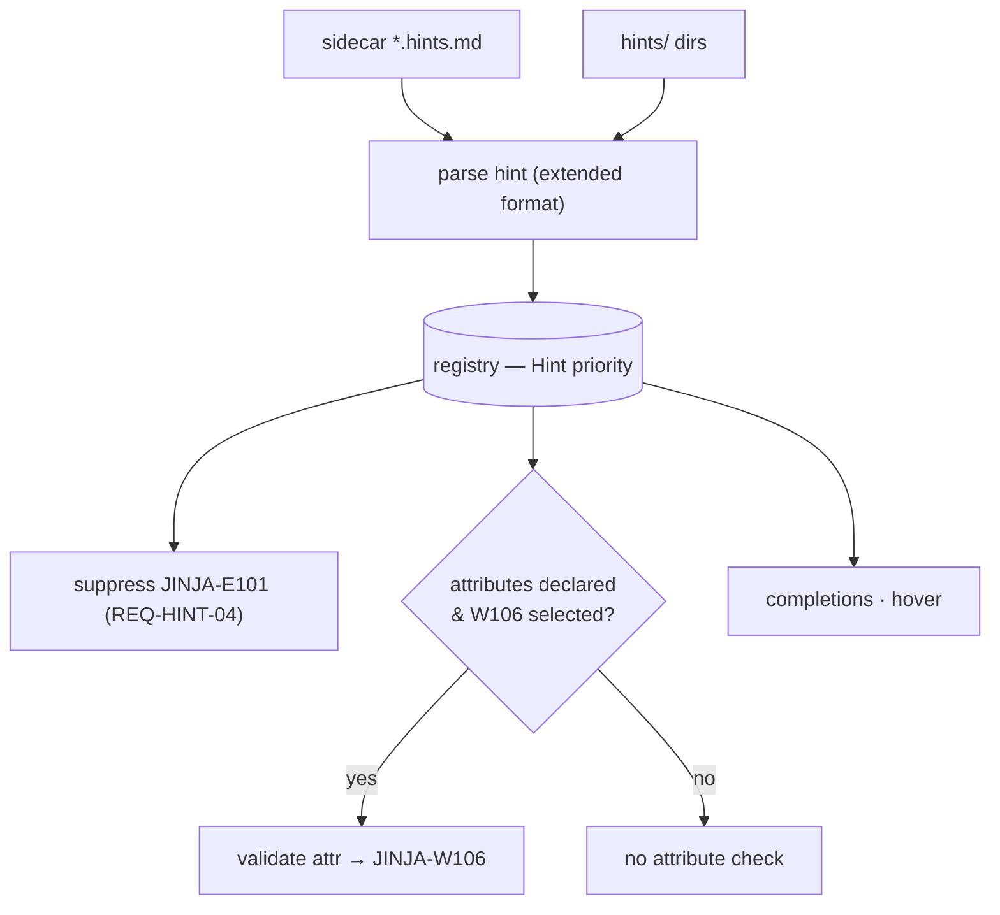

# F04 — User Hints

> **Status:** Approved
>
> **Version:** 0.1   ·   **Last updated:** 2026-06-24
>
> **Purpose:** Project-local hint files that let users document their own macros, filters, tests, and Python-injected context variables — so jinja-lsp understands them without running the host code — and the new, hint-gated `JINJA-W106 unknown-attribute` check this spec owns.

> **Depends on:** [constitution](../constitution.md), [F02-builtin-registry](F02-builtin-registry.md), [E15-app-config](../foundations/E15-app-config.md), [E01-architecture](../foundations/E01-architecture.md)   ·   **Related:** [F01-diagnostics](F01-diagnostics.md), [F03-extension-packs](F03-extension-packs.md), [F05-completions](F05-completions.md), [F06-hover](F06-hover.md)

> Requirement tag: **HINT**

---

## 1. Purpose & Scope

jinja-lsp can't see what your Python code injects into a template. It never runs the code (P1), so a context variable like `post` or `user` is invisible — and that means a false `undefined-variable` on every use. Hint files are the cure: small markdown docs where *you* tell the LSP what those symbols are. Document `user` and its attributes once, and the false positives vanish, completions light up, and hover works.

This spec covers:

- The two discovery mechanisms — **sidecar files** and configured **`hints` directories**.
- The **extended hint format** — a superset of the [F02](F02-builtin-registry.md) built-in format, adding the `context_variable` category, an optional `template` scope, and an `attributes` list.
- The effect on diagnostics: suppressing `JINJA-E101`, and the new **`JINJA-W106 unknown-attribute`** check (owned here).
- The effect on completions and hover.
- Merge into the registry at highest priority, and live reload.

## 2. Non-Goals / Out of Scope

- The registry struct, key, and core doc format — owned by [F02-builtin-registry](F02-builtin-registry.md).
- The compiled-in framework packs — owned by [F03-extension-packs](F03-extension-packs.md).
- The other 20 diagnostic codes and the `noqa` mechanism — owned by [F01-diagnostics](F01-diagnostics.md). (`JINJA-W106` is owned **here**.)
- `hints` config-key discovery mechanics — owned by [E15-app-config](../foundations/E15-app-config.md) (this spec defines what the files contain).

## 3. Background & Rationale

The hardest false positive for any template linter is the context variable. `{{ post.title }}` is perfectly valid — `post` came from a view function — but static analysis can't know that without executing Python, which P1 forbids. Static analysis alone cannot flag undefined variables reliably for this reason.

Hints solve it the right way: declarative, project-owned, no code execution. You write a little markdown describing `post`, the LSP reads it, and now it knows. And because you've also listed `post`'s attributes, the LSP can go one step further — gently flag `post.titel` as a likely typo. That's the new `JINJA-W106`, and it's deliberately cautious: off by default, never firing unless you've declared an attribute list, because a half-finished list would be a false-positive machine.

## 4. Concepts & Definitions

- **Hint file** — a project-local markdown doc documenting user symbols. (Canonical definition in [glossary](../glossary.md).)
- **Sidecar file** — a hint file beside its template (`post.html.hints.md` next to `post.html`). (Canonical definition in [glossary](../glossary.md).)
- **Context variable** — a variable injected by host code at render time, invisible to static analysis unless hinted, e.g. `post`. (Canonical definition in [glossary](../glossary.md).)
- **Template scope** — the optional `template` frontmatter field that limits a hint to one template.

## 5. Detailed Specification

### 5.1 Two discovery mechanisms

Hints are found two ways, and both are active at once. One is convention (a file next to your template); the other is configuration (a directory of shared hints).

**REQ-HINT-01 — Sidecar files are auto-discovered beside templates.**

When the LSP indexes a template `post.html`, it looks for `post.html.hints.md` in the same directory. If present, its hints apply to that template by default. Sidecars need no config — they're discovered automatically whenever the matching template is indexed.

**REQ-HINT-02 — Configured `hints` directories are scanned globally.**

Every directory in the `hints` config key ([E15](../foundations/E15-app-config.md)) is scanned at startup and on config reload. A hint file here is **global** (available in all templates) unless its frontmatter sets a `template` field (§5.2), which scopes it to that one template. The `hints` key is separate from `custom_builtins` ([F02](F02-builtin-registry.md)) on purpose: custom builtins are "third-party built-ins," hints are "this project's own symbols."

### 5.2 The extended hint format

A hint file is a built-in doc with extras. Everything from the [F02](F02-builtin-registry.md) core format works unchanged; hints add one new category and two new fields.

**REQ-HINT-03 — The hint format is a superset of the core doc format.**

Standard categories (`filter`, `function`, `test`, `variable`) behave exactly as built-ins ([F02 §5.3](F02-builtin-registry.md)). Hints add:

- a new category, **`context_variable`**, for a template-context variable;
- an optional **`template`** field — when set, the hint applies only to that template; when absent, it's global;
- a **`type`** field — the Python type name, informational only (shown in hover);
- an **`attributes`** list — `{name, type}` entries describing the variable's attribute tree.

Here is a hint documenting the `user` context variable, in a `hints` directory:

```markdown
<!-- hints/user.hints.md -->
---
name: "user"
category: "context_variable"
template: "blog/post.html"   # optional; omit for global scope
type: "User"                 # informational
attributes:
  - name: name
    type: string
  - name: email
    type: string
  - name: avatar_url
    type: string
---

The currently authenticated user, injected by the auth middleware.
```

The markdown body below the frontmatter is what hover renders ([F06](F06-hover.md)). The `attributes` list reuses the same attribute mechanism as built-in `loop.*` docs ([F02 §5.4](F02-builtin-registry.md)) — each entry becomes a `(parent, attr)` registry entry, e.g. `(user, email)`.

### 5.3 Effect on diagnostics

Hints don't just add documentation — they change what diagnostics fire. Declaring a context variable tells the LSP "this name is real," which silences the false positive; declaring its attributes lets the LSP catch typos.

**REQ-HINT-04 — A hinted `context_variable` suppresses `JINJA-E101`.**

A `context_variable` hint makes its `name` a known in-scope variable, so `JINJA-E101 undefined-variable` ([F01](F01-diagnostics.md)) no longer fires for it. The suppression is scoped: a `template`-scoped hint suppresses only in that template; a global hint suppresses everywhere. This is how `{{ post.title }}` stops being flagged once `post` is hinted.

**REQ-HINT-05 — `JINJA-W106 unknown-attribute` — definition (owned by this spec).**

This spec **owns** `JINJA-W106 unknown-attribute`, the 21st diagnostic code (constitution §4.2). It is the most cautious check in the suite:

- **What it detects** — an attribute access `var.attr` (or `var["attr"]`) where `var` is a hinted `context_variable` that declares an `attributes` list, and `attr` is **not** in that list. Example: `post.titel` when `post` declares `title`, `slug`, `body`, `author`.
- **Hint-gated** — it fires **only** against hinted variables. A variable with no hint, or a hinted variable with **no `attributes` declaration**, never produces `W106`. An empty or absent `attributes` list means "I haven't enumerated these," not "there are none."
- **Off by default** — even when an `attributes` list exists, `W106` does not run unless the user opts in via `lint.select` (e.g. `select = ["JINJA-W106"]` or `JINJA-W`). It is the only check off by default ([F01 §5.3](F01-diagnostics.md)).
- **Severity** — warning (`W`), never error. A typo is a suggestion, not a failure.
- **Pass** — Pass 1 (per-file), since it reads one template's attribute accesses against the registry.

> **Warning:** `W106` exists because incomplete `attributes` lists are dangerous. If it fired by default, every under-documented hint would spew false positives. Hence the triple gate: hinted **and** has an `attributes` list **and** explicitly selected. Only then does jinja-lsp presume the list is complete enough to judge against.

The fix offered for `W106` ("did you mean `title`?") lives in [F17-code-actions](F17-code-actions.md); the catalog entry lives in [F01 §5.1](F01-diagnostics.md) (cross-referenced to here).

### 5.4 Effect on completions and hover

Hinted symbols are first-class everywhere a built-in would be.

**REQ-HINT-06 — Hinted symbols appear in completions and hover.**

A hinted filter/function/test/variable appears in the relevant completion list ([F05](F05-completions.md)); a hinted `context_variable`'s `attributes` appear as attribute completions after `.`. Hover ([F06](F06-hover.md)) on any hinted symbol renders the hint file's markdown body, and hover on an attribute shows its `{name, type}`.

### 5.5 Merge priority and live reload

Hints are the highest-priority registry contributor, and they reload without a restart.

**REQ-HINT-07 — Hints merge at highest priority.**

Hint entries load into the unified registry ([F02 §5.2](F02-builtin-registry.md)) as `source = Hint`, above core, custom builtins, and packs. So a project hint for `join` overrides the built-in `join` filter doc for that project — the team's own documentation wins.

**REQ-HINT-08 — Hints live-reload on file change.**

Both sidecar and configured-dir hint files are watched via `workspace/didChangeWatchedFiles` ([E01 §5.3](../foundations/E01-architecture.md)). On change, the affected hints are re-read and the registry rebuilt — no LSP restart, just like the config file ([E15](../foundations/E15-app-config.md)). A malformed hint is logged and skipped; the rest still load (P3).

## 6. UI Mockups

### 6.1 A hint file and the completion + hover it powers

The hint file on the left declares `post`; the editor surfaces on the right are what that single file unlocks. This is the contract between a hint and the features that read it.

```
  hints/post.hints.md                     editor — templates/blog/post.html
  ─────────────────────────────          ──────────────────────────────────────
  ---                                      {{ post.| }}
  name: "post"                                      └─▶ ╭─ completions ──────────╮
  category: "context_variable"                        │ ⊙ title      string     │
  type: "Post"                                         │ ⊙ slug       string     │
  attributes:                                          │ ⊙ body       string     │
    - name: title                                      │ ⊙ author     User       │
      type: string                                     ╰─────────────────────────╯
    - name: slug
      type: string                          hover on `post`:
    - name: body                            ╭─ post ───────────── context_variable ─╮
      type: string                          │  type: Post                           │
    - name: author                          │                                       │
      type: User                            │  The blog post being rendered,        │
  ---                                        │  injected by the view.                │
  The blog post being rendered,             ╰───────────────────────────────────────╯
  injected by the view.
```

### 6.2 `JINJA-W106 unknown-attribute` (opt-in)

How `W106` appears when enabled — a gentle warning on a likely typo, only because `post` declares its attributes:

```
templates/blog/post.html        (lint.select = ["JINJA-W106"])
  4 │ {{ post.titel }}
    │         ~~~~~
    │         ╰─ JINJA-W106 unknown-attribute: 'titel' is not a known
    │            attribute of 'post' (Post)
    │            did you mean 'title'?  (quick fix available — F17)
```

States: enabled + typo (shown) · enabled + valid attribute (silent) · disabled (silent, the default) · hinted var with no `attributes` list (silent, never fires).

## 7. Visualizations

Where a hint's `name` flows once it's loaded:



## 8. Data Shapes

A parsed `context_variable` hint, as it enters the registry — note the `attributes` become `(parent, attr)` entries:

```json
{
  "name": "post",
  "category": "context_variable",
  "template": "blog/post.html",
  "type": "Post",
  "attributes": [
    {"name": "title", "ty": "string"},
    {"name": "slug", "ty": "string"},
    {"name": "body", "ty": "string"},
    {"name": "author", "ty": "User"}
  ],
  "body": "The blog post being rendered, injected by the view.",
  "source": "Hint"
}
```

## 9. Examples & Use Cases

In `starlette-blog`, `templates/blog/post.html` renders `{{ post.title }}` and `{{ post.author.name }}`. Out of the box, `post` is undefined to static analysis. The author drops `post.html.hints.md` beside it (or adds a global `post` hint in a `hints/` dir) declaring `post` as a `context_variable` with `title`, `slug`, `body`, `author`. Immediately: `JINJA-E101` clears on `post` (REQ-HINT-04), `post.` offers `title`/`slug`/`body`/`author` (REQ-HINT-06), and hover explains it. If the team turns on `lint.select = ["JINJA-W106"]`, a stray `{{ post.titel }}` is gently flagged (REQ-HINT-05) with a "did you mean `title`?" fix.

## 10. Edge Cases & Failure Modes

- **Hinted var, no `attributes` list** → `JINJA-E101` is still suppressed, but `W106` never fires (the list gate, REQ-HINT-05).
- **`W106` declared but not selected** → silent; it's off by default (REQ-HINT-05).
- **Sidecar and a global hint both define `post`** → the more specific (template-scoped) hint wins for that template; both are `Hint` priority.
- **Hint for `join` (a built-in)** → the hint overrides the built-in doc (REQ-HINT-07).
- **Malformed hint frontmatter** → logged and skipped on reload; siblings still load (REQ-HINT-08, P3).
- **Attribute access on a non-context-variable** (e.g. `loop.foo`) → governed by [F02](F02-builtin-registry.md) attribute docs, not `W106` (which is hint-gated).

## 11. Testing

Hints are verified by unit tests over the extended parser and the `W106` gate, integration tests over both discovery mechanisms, and a golden fixture for the diagnostic effects.

### 11.1 Scope & coverage

Target: **100% of this spec's behavior is covered.** Every `REQ-HINT-NN` maps to a test; the `W106` triple-gate has a test per gate. See the policy in [E17-testing](../foundations/E17-testing.md#2-coverage-policy).

### 11.2 Test plan

| Behavior / scenario | Type | Fixtures | Verifies |
|---|---|---|---|
| Sidecar `*.hints.md` is discovered beside its template | integration | [user-hints](../foundations/E17-testing.md#5-fixtures-registry) | REQ-HINT-01 |
| `hints` dir scanned; `template` scope honored | integration | [user-hints](../foundations/E17-testing.md#5-fixtures-registry) | REQ-HINT-02 |
| Extended format parses `context_variable` + `attributes` | unit | user-hints | REQ-HINT-03 |
| Hinted context var suppresses `JINJA-E101` (scoped) | golden | user-hints | REQ-HINT-04 |
| `W106` fires on unknown attr only when hinted + listed + selected | unit + golden | user-hints | REQ-HINT-05 |
| `W106` silent: no list / not selected / not hinted | unit | user-hints | REQ-HINT-05 |
| Hinted symbols appear in completions; hover renders body | e2e (pytest-lsp) | user-hints | REQ-HINT-06 |
| Hint overrides a built-in `join` | unit | user-hints | REQ-HINT-07 |
| Editing a hint file reloads it without restart | e2e (pytest-lsp) | user-hints | REQ-HINT-08 |

### 11.3 Fixtures

- **user-hints** — a workspace with a sidecar hint, a configured `hints` dir (one global + one `template`-scoped hint), a built-in-overriding hint, and templates that trigger and suppress `E101`/`W106`. Registered in [E17-testing](../foundations/E17-testing.md#5-fixtures-registry); reused by [F01](F01-diagnostics.md), [F02](F02-builtin-registry.md), [F05](F05-completions.md), [F06](F06-hover.md).

### 11.4 Requirement coverage

| Requirement | Covered by |
|---|---|
| REQ-HINT-01 | sidecar-discovery test |
| REQ-HINT-02 | hints-dir + scope test |
| REQ-HINT-03 | extended-format parse test |
| REQ-HINT-04 | E101-suppression golden |
| REQ-HINT-05 | W106 triple-gate tests |
| REQ-HINT-06 | completion/hover e2e |
| REQ-HINT-07 | built-in-override test |
| REQ-HINT-08 | live-reload e2e |

## 12. End-to-End Test Plan

Hints are exercised end to end through diagnostics (golden `check`) and completions/hover (`pytest-lsp`) — [E29](../foundations/E29-e2e-testing.md).

### 12.1 Coverage target

**100% of the hint effect**, end to end: suppression, the opt-in `W106`, completion/hover surfacing, and live reload.

### 12.2 Scenarios

| # | Journey | Path | Expected outcome |
|---|---|---|---|
| E2E-01 | Add a `post` context_variable hint, open the template | happy | `JINJA-E101` clears; `post.` completes its attributes |
| E2E-02 | Enable `JINJA-W106`, type a misspelled attribute | error | `JINJA-W106` appears with a "did you mean" message |
| E2E-03 | Hint a var with no `attributes` list, enable `W106` | happy | `E101` suppressed; no `W106` ever fires |
| E2E-04 | Edit the hint file (add an attribute) and save | happy | the new attribute appears in completion without restart |

## 13. Non-Functional Requirements

### 13.1 Security & Privacy

- **Access & authorization** — local process, no auth boundary. Hints are read **only** from sidecars beside indexed templates and from configured `hints` directories ([E15](../foundations/E15-app-config.md)); nothing outside those locations.
- **Input & validation** — hint files are untrusted input: parsed with `serde_yaml`, never executed (P1), and skipped on parse error (P3).
- **Data sensitivity** — hints may name internal types/attributes; they stay on the machine, never transmitted (no network).

### 13.2 Accessibility

- **N/A** — no GUI; the editor renders all completion/hover/diagnostic UI (constitution §4.6).

### 13.4 Performance & Scale

- **Latency** — hints load into the registry at startup/reload; the `W106` check is a per-file Pass 1 lookup against the registry, inside the per-file budget. Live reload completes within the config-reload budget (< 500 ms, [E15](../foundations/E15-app-config.md)).
- **Volume & scale** — hint files are small and few; their registry footprint is negligible.

## 15. Open Questions & Decisions

- **Decided** — `W106` is off by default and triple-gated (hinted + `attributes` declared + explicitly selected); no `W106` for un-listed or un-hinted variables; hints are the highest-priority registry layer.
- **OQ-HINT-1** — should nested attribute typos be checked (`post.author.naem`)? Deferred — v1 validates one level; nested types would need attribute entries to carry their own type's attribute set.

## 16. Cross-References

- **Depends on:** [constitution](../constitution.md) — P1 (no execution), P4 (no false positives); [F02-builtin-registry](F02-builtin-registry.md) — the registry, doc format, and merge order; [E15-app-config](../foundations/E15-app-config.md) — the `hints` key; [E01-architecture](../foundations/E01-architecture.md) — watched-files live reload.
- **Related:** [F01-diagnostics](F01-diagnostics.md) — `E101` suppression and the `W106` catalog entry; [F03-extension-packs](F03-extension-packs.md) — the compiled-in sibling of hints; [F05-completions](F05-completions.md), [F06-hover](F06-hover.md) — surfacing hinted symbols; [F17-code-actions](F17-code-actions.md) — the `W106` "did you mean" fix.

## 17. Changelog

- **2026-06-24** — Initial draft: dual discovery, the extended `context_variable` format, `E101` suppression, the hint-gated off-by-default `JINJA-W106 unknown-attribute` check (owned here), highest-priority merge, and live reload.
