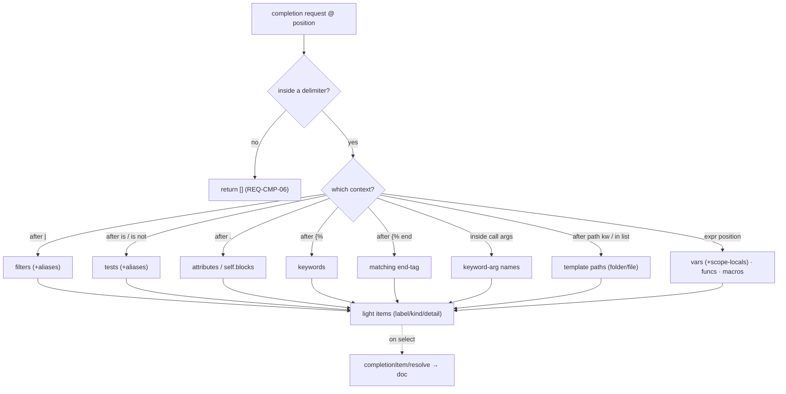

# F05 — Completions

> **Status:** Draft
>
> **Version:** 0.1   ·   **Last updated:** 2026-06-24
>
> **Purpose:** Context-aware completions inside Jinja delimiters — variables, filters, tests, statement keywords, attributes, template paths, imported macro names, and keyword-argument names inside calls — with lazy doc resolution and a strict "nothing outside the delimiters" contract.

> **Depends on:** [constitution](../constitution.md), [F02-builtin-registry](F02-builtin-registry.md), [E07-data-model](../foundations/E07-data-model.md), [E01-architecture](../foundations/E01-architecture.md)   ·   **Related:** [F03-extension-packs](F03-extension-packs.md), [F04-user-hints](F04-user-hints.md), [F06-hover](F06-hover.md), [F07-signature-help](F07-signature-help.md), [E30-extraction-and-indexing](../foundations/E30-extraction-and-indexing.md)

> Requirement tag: **CMP**

---

## 1. Purpose & Scope

Completions are the feature you feel most while typing. Open a `{{`, and jinja-lsp offers the variables in scope; type a `|`, and it offers filters; type `.` after `loop`, and it offers `index`. Every suggestion is drawn from the same unified registry ([F02](F02-builtin-registry.md)) and the workspace index ([E30](../foundations/E30-extraction-and-indexing.md)), and every one stays out of the way when you're outside Jinja.

This spec covers:

- The trigger characters and the completion **contexts** they open.
- What to complete in each context — variables (including scope-local ones), attributes, filters, tests, statement keywords, block-aware end-tags, template paths, imported macros, keyword-argument names, and the special objects `self`/`super`.
- **`completionItem/resolve`** for lazy documentation.
- The **negative contract** — nothing outside Jinja delimiters, inside comments/strings/``, or in alias positions.
- The completion item structure, including the folder/file descent for template paths.

## 2. Non-Goals / Out of Scope

- The registry and doc bodies the items draw from — owned by [F02-builtin-registry](F02-builtin-registry.md).
- The signature *tooltip* inside a call's parens — owned by [F07-signature-help](F07-signature-help.md). Completing the keyword-argument *names* there is this spec's job (REQ-CMP-08); the two features run together.
- Hover docs — owned by [F06-hover](F06-hover.md) (resolve reuses the same registry bodies).
- Template discovery and the workspace symbol tables — owned by [E30-extraction-and-indexing](../foundations/E30-extraction-and-indexing.md).

## 3. Background & Rationale

Completions are jinja-lsp's headline interactive feature. The design follows one idea: **the cursor's syntactic context decides what to offer.** A pipe means filters; a dot means attributes; an open `{%` means statement keywords. Getting the context detection right (and the negative contract — silence outside delimiters) is what makes completions feel native rather than noisy. Because the host-language LSP (Pyright, the HTML server) owns everything outside `{{ }}`/``, jinja-lsp must never compete there (P5).

## 4. Concepts & Definitions

- **Completion context** — the syntactic situation at the cursor that decides what to offer (inside `{{ }}`, after `.`, after `|`, after `is`/`is not`, after `{%`, after `{% end`, inside a call's argument list, after a path keyword, inside a path list/tuple, after `from … import`, on `self`).
- **Trigger character** — a keystroke that asks the editor to request completions (`{`, `%`, ` `, `|`, `.`, `(`, `,`, `"`).
- **Scope-local** — a variable bound by an enclosing ``, ``, ``, ``, or macro parameter list, visible only within that construct's range ([E07](../foundations/E07-data-model.md) `VariableScope`).
- **Scope-gated built-in** — a special variable/function offered only inside its scope: `loop` (in `for`), `self`/`super` (in a `block`), `caller`/`varargs`/`kwargs` (in a `macro`).
- **`completionItem/resolve`** — the second LSP round-trip that fills in an item's full documentation lazily.

## 5. Detailed Specification

### 5.1 Trigger characters

The server declares the keystrokes that prompt a completion request, so the editor asks at the right moments.

**REQ-CMP-01 — Declared trigger characters.**

The `completionProvider` declares trigger characters `{`, `%`, ` ` (space), `|`, `.`, `(`, `,`, and `"` ([E01 §5.5](../foundations/E01-architecture.md)). The space trigger matters inside `` and after keywords; `|` opens filters, `.` attributes, `(` and `,` the keyword-argument names inside a call (REQ-CMP-08), and `"` the template paths after a path keyword (REQ-CMP-04). Completions are also available on the usual manual invoke (Ctrl-Space) anywhere inside a delimiter. Whitespace-control and `+` delimiter forms (`{{-`, `-}}`, ``, ``) are transparent to context detection — the `-`/`+` never changes which context a position is in.

### 5.2 The contexts

The heart of the feature: each cursor position maps to one context, and each context to one candidate set. All candidates come from the unified registry ([F02](F02-builtin-registry.md), with packs [F03](F03-extension-packs.md) and hints [F04](F04-user-hints.md)) and the `TemplateIndex`/`WorkspaceIndex` ([E07](../foundations/E07-data-model.md)).

**REQ-CMP-02 — Context-to-candidate mapping.**

| Cursor context | Completes |
|---|---|
| Expression position (inside `{{ … }}`, or an expression inside ``) | in-scope variables — template-level + **scope-locals** (REQ-CMP-11) + hinted context vars ([F04](F04-user-hints.md)) — global functions (`range`, `lipsum`, `dict`, `cycler`, `joiner`, `namespace`, `debug`), and macros |
| After `.` on a resolvable receiver | that object's attributes — a hinted `context_variable`'s `attributes` ([F04](F04-user-hints.md)), or a built-in/pack variable's attribute docs (`loop.index`, `cycler.next`, a pack `request`'s attrs — [F02 §5.4](F02-builtin-registry.md)) (REQ-CMP-03) |
| After `.` on `self` | the template's block names, as `self.<block>()` (REQ-CMP-10) |
| After `\|` (a filter pipe) | built-in filters + pack/custom/hinted filters, including aliases (`d`→`default`, `e`→`escape`) |
| After `is` / `is not` (a test) | built-in tests + pack/custom/hinted tests, including word/operator aliases (`equalto`/`==` → `eq`) |
| After `{%` (statement start) | statement keywords — `for`, `if`, `block`, `macro`, `set`, `include`, `extends`, `import`, `from`, `with`, `call`, `filter`, `raw`, `autoescape`, `do`, … |
| After `{% end` | the **matching** end-tag for the innermost open block (REQ-CMP-09) |
| Inside a call's parens — `macro(`, `x \| filter(`, `is test(` | the callee's parameter names as `name=` keyword args (REQ-CMP-08) |
| After `extends`/`include`/`import`/`from` (in the string, or each element of a path list/tuple) | template paths from the workspace ([E30](../foundations/E30-extraction-and-indexing.md)), one directory level at a time (REQ-CMP-04, REQ-CMP-12) |
| After `from "x" import` (and after each comma in the list) | macro names exported by template `x` ([E07](../foundations/E07-data-model.md)) |

**REQ-CMP-03 — Attribute completions need a resolvable receiver.**

After `.`, jinja-lsp completes attributes only when the receiver resolves to something it documents — a hinted `context_variable` with `attributes`, a built-in or pack variable with attribute docs (`loop`, `cycler`, a pack-provided `request`), or `self` (whose members are the template's block names — REQ-CMP-10). For an unknown receiver it offers nothing (P4) and leaves the host LSP undisturbed (P5).

**REQ-CMP-04 — Path and import-name completions read the workspace.**

Template-path completion fires inside the string of ``, ``, ``, and `` — and inside **each element of a list/tuple include** (``, ``). Candidates are the templates discovered under the configured directories ([E30](../foundations/E30-extraction-and-indexing.md)), as workspace-relative paths (the UX is REQ-CMP-12). The `with context` / `without context` and `ignore missing` modifiers don't change the path context. A non-literal reference (``, the expression arm of ``) is **not** path-completed — there's no static path to offer (P4). After `from "x" import`, and after each comma in the import list, the candidates are the macros template `x` exports — read from its `TemplateIndex`; the `as <alias>` slot completes nothing (the user names it). If `x` isn't resolvable, the list is empty (no guessing).

**REQ-CMP-08 — Keyword-argument names complete inside a call's parens.**

Inside the argument list of a call whose callee jinja-lsp knows — a macro (params from [E07](../foundations/E07-data-model.md)), or a built-in/pack/hinted filter or test (params from its [F02](F02-builtin-registry.md) frontmatter) — completion offers the callee's parameter names as keyword arguments, each inserted as `name=`. The receiver of a filter (`x | truncate`) is the implicit first argument and is omitted from the offered names. Parameter names already supplied in the current call are filtered out, so each is offered once. A callee jinja-lsp can't resolve, or one with no documented parameters, offers nothing (P4). This is the parameter-*name* list; the signature *tooltip* showing which argument the cursor sits on is [F07](F07-signature-help.md)'s job, and the two run together.

**REQ-CMP-09 — End-tags and block names are block-aware.**

After `{% end`, jinja-lsp offers the single end-tag that closes the innermost open block — `` inside a `for`, `` inside a `macro`, and likewise `endif` / `endblock` / `endwith` / `endcall` / `endfilter` / `endautoescape` / `endraw` / `endset` / `endtrans`. The open block's name is additionally offered after `{% endblock ` (e.g. ``). When no block is open at the cursor, `{% end…` offers nothing (P4).

**REQ-CMP-10 — Special objects and scope-gated built-ins.**

`self` completes to the template's block names as methods (`self.content()`) — its members are exactly the blocks the template and its parents define ([E07](../foundations/E07-data-model.md)). `super()` is offered in expression position only inside an overriding block. The scope-gated specials are offered only where they're valid: `loop` inside a ``, `caller` / `varargs` / `kwargs` inside a ``, `self` / `super` inside a ``. Outside its scope, each is absent (matching the diagnostics' scope rules — P4).

**REQ-CMP-11 — Expression-position completion includes scope-local variables.**

Beyond template-level and hinted variables, expression position offers the variables bound by the enclosing constructs, each only within its range ([E07](../foundations/E07-data-model.md) `VariableScope`): a `` loop variable (and tuple-unpacking targets ``), a `` / `…` binding, a `` binding, a `` argument, and a macro's own parameters inside its body. A loop variable is not offered before the loop opens or after its ``.

**REQ-CMP-12 — Template paths complete one directory level at a time.**

Path candidates are keyed workspace-root-relative with `/` separators; with multiple roots, the first root wins on a colliding path (matching the loader's first-match semantics — [E30](../foundations/E30-extraction-and-indexing.md)). The completion filters by the text already typed inside the quotes and descends one level at a time: an immediate child directory is offered once as a `Folder` item labelled `<prefix><dir>/`, and a leaf template as a `File` item. When directory items are present the response sets `isIncomplete = true` so the editor re-queries after the user types `/`. Each item's edit replaces only the text **between** the quotes, never the quotes themselves.

### 5.3 Lazy documentation via resolve

A completion list can hold 100+ built-ins. Attaching every doc body up front would be wasteful, so items ship light and fill in on demand.

**REQ-CMP-05 — Items resolve their documentation lazily.**

Each completion item is returned with `label`, `kind`, and `detail` only. The full markdown `documentation` is attached on `completionItem/resolve`, looked up from the unified registry ([F02](F02-builtin-registry.md)) by the item's `(category, name)`. This keeps the initial list cheap even with the full built-in catalog — and the resolved body is the same doc card hover shows ([F06](F06-hover.md)).

### 5.4 The negative contract

The single most important rule: be silent where you don't belong.

**REQ-CMP-06 — Nothing outside Jinja delimiters.**

A completion request whose position is **outside** any `{{ … }}` / `` / `{# … #}` returns an empty result. jinja-lsp never completes host-language content (HTML attributes, SQL, prose) — that's the host LSP's job (P5). The same silence applies **inside** a `{# comment #}`, **inside a `…` body** (its content is literal text, not Jinja), **inside a plain string literal** in expression position (`{{ "foo|bar" }}` — the `|` is not a filter pipe), and in an **alias position** (``, `… import a as ▍`), where the user is naming the binding. Template-path strings after a path keyword are the one string context that *does* complete (REQ-CMP-04).

### 5.5 The completion item structure

Every item carries enough to render the list and to resolve its doc.

**REQ-CMP-07 — Item fields.**

| Field | Value |
|---|---|
| `label` | the symbol name (`truncate`, `post_url`, `loop`, `blog/macros.html`) |
| `kind` | `Variable` / `Function` / `Module` (macro) / `Keyword` (statement & end-tag) / `File` + `Folder` (template path & directory) / `Field` (attribute & keyword-arg name) / `Method` (`self.<block>`) |
| `detail` | a one-line summary — the `signature`, a type (`filter`, `User`), or a keyword-arg's type/default |
| `documentation` | **absent until resolve** (§5.3), then the registry markdown body |
| `data` | the `(category, name)` the resolve step looks up |

## 6. UI Mockups

### 6.1 Completion popup + resolved doc pane

The popup appears as you type inside a delimiter; selecting an item resolves and shows its doc pane. Here, after a `|` in `templates/blog/post.html`:

```
templates/blog/post.html
  4 │ {{ post.title | tr| }}
    │                   └─▶
    ╭─ completions ───────────────╮  ╭─ truncate ──────── filter · 2.0 ─╮
    │ ƒ  trim          filter     │  │ truncate(s, length=255,          │
    │ ƒ  truncate      filter   ◀─┼──│   killwords=False, end='...')     │
    │ ƒ  title         filter     │  │                                   │
    ╰─────────────────────────────╯  │ Truncates a string to a given     │
       ƒ filter  ⊙ variable           │ length. If killwords is false,    │
       ▭ macro   ⌗ keyword            │ it cuts at the last word boundary.│
       ⎘ template-path               ╰───────────────────────────────────╯
       (doc pane filled on resolve — REQ-CMP-05)
```

### 6.2 Attribute completions (after `.`)

After a `.` on a hinted or built-in object, only that object's attributes appear:

```
  6 │ {{ loop.| }}
    │                                    └─▶ ╭─ completions ─────────────╮
    │                                        │ ⊡ index      int          │
    │                                        │ ⊡ first      bool          │
    │                                        │ ⊡ last       bool          │
    │                                        │ ⊡ length     int           │
    │                                        ╰───────────────────────────╯
    │                                          (loop.* from F02 attr docs)
```

### 6.3 Template-path completions (after a path keyword)

After `{% extends "` / `include` / `import`, the workspace template list:

```
  1 │ 
    │             └─▶ ╭─ completions ───────────────╮
    │                 │ ⎘ base.html          File   │
    │                 │ ▸ blog/              Folder  │   one level at a time
    │                 │ ▸ email/             Folder  │   (REQ-CMP-12)
    │                 ╰─────────────────────────────╯
    │   typing "blog/" re-queries (isIncomplete) → blog/post.html · blog/macros.html
```

### 6.4 Keyword-argument completions (inside a call)

Inside a call's parens, the callee's parameter names complete as keyword args (REQ-CMP-08); the filter receiver fills the implicit first arg and is omitted:

```
  4 │ {{ post.body | truncate(| }}
    │                         └─▶ ╭─ completions ─────────────╮
    │                             │ ◈ length=     int=255     │
    │                             │ ◈ killwords=  bool=False  │
    │                             │ ◈ end=        str='...'   │
    │                             ╰───────────────────────────╯

  7 │ {{ post_url(| }}
    │            └─▶ ╭─ completions ───────╮
    │                │ ◈ post=             │
    │                │ ◈ anchor=           │
    │                ╰─────────────────────╯
```

### 6.5 End-tag and `self` completions

`{% end` offers only the tag that closes the open block; `self.` offers the template's block names (REQ-CMP-09, REQ-CMP-10):

```
  8 │ …{% end| }}     {{ self.| }}
    │                                   └─▶ ╭──────────╮   └─▶ ╭─ completions ─────╮
    │                                       │ ⌗ endfor │       │ ⌘ content()       │
    │                                       ╰──────────╯       │ ⌘ sidebar()       │
    │                                    (only the for's end)  ╰───────────────────╯
```

States: populated · empty (outside delimiters / in a comment / string / `raw` body / alias slot — REQ-CMP-06, or an unresolvable receiver/template/callee) · descending (a `Folder` item with `isIncomplete` re-opens the popup after `/`) · resolving (doc pane blank until resolve returns).

## 7. Visualizations

How a request routes to a candidate set:



## 8. Data Shapes

A light completion item as first returned, and its `data` for resolve:

```json
{
  "label": "truncate",
  "kind": 3,
  "detail": "filter · truncate(s, length=255, killwords=False, end='...')",
  "data": { "category": "filter", "name": "truncate" }
}
```

After `completionItem/resolve`, the same item gains its `documentation`:

```json
{
  "label": "truncate",
  "documentation": { "kind": "markdown", "value": "Truncates a string…" }
}
```

## 9. Examples & Use Cases

Editing `templates/blog/post.html` in `starlette-blog`, you type `{% extends "` and get the four workspace templates (§6.3); you pick `base.html`. Lower down you write `{{ post.title | tr` and the popup offers `trim`/`truncate` (§6.1); selecting `truncate` resolves its built-in doc. Inside `{{ loop. }}`, you get the `loop.*` attributes (§6.2), and `c` itself completes as a scope-local (REQ-CMP-11). Typing `{{ post_url(` offers the macro's parameter names `post=`/`anchor=` (§6.4, REQ-CMP-08); closing the loop with `{% end` offers only `endfor` (REQ-CMP-09); and `{{ self.` lists the template's blocks (REQ-CMP-10). And when you type plain HTML between tags, nothing pops up — the negative contract keeps jinja-lsp quiet for the HTML server (REQ-CMP-06).

## 10. Edge Cases & Failure Modes

- **Cursor in HTML / SQL / prose** → empty result (REQ-CMP-06).
- **`.` after an unknown receiver** → empty; no guessing (REQ-CMP-03, P4).
- **`from "missing.html" import`** → empty macro list (REQ-CMP-04).
- **Half-typed delimiter `{{ pos`** → tree-sitter recovers; expression-context completions still offered (P3).
- **Whitespace-control / `+` delimiters** (`{%- end`, `{{- post.`) → the `-`/`+` is transparent; the context is detected as usual (REQ-CMP-01).
- **Call with every keyword already supplied** → no parameter names left; empty (REQ-CMP-08).
- **Call to an unresolvable or parameter-less callee** → no keyword-arg completions (REQ-CMP-08, P4).
- **`{% end` with no open block** → empty; nothing to close (REQ-CMP-09).
- **Scope-gated special out of scope** (`loop` outside a `for`, `caller` outside a `macro`) → absent (REQ-CMP-10).
- **Loop variable referenced before/after its loop** → not offered outside the loop's range (REQ-CMP-11).
- **Non-literal include/extends** (``) → no path completion (REQ-CMP-04, P4).
- **Inside a `` body or a plain string literal** → empty (REQ-CMP-06).
- **Alias slot** (`import "x" as ▍`, `… import a as ▍`) → empty (REQ-CMP-06).
- **Resolve for a removed symbol** (registry reloaded mid-flight) → returns the item without docs, never errors.
- **Disabled pack symbol** → absent from the list (it's not in the active registry — [F03](F03-extension-packs.md)).

## 11. Testing

Completions are verified by unit tests over context detection, integration tests over candidate sets from fixtures, and `pytest-lsp` journeys for the live protocol including resolve.

### 11.1 Scope & coverage

Target: **100% of this feature's behavior is covered.** Every `REQ-CMP-NN` maps to a test; every context in §5.2 and every mockup state in §6 has a test. See the policy in [E17-testing](../foundations/E17-testing.md#2-coverage-policy).

### 11.2 Test plan

| Behavior / scenario | Type | Fixtures | Verifies |
|---|---|---|---|
| Trigger chars declared in `initialize` | e2e (pytest-lsp) | [starlette-blog](../foundations/E17-testing.md#5-fixtures-registry) | REQ-CMP-01 |
| Each context yields the right candidate set | unit + integration | [starlette-blog](../foundations/E17-testing.md#5-fixtures-registry), user-hints | REQ-CMP-02 |
| `.` completes attributes only for resolvable receivers (hinted, built-in, pack) | unit | user-hints | REQ-CMP-03 |
| Path completion fires in extends/include/import/from + list/tuple elements; skips non-literal & alias slots | unit + integration | [starlette-blog](../foundations/E17-testing.md#5-fixtures-registry) | REQ-CMP-04 |
| Items ship light; resolve attaches markdown docs | e2e (pytest-lsp) | [starlette-blog](../foundations/E17-testing.md#5-fixtures-registry) | REQ-CMP-05 |
| Position outside delimiters / in comment / string / raw / alias → empty; whitespace-control transparent | unit + e2e | [starlette-blog](../foundations/E17-testing.md#5-fixtures-registry) | REQ-CMP-06 |
| Item fields (label/kind/detail/data) are correct | unit | [starlette-blog](../foundations/E17-testing.md#5-fixtures-registry) | REQ-CMP-07 |
| Keyword-arg names complete in macro/filter/test calls; supplied names excluded; receiver omitted | unit + integration | [starlette-blog](../foundations/E17-testing.md#5-fixtures-registry), user-hints | REQ-CMP-08 |
| `{% end` offers only the innermost block's end-tag; `endblock` offers the name; none when no block open | unit | [starlette-blog](../foundations/E17-testing.md#5-fixtures-registry) | REQ-CMP-09 |
| `self.` offers block names; `super`/`loop`/`caller`/`varargs`/`kwargs` gated to their scope | unit | [starlette-blog](../foundations/E17-testing.md#5-fixtures-registry) | REQ-CMP-10 |
| Scope-locals (loop/set/with/macro-param) complete only within range | unit | [starlette-blog](../foundations/E17-testing.md#5-fixtures-registry) | REQ-CMP-11 |
| Path descent emits Folder/File kinds, `isIncomplete`, quote-excluded edits, first-root-wins | unit + integration | [starlette-blog](../foundations/E17-testing.md#5-fixtures-registry) | REQ-CMP-12 |

### 11.3 Fixtures

- Reuses [starlette-blog](../foundations/E17-testing.md#5-fixtures-registry) (templates, macros, paths) and [user-hints](../foundations/E17-testing.md#5-fixtures-registry) (hinted context vars + attributes).

### 11.4 Requirement coverage

| Requirement | Covered by |
|---|---|
| REQ-CMP-01 | trigger-char capability e2e |
| REQ-CMP-02 | per-context candidate tests |
| REQ-CMP-03 | receiver-resolution test |
| REQ-CMP-04 | path + import-name tests |
| REQ-CMP-05 | resolve e2e |
| REQ-CMP-06 | negative-contract unit + e2e (delimiters, comment, string, raw, alias, whitespace-control) |
| REQ-CMP-07 | item-structure test |
| REQ-CMP-08 | keyword-arg-name unit + integration |
| REQ-CMP-09 | block-aware end-tag/name unit |
| REQ-CMP-10 | special-object + scope-gating unit |
| REQ-CMP-11 | scope-local visibility unit |
| REQ-CMP-12 | path-descent (folder/file/isIncomplete) unit + integration |

## 12. End-to-End Test Plan

Completions are exercised end to end via `pytest-lsp` ([E29 Branch B](../foundations/E29-e2e-testing.md)) — request at a position, assert the items, then resolve.

### 12.1 Coverage target

**100% of the completion contexts and the negative contract**, end to end, including lazy resolve.

### 12.2 Scenarios

| # | Journey | Path | Expected outcome |
|---|---|---|---|
| E2E-01 | Complete after `\|` | happy | filter items (with aliases) returned; resolve attaches the doc |
| E2E-02 | Complete after `extends "` | happy | template paths returned as Folder/File items, one level deep (REQ-CMP-12) |
| E2E-03 | Complete after `loop.` | happy | `loop.*` attributes returned |
| E2E-04 | Request in plain HTML | negative | empty result (REQ-CMP-06) |
| E2E-05 | Complete after `from "macros.html" import` | happy | the exported macro names are returned |
| E2E-06 | Complete in `{{ ▍ }}` expression position | happy | in-scope variables, globals, and macros returned |
| E2E-07 | Complete after `.` on the hinted `post` object | happy | `post`'s hinted attributes (`title`, `slug`, `body`, …) returned |
| E2E-08 | Complete after `is ▍` / `is not ▍` | happy | test names (with word/operator aliases) returned |
| E2E-09 | Complete after `{% ▍` | happy | statement keywords returned |
| E2E-10 | Complete inside `truncate(▍` (filter args) | happy | filter keyword-arg names (`length=`, `killwords=`, `end=`) returned |
| E2E-11 | Complete inside `is divisibleby(▍` (test args) | happy | the test's argument name returned |
| E2E-12 | Complete inside `post_url(▍` (macro params) | happy | macro parameter names (`post=`, `anchor=`) returned |
| E2E-13 | Complete after `{% end` inside a `for` | happy | only `endfor` returned (REQ-CMP-09) |
| E2E-14 | Complete after `self.` in a child template | happy | the template's block names returned (REQ-CMP-10) |
| E2E-15 | Complete a loop variable inside the loop, then outside | mixed | offered within the loop's range; absent after `` (REQ-CMP-11) |
| E2E-16 | Complete a path inside `` (list form) | happy | template paths returned inside the list element (REQ-CMP-04) |
| E2E-17 | Request inside `{# comment #}`, a string literal, and a `` body | negative | empty result in each (REQ-CMP-06) |
| E2E-18 | Complete after `.` on an unknown receiver, and in an `as` alias slot | negative | empty result (REQ-CMP-03/06) |

## 13. Non-Functional Requirements

### 13.1 Security & Privacy

- **Access & authorization** — local process, no auth boundary. Candidates come from the in-memory registry and workspace index; no file is read at request time.
- **Input & validation** — the request position is the only input; out-of-range positions return empty, never panic (P3).
- **Data sensitivity** — completions surface only the user's own symbols and the embedded docs; nothing leaves the machine.

### 13.2 Accessibility

- **N/A** — no GUI; the editor renders the completion popup and doc pane (constitution §4.6).

### 13.4 Performance & Scale

- **Latency** — a completion response returns in **< 100 ms** (P6). This is met by reading the prebuilt registry and index (pure-function dispatch — [E01 §5.4](../foundations/E01-architecture.md)) and by **deferring documentation to resolve** (REQ-CMP-05), so the initial list never serializes 100+ doc bodies.
- **Volume & scale** — the candidate set is bounded by the registry (≈ 113 built-ins + packs/hints) and the workspace symbol tables; filtering is a linear scan over a few hundred entries, well inside budget.
- **Load** — handlers are pure reads with no shared mutable state, so concurrent completion/hover requests don't contend ([E01 §5.4](../foundations/E01-architecture.md)).

## 15. Open Questions & Decisions

- **Decided** — items resolve docs lazily; nothing is offered outside delimiters; attribute completion requires a resolvable receiver.
- **Decided** — keyword-argument names complete inside macro/filter/test calls (REQ-CMP-08, distinct from F07's signature tooltip); end-tags and block names are block-aware (REQ-CMP-09); `self`/`super` and the scope-gated specials follow the diagnostics' scope rules (REQ-CMP-10); expression position includes scope-locals (REQ-CMP-11); template paths complete one directory level at a time with `isIncomplete` descent (REQ-CMP-12).
- **OQ-CMP-1** — should expression-position completion offer snippet expansions for keywords (e.g. `for … in … endfor`)? Deferred to a later pass; v1 offers plain keyword labels.

## 16. Cross-References

- **Depends on:** [constitution](../constitution.md) — P5 (companion), P6 (latency); [F02-builtin-registry](F02-builtin-registry.md) — the candidate docs and resolve source; [E07-data-model](../foundations/E07-data-model.md) — in-scope vars, macros, exports; [E01-architecture](../foundations/E01-architecture.md) — trigger chars, pure-read dispatch.
- **Related:** [F03-extension-packs](F03-extension-packs.md), [F04-user-hints](F04-user-hints.md) — extra candidate sources; [F06-hover](F06-hover.md) — shares the resolved doc bodies; [F07-signature-help](F07-signature-help.md) — takes over inside call parens; [E30-extraction-and-indexing](../foundations/E30-extraction-and-indexing.md) — template paths and symbol tables.

## 17. Changelog

- **2026-06-25** — Expanded the completion contexts: keyword-argument names inside calls (REQ-CMP-08), block-aware end-tags and block names (REQ-CMP-09), `self`/`super` and scope-gated specials (REQ-CMP-10), scope-local variables (REQ-CMP-11), and one-level-at-a-time template-path descent with list/tuple-include and comma-import support (REQ-CMP-04, REQ-CMP-12). Added trigger characters `(`, `,`, `"`; extended the negative contract to comments, string literals, `` bodies, and alias slots; grew the E2E plan to 18 scenarios.
- **2026-06-24** — Initial draft.
