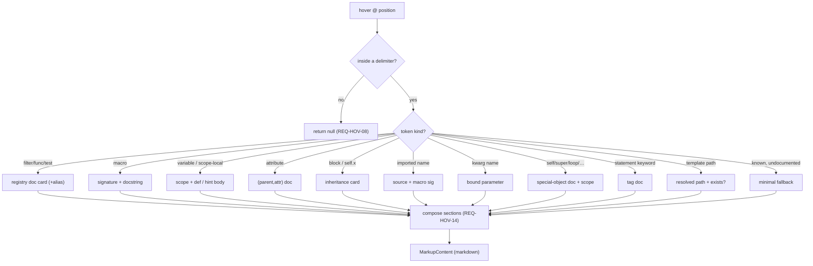

# F06 — Hover

> **Status:** Approved
>
> **Version:** 0.1   ·   **Last updated:** 2026-06-24
>
> **Purpose:** Hover documentation for every Jinja symbol — built-in/pack/custom/hinted filters, functions, and tests; macros; variables (including scope-locals); attribute accesses; blocks (with their inheritance chain); imported names; keyword-argument names; the special objects `self`/`super`/`loop`/`caller`/`varargs`/`kwargs`; statement keywords; and template paths — rendered as Markdown from the unified registry and the workspace index.

> **Depends on:** [constitution](../constitution.md), [F02-builtin-registry](F02-builtin-registry.md), [E07-data-model](../foundations/E07-data-model.md), [E01-architecture](../foundations/E01-architecture.md)   ·   **Related:** [F03-extension-packs](F03-extension-packs.md), [F04-user-hints](F04-user-hints.md), [F05-completions](F05-completions.md), [F08-go-to-definition](F08-go-to-definition.md), [E30-extraction-and-indexing](../foundations/E30-extraction-and-indexing.md)

> Requirement tag: **HOV**

---

## 1. Purpose & Scope

Hover answers "what is this?" without leaving the line you're on. Point at `truncate` and read its doc; point at a `post_url(...)` call and see its signature and docstring; point at `post` and learn where it came from. Every answer is rendered Markdown, drawn from the same registry ([F02](F02-builtin-registry.md)) that powers completions and from the workspace index ([E30](../foundations/E30-extraction-and-indexing.md)).

This spec covers:

- The **hover targets** and what each one shows — including blocks, imported names, keyword-argument names, special objects, and statement keywords.
- The **card structure** — how a multi-section Markdown card is composed (signature → prose → usage → metadata).
- Rendering to LSP `MarkupContent` (Markdown).
- The fallback when there's no documentation, and silence inside comments/strings/``.

## 2. Non-Goals / Out of Scope

- The registry and the doc bodies hover renders — owned by [F02-builtin-registry](F02-builtin-registry.md).
- Jumping to a definition (a separate request) — owned by [F08-go-to-definition](F08-go-to-definition.md).
- The completion doc pane (which reuses the same bodies) — owned by [F05-completions](F05-completions.md).
- Symbol extraction — owned by [E30-extraction-and-indexing](../foundations/E30-extraction-and-indexing.md).

## 3. Background & Rationale

Hover is the most direct payoff of the registry: those 113 built-in docs ([F02](F02-builtin-registry.md)) show up where you read them. Beyond built-ins, hover also reads *your* code — a macro's signature and its first comment become its docstring, a variable's scope and definition site become its tooltip. One request, several target kinds, each resolved purely from the index (P6, [E01 §5.4](../foundations/E01-architecture.md)).

## 4. Concepts & Definitions

- **Hover target** — the symbol under the cursor whose kind decides what hover shows.
- **Docstring** — the first `{# … #}` comment inside a macro body, used as the macro's hover prose.
- **Inheritance card** — for a block, the relationship to its parents/children: `scoped`/`required` modifiers, the parent it overrides, and the children that override it.
- **Card section** — one part of a composed hover: a fenced signature line, prose, a fenced `jinja` usage example, or a metadata bullet (`since`, `scope`, `defined in`).
- **`MarkupContent`** — the LSP type carrying Markdown to the editor's hover card.

## 5. Detailed Specification

### 5.1 The hover targets

Hover first classifies what's under the cursor, then renders the matching content. The classification reuses the `Reference` data already extracted ([E07](../foundations/E07-data-model.md)) — no new traversal.

**REQ-HOV-01 — Target-to-content mapping.**

| Target under cursor | Hover shows |
|---|---|
| A filter / function / test (built-in, pack, custom, or hinted) | its registry markdown doc — the §6.1 doc card ([F02](F02-builtin-registry.md)); an alias (`d`, `==`) resolves to its canonical symbol with an "alias of" note (REQ-HOV-02) |
| A macro name (at a call site or definition) | its signature + docstring (first `{# … #}` in the macro body) (REQ-HOV-03) |
| A variable — template-level, hinted, or **scope-local** | its binding kind, scope, and definition site; for a hinted context var, the hint body + `type` ([F04](F04-user-hints.md)) (REQ-HOV-04) |
| An attribute access (`user.email`, `loop.index`) | the attribute's doc — hinted `attributes` ([F04](F04-user-hints.md)) or built-in attribute docs ([F02 §5.4](F02-builtin-registry.md)) (REQ-HOV-05) |
| A template path (in `extends`/`include`/`import`/`from`, incl. list/tuple forms) | the resolved workspace path + existence, with `ignore missing` and dynamic-path handling (REQ-HOV-06) |
| A **block** name (``, ``, `self.x`) | the inheritance card — modifiers, the parent it overrides, the children that override it (REQ-HOV-09) |
| An **imported name / alias** (``) | the source template and, if it resolves to a macro, that macro's signature (REQ-HOV-10) |
| A **keyword-argument name** in a call (`render(width=…)`) | the parameter it binds and that parameter's type/default (REQ-HOV-11) |
| A **special object** — `self`, `super`, `loop`, `caller`, `varargs`, `kwargs` | its registry doc, plus a note when it's used outside its valid scope; `self.<block>()`/`super()` resolve into the inheritance model (REQ-HOV-12) |
| A **statement keyword** (`for`, `if`, `block`, `set`, `with`, `call`, …) | a short tag description from the embedded tag-doc set (REQ-HOV-13) |

**REQ-HOV-02 — Filters, functions, and tests render the registry doc.**

For a registry symbol, hover returns the doc card: its `signature`, `since`, `scope` (when the symbol is scope-gated), and markdown body ([F02 §6.1](F02-builtin-registry.md)). When the cursor is on an **alias** (`d`, `e`, `count`, `equalto`, `==`, `>=`), hover resolves to the canonical symbol and adds an *"alias of `default`"* note. The body is the same one completions attach on resolve ([F05 §5.3](F05-completions.md)) — one source, two surfaces. Pack ([F03](F03-extension-packs.md)) and hinted ([F04](F04-user-hints.md)) symbols render identically; only active-set symbols are eligible ([F03 §5.2](F03-extension-packs.md)).

**REQ-HOV-03 — Macros render signature + docstring.**

For a macro, hover renders the macro's signature from its `params` ([E07](../foundations/E07-data-model.md)) and, as prose, the **first `{# … #}` comment** inside the macro body (its docstring). If the macro has no leading comment, the signature renders alone.

**REQ-HOV-04 — Variables render scope + definition site.**

For a variable, hover states its scope ([E07](../foundations/E07-data-model.md) variable scopes — Template, ForLoop, Macro, …) and where it was defined. For a **scope-local** variable, hover names the binding kind — a `` loop variable, a `` / `` binding, a macro parameter, or a `` argument — and chooses the binding whose valid range contains the cursor ([E07](../foundations/E07-data-model.md) `VariableScope`). For a **hinted context variable** ([F04](F04-user-hints.md)), hover instead renders the hint's markdown body and `type`.

**REQ-HOV-05 — Attribute accesses render the attribute doc.**

For `obj.attr`, hover resolves `(obj, attr)` against the registry's attribute map ([F02 §5.4](F02-builtin-registry.md)): a hinted variable's declared `attributes`, or a built-in's attribute docs (e.g. `loop.index`). It shows the attribute's `name` and `type` (and any prose). An attribute on an unknown receiver gets the fallback (§5.3).

**REQ-HOV-06 — Template paths render resolution + existence.**

For a path string in `extends`/`include`/`import`/`from`, hover shows the resolved workspace-relative path and whether it exists ([E30](../foundations/E30-extraction-and-indexing.md)) — e.g. `→ templates/blog/macros.html (exists)` or `(not found)`. Inside a **list/tuple include** (``), hover resolves the candidate under the cursor. Under `ignore missing`, a missing target reads `(not found — ignored)` rather than an error. A dynamic path (`is_dynamic`, [E07](../foundations/E07-data-model.md)) reports that it's computed at runtime and can't be resolved statically.

**REQ-HOV-09 — Blocks render an inheritance card.**

For a `` / `` name (and a `self.<name>` reference), hover renders the block's inheritance card: the modifiers it carries (`scoped`, `required`), the parent block it **overrides** (with the parent template's path and line), and the child templates that **override it** ([E07](../foundations/E07-data-model.md), resolved by walking the `extends` chain — [E30](../foundations/E30-extraction-and-indexing.md)). The walk is cycle-guarded. A block that neither overrides nor is overridden renders just its name and modifiers.

**REQ-HOV-10 — Imported names resolve through the import.**

For a name in `` or ``, hover resolves through the import to the source template `x`. On the **name** slot (`a`), if it resolves to a macro in `x`, hover shows that macro's signature and source location; on the **alias** slot (`c`/`m`), hover shows `c — alias of a, imported from x`. An unresolvable source falls back (§5.3).

**REQ-HOV-11 — Keyword-argument names render their parameter.**

For a keyword-argument name in a call (`comment_card(show_actions=…)`, `truncate(length=…)`), hover identifies the parameter it binds on the callee — the macro's `params` ([E07](../foundations/E07-data-model.md)) or the built-in's `params` frontmatter ([F02](F02-builtin-registry.md)) — and shows that parameter's type and default. The value expression after the `=` hovers as its own target, not as the parameter.

**REQ-HOV-12 — Special objects render their doc and scope.**

`self`, `super`, `loop`, `caller`, `varargs`, and `kwargs` render their registry doc ([F02](F02-builtin-registry.md)). When one is used outside its valid scope (`loop` outside a ``, `super`/`self` outside a ``, `caller`/`varargs`/`kwargs` outside a ``), the card still renders but notes the constraint. `self.<block>()` resolves to that block's definition (REQ-HOV-09); `super()` resolves to the parent block, noting when the parent has no such block (an [F01](F01-diagnostics.md) condition).

**REQ-HOV-13 — Statement keywords render a tag description.**

Hovering a statement keyword (`for`, `if`, `elif`, `else`, `block`, `macro`, `set`, `with`, `call`, `filter`, `include`, `extends`, `import`, `from`, `raw`, `autoescape`, `do`, `trans`/`pluralize`, `continue`, `break`) shows a one-paragraph description with a minimal usage example, drawn from a small embedded **tag-doc set** (the same `include_str!()` embedding as [F02](F02-builtin-registry.md), keyed by keyword). A keyword with no tag doc gets the fallback (§5.3).

### 5.2 Rendering

Whatever the target, the output is one consistent shape the editor knows how to render.

**REQ-HOV-14 — Cards compose in a fixed section order.**

A composed card stacks these sections, in order, **omitting any that are empty**: a **bold heading** carrying the symbol kind and a one-line summary; a fenced signature line (```` ```jinja ````) for callables; the **prose** (doc body or docstring); a fenced `jinja` **usage** example when the doc carries one; and **metadata bullets** — `since`, `scope`, and `defined in <file>:<line>`. Relationship cites (a block's override parent/children, an import's source) use the `<file>:<line>` form. Because empty sections drop out, a documented built-in shows heading + signature + prose + usage + `since`, while a bare user macro shows just heading + signature + `defined in`.

**REQ-HOV-07 — Hover renders `MarkupContent { kind: Markdown }`.**

Every hover response is `MarkupContent` with `kind: "markdown"`, carrying a `range` covering the hovered token so the editor can underline it. Registry bodies are already markdown ([F02](F02-builtin-registry.md)); macro/variable/block/import/path hovers are assembled per REQ-HOV-14 into small markdown blocks (a fenced signature line plus prose and metadata).

### 5.3 Fallback

Hover should never be jarring. When there's nothing to say, it says so minimally — or stays silent.

**REQ-HOV-08 — Minimal fallback, and silence outside delimiters.**

If the cursor is on a Jinja token jinja-lsp recognizes but has no documentation for, hover returns a minimal "No documentation available" card naming the symbol kind. Hover returns **nothing** when the cursor is **outside** any Jinja delimiter (the host LSP owns that — P5), inside a `{# comment #}`, inside a `…` body (literal text, not Jinja), or inside a plain non-path string literal. Whitespace-control / `+` delimiters (``, `{{+`) are transparent — hover targets the inner token. This mirrors completions ([F05 §5.4](F05-completions.md)).

## 6. UI Mockups

### 6.1 Hover over a filter

Pointing at a built-in filter shows its registry doc card (the same card defined in [F02 §6.1](F02-builtin-registry.md)):

```
templates/blog/post.html
  4 │ {{ post.title | truncate(60) }}
    │                 ╿
    │   ╭─ truncate ───────────────────────── filter · since 2.0 ─╮
    │   │ truncate(s, length=255, killwords=False, end='...')      │
    │   │                                                          │
    │   │ Truncates a string to a given length. If killwords is    │
    │   │ false, it cuts at the last word boundary.                │
    │   ╰──────────────────────────────────────────────────────────╯
```

### 6.2 Hover over a macro call

Pointing at a macro call shows its signature and its `{# … #}` docstring:

```
templates/blog/post.html
  9 │ {{ post_url(post) }}
    │    ╿
    │   ╭─ post_url ───────────────────────────────── macro ─╮
    │   │ macro post_url(post)                                │
    │   │   defined in blog/macros.html:3                     │
    │   │                                                     │
    │   │ Builds the canonical URL for a blog post.           │
    │   ╰─────────────────────────────────────────────────────╯
       (prose is the first {# … #} comment in the macro body)
```

### 6.3 Hover over a hinted variable and an attribute

Pointing at a hinted context variable shows its hint body; pointing at an attribute shows its type:

```
  4 │ {{ post.title }}
    │    ╿        ╰── hover `title`: ⊡ title : string (attribute of post)
    │   ╭─ post ───────────────── context_variable · Post ─╮
    │   │ The blog post being rendered, injected by the view.│
    │   ╰────────────────────────────────────────────────────╯
```

### 6.4 Hover over a block (inheritance card)

Pointing at a block name shows its modifiers and where it sits in the inheritance chain (REQ-HOV-09):

```
templates/blog/post.html
  3 │ 
    │          ╿
    │   ╭─ content ─────────────────────────────── block ─╮
    │   │ block content                                    │
    │   │   overrides base.html:8                          │
    │   │   overridden by email/digest.html:5              │
    │   ╰──────────────────────────────────────────────────╯
       (the `scoped` / `required` modifiers appear when set)
```

### 6.5 Hover over an imported name and a keyword argument

An imported name resolves through to the source macro; a keyword-arg name shows the parameter it binds (REQ-HOV-10, REQ-HOV-11):

```
  1 │ 
    │                                    ╿
    │   ╭─ post_url ──────────── imported from blog/macros.html ─╮
    │   │ macro post_url(post)                                    │
    │   │   defined in blog/macros.html:3                         │
    │   ╰─────────────────────────────────────────────────────────╯

  9 │ {{ comment_card(c, show_actions=false) }}
    │                    ╿
    │   ╭─ show_actions ───────────── parameter of comment_card ─╮
    │   │ show_actions : default true                             │
    │   ╰─────────────────────────────────────────────────────────╯
```

States: registry doc (with alias resolution) · macro signature+docstring · variable scope/def · scope-local binding kind · hinted body · attribute type · block inheritance card · imported-name source · keyword-arg parameter · special-object doc · statement-keyword tag doc · template-path resolution (incl. list / dynamic / ignore-missing) · minimal fallback · silent (outside delimiters / comment / string / raw).

## 7. Visualizations

How a hover request classifies its target and picks a renderer:



## 8. Data Shapes

A hover response over the `truncate` filter:

```json
{
  "contents": {
    "kind": "markdown",
    "value": "**truncate** — filter · since 2.0\n\n`truncate(s, length=255, killwords=False, end='...')`\n\nTruncates a string to a given length…"
  },
  "range": { "start": {"line": 3, "character": 16}, "end": {"line": 3, "character": 24} }
}
```

## 9. Examples & Use Cases

In `starlette-blog`'s `templates/blog/post.html`, hovering `truncate` shows the built-in filter doc (§6.1); hovering the `post_url(post)` call shows `macro post_url(post)`, its source line in `blog/macros.html`, and the macro's leading-comment docstring (§6.2); hovering `post` (hinted as a `context_variable`) shows the hint body and `type: Post` (§6.3), and hovering `.title` shows `title : string`. Hovering the `"base.html"` in `` shows `→ templates/base.html (exists)`. Hovering the `content` block shows it overrides `base.html` and is overridden by `email/digest.html` (§6.4); hovering the imported `post_url` in `` resolves to its source macro (§6.5); hovering the `show_actions=` keyword in a `comment_card(…)` call names that parameter and its default; and hovering `loop` inside the comment loop shows the loop special-object doc with its `for`-scope note. Hovering inside a `{# comment #}`, a string literal, or a `` body — like plain HTML — shows nothing.

## 10. Edge Cases & Failure Modes

- **Cursor outside delimiters / in a comment / string / `` body** → `null` (REQ-HOV-08, P5).
- **Whitespace-control / `+` delimiters** (`{%- block`, `{{- post`) → transparent; hover targets the inner token (REQ-HOV-08).
- **Recognized token, no docs** → minimal fallback card (REQ-HOV-08).
- **Macro with no leading comment** → signature only, no docstring (REQ-HOV-03).
- **Attribute on an unknown receiver** → fallback; no guessing (REQ-HOV-05, P4).
- **`extends` on a dynamic path** → "computed at runtime — cannot resolve" (REQ-HOV-06).
- **`include` list/tuple element** → the candidate under the cursor resolves; under `ignore missing` a miss reads `(not found — ignored)` (REQ-HOV-06).
- **Alias slot vs name slot** in an import → different cards: the name resolves to the source macro, the alias reads `alias of <name>` (REQ-HOV-10).
- **Block that neither overrides nor is overridden** → name + modifiers only, no relationship rows (REQ-HOV-09).
- **`super()` where the parent has no such block** → the card notes the missing parent block (REQ-HOV-12, an [F01](F01-diagnostics.md) condition).
- **Scope-gated special used out of scope** (`loop` outside a `for`) → doc renders with a scope-constraint note (REQ-HOV-12).
- **Cyclic `extends`/`import`** → the inheritance walk is cycle-guarded; hover still returns (REQ-HOV-09).
- **Keyword-arg name with no matching parameter** → fallback; the value after `=` hovers on its own (REQ-HOV-11, P4).
- **Statement keyword with no tag doc** → minimal fallback (REQ-HOV-13).
- **Hinted name overriding a built-in** → the hint body renders (merge order, [F02 §5.2](F02-builtin-registry.md)).

## 11. Testing

Hover is verified by unit tests per target kind, integration tests over fixtures, and `pytest-lsp` journeys for the live protocol.

### 11.1 Scope & coverage

Target: **100% of this feature's behavior is covered.** Every `REQ-HOV-NN` maps to a test; every target kind in §5.1 and every state in §6 has a test. See the policy in [E17-testing](../foundations/E17-testing.md#2-coverage-policy).

### 11.2 Test plan

| Behavior / scenario | Type | Fixtures | Verifies |
|---|---|---|---|
| Filter/function/test hover renders the registry doc; an alias resolves to canonical + "alias of" | unit + e2e | [starlette-blog](../foundations/E17-testing.md#5-fixtures-registry) | REQ-HOV-01, REQ-HOV-02 |
| Macro hover = signature + first-comment docstring | unit | [starlette-blog](../foundations/E17-testing.md#5-fixtures-registry) | REQ-HOV-03 |
| Variable hover = scope + def; scope-local names its binding kind; hinted var = hint body | unit | [starlette-blog](../foundations/E17-testing.md#5-fixtures-registry), user-hints | REQ-HOV-04 |
| Attribute hover resolves `(parent, attr)` | unit | user-hints | REQ-HOV-05 |
| Template-path hover shows resolution + existence; list element, dynamic, ignore-missing handled | integration | [starlette-blog](../foundations/E17-testing.md#5-fixtures-registry) | REQ-HOV-06 |
| Block hover shows modifiers + overrides/overridden-by chain | unit + integration | [starlette-blog](../foundations/E17-testing.md#5-fixtures-registry) | REQ-HOV-09 |
| Imported name resolves to source macro; alias slot reads "alias of" | unit | [starlette-blog](../foundations/E17-testing.md#5-fixtures-registry) | REQ-HOV-10 |
| Keyword-arg name hover names the bound parameter + default | unit | [starlette-blog](../foundations/E17-testing.md#5-fixtures-registry) | REQ-HOV-11 |
| Special objects render doc + scope note; `self.x`/`super()` resolve | unit | [starlette-blog](../foundations/E17-testing.md#5-fixtures-registry) | REQ-HOV-12 |
| A scope-gated special out of scope, and `super()` with no parent block, render the constraint note | unit | [starlette-blog](../foundations/E17-testing.md#5-fixtures-registry) | REQ-HOV-12 |
| A hinted name overriding a built-in renders the hint body (merge order) | unit | user-hints | REQ-HOV-02 |
| Statement keyword renders its tag doc; unknown keyword → fallback | unit | [starlette-blog](../foundations/E17-testing.md#5-fixtures-registry) | REQ-HOV-13 |
| Cards compose sections in order, omitting empty ones | unit | [starlette-blog](../foundations/E17-testing.md#5-fixtures-registry) | REQ-HOV-14 |
| All responses are Markdown `MarkupContent` with a range | unit | [starlette-blog](../foundations/E17-testing.md#5-fixtures-registry) | REQ-HOV-07 |
| Undocumented token → fallback; outside delimiters/comment/string/raw → null | unit + e2e | [starlette-blog](../foundations/E17-testing.md#5-fixtures-registry) | REQ-HOV-08 |

### 11.3 Fixtures

- Reuses [starlette-blog](../foundations/E17-testing.md#5-fixtures-registry) (macros with docstrings, template paths) and [user-hints](../foundations/E17-testing.md#5-fixtures-registry) (hinted context vars + attributes).

### 11.4 Requirement coverage

| Requirement | Covered by |
|---|---|
| REQ-HOV-01 | target-classification tests |
| REQ-HOV-02 | registry-doc hover test |
| REQ-HOV-03 | macro-docstring test |
| REQ-HOV-04 | variable + hinted-var hover test |
| REQ-HOV-05 | attribute hover test |
| REQ-HOV-06 | template-path hover test (exists / list / dynamic / ignore-missing) |
| REQ-HOV-07 | MarkupContent shape test |
| REQ-HOV-08 | fallback + negative test (delimiter / comment / string / raw / whitespace-control) |
| REQ-HOV-09 | block inheritance-card test |
| REQ-HOV-10 | imported-name + alias-slot test |
| REQ-HOV-11 | keyword-arg-name hover test |
| REQ-HOV-12 | special-object + scope-gating + `self`/`super` resolution test |
| REQ-HOV-13 | statement-keyword tag-doc test |
| REQ-HOV-14 | card-composition order test |

## 12. End-to-End Test Plan

Hover is exercised end to end via `pytest-lsp` ([E29 Branch B](../foundations/E29-e2e-testing.md)) — request at a position, assert a doc substring.

### 12.1 Coverage target

**100% of the hover targets and the fallback**, end to end.

### 12.2 Scenarios

| # | Journey | Path | Expected outcome |
|---|---|---|---|
| E2E-01 | Hover a built-in filter | happy | response Markdown contains the built-in doc prose |
| E2E-02 | Hover a macro call | happy | response shows the signature and the def location |
| E2E-03 | Hover a hinted variable | happy | response shows the hint body and type |
| E2E-04 | Hover plain HTML | negative | `null` response (REQ-HOV-08) |
| E2E-05 | Hover a missing template path | error | response shows `(not found)` |
| E2E-06 | Hover a filter alias (`d`) | happy | resolves to `default` with an "alias of" note (REQ-HOV-02) |
| E2E-07 | Hover a scope-local (loop var / macro param) | happy | response names the binding kind and scope (REQ-HOV-04) |
| E2E-08 | Hover an overriding block name | happy | card shows `overrides …` and `overridden by …` (REQ-HOV-09) |
| E2E-09 | Hover an imported name, then its `as` alias | mixed | name → source macro signature; alias → "alias of" (REQ-HOV-10) |
| E2E-10 | Hover a keyword-argument name in a call | happy | response names the bound parameter + default (REQ-HOV-11) |
| E2E-11 | Hover `loop` inside a `for`, and `self` in a block | happy | each renders its special-object doc (REQ-HOV-12) |
| E2E-12 | Hover a statement keyword (`for`) | happy | response shows the tag description (REQ-HOV-13) |
| E2E-13 | Hover a path inside a `` list | happy | the candidate under the cursor resolves (REQ-HOV-06) |
| E2E-14 | Hover inside a `{# comment #}`, a string, and a `` body | negative | `null` in each (REQ-HOV-08) |

## 13. Non-Functional Requirements

### 13.1 Security & Privacy

- **Access & authorization** — local process, no auth boundary. Content comes from the in-memory registry and index; no file is read at hover time.
- **Input & validation** — the request position is the only input; out-of-range positions return `null`, never panic (P3).
- **Data sensitivity** — hover surfaces only the user's own symbols and embedded docs; nothing leaves the machine.

### 13.2 Accessibility

- **N/A** — no GUI; the editor renders the hover card (constitution §4.6).

### 13.4 Performance & Scale

- **Latency** — a hover response returns well under the < 100 ms interactive budget (P6); it's an O(1) registry lookup or a single index read in a pure-function handler ([E01 §5.4](../foundations/E01-architecture.md)).
- **Volume & scale** — content size is one doc body; no pagination needed.

## 15. Open Questions & Decisions

- **Decided** — hover reuses the registry bodies (one source with completions); macro docstring is the first `{# … #}` comment; outside delimiters hover is silent.
- **Decided** — hover covers blocks (inheritance card, REQ-HOV-09), imported names (REQ-HOV-10), keyword-argument names (REQ-HOV-11), the special objects with scope notes (REQ-HOV-12), and statement keywords from an embedded tag-doc set (REQ-HOV-13); cards compose in a fixed section order (REQ-HOV-14).
- **OQ-HOV-1** — should macro hover include parameter docs inline in the macro card (beyond the per-call keyword-arg hover of REQ-HOV-11)? Deferred; signature help ([F07](F07-signature-help.md)) is the home for stepping through per-parameter detail.
- **OQ-HOV-2** — the embedded **tag-doc set** (REQ-HOV-13) is a small new authored corpus (one short doc per statement keyword). Confirm its scope and whether it ships in v1 or follows as a fast-follow.

## 16. Cross-References

- **Depends on:** [constitution](../constitution.md) — P5 (companion), P6 (latency); [F02-builtin-registry](F02-builtin-registry.md) — the doc card and bodies; [E07-data-model](../foundations/E07-data-model.md) — macro params, scopes, references; [E01-architecture](../foundations/E01-architecture.md) — pure-read dispatch.
- **Related:** [F03-extension-packs](F03-extension-packs.md), [F04-user-hints](F04-user-hints.md) — extra hover sources; [F05-completions](F05-completions.md) — shares resolved doc bodies; [F08-go-to-definition](F08-go-to-definition.md) — the jump for what hover shows; [E30-extraction-and-indexing](../foundations/E30-extraction-and-indexing.md) — path resolution.

## 17. Changelog

- **2026-06-25** — Expanded the hover targets: block inheritance cards (REQ-HOV-09), imported-name resolution incl. alias slots (REQ-HOV-10), keyword-argument names (REQ-HOV-11), the special objects `self`/`super`/`loop`/`caller`/`varargs`/`kwargs` with scope notes (REQ-HOV-12), and statement-keyword tag docs (REQ-HOV-13). Added filter/test alias resolution and `since`/`scope` metadata (REQ-HOV-02), scope-local binding kinds (REQ-HOV-04), list/dynamic/ignore-missing path forms (REQ-HOV-06), a fixed card-composition order (REQ-HOV-14), and an extended negative contract (comments/strings/``/whitespace-control). E2E grew to 14 scenarios.
- **2026-06-24** — Initial draft.
