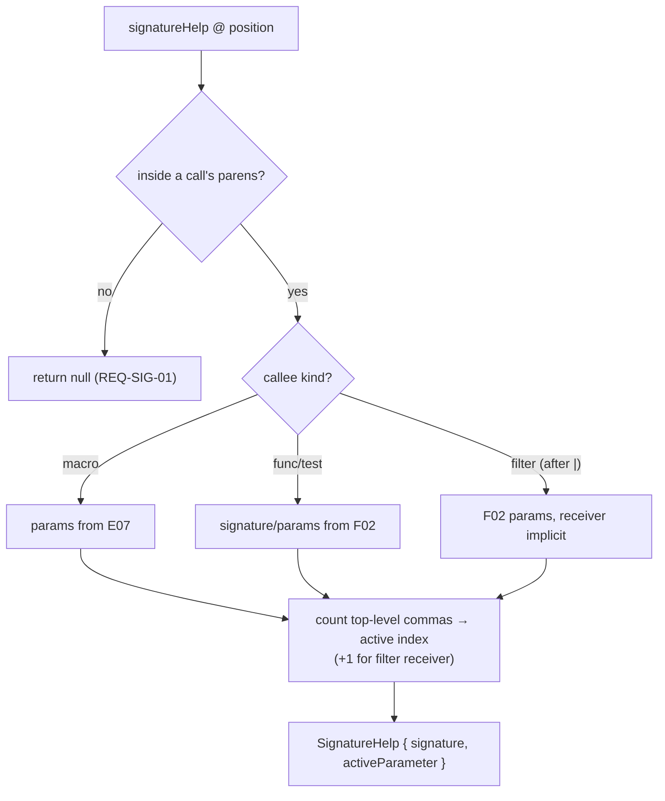

# F07 — Signature Help

> **Status:** Draft
>
> **Version:** 0.1   ·   **Last updated:** 2026-06-24
>
> **Purpose:** Signature help inside macro, function, and filter calls — showing the full signature with the active parameter highlighted and per-parameter docs — re-resolving the active parameter as the cursor crosses commas.

> **Depends on:** [constitution](../constitution.md), [F02-builtin-registry](F02-builtin-registry.md), [E07-data-model](../foundations/E07-data-model.md), [E01-architecture](../foundations/E01-architecture.md)   ·   **Related:** [F03-extension-packs](F03-extension-packs.md), [F04-user-hints](F04-user-hints.md), [F05-completions](F05-completions.md), [F06-hover](F06-hover.md)

> Requirement tag: **SIG**

---

## 1. Purpose & Scope

Signature help is the popup that follows your cursor through a call's arguments. Open the paren on `post_url(`, and it shows `post_url(post)` with `post` highlighted; type past a comma in `truncate(60, ` and the highlight moves to `killwords`. It works the same for your macros, for built-in functions, and — importantly — for filter arguments, where the call's parens sit after a `|`.

This spec covers:

- The trigger characters (`(` and `,`) and where signature help applies.
- The **sources** — macro `params` ([E07](../foundations/E07-data-model.md)) and built-in `signature`/`params` ([F02](F02-builtin-registry.md)).
- **Filter-argument support** — `{{ x | truncate(<here>) }}`.
- **Active-parameter re-resolution** as the cursor moves across commas.

## 2. Non-Goals / Out of Scope

- The registry and the `params`/`signature` data — owned by [F02-builtin-registry](F02-builtin-registry.md).
- Completing the callee name (before the paren) — owned by [F05-completions](F05-completions.md).
- Whole-symbol hover docs — owned by [F06-hover](F06-hover.md) (signature help is per-parameter).
- The `wrong-call-args` diagnostic — owned by [F01-diagnostics](F01-diagnostics.md).

## 3. Background & Rationale

Signature help pairs naturally with completions: completion gets you to the callee, signature help walks you through its arguments. The data is already there — macros carry `params` from extraction ([E07](../foundations/E07-data-model.md)), built-ins carry `params` in their doc frontmatter ([F02](F02-builtin-registry.md)) — so this feature is mostly about *positioning*: figuring out which call you're in and which argument the cursor sits on. Jinja's one twist is the filter call: `truncate` is invoked as `x | truncate(60)`, where the receiver `x` is an implicit first argument. We handle that explicitly.

## 4. Concepts & Definitions

- **Signature** — the callee's parameter list, rendered as a label with per-parameter ranges.
- **Active parameter** — the parameter the cursor currently sits on, highlighted in the popup.
- **Filter call** — a filter applied with arguments, `x | filter(args)`, where the piped value is the implicit first argument.

## 5. Detailed Specification

### 5.1 Triggers and applicability

Signature help appears when you open a call and updates as you add arguments.

**REQ-SIG-01 — Trigger on `(` and `,`.**

The `signatureHelpProvider` declares trigger characters `(` and `,` ([E01 §5.5](../foundations/E01-architecture.md)). `(` opens the popup for the enclosing call; `,` advances (re-resolves) the active parameter. It's also available on manual invoke while the cursor is inside a call's argument list. Signature help applies only **inside Jinja delimiters**; outside them it returns nothing (P5).

### 5.2 The sources

The signature comes from whatever the callee is — a user macro or a registry symbol.

**REQ-SIG-02 — Signatures resolve from macro params or the registry.**

- For a **macro** call, the signature is built from the macro's `params` ([E07](../foundations/E07-data-model.md)) — name, and default where present.
- For a **function/filter/test** call, the signature is the registry entry's `signature` string and `params` list ([F02 §5.3](F02-builtin-registry.md)) — including pack ([F03](F03-extension-packs.md)) and hinted ([F04](F04-user-hints.md)) callables. Only active-set symbols are eligible.

Each parameter's `type`, `default`, and `required` ([F02](F02-builtin-registry.md) `Param`) become its per-parameter documentation in the popup.

### 5.3 Filter-argument support

Filters are the Jinja-specific case, and they must work.

**REQ-SIG-03 — Signature help works for filter arguments.**

Inside `{{ x | truncate(<here>) }}`, signature help shows `truncate`'s signature. The piped value `x` is the filter's implicit first parameter (the `s` in `truncate(s, length=…)`), so the **first explicit argument in the parens maps to the second parameter**. The popup reflects this: when the cursor is in the first paren slot, the active parameter is `length`, not `s`. This off-by-one mapping is the only filter-specific rule.

### 5.4 Active-parameter re-resolution

The highlight must track the cursor, not just the opening paren.

**REQ-SIG-04 — The active parameter re-resolves across commas.**

The active parameter index is computed from the cursor's position within the argument list: count the top-level commas before the cursor (ignoring commas nested in inner calls, brackets, or strings). Each `,` trigger recomputes it, so the highlight moves `length → killwords → end` as you type. For a filter call, add one to the index for the implicit receiver (§5.3). When the cursor is past the last parameter (e.g. extra args), the popup shows the signature with no active highlight rather than erroring.

### 5.5 The response shape

The response is a standard `SignatureHelp`, with the active parameter marked so the editor can bold it.

**REQ-SIG-05 — `SignatureHelp` carries the active parameter index.**

The response is a `SignatureHelp` with one `SignatureInformation` (the resolved signature label + a `parameters` list of `ParameterInformation`, each with its own doc) and an `activeParameter` index ([F02](F02-builtin-registry.md) supplies the param docs). The editor bolds the active parameter from that index.

## 6. UI Mockups

### 6.1 Signature popup with the active parameter bolded

The popup appears at the open paren and follows the cursor. Here in a `truncate` filter call, after one comma — the active parameter (`killwords`) is bolded:

```
templates/blog/post.html
  4 │ {{ post.body | truncate(60, | ) }}
    │                            └─▶
    ╭─ truncate(s, length=255, ▟killwords=False▙, end='...', leeway=None) ─╮
    │                                                                       │
    │  killwords : bool = False                                             │
    │  If true, cut mid-word instead of at the last word boundary.          │
    ╰───────────────────────────────────────────────────────────────────────╯
      ▟ ▙ = active parameter (REQ-SIG-04)   ·   s is the piped value (REQ-SIG-03)
```

### 6.2 Signature popup for a macro call

For a user macro, the signature comes from its extracted `params`:

```
  9 │ {{ post_url(| ) }}
    │             └─▶
    ╭─ post_url(▟post▙) ──────────────────────────── macro ─╮
    │  post                                                  │
    │  the blog post to build a URL for                      │
    ╰────────────────────────────────────────────────────────╯
```

States: opened (first param active) · advanced (later param active via `,`) · filter call (receiver implicit, index +1) · past-last (signature shown, no highlight) · dismissed (cursor leaves the parens or the delimiter).

## 7. Visualizations

How a signature-help request resolves the callee and the active parameter:



## 8. Data Shapes

A `SignatureHelp` for `truncate(60, ` (cursor on the second explicit arg) — note `activeParameter: 2`, since `s` is index 0:

```json
{
  "signatures": [{
    "label": "truncate(s, length=255, killwords=False, end='...', leeway=None)",
    "parameters": [
      {"label": "s"},
      {"label": "length=255",     "documentation": "int = 255"},
      {"label": "killwords=False", "documentation": "bool = False — cut mid-word"},
      {"label": "end='...'",       "documentation": "string = '...'"},
      {"label": "leeway=None",     "documentation": "int = None"}
    ]
  }],
  "activeSignature": 0,
  "activeParameter": 2
}
```

## 9. Examples & Use Cases

In `starlette-blog`'s `templates/blog/post.html`, the author types `{{ post.body | truncate(`. Signature help opens showing `truncate`'s full signature with `length` active (the receiver `post.body` filled `s` — REQ-SIG-03). Typing `60, ` advances the highlight to `killwords` (REQ-SIG-04). Elsewhere, calling the imported macro `{{ post_url(` opens `post_url(post)` with `post` active and its docstring-derived parameter note (§6.2). Both come from data already in the index — no new extraction.

## 10. Edge Cases & Failure Modes

- **Cursor outside a call / outside delimiters** → `null` (REQ-SIG-01, P5).
- **Comma nested in an inner call or string** → not counted toward the active index (REQ-SIG-04).
- **More arguments than parameters** → signature shown with no active highlight, no error.
- **Unknown callee** (typo'd macro/filter) → `null`; no signature to show (P4).
- **Filter with no declared params** (e.g. `upper`) → minimal signature, receiver only.
- **Half-typed call `truncate(`** → tree-sitter recovers; signature still resolves (P3).

## 11. Testing

Signature help is verified by unit tests over active-index computation (including the filter offset), integration tests over fixtures, and `pytest-lsp` journeys for the live protocol.

### 11.1 Scope & coverage

Target: **100% of this feature's behavior is covered.** Every `REQ-SIG-NN` maps to a test; the filter-offset and comma-counting logic and every §6 state have tests. See the policy in [E17-testing](../foundations/E17-testing.md#2-coverage-policy).

### 11.2 Test plan

| Behavior / scenario | Type | Fixtures | Verifies |
|---|---|---|---|
| `(` and `,` declared as triggers | e2e (pytest-lsp) | [starlette-blog](../foundations/E17-testing.md#5-fixtures-registry) | REQ-SIG-01 |
| Macro signature from `params`; built-in from registry | unit | [starlette-blog](../foundations/E17-testing.md#5-fixtures-registry) | REQ-SIG-02 |
| Filter call: receiver implicit, index offset by one | unit | [starlette-blog](../foundations/E17-testing.md#5-fixtures-registry) | REQ-SIG-03 |
| Active param re-resolves across top-level commas | unit | [starlette-blog](../foundations/E17-testing.md#5-fixtures-registry) | REQ-SIG-04 |
| Nested commas/strings don't bump the active index | unit | [starlette-blog](../foundations/E17-testing.md#5-fixtures-registry) | REQ-SIG-04 |
| Response carries `activeParameter` + per-param docs | unit + e2e | [starlette-blog](../foundations/E17-testing.md#5-fixtures-registry) | REQ-SIG-05 |
| Outside a call / unknown callee → null | unit | [starlette-blog](../foundations/E17-testing.md#5-fixtures-registry) | REQ-SIG-01, REQ-SIG-02 |

### 11.3 Fixtures

- Reuses [starlette-blog](../foundations/E17-testing.md#5-fixtures-registry) (the `post_url` macro and built-in/pack filters with params). Hinted callables reuse [user-hints](../foundations/E17-testing.md#5-fixtures-registry).

### 11.4 Requirement coverage

| Requirement | Covered by |
|---|---|
| REQ-SIG-01 | trigger + negative tests |
| REQ-SIG-02 | macro + registry source tests |
| REQ-SIG-03 | filter-offset test |
| REQ-SIG-04 | comma-counting tests (incl. nesting) |
| REQ-SIG-05 | response-shape test |

## 12. End-to-End Test Plan

Signature help is exercised end to end via `pytest-lsp` ([E29 Branch B](../foundations/E29-e2e-testing.md)) — open a call, assert the active parameter, advance across a comma.

### 12.1 Coverage target

**100% of the trigger, source, filter-offset, and re-resolution behavior**, end to end.

### 12.2 Scenarios

| # | Journey | Path | Expected outcome |
|---|---|---|---|
| E2E-01 | Open `post_url(` | happy | signature shown, `post` active |
| E2E-02 | Open `truncate(` after a `\|` | happy | `length` active (receiver implicit) |
| E2E-03 | Type past a comma in `truncate(60, ` | happy | active parameter advances to `killwords` |
| E2E-04 | Signature help in plain HTML | negative | `null` response |

## 13. Non-Functional Requirements

### 13.1 Security & Privacy

- **Access & authorization** — local process, no auth boundary. Signatures come from the in-memory registry and index; no file is read at request time.
- **Input & validation** — the request position is the only input; malformed/half-typed calls degrade gracefully, never panic (P3).
- **Data sensitivity** — surfaces only the user's own symbols and embedded docs; nothing leaves the machine.

### 13.2 Accessibility

- **N/A** — no GUI; the editor renders the signature popup (constitution §4.6).

### 13.4 Performance & Scale

- **Latency** — a signature-help response returns well under the < 100 ms interactive budget (P6); resolving the callee and counting commas is a small local computation over the index in a pure-function handler ([E01 §5.4](../foundations/E01-architecture.md)).
- **Volume & scale** — one signature with a handful of parameters; trivial payload.

## 15. Open Questions & Decisions

- **Decided** — triggers are `(` and `,`; the filter receiver is an implicit first parameter (index offset by one); the active parameter is recomputed on every comma.
- **OQ-SIG-1** — should keyword arguments (`truncate(killwords=True)`) jump the active parameter to the named one rather than by position? Deferred; v1 resolves positionally.

## 16. Cross-References

- **Depends on:** [constitution](../constitution.md) — P5 (companion), P6 (latency); [F02-builtin-registry](F02-builtin-registry.md) — `signature`/`params` and per-parameter docs; [E07-data-model](../foundations/E07-data-model.md) — macro params; [E01-architecture](../foundations/E01-architecture.md) — trigger chars, pure-read dispatch.
- **Related:** [F03-extension-packs](F03-extension-packs.md), [F04-user-hints](F04-user-hints.md) — extra callable sources; [F05-completions](F05-completions.md) — completes the callee before the paren; [F06-hover](F06-hover.md) — whole-symbol docs vs per-parameter; [F01-diagnostics](F01-diagnostics.md) — `wrong-call-args` validates what signature help guides.

## 17. Changelog

- **2026-06-24** — Initial draft.
