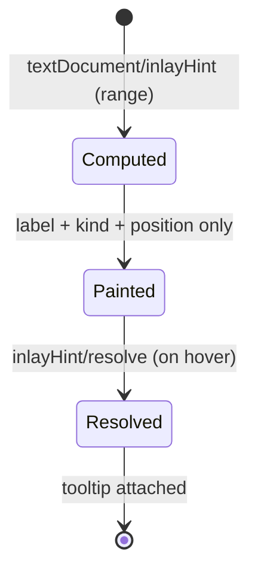

# F14 — Inlay Hints

> **Status:** Draft
>
> **Version:** 0.3   ·   **Last updated:** 2026-06-26
>
> **Purpose:** Inline ghost text that makes Jinja calls and blocks self-explanatory — parameter-name labels at macro and filter calls and an `endblock` name echo (a loop-variable type hint is designed but deferred, OQ-INLAY-2) — all served lazily via `inlayHint/resolve`.

> **Depends on:** [constitution](../constitution.md), [E07-data-model](../foundations/E07-data-model.md), [E01-architecture](../foundations/E01-architecture.md)   ·   **Related:** [F02-builtin-registry](F02-builtin-registry.md), [F04-user-hints](F04-user-hints.md), [F07-signature-help](F07-signature-help.md)

> Requirement tag: **INLAY**

---

## 1. Purpose & Scope

Inlay hints are the small grey labels an editor paints *between* your tokens — they tell you what an argument means without you opening the definition. When you call `{{ comment_card(comment, true) }}`, the hint shows you that the bare `true` fills the `show_actions` parameter; when you close a long block with a bare ``, the hint reminds you which block you just closed.

This spec covers:

- **Parameter-name hints** at macro call sites, drawn from each macro's declared parameters ([E07](../foundations/E07-data-model.md)), and at filter call sites, drawn from the built-in's frontmatter params ([F02](F02-builtin-registry.md)).
- **`endblock` name echo** when a `` omits its block name.
- **Loop-variable type hints** when a loop iterates a hinted iterable — **deferred from v1** (OQ-INLAY-2): F04 does not yet model iterable element types.
- The shipped categories as independent, client-toggleable settings.
- Lazy tooltip computation via `inlayHint/resolve`.

## 2. Non-Goals / Out of Scope

- The full call-site signature popup — owned by [F07-signature-help](F07-signature-help.md).
- The documentation bodies that hints can link to — owned by [F02-builtin-registry](F02-builtin-registry.md) and [F04-user-hints](F04-user-hints.md).
- Inferring types by executing Python or rendering templates — forbidden by P1; we only echo what hints already declare.
- Inlay hints inside the host language (HTML/SQL/text) — we paint hints only inside Jinja delimiters (P5).

## 3. Background & Rationale

Jinja calls are positional, and a macro like `comment_card(comment, show_actions)` reads as `comment_card(comment, true)` at the call site — the second argument is a mystery. Inlay hints close that gap the way they do in Rust or TypeScript: a faint `show_actions:` label before `true`. Filter calls (`{{ x | truncate(60) }}`) have the same problem, with the twist that the receiver `x` is an implicit first argument — but F02's `params` list already excludes that receiver, so the first explicit argument maps straight to `params[0]` ([F07](F07-signature-help.md) REQ-SIG-03). And — again like Rust/TS/clangd — a hint is pointless when the argument already spells the parameter (`comment` filling `comment`), so we suppress it. The `endblock` echo earns its place because base layouts often nest blocks hundreds of lines deep, and a bare `` tells you nothing. Each category is independently toggleable because hints are noise to some readers and a lifeline to others; per P4-adjacent restraint, the noisiest one (loop types) would ship off — and in fact it does not ship in v1 at all, because F04 has no iterable element-type declaration for it to echo (OQ-INLAY-2).

## 4. Concepts & Definitions

- **Inlay hint** — inline ghost text the editor renders between tokens. (Canonical definition in [glossary](../glossary.md).)
- **Parameter-name hint** — a `param:` label painted before a positional argument at a macro or filter call site.
- **Filter receiver** — for a filter call `x | f(args)`, the piped value `x` is the filter's implicit receiver. F02's `params` list already **excludes** the receiver (the `truncate` doc lists `[length, killwords, end, leeway]`, not `s` — [F02 §5.3](F02-builtin-registry.md)), so the first explicit argument maps directly to `params[0]`; no index offset is applied ([F07](F07-signature-help.md) REQ-SIG-03 reasons the same way against the same list).
- **`endblock` echo** — the block name painted after a name-less ``.
- **Resolve** — the lazy second round-trip (`inlayHint/resolve`) that attaches a hint's tooltip only when the user hovers it.

## 5. Detailed Specification

The server advertises `inlayHintProvider` with `resolveProvider: true` ([E01](../foundations/E01-architecture.md)). On `textDocument/inlayHint` for a visible range, the handler reads the `TemplateIndex` for that file and emits hints purely from extracted facts — no parsing, no execution.

### 5.1 Parameter-name hints at macro calls

When you call a macro with positional arguments, the hint labels each argument with the parameter it fills.

**REQ-INLAY-01 — Label positional macro arguments with their parameter name.**

For a call to a known macro, emit one `InlayHint` of kind `Parameter` immediately before each positional argument, with label `<param>:` and position at the argument's start. The parameter names come from the macro's `parameters` list ([E07](../foundations/E07-data-model.md)), matched left-to-right. So `{{ comment_card(comment, true) }}` renders as `{{ comment_card(comment, show_actions: true) }}` — the bare `true` is labelled `show_actions:`, while the first argument gets no hint (next paragraph).

Hints are emitted only for the **leading run of positional arguments**, stopping at the first keyword argument (`comment_card(comment, show_actions=true)` → the trailing keyword arg already names its parameter, so it and any argument after it get no hint — this mirrors [F07](F07-signature-help.md)'s positional-only v1). A hint is emitted only when the macro is resolvable in the `WorkspaceIndex`; unresolvable calls get no hint — we never guess (P4). Arguments past the last declared parameter get no hint (label up to the last declared param; extras get none).

**REQ-INLAY-06 — Suppress the hint when the argument already spells the parameter.**

When a positional argument is a bare identifier, or an **attribute access whose final segment** equals the parameter name, emit no hint — the label would be redundant. The final segment is the trailing accessor of either attribute-access form (per [glossary](../glossary.md)): dotted `post.author` → `author`, and subscript with a **string-literal key** `post["author"]` → `author`. So `comment_card(comment, true)` labels only `show_actions:` (the `comment` argument matches its `comment` parameter and is suppressed); `post_url(post.author)` / `post_url(post["author"])` filling a `post` parameter still labels (final segment `author` ≠ `post`); and `post_url(post)`, `post_url(self.post)`, or `post_url(ctx["post"])` filling a `post` parameter is suppressed (final segment `post`). A non-literal subscript key (`post[i]`, `post[key]`) has no statically known final segment, so suppression does not apply and the hint is emitted. This matches rust-analyzer, TypeScript, and clangd, which all hide the noise of `f(x: x)`.

This category (macro and filter parameter-name hints) is **on by default**.

### 5.2 Parameter-name hints at filter calls

Filters take arguments too, and the same labelling helps — with one Jinja-specific twist.

**REQ-INLAY-07 — Label positional filter arguments, receiver implicit.**

For a filter call `{{ x | truncate(60) }}` where the filter is a resolvable built-in, emit one `InlayHint` of kind `Parameter` before each explicit positional argument. The parameter names come from the built-in's **F02 frontmatter `params`** ([F02 §5.3](F02-builtin-registry.md)) — *not* from [E07](../foundations/E07-data-model.md), which models macros, not filters. F02's `params` list **already excludes the implicit receiver** — `truncate`'s `params` are `[length, killwords, end, leeway]`, with the receiver `s` appearing only in the `signature` string — so the **first explicit argument maps to `params[0]`**, with **no index offset** ([F07](F07-signature-help.md) REQ-SIG-03 resolves against the same receiver-less list). So `{{ post.body | truncate(60) }}` renders as `{{ post.body | truncate(length: 60) }}` — `60` is labelled `length:` (`params[0]`), never `s:`.

The same rules as §5.1 apply: only the leading run of positional args is labelled (stop at the first keyword arg — REQ-INLAY-01); the argument-equals-parameter suppression holds (REQ-INLAY-06); unresolvable filters get no hint (P4); extra args past the last declared param get none. A filter with no declared params beyond the receiver (e.g. `upper`) yields no hints.

This category is **on by default** (it shares the `parameterNames` toggle — §5.5).

### 5.3 `endblock` name echo

A long block closed with a bare `` gives the reader no anchor; the echo supplies one.

**REQ-INLAY-02 — Echo the block name after a name-less `endblock`.**

When a `` omits the block name, emit one `InlayHint` carrying the owning block's name, positioned **immediately after the `endblock` keyword token** (so it reads ``). The position is anchored to the **end of the `endblock` keyword token itself**, independent of any whitespace-control markers or padding: `` and `` place the echo at the same point relative to the keyword as `` does — the `-` trim markers and surrounding whitespace never shift it. A `` that already names the block gets no hint — it would be redundant. The block name is read from the enclosing `BlockDefinition` ([E07](../foundations/E07-data-model.md)).

A block name is neither a parameter nor a type, and LSP defines no `InlayHintKind` for a name/label (only `Type` and `Parameter` exist). We therefore emit a **plain, kind-less hint** — `kind` is left unset — rather than mislabel it `Type`. (If a client requires a kind, `Type` is the deliberate fallback; the name is not semantically a type.)

This category is **on by default**.

### 5.4 Loop-variable type hints (deferred — see OQ-INLAY-2)

When a loop iterates a variable whose element type is known from a hint, the loop variable could carry that type. **This category is deferred from v1**: it depends on an iterable element-type declaration that [F04](F04-user-hints.md) does not currently model — F04's `type` field is the scalar Python type name (informational, [F04 REQ-HINT-03](F04-user-hints.md)) and its `attributes` list describes a variable's attribute tree, but neither expresses "`posts` is a list whose elements are `Post`". Without that pinned data shape the hint has nothing to echo, so the requirement below is held open as **OQ-INLAY-2** rather than scheduled for v1 (P4 — we never guess a type).

**OQ-INLAY-2 (intended design) — Hint the loop variable's element type when the iterable's element type is F04-declared.**

For ``, *if and when* F04 grows a way to declare an iterable's element type, and `<iterable>` is a hinted `context_variable` ([F04](F04-user-hints.md)) carrying that declared element type, emit a `Type`-kind hint `: <ElementType>` after `<var>`. So in `digest.html`, `` would render as `` when `posts` is hinted as a list of `Post`. **The hint echoes only the F04-declared element type — it never infers a runtime or element type from data, template structure, or usage** (P1); with no declared element type, no hint is emitted (P4).

When activated, this category would be **off by default** — element types are coarse and the hint is the noisiest of the three.

### 5.5 Toggles

Each category is an independent on/off switch the client controls.

**REQ-INLAY-04 — Each category toggles independently.**

The two shipped categories map to two client-side settings: `parameterNames` (default on — covers both macro and filter parameter-name hints, REQ-INLAY-01/06/07) and `endblockNames` (default on). A disabled category emits no hints of that kind; the other is unaffected. Clients that pass these as `InitializationOptions` (or the editor extension's settings — [F20](F20-editor-integrations.md)) get the configured defaults. The deferred loop-variable category (OQ-INLAY-2) reserves the `loopVariableTypes` setting name (default off) for when it ships; until then it is a no-op.

### 5.6 Lazy tooltips via resolve

The initial response stays cheap; tooltips are computed only when needed.

**REQ-INLAY-05 — Attach tooltips lazily on resolve.**

The `textDocument/inlayHint` response ships each hint with its label, kind, and position only — no `tooltip`. When the user hovers a hint, the client calls `inlayHint/resolve`, and only then does the handler attach a Markdown tooltip: a parameter hint resolves to the parameter's doc (its declared type/default, or the registry doc — [F02](F02-builtin-registry.md)/[F04](F04-user-hints.md)); an `endblock` echo resolves to the block's definition location.

Each hint carries an opaque `data` payload so resolve can find the source symbol. That `data` is a **stable logical key**, never a byte offset: for a parameter hint, `(template path, macro-or-filter name, parameter index)`; for an `endblock` echo, `(template path, block name)`. The **parameter index is the declared-param index** — the offset into the source's parameter list (macro `parameters` ([E07](../foundations/E07-data-model.md)) or filter `params` ([F02](F02-builtin-registry.md))), *not* the explicit-argument index. Since F02 `params` already excludes the filter receiver (REQ-INLAY-07), this is the same index used to pick the hint's label, so resolve fetches the exact param doc it labelled (`truncate(60)` stores index `0` → `length`, never `s`). A byte offset would be useless because the `TemplateIndex` is replaced atomically on every edit ([E07](../foundations/E07-data-model.md) REQ-DATA-08), so any offset baked into `data` is stale the moment the document changes. On resolve, the handler **re-looks-up** the key against the *current* index: on a hit it attaches the tooltip; on a miss (the symbol moved, was renamed, or deleted) it returns the hint **untouched** — no tooltip, no throw (§10).

## 6. UI Mockups

### 6.1 Parameter-name hints + `endblock` echo (editor)

How the default categories render together in `blog/post.html`. The faint labels (shown here in `‹…›`) are the painted inlay hints, not source text. Note where hints *don't* appear: `comment` filling the `comment` parameter is suppressed (REQ-INLAY-06), only the informative `show_actions:` label survives; and the `truncate(60)` filter labels `60` as `length:` (`params[0]`) because the piped `post.body` is the receiver, which F02 `params` excludes (REQ-INLAY-07).

```
templates/blog/post.html
 ┌──────────────────────────────────────────────────────────────────────┐
 │  3 │                                               │
 │  4 │   <a href="{{ post_url(post) }}">{{ post.title }}</a>            │
 │  5 │   {{ comment_card(comment, ‹show_actions:› true) }}             │
 │  6 │   <p>{{ post.body | truncate(‹length:› 60) }}</p>               │
 │ 18 │                                          │
 └──────────────────────────────────────────────────────────────────────┘
   ‹ … › = inlay hint (grey ghost text — not part of the file)
   line 4: post_url(post) has no hint — the argument `post` already
           names the `post` parameter (REQ-INLAY-06)
   line 18: the echo sits immediately after the `endblock` keyword
```

### 6.2 Loop-variable type hint (deferred — OQ-INLAY-2)

Intended rendering *if* the deferred category ships: when `loopVariableTypes` is enabled and `posts` is hinted with an element type of `Post` (`email/digest.html`):

```
 7 │ 
 8 │   {{ post.title }}
 9 │ 
```

### 6.3 Resolved tooltip on hover

Hovering the `show_actions:` parameter hint triggers `inlayHint/resolve` and shows its doc:

```
   …{{ comment_card(comment, show_actions: true) }}
                              │
                              ▼
        ╭───────────────────────────────────────────╮
        │ show_actions: bool = true                  │
        │                                            │
        │ Whether to render the reply / edit links.  │
        ╰───────────────────────────────────────────╯
```

## 7. Visualizations

The request/resolve lifecycle for a single hint.



## 9. Examples & Use Cases

In `starlette-blog`, `templates/blog/post.html` calls `{{ comment_card(comment, true) }}` where `comment_card(comment, show_actions)` is defined in `blog/macros.html`. With `parameterNames` on, the reader sees `comment_card(comment, show_actions: true)` and instantly understands the bare `true` — the first argument needs no label because `comment` already names its parameter (REQ-INLAY-06). The nearby `{{ post.body | truncate(60) }}` likewise shows `truncate(length: 60)`, the receiver `post.body` excluded from F02 `params` so `60` maps to `params[0]` (REQ-INLAY-07). The base layout in `templates/base.html` closes its `body` block 40 lines after opening it; with `endblockNames` on, the bare `` echoes `body`, so the reader doesn't scroll back to check. A maintainer who finds the labels noisy turns `parameterNames` off in their editor settings; everyone else keeps them.

## 10. Edge Cases & Failure Modes

- **Unresolvable macro/filter call** → no parameter hints (we never guess a parameter name — P4).
- **More arguments than parameters** → label up to the last declared parameter; extras get no hint.
- **Argument already names its parameter** (`comment` filling `comment`, `post.author` or `post["author"]` filling `author`) → no hint; the label would be redundant (REQ-INLAY-06).
- **Subscript with a non-literal key** (`post[i]` filling `post`) → no statically known final segment, so suppression does not apply; the hint is emitted (REQ-INLAY-06).
- **Keyword argument** (`comment_card(comment=c)`) → already named, so no hint; and labelling stops at the first keyword arg, so any positional argument *after* one gets no hint either (REQ-INLAY-01, mirrors [F07](F07-signature-help.md) positional-only v1).
- **Filter receiver** → F02 `params` already excludes the receiver, so the first explicit filter argument maps to `params[0]` (no offset); `truncate(60)` labels `60` as `length:`, never `s:` (REQ-INLAY-07, [F07](F07-signature-help.md) REQ-SIG-03).
- **Filter with no params beyond the receiver** (`upper`, empty `params`) → no hint; there is no `params[0]` to label.
- **``** (already named) → no echo; redundant.
- **Whitespace-control on a bare endblock** (``, ``) → echo still emitted, anchored to the end of the `endblock` keyword token; the trim markers and any padding never move it (REQ-INLAY-02).
- **Loop over an iterable (any)** → no type hint in v1; the loop-variable category is deferred (OQ-INLAY-2). When it ships, a non-hinted iterable would still get no hint even with the category on.
- **Half-typed call** `{{ post_url( }}` → tree-sitter recovers; no hint until the argument node exists (P3).
- **Resolve for a stale hint** (the document changed underneath, so the `data` logical key no longer resolves) → return the hint unchanged with no tooltip; never throw (REQ-INLAY-05).

## 11. Testing

Each category and the resolve round-trip are unit-tested against the `starlette-blog` fixture; toggles are tested for independence.

### 11.1 Scope & coverage

Target: **100% of this feature's behavior.** Every `REQ-INLAY-NN` maps to at least one test; every category state (§6) and edge case (§10) has a test. See [E17-testing](../foundations/E17-testing.md#2-coverage-policy).

### 11.2 Test plan

Each row names the concrete call/construct, the fixture (or a synthetic `didOpen` doc where no fixture carries the construct — [E17 §5](../foundations/E17-testing.md#starlette-blog)), and the exact expected hint (label + position) or its absence. Rows pair happy (hint emitted) with negative (no hint) polarities for every branch.

| # | Behavior / scenario | Call / construct · fixture | Expected hint (label · position) or absence | Type | Verifies |
|---|---|---|---|---|---|
| T-01 | Positional arg whose name differs from the param → one `param:` label | `{{ comment_card(comment, true) }}` in `blog/post.html` · [starlette-blog](../foundations/E17-testing.md#starlette-blog) | `show_actions:` of kind `Parameter`, immediately before the `true` argument; no hint on `comment` (suppressed, T-21) | unit | REQ-INLAY-01 |
| T-02 | Multiple positional args → labels in left-to-right order | `{{ render_link(href, label) }}` (params `url`, `text`) · synthetic doc importing a two-param macro | `url:` before `href`, then `text:` before `label`, both `Parameter` | unit | REQ-INLAY-01 |
| T-03 | Keyword arg → no hint, and stops the positional run (§10) | `{{ comment_card(comment, show_actions=true) }}` in `blog/post.html` · [starlette-blog](../foundations/E17-testing.md#starlette-blog) | no hint on `show_actions=true` (already named); `comment` is suppressed anyway (T-21) | unit | REQ-INLAY-01 |
| T-04 | Unresolvable / unknown macro callee → no hint (§10) | `{{ nonexistent_macro(x) }}` · synthetic doc | empty hint list — never guess a parameter name (P4) | unit | REQ-INLAY-01 |
| T-05 | Over-arity call → label up to last param, extras get none (§10) | `{{ post_url(slug, extra) }}` (one-param macro, two args) · synthetic doc importing a one-param macro | `post:` before `slug`; no hint before `extra` | unit | REQ-INLAY-01 |
| T-06 | Half-typed call → no hint until the argument node exists (§10) | `{{ post_url( }}` · synthetic doc | empty hint list; tree-sitter recovers, no crash (P3) | unit | REQ-INLAY-01 |
| T-20 | Positional arg *after* a keyword arg → no hint (run stops at the first keyword, §10) | `{{ render_link(href, text=label, "noopener") }}` · synthetic doc | `url:` before `href`; no hint on `text=label` (named) and none on the trailing positional `"noopener"` | unit | REQ-INLAY-01 |
| T-21 | Arg name equals param name → suppressed (§10) | `{{ post_url(post) }}` (param `post`) in `blog/post.html` · [starlette-blog](../foundations/E17-testing.md#starlette-blog) | empty hint list — `post` already names the `post` parameter (REQ-INLAY-06) | unit | REQ-INLAY-06 |
| T-22 | Attribute arg → suppress only when the final segment equals the param | `{{ thumb(post.author) }}` vs `{{ thumb(post.slug) }}` (param `author`) · synthetic doc | `post.author` (final segment `author` = param) → no hint; `post.slug` (final segment `slug` ≠ param) → `author:` before `post.slug` | unit | REQ-INLAY-06 |
| T-27 | Subscript arg → suppress on a string-literal final segment; emit on a non-literal key | `{{ thumb(post["author"]) }}`, `{{ thumb(post["slug"]) }}`, `{{ thumb(post[i]) }}` (param `author`) · synthetic doc | `post["author"]` → no hint; `post["slug"]` → `author:` before it; `post[i]` (no static final segment) → `author:` before it | unit | REQ-INLAY-06 |
| T-23 | Filter positional arg → labelled with receiver offset | `{{ post.body | truncate(60) }}` · [starlette-blog](../foundations/E17-testing.md#starlette-blog) | `length:` of kind `Parameter` before `60` (`params[0]`; the receiver `s` is excluded from F02 `params`, no offset — REQ-SIG-03) | unit | REQ-INLAY-07 |
| T-24 | Filter with receiver-only params → no hint | `{{ name | upper }}` / `{{ name | upper() }}` · synthetic doc | empty hint list — empty `params`, no `params[0]` to label | unit | REQ-INLAY-07 |
| T-07 | Bare `` → block-name echo | long `content` block closed `` in `blog/post.html` · [starlette-blog](../foundations/E17-testing.md#starlette-blog) | `content`, **kind unset**, positioned immediately after the `endblock` keyword | unit | REQ-INLAY-02 |
| T-08 | Bare `` on the base layout → echoes `body` | `body` block closed bare in `base.html` · [starlette-blog](../foundations/E17-testing.md#starlette-blog) | `body`, kind unset, immediately after the `endblock` keyword | unit | REQ-INLAY-02 |
| T-09 | Named `` → no echo (redundant, §10) | named endblock in a synthetic doc | no echo hint on that tag | unit | REQ-INLAY-02 |
| T-26 | Bare endblock with whitespace-control → echo anchored to the keyword | `` and `` closing `content` · synthetic doc | `content` echo positioned immediately after the `endblock` keyword token, identical to ``; trim markers/padding do not shift it | unit | REQ-INLAY-02 |
| T-10 | *(deferred, OQ-INLAY-2)* Loop over an iterable with a declared element type → element-type hint | `` where `posts` carries a declared element type `Post` · [user-hints](../foundations/E17-testing.md#user-hints) | *(when the category ships)* `: Post` of kind `Type`, after `post`; **v1: no loop hint** | unit | OQ-INLAY-2 |
| T-11 | Loop over any iterable in v1 → no type hint (category deferred, §10) | `` · [starlette-blog](../foundations/E17-testing.md#starlette-blog) | no `Type` loop hint (loop-variable category not shipped — OQ-INLAY-2) | unit | OQ-INLAY-2 |
| T-12 | `parameterNames` off → suppresses only `param:` labels | `post.html` content block with `endblockNames` left on · [starlette-blog](../foundations/E17-testing.md#starlette-blog) | no `Parameter` hints (macro or filter); `content` endblock echo still present | unit | REQ-INLAY-04 |
| T-13 | `endblockNames` off → suppresses only the echo | `post.html` content block with `parameterNames` left on · [starlette-blog](../foundations/E17-testing.md#starlette-blog) | no endblock echo; `show_actions:` parameter hint still present | unit | REQ-INLAY-04 |
| T-14 | *(deferred, OQ-INLAY-2)* `loopVariableTypes` on → enables only loop type hints | `` with the other two toggles off · [user-hints](../foundations/E17-testing.md#user-hints) | *(when the category ships)* `: Post` loop hint present; no parameter/endblock hints; **v1: the toggle is a no-op, no loop hint** | unit | OQ-INLAY-2 |
| T-15 | `loopVariableTypes` (reserved, default off) → no loop type hints, others unaffected | hinted-`posts` loop plus a macro call, defaults applied · [user-hints](../foundations/E17-testing.md#user-hints) | no loop hint (category deferred — OQ-INLAY-2); parameter hint on the call still present | unit | REQ-INLAY-04 |
| T-16 | Initial response carries label/kind/position only, no tooltip | `{{ comment_card(comment, true) }}` parameter hint · [starlette-blog](../foundations/E17-testing.md#starlette-blog) | hint has no `tooltip` field; opaque logical-key `data` payload present | unit | REQ-INLAY-05 |
| T-17 | Resolve a parameter hint → Markdown param doc tooltip | resolve the `show_actions:` hint · [starlette-blog](../foundations/E17-testing.md#starlette-blog) | tooltip = param doc (`show_actions: bool = true` + body) | unit | REQ-INLAY-05 |
| T-18 | Resolve an `endblock` echo → block definition location | resolve the `content` echo hint · [starlette-blog](../foundations/E17-testing.md#starlette-blog) | tooltip points at the `` definition | unit | REQ-INLAY-05 |
| T-19 | Resolve a stale hint (`data` key no longer resolves) → unchanged, no throw (§10) | resolve a hint after editing the doc so the macro/block moved or was renamed · synthetic doc | re-lookup of the logical key misses; hint returned unchanged, no tooltip, no exception | unit | REQ-INLAY-05 |
| T-25 | `data` is a logical key (path + name + param index / block name), not a byte offset | inspect the `data` of a parameter hint and an endblock echo · synthetic doc | parameter hint `data` = (path, macro/filter name, declared-param index — e.g. `truncate(60)` stores `0` → `length`, not the explicit-arg index); endblock `data` = (path, block name); neither carries a byte offset | unit | REQ-INLAY-05 |

### 11.3 Fixtures

- Reuses [starlette-blog](../foundations/E17-testing.md#5-fixtures-registry) for macro calls, filter calls (the `truncate` built-in), and `endblock` echoes, and [user-hints](../foundations/E17-testing.md#5-fixtures-registry) for the loop-variable type case (a hinted `posts` list).

### 11.4 Requirement coverage

| Requirement | Covered by |
|---|---|
| REQ-INLAY-01 | T-01–T-06, T-20 (positional order, keyword-named no-hint + run stops, unknown-callee no-hint, over-arity, half-typed, positional-after-keyword); E2E-01, E2E-06 |
| REQ-INLAY-02 | T-07–T-09, T-26 (bare echo ×2 kind-less + post-keyword position, named no-echo, whitespace-control anchoring); E2E-01 |
| OQ-INLAY-2 *(deferred)* | T-10, T-11, T-14 (intended element-type hint, v1 no-loop-hint, toggle no-op); E2E-03 |
| REQ-INLAY-04 | T-12, T-13, T-15 (each shipped toggle isolated; reserved loop toggle default off — no-op); E2E-03 |
| REQ-INLAY-05 | T-16–T-19, T-25 (no initial tooltip, param resolve, endblock resolve, stale-key resolve, logical-key shape); E2E-02, E2E-04 |
| REQ-INLAY-06 | T-21, T-22, T-27 (arg-equals-param suppressed, dotted + subscript final-segment match, non-literal key emits); E2E-01 |
| REQ-INLAY-07 | T-23, T-24 (filter arg → `params[0]`, receiver-less; empty-params filter no-hint); E2E-07 |

## 12. End-to-End Test Plan

### 12.1 Coverage target

**100% of the feature's user-visible scope** through the `pytest-lsp` LSP-protocol branch ([E29](../foundations/E29-e2e-testing.md#2-coverage-policy)): request hints, assert labels, then resolve and assert tooltips.

### 12.2 Scenarios

| # | Journey | Path | Expected outcome |
|---|---|---|---|
| E2E-01 | `inlayHint` over `post.html` content block (`comment_card(comment, true)`, `post_url(post)`, bare ``) · [starlette-blog](../foundations/E17-testing.md#starlette-blog) | happy | response includes the `show_actions:` label before `true` and the `content` endblock echo (kind unset, after the `endblock` keyword) at the right ranges; **no** hint on the `comment`/`post` arguments (each names its parameter — REQ-INLAY-06) |
| E2E-02 | `inlayHint/resolve` on the `show_actions:` parameter hint · [starlette-blog](../foundations/E17-testing.md#starlette-blog) | happy | resolved hint carries the parameter's Markdown tooltip (`show_actions: bool = true` + body) |
| E2E-03 | `inlayHint` over the `posts` loop (loop-variable category deferred — OQ-INLAY-2) · [user-hints](../foundations/E17-testing.md#user-hints) | happy | no `Type` loop hints (category not shipped); parameter and endblock hints still present |
| E2E-04 | `inlayHint/resolve` on a stale hint after a `didChange` (logical key no longer resolves) · synthetic doc | happy | hint returned unchanged with no tooltip; the server never throws |
| E2E-05 | `inlayHint` at a position outside any Jinja delimiter (host HTML) | error | empty hint list (host language untouched — P5) |
| E2E-06 | `inlayHint` over a call to an unresolvable macro · synthetic doc | error | empty hint list — no guessed parameter names (P4) |
| E2E-07 | `inlayHint` over the `{{ post.body | truncate(60) }}` filter call · [starlette-blog](../foundations/E17-testing.md#starlette-blog) | happy | response includes a `length:` label before `60` (`params[0]`; receiver `post.body` excluded from F02 `params`, no offset — REQ-INLAY-07 / REQ-SIG-03) |

## 13. Non-Functional Requirements

### 13.1 Security & Privacy

- **Input & validation** — hints read the syntax tree and the registry only; no template is executed (P1).
- **Data sensitivity** — labels and tooltips quote only the user's own source and their own hint docs; nothing leaves the machine.

### 13.2 Accessibility

- **N/A** — the editor renders all inlay-hint UI; jinja-lsp emits protocol data only (constitution §4.6).

### 13.4 Performance & Scale

- **Latency** — the `inlayHint` response covers only the requested (visible) range and reads the in-memory `TemplateIndex`, so it returns well inside the interactive budget; tooltip work is deferred to `resolve` (REQ-INLAY-05).

## 15. Open Questions & Decisions

- **Decided** — the two shipped categories (parameter-name, `endblock` echo) are on by default. Tooltips are resolve-lazy. No host-language hints (P5).
- **OQ-INLAY-1** — over-arity inlay behavior is **decided**: extra arguments past the last declared parameter get **no parameter hint** (§5.1, §10), so the inlay surface stays silent. The open part is narrower and *not* about the parameter hint: should jinja-lsp ever paint a separate **diagnostic-style inlay** (e.g. a faint warning marker) at an over-arity call, or leave that entirely to the `JINJA-E501 wrong-call-args` diagnostic ([F01](F01-diagnostics.md))? Leaning toward leaving it to `JINJA-E501` — inlay hints inform, diagnostics flag.
- **OQ-INLAY-2** — loop-variable type hints (§5.4, §6.2) are **deferred from v1**: they require an iterable element-type declaration that [F04](F04-user-hints.md) does not model (its `type` is a scalar Python type name and its `attributes` describe an attribute tree — neither expresses a list's element type). Ship this category only after F04 grows such a declaration; until then the `loopVariableTypes` toggle is reserved and a no-op. The design above is the intended behavior once F04 supports it.

## 16. Cross-References

- **Depends on:** [constitution](../constitution.md) — the mockup and P1/P5 rules; [E07-data-model](../foundations/E07-data-model.md) — macro `parameters`, `BlockDefinition`, and the per-edit index replacement (REQ-DATA-08) the `data` logical key works around; [E01-architecture](../foundations/E01-architecture.md) — the `inlayHintProvider` capability.
- **Related:** [F02-builtin-registry](F02-builtin-registry.md) — the source of **filter** param names (REQ-INLAY-07) and the docs tooltips resolve to; [F04-user-hints](F04-user-hints.md) — the docs tooltips resolve to; [F07-signature-help](F07-signature-help.md) — the richer call-site surface and the shared receiver-handling rule, which resolves against the same receiver-less F02 `params` list (REQ-SIG-03); [F20-editor-integrations](F20-editor-integrations.md) — where the toggles are configured.

## 17. Changelog

- **2026-06-24** — Initial draft.
- **2026-06-26** — v0.3: spec-review reconciliation pass (jinja-lsp-rv1, -eou, -r4f, -nb2, -7r2, -15v, -sko). **Fixed the filter off-by-one** (rv1): F02's `params` list *already excludes* the receiver, so the first explicit filter arg maps to `params[0]` with **no `+1` offset** — corrected REQ-INLAY-07, the §4 concept, §3/§6.1/§9 prose, T-23/T-24 and E2E-07 (the `length:` label is unchanged; only the reasoning was wrong). **Pinned the resolve `data` index basis** (eou): the parameter index is the **declared-param index** into the source's `parameters`/`params` list (the same receiver-less index that picks the label), not the explicit-arg index — REQ-INLAY-05 and T-25. **Deferred the loop-variable type category** (r4f, P1): F04 models a scalar `type` and an `attributes` tree but no iterable element type, so REQ-INLAY-03 became **OQ-INLAY-2** (intended design retained, `loopVariableTypes` reserved as a no-op) — updated §1/§2/§3 scope, §5.4, §5.5, §6.2, §10, T-10/T-11/T-14/T-15, §11.4 and E2E-03. **Reinforced** that the loop-type echo would carry only the F04-declared type, never an inferred one (nb2, P1, §5.4). **Specified `endblock` echo anchoring** under whitespace-control: the position is fixed to the end of the `endblock` keyword token regardless of `` markers or padding (7r2) — REQ-INLAY-02, a new §10 edge and T-26. **Extended arg-equals-param suppression to subscript access** `post["author"]` (final segment = the string-literal key; non-literal keys emit) per the glossary's attribute-access definition (15v) — REQ-INLAY-06, a §10 edge and T-27. **Reframed OQ-INLAY-1** (sko): the over-arity *inlay parameter hint* behavior is decided (silent); the residual question is narrowed to a possible future *diagnostic-style* inlay vs leaving it to `JINJA-E501`.
- **2026-06-25** — v0.2: review-fix pass. Added **filter-call parameter hints** (REQ-INLAY-07, §5.2) sourcing param names from F02 frontmatter with the receiver-implicit `+1` offset ([F07](F07-signature-help.md) REQ-SIG-03); added **arg-equals-param suppression** (REQ-INLAY-06) matching rust-analyzer/TS/clangd, and changed the hero example throughout from the redundant `post_url(post: post)` to `comment_card(comment, true)` → `show_actions:`; pinned the `endblock` echo position to immediately after the `endblock` keyword and made it a **kind-less** hint (no `Block`/`Name` InlayHintKind exists — `Type` was semantically wrong, REQ-INLAY-02); dropped the `*args` wording (E07 `Parameter` has no varargs flag) keeping the plain over-arity rule; restricted parameter hints to the **leading run of positional args**, stopping at the first keyword arg (mirrors F07 positional-only v1); and specified the resolve `data` payload as a **stable logical key** (path + macro/filter name + param index, or block name) that re-looks-up against the current index and returns untouched on miss — never a byte offset (E07 REQ-DATA-08). Added test rows T-20–T-25 and E2E-07, and re-traced §11.4.
- **2026-06-25** — Expanded §11.2 test plan to concrete per-branch rows (T-01–T-19) covering every hint kind and polarity — positional single/multi-param labels, keyword-named no-hint, unknown-callee no-hint, over-arity, half-typed, bare/named endblock echo, hinted/non-hinted loop type, per-toggle isolation, no-initial-tooltip, param/endblock/stale resolve — and grew §12.2 to E2E-01–E2E-06 (added stale-resolve and unresolvable-macro journeys). Rewrote §11.4 to trace each REQ to its T-/E2E ids.
