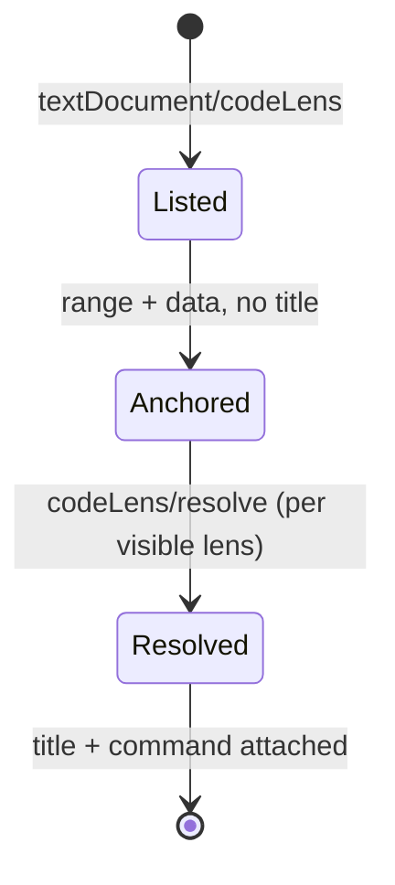

# F15 — Code Lens

> **Status:** Draft
>
> **Version:** 0.1   ·   **Last updated:** 2026-06-24
>
> **Purpose:** Actionable annotations above macros and blocks — a reference count and an inheritance summary — whose counts are computed lazily via `codeLens/resolve` so the initial response stays cheap.

> **Depends on:** [constitution](../constitution.md), [E07-data-model](../foundations/E07-data-model.md), [E01-architecture](../foundations/E01-architecture.md)   ·   **Related:** [F09-find-references](F09-find-references.md), [F16-call-hierarchy](F16-call-hierarchy.md), [F08-go-to-definition](F08-go-to-definition.md)

> Requirement tag: **LENS**

---

## 1. Purpose & Scope

Code lenses are the clickable grey lines an editor floats above a definition — "5 references", "extended by 2". They turn the reference graph and the inheritance graph into a glance: you see how connected a macro is, or whether a base block is ever overridden, without running find-references yourself.

This spec covers:

- A **reference-count** lens above every macro and block, counting usages from [F09](F09-find-references.md).
- An **inheritance** lens above every block — "overrides base" on a child block, "extended by N" on a parent block.
- The two lens kinds as independent, client-toggleable settings.
- Lazy count computation via `codeLens/resolve`.

## 2. Non-Goals / Out of Scope

- Producing the locations a lens links to — owned by [F09-find-references](F09-find-references.md) and [F08-go-to-definition](F08-go-to-definition.md).
- The incoming/outgoing call tree behind a macro — owned by [F16-call-hierarchy](F16-call-hierarchy.md).
- Lenses for the host language (HTML/SQL/text) — we annotate Jinja symbols only (P5).
- "Run" / "debug" lenses — we never execute templates (P1).

## 3. Background & Rationale

A macro defined in `blog/macros.html` might be called from three templates or from none. Without a lens, the only way to know is to run find-references. The reference-count lens surfaces that number inline, and clicking it opens the reference list. The inheritance lens answers a question unique to Jinja templates: when you edit a ``, does anything override it? A base block marked "extended by 2" warns you that two child templates depend on its contract; a child block marked "overrides base" tells you a parent exists to jump to. Both lenses are kept noise-conscious and independently toggleable, because a lens on every symbol is clutter.

## 4. Concepts & Definitions

- **Code lens** — a clickable annotation rendered above a line. (See the editor terms in [glossary](../glossary.md).)
- **Reference graph** — the cross-workspace map of symbol usages built by [F09](F09-find-references.md).
- **Inheritance graph** — the `extends`/block-override relationships in the `WorkspaceIndex` ([E07](../foundations/E07-data-model.md)).
- **Resolve** — the lazy second round-trip (`codeLens/resolve`) that computes a lens's count and command.

## 5. Detailed Specification

The server advertises `codeLensProvider` with `resolveProvider: true` ([E01](../foundations/E01-architecture.md)). On `textDocument/codeLens`, the handler returns one lens per eligible symbol with its range and an opaque `data` payload — but **no title and no count yet**. The count and command are filled in on `codeLens/resolve`, so opening a large template doesn't trigger a workspace-wide reference scan up front.

### 5.1 Reference-count lens

Above each macro and block, a lens shows how many places use it.

**REQ-LENS-01 — A reference-count lens on every macro and block.**

For each `MacroDefinition` and `BlockDefinition` in the file ([E07](../foundations/E07-data-model.md)), emit one lens anchored to the definition line. On resolve, its title is `N references` (or `no references`, singular `1 reference`), where `N` is the count of usages the [F09](F09-find-references.md) reference graph reports for that symbol, **excluding** the declaration itself. Activating the lens runs the client's "show references" command at the definition — the same result as `textDocument/references`.

This lens kind is **on by default**.

### 5.2 Inheritance lens

Above each block, a lens summarizes its place in the inheritance graph.

**REQ-LENS-02 — An inheritance lens on every block.**

For each `BlockDefinition`, resolve the block against the inheritance graph and emit one lens:

- If the block **overrides** a same-named block in a parent template (reachable via the template chain), title it `overrides base` and link it to the parent block's definition ([F08](F08-go-to-definition.md)).
- If the block is **overridden by** `N` child templates, title it `extended by N`, linking to the list of overriding blocks.
- A block that neither overrides nor is overridden gets **no inheritance lens** — there's nothing to say (noise-conscious).

A block can carry both the reference-count lens (§5.1) and an inheritance lens; editors stack them.

This lens kind is **on by default**.

### 5.3 Toggles

Each lens kind is an independent on/off switch.

**REQ-LENS-03 — Each lens kind toggles independently.**

Two client-side settings — `references` (default on) and `inheritance` (default on) — gate the two kinds. A disabled kind is omitted from the `textDocument/codeLens` response entirely (not just blanked on resolve), so a fully disabled feature does zero work. Settings arrive via `InitializationOptions` or the editor extension ([F20](F20-editor-integrations.md)).

### 5.4 Lazy resolve

The count work happens on resolve, not on the initial request.

**REQ-LENS-04 — Compute counts and commands on resolve.**

`textDocument/codeLens` returns lenses with range and `data` only. `codeLens/resolve` reads `data`, queries the reference/inheritance graph, and fills in the `title` and `command`. The `data` payload identifies the source symbol (file + symbol id) so resolve never re-derives it from position. If the document changed since the lens was issued and the symbol is gone, resolve returns the lens with an empty title rather than throwing (P3).

## 6. UI Mockups

### 6.1 Reference-count + inheritance lenses (editor)

How both default lenses render in `starlette-blog`. The grey lines above each definition are the lenses; clicking one runs its command.

```
templates/blog/macros.html
 ┌──────────────────────────────────────────────────────────────────────┐
 │      5 references                                                     │
 │  6 │                                        │
 │  7 │   {{ url_for("post", slug=post.slug) }}                          │
 │  8 │                                                    │
 │                                                                       │
 │      2 references                                                     │
 │ 10 │                   │
 └──────────────────────────────────────────────────────────────────────┘

templates/base.html
 ┌──────────────────────────────────────────────────────────────────────┐
 │      extended by 2                                                    │
 │  9 │                                 │
 └──────────────────────────────────────────────────────────────────────┘

templates/blog/post.html
 ┌──────────────────────────────────────────────────────────────────────┐
 │      overrides base                                                   │
 │  3 │                                               │
 └──────────────────────────────────────────────────────────────────────┘
```

### 6.2 Stacked lenses

A macro that is both referenced and (hypothetically) part of an export chain stacks its lenses, newest concern on top:

```
      5 references
  6 │ 
```

## 7. Visualizations

The two-phase lifecycle — cheap list first, counts on demand.



## 9. Examples & Use Cases

In `starlette-blog`, `post_url` is imported into `blog/post.html` and `email/digest.html` and called three times; its lens reads `5 references` — the three calls plus the two `from … import` bindings F09 counts (REQ-LENS-01), excluding the declaration. The `comment_card` macro, imported and called once in `blog/post.html`, reads `2 references`; a macro with no callers would instead read `no references` — a gentle nudge toward `JINJA-W202`. In `base.html`, the `content` block is overridden by both `blog/post.html` and `email/digest.html`, so its lens reads `extended by 2`; clicking it lists the two overriding blocks. Over in `blog/post.html`, that same block carries `overrides base`, and clicking it jumps to `base.html`.

## 10. Edge Cases & Failure Modes

- **Macro never used** → `no references`; not an error, just zero.
- **Block neither overrides nor is overridden** → no inheritance lens (nothing to show).
- **Recursive import cycle** affecting counts → counts are still finite (the graph is visited once per node, matching `JINJA-E404` handling); no infinite resolve.
- **Document edited between list and resolve** → resolve returns an empty title rather than a stale count (P3).
- **Both kinds disabled** → empty `codeLens` response; zero graph queries.
- **Symbol inside an inline template region** ([E31](../foundations/E31-inline-templates.md)) → lens anchors in host-file coordinates, like any other feature.

## 11. Testing

Counts and titles are unit-tested against the `starlette-blog` reference and inheritance graphs; the resolve round-trip and toggles are tested explicitly.

### 11.1 Scope & coverage

Target: **100% of this feature's behavior.** Every `REQ-LENS-NN` maps to a test; every lens state (§6) and edge case (§10) has a test. See [E17-testing](../foundations/E17-testing.md#2-coverage-policy).

### 11.2 Test plan

| Behavior / scenario | Type | Fixtures | Verifies |
|---|---|---|---|
| Macro/block reference counts match the F09 graph | unit | [starlette-blog](../foundations/E17-testing.md#5-fixtures-registry) | REQ-LENS-01 |
| Unused macro resolves to `no references` | unit | [starlette-blog](../foundations/E17-testing.md#5-fixtures-registry) | REQ-LENS-01 |
| Child block → `overrides base`; parent block → `extended by N` | unit | [inheritance](../foundations/E17-testing.md#5-fixtures-registry) | REQ-LENS-02 |
| Standalone block gets no inheritance lens | unit | [starlette-blog](../foundations/E17-testing.md#5-fixtures-registry) | REQ-LENS-02 |
| Disabling a kind omits it from the response | unit | [starlette-blog](../foundations/E17-testing.md#5-fixtures-registry) | REQ-LENS-03 |
| Initial response has no titles; resolve fills them in | unit + e2e | [starlette-blog](../foundations/E17-testing.md#5-fixtures-registry) | REQ-LENS-04 |

### 11.3 Fixtures

- Reuses [starlette-blog](../foundations/E17-testing.md#5-fixtures-registry) for reference counts and the unused-macro case, and [inheritance](../foundations/E17-testing.md#5-fixtures-registry) for the override / extended-by cases.

### 11.4 Requirement coverage

| Requirement | Covered by |
|---|---|
| REQ-LENS-01 | reference-count unit tests |
| REQ-LENS-02 | inheritance-lens unit tests |
| REQ-LENS-03 | toggle-omission unit test |
| REQ-LENS-04 | resolve round-trip unit + e2e |

## 12. End-to-End Test Plan

### 12.1 Coverage target

**100% of the feature's user-visible scope** through the `pytest-lsp` LSP-protocol branch ([E29](../foundations/E29-e2e-testing.md#2-coverage-policy)): list lenses, resolve them, assert titles and commands.

### 12.2 Scenarios

| # | Journey | Path | Expected outcome |
|---|---|---|---|
| E2E-01 | `codeLens` over `macros.html` | happy | one lens per macro/block, all titles empty |
| E2E-02 | `codeLens/resolve` on the `post_url` lens | happy | title `5 references`, command targets the references list |
| E2E-03 | `codeLens/resolve` on the `content` block in `base.html` | happy | title `extended by 2` |
| E2E-04 | `references` kind disabled via init options | happy | no reference-count lenses in the response |

## 13. Non-Functional Requirements

### 13.1 Security & Privacy

- **Input & validation** — lenses read the reference and inheritance graphs only; no template is executed (P1).
- **Data sensitivity** — titles report counts and the user's own locations; nothing leaves the machine.

### 13.2 Accessibility

- **N/A** — the editor renders all code-lens UI; jinja-lsp emits protocol data only (constitution §4.6).

### 13.4 Performance & Scale

- **Latency** — the initial `codeLens` response does no graph traversal (titles deferred to resolve, REQ-LENS-04), so it returns immediately; resolve touches one symbol's graph slice, staying inside the interactive budget (P6).

## 15. Open Questions & Decisions

- **Decided** — both kinds on by default; counts resolve-lazy; a block with no inheritance relationship gets no lens.
- **OQ-LENS-1** — should the reference count include uses inside inline-template regions ([E31](../foundations/E31-inline-templates.md)) by default, or gate them behind a setting? Currently included.

## 16. Cross-References

- **Depends on:** [constitution](../constitution.md) — the mockup and P1/P5 rules; [E07-data-model](../foundations/E07-data-model.md) — `MacroDefinition`/`BlockDefinition` and the inheritance graph; [E01-architecture](../foundations/E01-architecture.md) — the `codeLensProvider` capability.
- **Related:** [F09-find-references](F09-find-references.md) — the reference counts; [F08-go-to-definition](F08-go-to-definition.md) — the inheritance jump targets; [F16-call-hierarchy](F16-call-hierarchy.md) — the deeper call view; [F20-editor-integrations](F20-editor-integrations.md) — where the toggles are configured.

## 17. Changelog

- **2026-06-24** — Initial draft.
- **2026-06-24** — `post_url`'s lens reads `5 references` (the F09 usage count per REQ-LENS-01), reconciled across §6.1/§6.2/§11; `comment_card(comment, show_actions)` is imported and called in `post.html`, so its lens reads `2 references`; the second `content` overrider named as `email/digest.html`.
