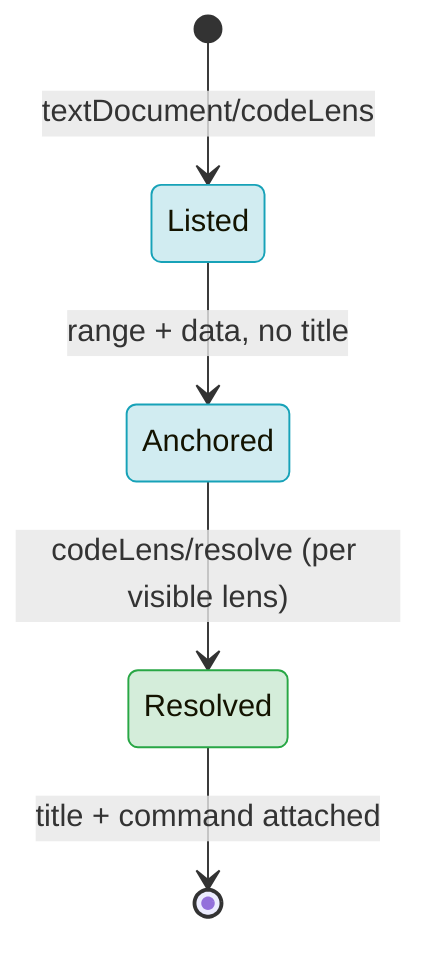

# F15 — Code Lens

> **Status:** Approved
>
> **Version:** 0.3   ·   **Last updated:** 2026-06-26
>
> **Purpose:** Actionable annotations above macros and blocks — a reference count and an inheritance summary — whose counts are computed lazily via `codeLens/resolve` so the initial response stays cheap.

> **Depends on:** [constitution](../constitution.md), [E07-data-model](../foundations/E07-data-model.md), [E01-architecture](../foundations/E01-architecture.md)   ·   **Related:** [F09-find-references](F09-find-references.md), [F16-call-hierarchy](F16-call-hierarchy.md), [F08-go-to-definition](F08-go-to-definition.md), [F01-diagnostics](F01-diagnostics.md)

> Requirement tag: **LENS**

---

## 1. Purpose & Scope

Code lenses are the clickable grey lines an editor floats above a definition — "5 references", "extended by 2". They turn the reference graph and the inheritance graph into a glance: you see how connected a macro is, or whether a base block is ever overridden, without running find-references yourself.

This spec covers:

- A **reference-count** lens above every macro and block, counting usages from [F09](F09-find-references.md).
- An **inheritance** lens above every block — "overrides base" on a child block, "extended by N" on a parent block.
- The two lens kinds as independent, client-toggleable settings.
- Lazy count computation via `codeLens/resolve`.

## 2. Non-Goals / Out of Scope

- Producing the locations a lens links to — owned by [F09-find-references](F09-find-references.md) and [F08-go-to-definition](F08-go-to-definition.md).
- The incoming/outgoing call tree behind a macro — owned by [F16-call-hierarchy](F16-call-hierarchy.md).
- Lenses for the host language (HTML/SQL/text) — we annotate Jinja symbols only (P5).
- "Run" / "debug" lenses — we never execute templates (P1).

## 3. Background & Rationale

A macro defined in `blog/macros.html` might be called from three templates or from none. Without a lens, the only way to know is to run find-references. The reference-count lens surfaces that number inline, and clicking it opens the reference list. The inheritance lens answers a question unique to Jinja templates: when you edit a ``, does anything override it? A base block marked "extended by 2" warns you that two child templates depend on its contract; a child block marked "overrides base" tells you a parent exists to jump to. Both lenses are kept noise-conscious and independently toggleable, because a lens on every symbol is clutter.

## 4. Concepts & Definitions

- **Code lens** — a clickable annotation rendered above a line. (See the editor terms in [glossary](../glossary.md).)
- **Reference graph** — the cross-workspace map of symbol usages built by [F09](F09-find-references.md).
- **Inheritance graph** — the `extends`/block-override relationships in the `WorkspaceIndex` ([E07](../foundations/E07-data-model.md)).
- **Resolve** — the lazy second round-trip (`codeLens/resolve`) that computes a lens's count and command.

## 5. Detailed Specification

The server advertises `codeLensProvider` with `resolveProvider: true` ([E01](../foundations/E01-architecture.md)). On `textDocument/codeLens`, the handler returns one lens per eligible symbol with its range and an opaque `data` payload — but **no title and no count yet**. The count and command are filled in on `codeLens/resolve`, so opening a large template doesn't trigger a workspace-wide reference scan up front.

### 5.1 Reference-count lens

Above each macro and block, a lens shows how many places use it.

**REQ-LENS-01 — A reference-count lens on every macro and block.**

For each `MacroDefinition` and `BlockDefinition` in the file ([E07](../foundations/E07-data-model.md)), emit one lens anchored to the definition line. On resolve, its title is `N references` (singular `1 reference`), where `N` is the count of usages the [F09](F09-find-references.md) reference graph reports for that symbol **with `includeDeclaration: false`** — i.e. F09's usage list *excluding* the declaration itself. F09's panel with the declaration shows `N+1` (six for `post_url`); the lens shows the five usages.

Activating the lens invokes `textDocument/references` at the definition **with `context.includeDeclaration: false`**, so clicking `5 references` opens a panel of exactly five locations (not the six F09 shows with the declaration). The lens count and that panel's length are therefore equal by construction: `lens-N == F09 panel-N(includeDeclaration: false)`.

**UX note:** the lens count may read one *lower* than the editor's built-in "Find All References" command, which usually counts the declaration too (so `5 references` on the lens vs. `6` from the editor command for the same macro). This one-off difference is intended — the lens deliberately excludes the declaration so its number matches the panel it opens.

The count-0 case is **not** rendered as a lens — see REQ-LENS-05 and §15.

This lens kind is **on by default**.

### 5.2 Inheritance lens

Above each block, a lens summarizes its place in the inheritance graph.

**REQ-LENS-02 — An inheritance lens on every block.**

For each `BlockDefinition`, resolve the block against the inheritance graph and emit a lens for each relationship the block has:

- If the block **overrides** a same-named block in a parent template (reachable via the template chain), title it `overrides base` and link it to the parent block's definition ([F08](F08-go-to-definition.md)).
- If the block is **overridden by** `N` descendant templates, title it `extended by N`, linking to the list of overriding blocks. `N` counts **all descendant overrides in the chain, not only the immediate children** — the same deep-chain rule F09 applies (F09 §10: "every override in the chain is a reference, not only the immediate child"). In a `base → post → amp-post` chain, the base block is `extended by 2` (both `post` and `amp-post`), never `extended by 1`.
- A block that neither overrides nor is overridden gets **no inheritance lens** — there's nothing to say (noise-conscious).

A block can carry **both** inheritance lenses at once: a mid-chain block that *overrides* its parent **and** *is extended by* a descendant resolves to two inheritance lenses — `overrides base` **and** `extended by N` — which editors stack (or, where a client prefers one line, a combined title `overrides base · extended by N`). In the `base → post → amp-post` chain, the mid-chain `post` block carries `overrides base` (it overrides `base`) **and** `extended by 1` (it is overridden by `amp-post`).

A block can also carry both the reference-count lens (§5.1) and its inheritance lens(es); editors stack them.

This lens kind is **on by default**.

### 5.3 Toggles

Each lens kind is an independent on/off switch.

**REQ-LENS-03 — Each lens kind toggles independently.**

Two client-side settings — `references` (default on) and `inheritance` (default on) — gate the two kinds. A disabled kind is omitted from the `textDocument/codeLens` response entirely (not just blanked on resolve), so a fully disabled feature does zero work. Settings arrive via `InitializationOptions` or the editor extension ([F20](F20-editor-integrations.md)).

### 5.4 Lazy resolve

The count work happens on resolve, not on the initial request.

**REQ-LENS-04 — Compute counts and commands on resolve.**

`textDocument/codeLens` returns lenses with range and `data` only. `codeLens/resolve` reads `data`, queries the reference/inheritance graph, and fills in the `title` and `command`.

The `data` payload carries a **stable symbol id**, not a cursor position: the tuple **(file URI, symbol kind, symbol name, declaration name-range)** drawn straight from the `MacroDefinition`/`BlockDefinition` in the [E07](../foundations/E07-data-model.md) `TemplateIndex` (E07 REQ-DATA-01/02; the declaration name-range is the same range F09's REQ-REF-03 uses for `includeDeclaration`). An index-assigned id (the symbol's slot in the `TemplateIndex`) is an acceptable equivalent encoding so long as it round-trips to the same symbol. Resolve looks the symbol up by this id and **never re-derives it from a live cursor position**, so the same lens resolves to the same title regardless of where the user's cursor sits or how text below the definition shifts. Lookup matches on **(kind, name) within the file**, using the declaration name-range only as a tiebreaker between same-named same-kind symbols (rare); it does **not** require exact range equality, so a definition that merely shifted lines after an edit still resolves rather than being treated as gone. If the document changed since the lens was issued and the symbol is genuinely gone (no matching (kind, name) in the rebuilt index), resolve returns the lens with an empty title rather than throwing (P3).

### 5.5 Zero-reference suppression

A `no references` lens on every unused macro and block is clutter, and it duplicates a diagnostic we already own.

**REQ-LENS-05 — Suppress the reference-count lens when the count is 0.**

A macro or block with zero usages gets **no reference-count lens** at all (not a `no references` lens). The smallest count a reference-count lens ever shows is `1 reference`. "Unused" is owned by [F01](F01-diagnostics.md)'s `JINJA-W202 unused-macro` (and `JINJA-W203 unused-import`), which already surface the same fact as a squiggle on the definition; a count-0 lens would only restate it on a second line. This keeps the lens layer noise-conscious (§3) and avoids two features narrating the same emptiness. The decision and its rationale are recorded in §15.

Because the count is computed on resolve (REQ-LENS-04), suppression also happens at resolve: a definition that turns out to have zero usages resolves to an **empty-title** lens (the same P3 shape used for a vanished symbol), so the editor renders nothing for it.

## 6. UI Mockups

### 6.1 Reference-count + inheritance lenses (editor)

How both default lenses render in `starlette-blog`. The grey lines above each definition are the lenses; clicking one runs its command.

```
templates/blog/macros.html
 ┌──────────────────────────────────────────────────────────────────────┐
 │      5 references                                                     │
 │  6 │                                        │
 │  7 │   {{ url_for("post", slug=post.slug) }}                          │
 │  8 │                                                    │
 │                                                                       │
 │      2 references                                                     │
 │ 10 │                   │
 └──────────────────────────────────────────────────────────────────────┘

templates/base.html
 ┌──────────────────────────────────────────────────────────────────────┐
 │      extended by 2                                                    │
 │  9 │                                 │
 └──────────────────────────────────────────────────────────────────────┘

templates/blog/post.html
 ┌──────────────────────────────────────────────────────────────────────┐
 │      overrides base                                                   │
 │  3 │                                               │
 └──────────────────────────────────────────────────────────────────────┘
```

### 6.2 Stacked lenses — a mid-chain block in both directions

In a `layout → article → amp-article` chain (named apart from the canonical `base.html`/`content` cast so the overrider sets don't blur together), the mid-chain `article` block both *overrides* `layout`'s `main` block **and** *is extended by* `amp-article`. It therefore carries two inheritance lenses, which the editor stacks (clients that prefer one line render the combined title). A reference-count lens stacks above them when the block also has usages:

```
templates/blog/amp_article.html  (extends blog/article.html)
 ┌──────────────────────────────────────────────────────────────────────┐
 │      overrides base                                                   │
 │  3 │                                                  │
 └──────────────────────────────────────────────────────────────────────┘

templates/blog/article.html  (extends layout.html)
 ┌──────────────────────────────────────────────────────────────────────┐
 │      overrides base                                                   │
 │      extended by 1                                                    │
 │  3 │                                                  │
 └──────────────────────────────────────────────────────────────────────┘

templates/layout.html
 ┌──────────────────────────────────────────────────────────────────────┐
 │      extended by 2     (both article.html and amp_article.html)       │
 │  9 │                                    │
 └──────────────────────────────────────────────────────────────────────┘
```

Combined-title form, where a client renders one line: `overrides base · extended by 1`.

## 7. Visualizations

The two-phase lifecycle — cheap list first, counts on demand.



## 9. Examples & Use Cases

In `starlette-blog`, `post_url` is imported into `blog/post.html` and `email/digest.html` and called three times; its lens reads `5 references` — the three calls plus the two `from … import` bindings F09 counts with `includeDeclaration: false` (REQ-LENS-01), excluding the declaration. Clicking it runs `textDocument/references` with `includeDeclaration: false`, so the panel that opens lists exactly those five, matching the count. The `comment_card` macro, imported and called once in `blog/post.html`, reads `2 references`; a macro with no callers gets **no** reference-count lens at all (REQ-LENS-05) — `JINJA-W202` already flags it as unused, so the lens layer stays quiet. In `base.html`, the `content` block is overridden by both `blog/post.html` and `email/digest.html`, so its lens reads `extended by 2` (all descendant overrides, REQ-LENS-02); clicking it lists the two overriding blocks. Over in `blog/post.html`, that same block carries `overrides base`, and clicking it jumps to `base.html`. In a deeper `base → post → amp-post` chain the mid-chain `post` block carries both `overrides base` and `extended by 1` at once.

## 10. Edge Cases & Failure Modes

- **Macro never used** → **no reference-count lens** (count 0 is suppressed, REQ-LENS-05); `JINJA-W202` owns "unused". Not an error, just nothing rendered.
- **Block neither overrides nor is overridden** → no inheritance lens (nothing to show).
- **Mid-chain block, both directions** → carries `overrides base` **and** `extended by N` simultaneously (REQ-LENS-02); both lenses resolve and stack.
- **Recursive import cycle** affecting counts → counts are still finite (the graph is visited once per node, matching `JINJA-E404` handling); no infinite resolve.
- **Document edited between list and resolve** → resolve returns an empty title rather than a stale count (P3).
- **Both kinds disabled** → empty `codeLens` response; zero graph queries.
- **Symbol inside an inline template region** ([E31](../foundations/E31-inline-templates.md)) → lens anchors in host-file coordinates, like any other feature.

## 11. Testing

Counts and titles are unit-tested against the `starlette-blog` reference and inheritance graphs; the resolve round-trip and toggles are tested explicitly.

### 11.1 Scope & coverage

Target: **100% of this feature's behavior.** Every `REQ-LENS-NN` maps to a test; every lens state (§6) and edge case (§10) has a test. See [E17-testing](../foundations/E17-testing.md#2-coverage-policy).

### 11.2 Test plan

Rows are organized by lens kind and branch so every count branch (1 / N, with 0 suppressed), every inheritance branch (`overrides base`; `extended by 1`; `extended by N>1`; both directions on one block; neither), every toggle combination, the resolve round-trip, and every §10 edge and §6 state maps to a concrete symbol · fixture · expected title + command.

**REQ-LENS-01 — reference-count lens (counts 1 / N, macros and blocks, declaration-excluded count, click target):**

| # | Symbol · fixture | Expected lens | Type | Verifies |
|---|---|---|---|---|
| 1 | `post_url` macro · [starlette-blog](../foundations/E17-testing.md#5-fixtures-registry) `blog/macros.html` (N: 3 calls + 2 import bindings) | title `5 references`; command invokes `textDocument/references` at the definition **with `includeDeclaration: false`** | unit | REQ-LENS-01 |
| 2 | `comment_card` macro · [starlette-blog](../foundations/E17-testing.md#5-fixtures-registry) `blog/macros.html` (N: import + call) | title `2 references`; command invokes `textDocument/references` with `includeDeclaration: false` | unit | REQ-LENS-01 |
| 3 | macro referenced exactly once · synthetic `didOpen` doc (one `` binding, no call) | title `1 reference` (singular grammar) | unit | REQ-LENS-01 |
| 4 | reference-count title excludes the declaration · [starlette-blog](../foundations/E17-testing.md#5-fixtures-registry) `post_url` | count is usages only; the `` declaration line itself is not counted (count is F09's `includeDeclaration: false` total) | unit | REQ-LENS-01 |
| 5 | **lens-N equals F09 panel length** · [starlette-blog](../foundations/E17-testing.md#5-fixtures-registry) `post_url` | the lens's `N` (5) equals the length of `textDocument/references` with `includeDeclaration: false` (5), and is one less than the F09 panel with `includeDeclaration: true` (6): `lens-N == F09 panel-N(includeDeclaration:false) == F09 panel-N(true) − 1` ([F09](F09-find-references.md) REQ-REF-03) | unit | REQ-LENS-01 |
| 6 | `content` **block** carries its own reference-count lens · [starlette-blog](../foundations/E17-testing.md#5-fixtures-registry) `base.html` | reference-count lens present on the block line (block carries its own count lens, distinct from the inheritance lens) | unit | REQ-LENS-01 |
| 7 | activating a reference-count lens opens a panel that matches the count · [starlette-blog](../foundations/E17-testing.md#5-fixtures-registry) `post_url` | command equals `textDocument/references` at the definition with `includeDeclaration: false`; the resulting panel holds exactly the five locations the lens counts (not six) | unit | REQ-LENS-01 |

**REQ-LENS-02 — inheritance lens (`overrides base` / `extended by 1` / `extended by N>1` over all descendants / both directions / neither, click targets):**

| # | Symbol · fixture | Expected lens | Type | Verifies |
|---|---|---|---|---|
| 8 | `content` block in child · [starlette-blog](../foundations/E17-testing.md#5-fixtures-registry) `blog/post.html` | title `overrides base`; command jumps to the parent block in `base.html` ([F08](F08-go-to-definition.md)) | unit | REQ-LENS-02 |
| 9 | `content` block in parent, two overriders · [starlette-blog](../foundations/E17-testing.md#5-fixtures-registry) `base.html` (overridden by `blog/post.html` and `email/digest.html`) | title `extended by 2`; command lists the two overriding blocks | unit | REQ-LENS-02 |
| 10 | parent block with a single overrider · [inheritance](../foundations/E17-testing.md#5-fixtures-registry) (one child overrides one base block) | title `extended by 1` (N=1 branch); command lists the one overriding block | unit | REQ-LENS-02 |
| 11 | child block that overrides · [inheritance](../foundations/E17-testing.md#5-fixtures-registry) | title `overrides base`; jump links to that fixture's parent block | unit | REQ-LENS-02 |
| 12 | standalone block — neither overrides nor overridden · [starlette-blog](../foundations/E17-testing.md#5-fixtures-registry) `base.html` `head` block (no child overrides it) | **no** inheritance lens emitted (noise-conscious) | unit | REQ-LENS-02 |
| 13 | **`extended by N` counts all descendants, not just direct children** · [inheritance](../foundations/E17-testing.md#5-fixtures-registry) 3-level chain `base → post → amp-post` | the **base** `content` block's lens reads `extended by 2` (both `post` and `amp-post` override it down the chain), **not** `extended by 1` — the deep-chain rule matching [F09](F09-find-references.md) §10 | unit | REQ-LENS-02 |
| 14 | **mid-chain block in both directions** · [inheritance](../foundations/E17-testing.md#5-fixtures-registry) 3-level chain `base → post → amp-post`, the `post` `content` block | the mid-chain block carries **both** inheritance lenses at once: `overrides base` (jumps to `base`) **and** `extended by 1` (lists `amp-post`); both resolve and stack (§5.2, §6.2) | unit | REQ-LENS-02 |
| 15 | block carries reference-count + inheritance lenses stacked · [starlette-blog](../foundations/E17-testing.md#5-fixtures-registry) `base.html` `content` | reference-count lens and `extended by 2` inheritance lens both present on the same definition line | unit | REQ-LENS-01, REQ-LENS-02 |

**REQ-LENS-03 — independent toggles (references off / inheritance off / both off / both on):**

| # | Scenario · fixture | Expected | Type | Verifies |
|---|---|---|---|---|
| 16 | `references` disabled, `inheritance` on · [starlette-blog](../foundations/E17-testing.md#5-fixtures-registry) | no reference-count lenses in the `textDocument/codeLens` response; inheritance lenses still present (omitted from response, not blanked on resolve) | unit | REQ-LENS-03 |
| 17 | `inheritance` disabled, `references` on · [starlette-blog](../foundations/E17-testing.md#5-fixtures-registry) | no inheritance lenses in the response; reference-count lenses still present | unit | REQ-LENS-03 |
| 18 | both kinds enabled (defaults) · [starlette-blog](../foundations/E17-testing.md#5-fixtures-registry) | both lens kinds present; defaults are on for each | unit | REQ-LENS-03 |
| 19 | both kinds disabled · [starlette-blog](../foundations/E17-testing.md#5-fixtures-registry) | empty `codeLens` response; **zero** reference/inheritance graph queries performed (§10 edge) | unit | REQ-LENS-03 |

**REQ-LENS-04 — lazy resolve (Listed → Anchored → Resolved, stable symbol-id `data`, stale symbol):**

| # | Scenario · fixture | Expected | Type | Verifies |
|---|---|---|---|---|
| 20 | initial `textDocument/codeLens` · [starlette-blog](../foundations/E17-testing.md#5-fixtures-registry) `blog/macros.html` | one lens per macro/block with range + opaque `data`, **no title and no command** (Anchored state, §7) | unit | REQ-LENS-04 |
| 21 | `codeLens/resolve` fills title + command · [starlette-blog](../foundations/E17-testing.md#5-fixtures-registry) `post_url` lens | resolve reads `data`, queries the graph, returns title `5 references` + command (Resolved state, §7) | unit | REQ-LENS-04 |
| 22 | **`data` carries a stable symbol id, position-independent** · synthetic `didOpen` doc | `data` is the tuple (file URI, symbol kind, name, declaration name-range) drawn from the [E07](../foundations/E07-data-model.md) `TemplateIndex` (or an equivalent index-assigned id); resolve looks the symbol up by **(kind, name) within the file** (range tiebreaker only), **never re-derives from a cursor position**. Inserting unrelated text *below* the definition yields the **same** resolved title; inserting text *above* the definition — shifting the symbol's own name-range while it still exists — **also** resolves to the same title (no exact-range match required, asserting the §5.4 (kind, name) rule) | unit | REQ-LENS-04 |
| 23 | document edited between list and resolve, symbol now gone · synthetic `didOpen` doc edited before resolve | resolve returns the lens with an **empty title** rather than throwing (P3, §10 edge) | unit | REQ-LENS-04 |

**REQ-LENS-05 — zero-reference suppression (count 0 renders no lens; W202 owns "unused"):**

| # | Scenario · fixture | Expected | Type | Verifies |
|---|---|---|---|---|
| 24 | unused macro (no callers) · [unused-symbols](../foundations/E17-testing.md#5-fixtures-registry) | **no** reference-count lens emitted/resolved for the zero-usage macro (resolves to empty title); no `no references` text; no error; `JINJA-W202` still flags it separately | unit | REQ-LENS-05 |
| 25 | unused block (no overrides, no other usages) · [unused-symbols](../foundations/E17-testing.md#5-fixtures-registry) | block with zero usages gets no reference-count lens either (count-0 suppression applies to blocks too) | unit | REQ-LENS-05 |

**§10 edge cases (negative / boundary polarities):**

| # | Edge · fixture | Expected | Type | Verifies |
|---|---|---|---|---|
| 26 | macro never used · [unused-symbols](../foundations/E17-testing.md#5-fixtures-registry) | no reference-count lens (count 0 suppressed; same as row 24, asserted as an edge); `JINJA-W202` owns "unused" | unit | REQ-LENS-05 |
| 27 | block neither overrides nor is overridden · [starlette-blog](../foundations/E17-testing.md#5-fixtures-registry) `head` block | no inheritance lens (same as row 12, asserted as an edge) | unit | REQ-LENS-02 |
| 28 | recursive import cycle affecting counts · synthetic `didOpen` doc with a `` cycle (matching `JINJA-E404`) | count is finite, graph visited once per node; resolve terminates (no infinite resolve) | unit | REQ-LENS-01 |
| 29 | both kinds disabled · [starlette-blog](../foundations/E17-testing.md#5-fixtures-registry) | empty response, zero graph queries (same as row 19, asserted as an edge) | unit | REQ-LENS-03 |
| 30 | symbol inside an inline-template region ([E31](../foundations/E31-inline-templates.md)) · [call-and-paths](../foundations/E17-testing.md#5-fixtures-registry) (holds the inline cases) | lens anchors in host-file coordinates, like any other feature | unit | REQ-LENS-01, REQ-LENS-04 |

### 11.3 Fixtures

- Reuses [starlette-blog](../foundations/E17-testing.md#5-fixtures-registry) for the `5 references` / `2 references` counts, the lens-N == F09-panel equality, the standalone-block and stacked-lens cases, the toggle and both-disabled cases, and the `overrides base` / `extended by 2` inheritance cases.
- Reuses [unused-symbols](../foundations/E17-testing.md#5-fixtures-registry) for the count-0 suppression cases (rows 24, 25, 26).
- Reuses [inheritance](../foundations/E17-testing.md#5-fixtures-registry) for the single-overrider `extended by 1` and child-`overrides base` cases (rows 10, 11), and the 3-level `base → post → amp-post` chain that drives the all-descendants `extended by 2` (row 13) and the both-directions mid-chain block (row 14).
- Reuses [call-and-paths](../foundations/E17-testing.md#5-fixtures-registry) for the inline-template anchoring edge (row 30).
- Synthetic in-memory `didOpen` documents cover the `1 reference` singular grammar (row 3), the stable-symbol-id position-independent resolve (row 22), the stale-symbol empty-title path (row 23), and the recursive-import-cycle count (row 28) — constructs that don't live in the baseline fixtures.

### 11.4 Requirement coverage

| Requirement | Covered by |
|---|---|
| REQ-LENS-01 | rows 1–7 (counts 1 / N on macros and blocks, declaration excluded, lens-N == F09 panel-N(includeDeclaration:false), click target opens the matching panel), 15 (stacked), 28 (cycle), 30 (inline) |
| REQ-LENS-02 | rows 8–15 (`overrides base`, `extended by 1`, `extended by N>1`, all-descendants deep chain, both-directions mid-chain, neither → no lens, stacked), 27 (standalone edge) |
| REQ-LENS-03 | rows 16–19 (references off, inheritance off, both on, both off), 29 (both-disabled edge) |
| REQ-LENS-04 | rows 20–23 (Anchored→Resolved, stable position-independent symbol-id `data`, stale-symbol empty title), 30 (inline anchoring) |
| REQ-LENS-05 | rows 24–25 (count-0 macro and block suppressed; W202 owns "unused"), 26 (never-used edge) |

## 12. End-to-End Test Plan

### 12.1 Coverage target

**100% of the feature's user-visible scope** through the `pytest-lsp` LSP-protocol branch ([E29](../foundations/E29-e2e-testing.md#2-coverage-policy)): list lenses, resolve them, assert titles and commands.

### 12.2 Scenarios

| # | Journey | Path | Expected outcome |
|---|---|---|---|
| E2E-01 | `textDocument/codeLens` over `blog/macros.html` (starlette-blog) | happy | one lens per macro/block; every lens has range + `data` and **no title** (Anchored, REQ-LENS-04) |
| E2E-02 | `codeLens/resolve` on the `post_url` lens, then invoke its command | happy | title `5 references`; command runs `textDocument/references` with `includeDeclaration: false`, returning **exactly 5** locations (one fewer than the 6 the same query returns with `includeDeclaration: true`) (REQ-LENS-01/04) |
| E2E-03 | `codeLens/resolve` on the `comment_card` lens | happy | title `2 references` (a second N≠5 count, confirming counts track the F09 graph) |
| E2E-04 | `codeLens/resolve` on an unused macro (unused-symbols) | negative | **no** reference-count lens / empty title (count 0 suppressed, REQ-LENS-05); no `no references` text; no protocol error; `JINJA-W202` owns "unused" |
| E2E-05 | `codeLens/resolve` on the `content` block in `base.html` | happy | title `extended by 2`; command lists the two overriding blocks |
| E2E-06 | `codeLens/resolve` on the `content` block in `blog/post.html` | happy | title `overrides base`; command jumps to the parent block in `base.html` |
| E2E-07 | `codeLens` over `base.html`, standalone `head` block | negative | the `head` block carries no inheritance lens (no override relationship) |
| E2E-08 | `codeLens/resolve` on a **3-level chain** `base → post → amp-post` (inheritance) | happy | base block resolves `extended by 2` (all descendants, not 1); the **mid-chain** `post` block resolves **both** `overrides base` **and** `extended by 1` (REQ-LENS-02) |
| E2E-09 | `references` kind disabled via init options | negative | no reference-count lenses in the response; inheritance lenses still present |
| E2E-10 | `inheritance` kind disabled via init options | negative | no inheritance lenses in the response; reference-count lenses still present |
| E2E-11 | both kinds disabled via init options | negative | empty `codeLens` response |
| E2E-12 | `codeLens/resolve` after the document changed and the symbol is gone | negative | resolve returns the lens with an empty title rather than erroring (P3) |

## 13. Non-Functional Requirements

### 13.1 Security & Privacy

- **Input & validation** — lenses read the reference and inheritance graphs only; no template is executed (P1).
- **Data sensitivity** — titles report counts and the user's own locations; nothing leaves the machine.

### 13.2 Accessibility

- **N/A** — the editor renders all code-lens UI; jinja-lsp emits protocol data only (constitution §4.6).

### 13.4 Performance & Scale

- **Latency** — the initial `codeLens` response does no graph traversal (titles deferred to resolve, REQ-LENS-04), so it returns immediately; resolve touches one symbol's graph slice, staying inside the interactive budget (P6).

## 15. Open Questions & Decisions

- **Decided** — both kinds on by default; counts resolve-lazy; a block with no inheritance relationship gets no lens.
- **Decided — zero-reference count lenses are suppressed, not shown as `no references` (REQ-LENS-05).** A count lens on *every* macro and block, including a `no references` line on each unused one, contradicts the spec's own noise-consciousness (§3) and duplicates a fact `JINJA-W202 unused-macro` / `JINJA-W203 unused-import` already surface as a squiggle on the same definition. We considered (a) keeping `no references`, (b) making the 0-floor a client setting, and (c) suppressing at 0. We chose (c): suppress at count 0 and let W202/W203 own "unused", so two features never narrate the same emptiness and the smallest count shown is `1 reference`. We did **not** add a setting — a per-client 0-toggle is more configuration surface than a never-useful line warrants; this can revisit if a user asks. (Inheritance lenses are already self-suppressing at "no relationship", so this only concerns the reference-count kind.)
- **Decided — reference counts include uses inside inline-template regions ([E31](../foundations/E31-inline-templates.md)) by default (was OQ-LENS-1).** This is already the shipped, tested behavior: the lens anchors and counts in host-file coordinates like every other feature (§10, row 30), so an inline-region usage counts the same as any other. We chose inclusion over a setting because a usage is a usage regardless of where the template text lives, and a per-region gate is configuration surface no user has asked for; revisit on request.

## 16. Cross-References

- **Depends on:** [constitution](../constitution.md) — the mockup and P1/P5 rules; [E07-data-model](../foundations/E07-data-model.md) — `MacroDefinition`/`BlockDefinition` and the inheritance graph; [E01-architecture](../foundations/E01-architecture.md) — the `codeLensProvider` capability.
- **Related:** [F09-find-references](F09-find-references.md) — the reference counts (the lens count is F09 with `includeDeclaration: false`); [F08-go-to-definition](F08-go-to-definition.md) — the inheritance jump targets; [F01-diagnostics](F01-diagnostics.md) — `JINJA-W202`/`W203` own "unused", which is why a zero-count lens is suppressed (REQ-LENS-05); [F16-call-hierarchy](F16-call-hierarchy.md) — the deeper call view; [F20-editor-integrations](F20-editor-integrations.md) — where the toggles are configured.

## 17. Changelog
- **2026-06-26** — Status: Draft → Approved.

- **2026-06-24** — Initial draft.
- **2026-06-24** — `post_url`'s lens reads `5 references` (the F09 usage count per REQ-LENS-01), reconciled across §6.1/§6.2/§11; `comment_card(comment, show_actions)` is imported and called in `post.html`, so its lens reads `2 references`; the second `content` overrider named as `email/digest.html`.
- **2026-06-25** — §11.2 and §12.2 rewritten for full combinatorial coverage: every count branch (0 `no references` / 1 `1 reference` / N), every inheritance branch (`overrides base`, `extended by 1`, `extended by N>1`, neither → no lens), both toggles independently plus both-on/both-off, the Anchored→Resolved resolve lifecycle with data-identity and stale-symbol empty-title, and every §10 edge — each traced to a concrete symbol · fixture · expected title + command; §11.4 retargeted to the new row numbers; E2E scenarios expanded to 11 across happy and negative polarities.
- **2026-06-26** — v0.3, spec-review fixes: renamed the §6.2 mid-chain mockup's inheritance fixture to `layout → article → amp-article` (block `main`) so its overrider set no longer collides with the canonical `base.html`/`content` cast whose overriders are `post.html`/`digest.html` (jinja-lsp-zzy); changed resolve identity (§5.4, row 22) to match on **(kind, name) within the file** with the declaration name-range as a tiebreaker only, so a definition that merely shifts lines after an edit still resolves instead of falling to the empty-title path (jinja-lsp-y3j); promoted OQ-LENS-1 to a **Decided** entry — inline-region references are counted by default, revisit on request (jinja-lsp-r2d); added a §5.1 UX note that the lens count may read one lower than the editor's built-in references command, which usually counts the declaration, and that this is intended (jinja-lsp-d7q); applied the constitution §6 Mermaid style to the §7 diagram with colored nodes via `classDef` and labeled arrows, no `%%{init}%%` block (jinja-lsp-rle).
- **2026-06-25** — v0.2, review fixes: (1) pinned the reference-count lens to F09's `includeDeclaration: false` total and its click command to `textDocument/references` with `includeDeclaration: false`, so `5 references` opens a 5-item panel (not the 6 F09 shows with the declaration); added the `lens-N == F09 panel-N(includeDeclaration:false)` equality test. (2) Defined `extended by N` as counting **all descendant overrides** in the chain (not just direct children), matching F09 §10; added a 3-level `base → post → amp-post` chain test asserting the base block reads `extended by 2`. (3) Added the both-directions case — a mid-chain block that *overrides base* **and** *is extended by N* carries both inheritance lenses (§5.2, §6.2, row 14, E2E-08). (4) Added **REQ-LENS-05**: suppress the reference-count lens at count 0 (no `no references`), letting `JINJA-W202`/`W203` own "unused"; decision + rationale recorded in §15. (5) Defined the resolve `data` as a **stable, position-independent symbol id** = (file URI, kind, name, declaration name-range) from the E07 `TemplateIndex` (or an equivalent index-assigned id), asserted by the position-independence resolve test. Bumped Version to 0.2; added F01 to Related.
