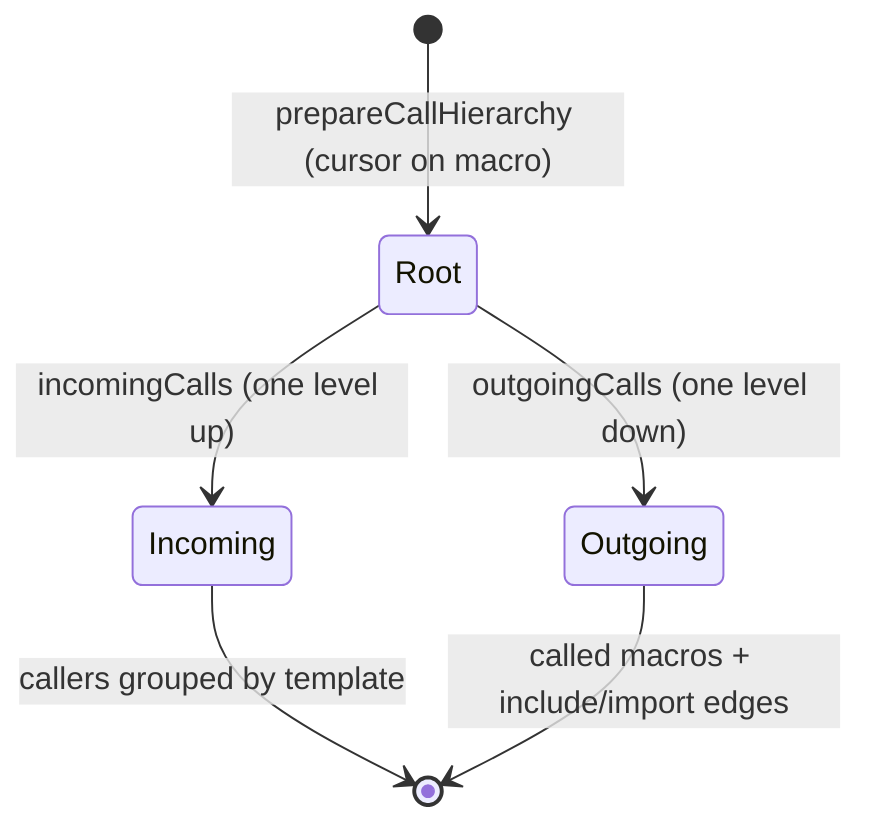

# F16 — Call Hierarchy

> **Status:** Draft
>
> **Version:** 0.1   ·   **Last updated:** 2026-06-24
>
> **Purpose:** The incoming/outgoing call graph for a macro — who calls it, and what it calls (including `include`/`import` targets as outgoing edges) — built over the [F09](F09-find-references.md) reference graph.

> **Depends on:** [constitution](../constitution.md), [E07-data-model](../foundations/E07-data-model.md), [E01-architecture](../foundations/E01-architecture.md)   ·   **Related:** [F09-find-references](F09-find-references.md), [F08-go-to-definition](F08-go-to-definition.md), [F15-code-lens](F15-code-lens.md)

> Requirement tag: **CALL**

---

## 1. Purpose & Scope

Call hierarchy is the expandable tree an editor shows when you ask "who calls this macro, and what does it call?" Start on `post_url`, expand upward to see every template that calls it, expand downward to see the macros and templates it pulls in. It's find-references turned into a navigable graph.

This spec covers:

- `callHierarchy/prepare` on a macro — establishing the macro as the hierarchy's root item.
- `callHierarchy/incomingCalls` — every call site that invokes the macro.
- `callHierarchy/outgoingCalls` — the macros this macro calls, plus its `include`/`import` targets as outgoing edges.
- Macros as the primary callable; templates appear as edges.

## 2. Non-Goals / Out of Scope

- The flat reference list — owned by [F09-find-references](F09-find-references.md).
- The inline reference-count annotation — owned by [F15-code-lens](F15-code-lens.md).
- Single-jump navigation — owned by [F08-go-to-definition](F08-go-to-definition.md).
- A call hierarchy over host-language functions — we model Jinja macros and template edges only (P5); we never execute templates (P1).

## 3. Background & Rationale

In a template codebase, the unit of reuse is the macro, and the dependency edges are calls (`{{ macro() }}`), includes (``), and imports (``). Before you change `post_url`, you want to know which templates render it — that's the incoming view. When you're tracing why `digest.html` is heavy, you want to walk down through what it includes and the macros those bring in — that's the outgoing view. We model both over the same reference graph that powers [F09](F09-find-references.md), so the call hierarchy is a *view* of existing facts, not a second traversal engine.

## 4. Concepts & Definitions

- **Call hierarchy** — the incoming/outgoing call graph of a macro. (Canonical definition in [glossary](../glossary.md).)
- **Call hierarchy item** — one node in the tree (a macro, or a template acting as a caller/edge), carrying name, kind, and definition range.
- **Incoming call** — a call site that invokes the item.
- **Outgoing call** — a macro the item calls, or an `include`/`import` target it depends on.
- **Callable** — the primary hierarchy unit; in Jinja that's the **macro** ([E07](../foundations/E07-data-model.md)).

## 5. Detailed Specification

The server advertises `callHierarchyProvider` ([E01](../foundations/E01-architecture.md)). The protocol is three steps: `prepare` to pin a root item from a cursor position, then `incomingCalls` and `outgoingCalls` to expand it in either direction. Every step reads the `WorkspaceIndex` reference graph ([F09](F09-find-references.md)) — no parsing, no execution.

### 5.1 Prepare

The hierarchy starts at the macro under the cursor.

**REQ-CALL-01 — Prepare resolves a macro from the cursor.**

`textDocument/prepareCallHierarchy` at a position over a macro — at its definition (``), a call site (`{{ post_url(post) }}`), or an imported-name usage — returns a **list of `CallHierarchyItem` (`CallHierarchyItem[]`), typically exactly one**, for that `MacroDefinition`: `kind = Function`, `name` the macro name, `detail` the source template's relative path, ranges spanning the definition. The LSP shape is a list (`CallHierarchyItem[] | null`), so the common single-macro case returns a one-element list, and the rare position that resolves to more than one macro (an ambiguous imported name) may return several. The item is always anchored to the *definition*, regardless of which usage the cursor sat on, so incoming/outgoing expansion is stable. A position over a non-macro (a plain variable, a block, host text) returns nothing (`null` or an empty list) — macros are the only callable (P4/P5).

### 5.2 Incoming calls

Expanding upward lists everyone who calls the macro.

**REQ-CALL-02 — Incoming calls are the macro's call sites.**

`callHierarchy/incomingCalls` for a macro item returns one `CallHierarchyIncomingCall` per **calling template**: the `from` item is the calling template (or the enclosing macro, when the call sits inside another macro body), and `fromRanges` lists every call-site range within it. Counting is grouped by caller, so a template that calls `post_url` three times appears once with three ranges. The call sites are exactly the function-call `Reference`s the [F09](F09-find-references.md) graph resolves to this macro.

### 5.3 Outgoing calls

Expanding downward lists what the macro calls — and what it pulls in.

**REQ-CALL-03 — Outgoing calls include called macros, terminal globals, and template edges.**

`callHierarchy/outgoingCalls` for a macro item returns one `CallHierarchyOutgoingCall` per dependency, drawn strictly from the references the macro's **own body** contains — the macro's enclosing-owner scope ([E07](../foundations/E07-data-model.md) REQ-DATA-12: the enclosing owner of a span is the innermost macro/block body containing it). Outgoing edges are *not* attributed from the macro's whole template; a sibling macro's calls or a template-level directive outside this body do not appear here. Edges are of three kinds:

- **Called macro** — every macro invoked inside this macro's body; the `to` item is that macro's definition (`kind = Function`), `fromRanges` the call sites within the body. This is the only **expandable** kind — its `to` item is a real `MacroDefinition` you can `prepare` and walk further.
- **Terminal global** — a pack/registry global or built-in callable invoked in the body (e.g. `url_for` from the Starlette pack) that has **no workspace definition**. We surface it as an edge with `kind = Function` and a **synthetic/registry range** (the pack/registry entry, not a template span), `fromRanges` the call sites within the body. It is **terminal and non-expandable**: there is no `MacroDefinition` to anchor on, so you can't `prepareCallHierarchy` on it and it has no further outgoing level. This is the documented asymmetry — an outgoing edge may point at something you could never have *prepared* a hierarchy on.
- **Template edge** — every `` and `` reachable from this macro's body; the `to` item is the target template (`kind = Module`), `fromRanges` the directive's range. This is what makes the outgoing view a true dependency tree rather than just a call list — it captures the composition edges Jinja relies on. Template edges are also **terminal** as call-hierarchy items (a template is not a callable you `prepare`), though the client may re-issue `outgoingCalls` on the target to walk its own body one level further. Template-level `include`/`import`/`extends` directives that sit *outside* any macro body belong to the **template** item, not to a macro, and are never duplicated onto every macro defined in that template.

A dynamic or `ignore missing` template reference whose path can't be resolved statically ([E07](../foundations/E07-data-model.md) `is_dynamic` / `ignore_missing`) is omitted — we never fabricate an edge we can't prove (P4).

The outgoing tree **omits the `` inheritance chain.** Inheritance (`extends` and block overrides) is the inheritance lens's domain ([F15](F15-code-lens.md) §5.2); a macro's outgoing view shows what it *calls* and *pulls in*, not the template's parent. Don't expect the base template to appear as an outgoing edge.

### 5.4 Graph reuse and cycles

The hierarchy is a view of the reference graph, traversed one level per request.

**REQ-CALL-04 — One level per request; reuse the F09 graph.**

Each `incomingCalls` / `outgoingCalls` call expands exactly one level; the client drives deeper expansion by re-querying on a child item. The handler reuses the [F09](F09-find-references.md) reference graph and the import graph in the `WorkspaceIndex` — it builds no separate index. Because expansion is one level at a time, an import/call cycle (the same situation `JINJA-E404` flags) can't cause infinite recursion; each request terminates on the direct neighbors.

## 6. UI Mockups

### 6.1 Incoming calls tree (editor)

Preparing on `post_url`, then expanding **incoming** shows who calls it. Each leaf is a calling template with its call count.

```
Call Hierarchy — incoming to  post_url   (blog/macros.html:6)
 ┌──────────────────────────────────────────────────────────────────────┐
 │  ⮜  post_url                              blog/macros.html             │
 │     ├─ ⮜ blog/post.html                   (2 calls)                    │
 │     │     • line 4   {{ post_url(post) }}                              │
 │     │     • line 9   {{ post_url(related) }}                           │
 │     └─ ⮜ email/digest.html                (1 call)                     │
 │           • line 12  {{ post_url(post) }}                              │
 └──────────────────────────────────────────────────────────────────────┘
   ⮜ = incoming (callers)
```

### 6.2 Outgoing calls tree (editor)

Expanding **outgoing** from `post_url` shows what it calls and what its template pulls in. Macros (ƒ) and template edges (▤) are distinguished.

```
Call Hierarchy — outgoing from  post_url   (blog/macros.html:6)
 ┌──────────────────────────────────────────────────────────────────────┐
 │  ⮞  post_url                              blog/macros.html             │
 │     └─ ƒ url_for                          (global — starlette pack)    │
 │           • line 7   {{ url_for("post", slug=post.slug) }}            │
 └──────────────────────────────────────────────────────────────────────┘
   ⮞ = outgoing   ƒ = called macro/global   ▤ = include/import edge (when present)
```

## 7. Visualizations

The three-step prepare → expand protocol, both directions reading one graph.



## 9. Examples & Use Cases

In `starlette-blog`, you prepare a call hierarchy on `post_url` in `blog/macros.html`. The **incoming** view groups callers by template: `blog/post.html` (two call sites) and `email/digest.html` (one, via its `from "blog/macros.html" import post_url`). Before renaming `post_url`'s `post` parameter, you scan this tree and know exactly which three call sites to check. The **outgoing** view shows `post_url` calls the `url_for` global (from the Starlette pack); a macro that also included or imported another template would surface those as `▤` edges, each expandable one level further via `outgoingCalls`.

## 10. Edge Cases & Failure Modes

- **Prepare over a non-macro** (variable, block, host text) → empty result; macros are the only callable.
- **Macro with no callers** → `incomingCalls` returns an empty list (the dead-macro case `JINJA-W202` also catches).
- **Macro that calls nothing and includes nothing** → `outgoingCalls` returns an empty list.
- **Dynamic / `ignore missing` include** → omitted from outgoing edges (unresolvable — P4).
- **Import/call cycle** → one level per request means no infinite recursion (matches `JINJA-E404`).
- **Cursor over a `from ... import post_url` name** → prepare anchors to the macro's *definition*, not the import line.
- **Macro inside an inline template region** ([E31](../foundations/E31-inline-templates.md)) → items report host-file coordinates, like every feature.

## 11. Testing

Prepare, incoming, and outgoing are unit-tested against the `starlette-blog` reference graph, including the include/import edge case and cycle termination.

### 11.1 Scope & coverage

Target: **100% of this feature's behavior.** Every `REQ-CALL-NN` maps to a test; every tree state (§6) and edge case (§10) has a test. See [E17-testing](../foundations/E17-testing.md#2-coverage-policy).

### 11.2 Test plan

Concrete rows trace each REQ, sub-case, §6 state, and §10 edge in both polarities. Cursor positions are given as `template:line` against the `starlette-blog` layout (`blog/macros.html` defines `post_url` at line 6 and `comment_card` at line ~12; `blog/post.html` calls `post_url(post)` at line 4 and `post_url(related)` at line 9 and `comment_card(c, ...)` in its comment loop; `email/digest.html` imports `post_url` via `` and calls it at line 12; `post_url`'s body calls the `url_for` global at line 7). Synthetic rows use an in-memory `didOpen` document where the baseline lacks the construct.

| # | Behavior / scenario | Type | Cursor · fixture/synthetic | Expected item / edges | Verifies |
|---|---|---|---|---|---|
| T01 | Prepare **at definition** anchors to the definition | unit | `blog/macros.html:6` on `` · [starlette-blog](../foundations/E17-testing.md#5-fixtures-registry) | one item: `kind=Function`, `name="post_url"`, `detail="blog/macros.html"`, ranges spanning the def at line 6 | REQ-CALL-01 |
| T02 | Prepare **at a call site** anchors to the definition (not the call) | unit | `blog/post.html:4` on `{{ post_url(post) }}` · [starlette-blog](../foundations/E17-testing.md#5-fixtures-registry) | same item as T01, anchored to `blog/macros.html:6` — never to the call line | REQ-CALL-01 |
| T03 | Prepare **at an import-name usage** anchors to the definition (§10 import-name edge) | unit | `email/digest.html:12` on `post_url` in `{{ post_url(post) }}` (imported via `from … import post_url`) · [starlette-blog](../foundations/E17-testing.md#5-fixtures-registry) | same item as T01, anchored to `blog/macros.html:6`, not to the `from … import` line | REQ-CALL-01 |
| T04 | Prepare **over a non-macro** returns nothing (negative; §10 non-macro edge; 6.x suppressed) | unit | `blog/post.html` on the `post` variable inside `{{ post.title \| truncate(60) }}` · [starlette-blog](../foundations/E17-testing.md#5-fixtures-registry) | empty result (no item) | REQ-CALL-01 |
| T05 | Prepare **over a block / host text** returns nothing (negative; §10 non-macro edge, second branch) | unit | `base.html` on the `content` block keyword and on a host-HTML run · [starlette-blog](../foundations/E17-testing.md#5-fixtures-registry) | empty result for both positions | REQ-CALL-01 |
| T06 | Prepare inside an **inline template region** reports host-file coordinates (§10 E31 edge) | unit | a `didOpen` host doc embedding a `` region ([E31](../foundations/E31-inline-templates.md)) · synthetic | one item: `kind=Function`, ranges in **host-file** line/col, not region-local | REQ-CALL-01 |
| T07 | **Incoming** groups callers by template with all ranges (6.1 tree, happy) | unit | prepared `post_url` · [starlette-blog](../foundations/E17-testing.md#5-fixtures-registry) | two `IncomingCall`s: `from=blog/post.html` with `fromRanges=[line 4, line 9]` (2), `from=email/digest.html` with `fromRanges=[line 12]` (1) | REQ-CALL-02 |
| T08 | **Incoming** `from` is the **enclosing macro** when the call sits inside another macro body | unit | a `didOpen` doc where `` calls `post_url(p)` in its body · synthetic | one `IncomingCall` whose `from` item is `wrapper` (the enclosing macro), not the template | REQ-CALL-02 |
| T09 | **Incoming** on a macro with **no callers** returns an empty list (negative; §10 dead-macro edge) | unit | prepared `comment_card` after removing its call site, or a `didOpen` macro never called · synthetic | `incomingCalls` → `[]` | REQ-CALL-02 |
| T10 | **Outgoing** lists the **called global** as a `ƒ` edge (6.2 tree, happy) | unit | prepared `post_url` · [starlette-blog](../foundations/E17-testing.md#5-fixtures-registry) | one `OutgoingCall`: `to=url_for` (`kind=Function`, global — starlette pack), `fromRanges=[line 7]` | REQ-CALL-03 |
| T11 | **Outgoing** lists a **called macro** as a `ƒ` edge | unit | a `didOpen` macro `{{ post_url(p) }}` · synthetic | one `OutgoingCall`: `to=post_url` (`kind=Function`, def `blog/macros.html:6`), `fromRanges` = call site in `a`'s body | REQ-CALL-03 |
| T12 | **Outgoing** lists `include` / `import` **template edges** as `▤` edges (§5.3 second kind) | unit | a `didOpen` macro/template with `` and `` · synthetic | two `OutgoingCall`s: `to` items `kind=Module` for `base.html` and `blog/macros.html`, `fromRanges` = each directive's range | REQ-CALL-03 |
| T13 | **Outgoing** on a macro that **calls and includes nothing** returns an empty list (negative; §10 empty-outgoing edge) | unit | a `didOpen` leaf macro `plain` · synthetic | `outgoingCalls` → `[]` | REQ-CALL-03 |
| T14 | **Outgoing** **omits** dynamic / `ignore missing` template edges (negative; §10 unresolvable edge) | unit | the `` and dynamic-path (`is_dynamic`) cases · [call-and-paths](../foundations/E17-testing.md#5-fixtures-registry) | those edges absent from `outgoingCalls`; only statically-resolvable edges remain | REQ-CALL-03 |
| T15 | **One level per request**: outgoing on `post_url` does not transitively expand `url_for` | unit | prepared `post_url`, single `outgoingCalls` · [starlette-blog](../foundations/E17-testing.md#5-fixtures-registry) | result is the direct edge(s) only; no children of `url_for` are included | REQ-CALL-04 |
| T16 | **Import / call cycle** expands one level without recursion (§10 cycle edge; matches `JINJA-E404`) | unit | the recursive-import chain (A imports B, B imports A) · [inheritance](../foundations/E17-testing.md#5-fixtures-registry) | `outgoingCalls` returns the direct neighbor once and terminates; no infinite recursion | REQ-CALL-04 |
| T17 | **Graph reuse**: handler reads the F09 reference/import graph, builds no second index | unit | prepared `post_url`, assert incoming/outgoing derive from the same resolved `Reference`s as [F09](F09-find-references.md) · [starlette-blog](../foundations/E17-testing.md#5-fixtures-registry) | incoming `fromRanges` == F09 function-call references to `post_url`; no separate traversal state | REQ-CALL-04 |

### 11.3 Fixtures

- Reuses [starlette-blog](../foundations/E17-testing.md#5-fixtures-registry) for the core incoming/outgoing graph, [call-and-paths](../foundations/E17-testing.md#5-fixtures-registry) for the dynamic/`ignore missing` edge case, and [inheritance](../foundations/E17-testing.md#5-fixtures-registry) for cycle termination.

### 11.4 Requirement coverage

| Requirement | Covered by |
|---|---|
| REQ-CALL-01 | T01–T06 (prepare at def/call/import-name, non-macro, block/host text, inline region) |
| REQ-CALL-02 | T07–T09 (grouped-by-template incoming, enclosing-macro `from`, no-callers empty) |
| REQ-CALL-03 | T10–T14 (called global/macro `ƒ`, include/import `▤` edges, empty outgoing, dynamic/`ignore missing` omission) |
| REQ-CALL-04 | T15–T17 (one level per request, cycle termination, F09 graph reuse) |

## 12. End-to-End Test Plan

### 12.1 Coverage target

**100% of the feature's user-visible scope** through the `pytest-lsp` LSP-protocol branch ([E29](../foundations/E29-e2e-testing.md#2-coverage-policy)): prepare on a macro, then expand both directions and assert the items.

### 12.2 Scenarios

| # | Journey | Path | Expected outcome |
|---|---|---|---|
| E2E-01 | `prepareCallHierarchy` on the `post_url` **definition** (`blog/macros.html:6`) | happy | one `Function` item, `detail="blog/macros.html"`, ranges at the def |
| E2E-02 | `prepareCallHierarchy` on a `post_url` **call site** (`blog/post.html:4`) | happy | same item anchored to `blog/macros.html:6`, not the call line |
| E2E-03 | `prepareCallHierarchy` on the **imported-name** usage (`email/digest.html:12`) | happy | same item anchored to `blog/macros.html:6`, not the `from … import` line |
| E2E-04 | `incomingCalls` on the prepared `post_url` item | happy | callers grouped: `blog/post.html` (2 ranges, lines 4 & 9) and `email/digest.html` (1 range, line 12) |
| E2E-05 | `outgoingCalls` on the prepared `post_url` item | happy | one `Function` edge `url_for` (global, starlette pack) at line 7; one level only — `url_for` not expanded |
| E2E-06 | `outgoingCalls` on a prepared macro that **includes/imports** another template | happy | a `Module` template edge for the `include`/`import` target appears alongside any called-macro edges |
| E2E-07 | `outgoingCalls` across a **recursive import** chain returns one level and terminates | happy | direct neighbor returned once; no hang/recursion (matches `JINJA-E404`) |
| E2E-08 | `prepareCallHierarchy` over a **plain variable** | error | empty result (no item) |
| E2E-09 | `prepareCallHierarchy` over **host text / a block keyword** | error | empty result (no item) |
| E2E-10 | `incomingCalls` on a macro with **no callers** | error | empty list returned |

## 13. Non-Functional Requirements

### 13.1 Security & Privacy

- **Input & validation** — the hierarchy reads the reference/import graph only; no template is executed (P1).
- **Data sensitivity** — items report the user's own macros, templates, and ranges; nothing leaves the machine.

### 13.2 Accessibility

- **N/A** — the editor renders the call-hierarchy tree; jinja-lsp emits protocol data only (constitution §4.6).

### 13.4 Performance & Scale

- **Latency** — each request expands one level over the in-memory `WorkspaceIndex` graph, so response stays inside the interactive budget even for heavily-called macros (P6).

## 15. Open Questions & Decisions

- **Decided** — macros are the only callable; templates appear as caller groups and `include`/`import` edges; one level per request; cycles terminate by construction.
- **OQ-CALL-1** — should blocks (override chains) ever appear as a separate hierarchy, or stay purely in [F15](F15-code-lens.md)'s inheritance lens? Currently blocks are out of scope here.

## 16. Cross-References

- **Depends on:** [constitution](../constitution.md) — the mockup and P1/P5 rules; [E07-data-model](../foundations/E07-data-model.md) — `MacroDefinition`, the import graph, and the resolution flags; [E01-architecture](../foundations/E01-architecture.md) — the `callHierarchyProvider` capability.
- **Related:** [F09-find-references](F09-find-references.md) — the reference graph this views; [F08-go-to-definition](F08-go-to-definition.md) — single-jump navigation; [F15-code-lens](F15-code-lens.md) — the inline reference count.

## 17. Changelog

- **2026-06-24** — Initial draft.
- **2026-06-24** — Outgoing example drops the non-cast `blog/_meta.html` include; `post_url`'s only outgoing edge is the `url_for` global, matching its body in F08/F15.
- **2026-06-25** — §11.2 and §12.2 rewritten to concrete rows covering every REQ sub-case, §6 state, and §10 edge in both polarities: prepare at def/call-site/import-name/inline-region, non-macro & block/host-text negatives, incoming grouped-by-template and enclosing-macro & no-callers, outgoing called-global/called-macro/include-import edges, empty-outgoing & dynamic/`ignore missing` omission, one-level-per-request, cycle termination, and F09 graph reuse. §11.4 updated to the full T01–T17 mapping; E2E expanded to E2E-01…E2E-10.
