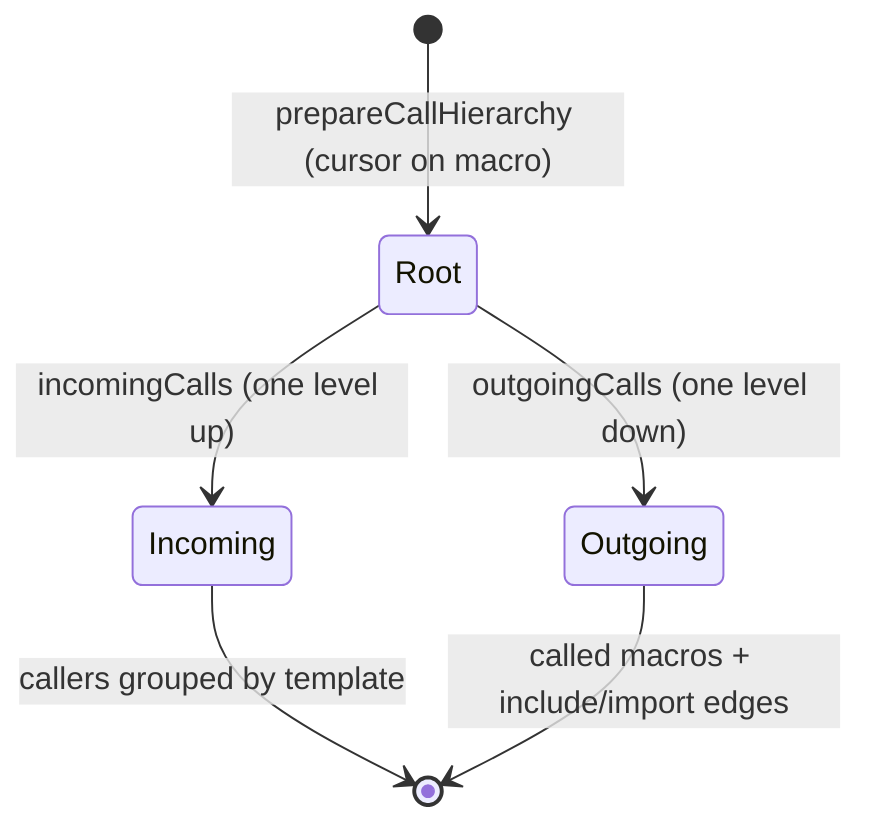

# F16 — Call Hierarchy

> **Status:** Draft
>
> **Version:** 0.1   ·   **Last updated:** 2026-06-24
>
> **Purpose:** The incoming/outgoing call graph for a macro — who calls it, and what it calls (including `include`/`import` targets as outgoing edges) — built over the [F09](F09-find-references.md) reference graph.

> **Depends on:** [constitution](../constitution.md), [E07-data-model](../foundations/E07-data-model.md), [E01-architecture](../foundations/E01-architecture.md)   ·   **Related:** [F09-find-references](F09-find-references.md), [F08-go-to-definition](F08-go-to-definition.md), [F15-code-lens](F15-code-lens.md)

> Requirement tag: **CALL**

---

## 1. Purpose & Scope

Call hierarchy is the expandable tree an editor shows when you ask "who calls this macro, and what does it call?" Start on `post_url`, expand upward to see every template that calls it, expand downward to see the macros and templates it pulls in. It's find-references turned into a navigable graph.

This spec covers:

- `callHierarchy/prepare` on a macro — establishing the macro as the hierarchy's root item.
- `callHierarchy/incomingCalls` — every call site that invokes the macro.
- `callHierarchy/outgoingCalls` — the macros this macro calls, plus its `include`/`import` targets as outgoing edges.
- Macros as the primary callable; templates appear as edges.

## 2. Non-Goals / Out of Scope

- The flat reference list — owned by [F09-find-references](F09-find-references.md).
- The inline reference-count annotation — owned by [F15-code-lens](F15-code-lens.md).
- Single-jump navigation — owned by [F08-go-to-definition](F08-go-to-definition.md).
- A call hierarchy over host-language functions — we model Jinja macros and template edges only (P5); we never execute templates (P1).

## 3. Background & Rationale

In a template codebase, the unit of reuse is the macro, and the dependency edges are calls (`{{ macro() }}`), includes (``), and imports (``). Before you change `post_url`, you want to know which templates render it — that's the incoming view. When you're tracing why `digest.html` is heavy, you want to walk down through what it includes and the macros those bring in — that's the outgoing view. We model both over the same reference graph that powers [F09](F09-find-references.md), so the call hierarchy is a *view* of existing facts, not a second traversal engine.

## 4. Concepts & Definitions

- **Call hierarchy** — the incoming/outgoing call graph of a macro. (Canonical definition in [glossary](../glossary.md).)
- **Call hierarchy item** — one node in the tree (a macro, or a template acting as a caller/edge), carrying name, kind, and definition range.
- **Incoming call** — a call site that invokes the item.
- **Outgoing call** — a macro the item calls, or an `include`/`import` target it depends on.
- **Callable** — the primary hierarchy unit; in Jinja that's the **macro** ([E07](../foundations/E07-data-model.md)).

## 5. Detailed Specification

The server advertises `callHierarchyProvider` ([E01](../foundations/E01-architecture.md)). The protocol is three steps: `prepare` to pin a root item from a cursor position, then `incomingCalls` and `outgoingCalls` to expand it in either direction. Every step reads the `WorkspaceIndex` reference graph ([F09](F09-find-references.md)) — no parsing, no execution.

### 5.1 Prepare

The hierarchy starts at the macro under the cursor.

**REQ-CALL-01 — Prepare resolves a macro from the cursor.**

`textDocument/prepareCallHierarchy` at a position over a macro — at its definition (``), a call site (`{{ post_url(post) }}`), or an imported-name usage — returns a single `CallHierarchyItem` for that `MacroDefinition`: `kind = Function`, `name` the macro name, `detail` the source template's relative path, ranges spanning the definition. The item is always anchored to the *definition*, regardless of which usage the cursor sat on, so incoming/outgoing expansion is stable. A position over a non-macro (a plain variable, a block, host text) returns nothing — macros are the only callable (P4/P5).

### 5.2 Incoming calls

Expanding upward lists everyone who calls the macro.

**REQ-CALL-02 — Incoming calls are the macro's call sites.**

`callHierarchy/incomingCalls` for a macro item returns one `CallHierarchyIncomingCall` per **calling template**: the `from` item is the calling template (or the enclosing macro, when the call sits inside another macro body), and `fromRanges` lists every call-site range within it. Counting is grouped by caller, so a template that calls `post_url` three times appears once with three ranges. The call sites are exactly the function-call `Reference`s the [F09](F09-find-references.md) graph resolves to this macro.

### 5.3 Outgoing calls

Expanding downward lists what the macro calls — and what it pulls in.

**REQ-CALL-03 — Outgoing calls include called macros and template edges.**

`callHierarchy/outgoingCalls` for a macro item returns one `CallHierarchyOutgoingCall` per dependency, of two kinds:

- **Called macro** — every macro invoked inside this macro's body; the `to` item is that macro's definition (`kind = Function`), `fromRanges` the call sites within the body.
- **Template edge** — every `` and `` reachable from this macro's body or its template; the `to` item is the target template (`kind = Module`), `fromRanges` the directive's range. This is what makes the outgoing view a true dependency tree rather than just a call list — it captures the composition edges Jinja relies on.

A dynamic or `ignore missing` template reference whose path can't be resolved statically ([E07](../foundations/E07-data-model.md) `is_dynamic` / `ignore_missing`) is omitted — we never fabricate an edge we can't prove (P4).

### 5.4 Graph reuse and cycles

The hierarchy is a view of the reference graph, traversed one level per request.

**REQ-CALL-04 — One level per request; reuse the F09 graph.**

Each `incomingCalls` / `outgoingCalls` call expands exactly one level; the client drives deeper expansion by re-querying on a child item. The handler reuses the [F09](F09-find-references.md) reference graph and the import graph in the `WorkspaceIndex` — it builds no separate index. Because expansion is one level at a time, an import/call cycle (the same situation `JINJA-E404` flags) can't cause infinite recursion; each request terminates on the direct neighbors.

## 6. UI Mockups

### 6.1 Incoming calls tree (editor)

Preparing on `post_url`, then expanding **incoming** shows who calls it. Each leaf is a calling template with its call count.

```
Call Hierarchy — incoming to  post_url   (blog/macros.html:6)
 ┌──────────────────────────────────────────────────────────────────────┐
 │  ⮜  post_url                              blog/macros.html             │
 │     ├─ ⮜ blog/post.html                   (2 calls)                    │
 │     │     • line 4   {{ post_url(post) }}                              │
 │     │     • line 9   {{ post_url(related) }}                           │
 │     └─ ⮜ email/digest.html                (1 call)                     │
 │           • line 12  {{ post_url(post) }}                              │
 └──────────────────────────────────────────────────────────────────────┘
   ⮜ = incoming (callers)
```

### 6.2 Outgoing calls tree (editor)

Expanding **outgoing** from `post_url` shows what it calls and what its template pulls in. Macros (ƒ) and template edges (▤) are distinguished.

```
Call Hierarchy — outgoing from  post_url   (blog/macros.html:6)
 ┌──────────────────────────────────────────────────────────────────────┐
 │  ⮞  post_url                              blog/macros.html             │
 │     └─ ƒ url_for                          (global — starlette pack)    │
 │           • line 7   {{ url_for("post", slug=post.slug) }}            │
 └──────────────────────────────────────────────────────────────────────┘
   ⮞ = outgoing   ƒ = called macro/global   ▤ = include/import edge (when present)
```

## 7. Visualizations

The three-step prepare → expand protocol, both directions reading one graph.



## 9. Examples & Use Cases

In `starlette-blog`, you prepare a call hierarchy on `post_url` in `blog/macros.html`. The **incoming** view groups callers by template: `blog/post.html` (two call sites) and `email/digest.html` (one, via its `from "blog/macros.html" import post_url`). Before renaming `post_url`'s `post` parameter, you scan this tree and know exactly which three call sites to check. The **outgoing** view shows `post_url` calls the `url_for` global (from the Starlette pack); a macro that also included or imported another template would surface those as `▤` edges, each expandable one level further via `outgoingCalls`.

## 10. Edge Cases & Failure Modes

- **Prepare over a non-macro** (variable, block, host text) → empty result; macros are the only callable.
- **Macro with no callers** → `incomingCalls` returns an empty list (the dead-macro case `JINJA-W202` also catches).
- **Macro that calls nothing and includes nothing** → `outgoingCalls` returns an empty list.
- **Dynamic / `ignore missing` include** → omitted from outgoing edges (unresolvable — P4).
- **Import/call cycle** → one level per request means no infinite recursion (matches `JINJA-E404`).
- **Cursor over a `from ... import post_url` name** → prepare anchors to the macro's *definition*, not the import line.
- **Macro inside an inline template region** ([E31](../foundations/E31-inline-templates.md)) → items report host-file coordinates, like every feature.

## 11. Testing

Prepare, incoming, and outgoing are unit-tested against the `starlette-blog` reference graph, including the include/import edge case and cycle termination.

### 11.1 Scope & coverage

Target: **100% of this feature's behavior.** Every `REQ-CALL-NN` maps to a test; every tree state (§6) and edge case (§10) has a test. See [E17-testing](../foundations/E17-testing.md#2-coverage-policy).

### 11.2 Test plan

| Behavior / scenario | Type | Fixtures | Verifies |
|---|---|---|---|
| Prepare on definition/call/import-name all anchor to the definition | unit | [starlette-blog](../foundations/E17-testing.md#5-fixtures-registry) | REQ-CALL-01 |
| Prepare on a non-macro returns nothing | unit | [starlette-blog](../foundations/E17-testing.md#5-fixtures-registry) | REQ-CALL-01 |
| Incoming groups callers by template with all ranges | unit | [starlette-blog](../foundations/E17-testing.md#5-fixtures-registry) | REQ-CALL-02 |
| Outgoing lists called macros + include/import edges | unit | [starlette-blog](../foundations/E17-testing.md#5-fixtures-registry) | REQ-CALL-03 |
| Dynamic / `ignore missing` edges are omitted | unit | [call-and-paths](../foundations/E17-testing.md#5-fixtures-registry) | REQ-CALL-03 |
| Import cycle expands one level without recursion | unit | [inheritance](../foundations/E17-testing.md#5-fixtures-registry) | REQ-CALL-04 |

### 11.3 Fixtures

- Reuses [starlette-blog](../foundations/E17-testing.md#5-fixtures-registry) for the core incoming/outgoing graph, [call-and-paths](../foundations/E17-testing.md#5-fixtures-registry) for the dynamic/`ignore missing` edge case, and [inheritance](../foundations/E17-testing.md#5-fixtures-registry) for cycle termination.

### 11.4 Requirement coverage

| Requirement | Covered by |
|---|---|
| REQ-CALL-01 | prepare unit tests |
| REQ-CALL-02 | incoming-calls unit test |
| REQ-CALL-03 | outgoing-calls + edge-omission unit tests |
| REQ-CALL-04 | cycle-termination unit test |

## 12. End-to-End Test Plan

### 12.1 Coverage target

**100% of the feature's user-visible scope** through the `pytest-lsp` LSP-protocol branch ([E29](../foundations/E29-e2e-testing.md#2-coverage-policy)): prepare on a macro, then expand both directions and assert the items.

### 12.2 Scenarios

| # | Journey | Path | Expected outcome |
|---|---|---|---|
| E2E-01 | `prepareCallHierarchy` on `post_url` | happy | one `Function` item anchored to `blog/macros.html` |
| E2E-02 | `incomingCalls` on the prepared item | happy | callers `blog/post.html` (2 ranges) and `email/digest.html` (1) |
| E2E-03 | `outgoingCalls` on the prepared item | happy | a called global plus the `include` template edge |
| E2E-04 | `prepareCallHierarchy` over a plain variable | error | empty result |

## 13. Non-Functional Requirements

### 13.1 Security & Privacy

- **Input & validation** — the hierarchy reads the reference/import graph only; no template is executed (P1).
- **Data sensitivity** — items report the user's own macros, templates, and ranges; nothing leaves the machine.

### 13.2 Accessibility

- **N/A** — the editor renders the call-hierarchy tree; jinja-lsp emits protocol data only (constitution §4.6).

### 13.4 Performance & Scale

- **Latency** — each request expands one level over the in-memory `WorkspaceIndex` graph, so response stays inside the interactive budget even for heavily-called macros (P6).

## 15. Open Questions & Decisions

- **Decided** — macros are the only callable; templates appear as caller groups and `include`/`import` edges; one level per request; cycles terminate by construction.
- **OQ-CALL-1** — should blocks (override chains) ever appear as a separate hierarchy, or stay purely in [F15](F15-code-lens.md)'s inheritance lens? Currently blocks are out of scope here.

## 16. Cross-References

- **Depends on:** [constitution](../constitution.md) — the mockup and P1/P5 rules; [E07-data-model](../foundations/E07-data-model.md) — `MacroDefinition`, the import graph, and the resolution flags; [E01-architecture](../foundations/E01-architecture.md) — the `callHierarchyProvider` capability.
- **Related:** [F09-find-references](F09-find-references.md) — the reference graph this views; [F08-go-to-definition](F08-go-to-definition.md) — single-jump navigation; [F15-code-lens](F15-code-lens.md) — the inline reference count.

## 17. Changelog

- **2026-06-24** — Initial draft.
- **2026-06-24** — Outgoing example drops the non-cast `blog/_meta.html` include; `post_url`'s only outgoing edge is the `url_for` global, matching its body in F08/F15.
