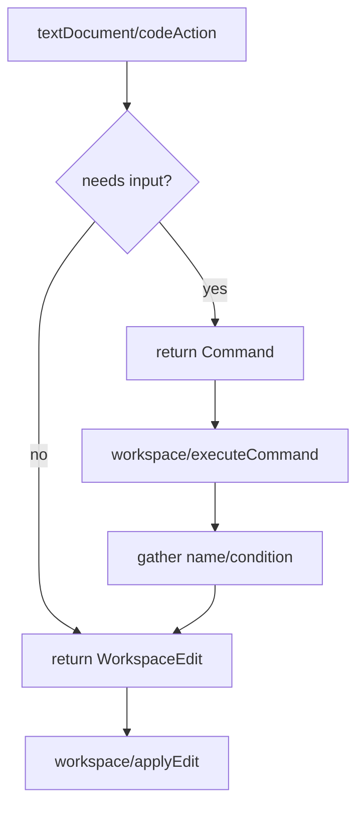

# F17 — Code Actions

> **Status:** Draft
>
> **Version:** 0.2   ·   **Last updated:** 2026-06-26
>
> **Purpose:** The lightbulb menu — quick-fixes derived mechanically from the [F01](F01-diagnostics.md) diagnostic catalog, plus cursor-triggered refactors (extract-to-macro, wrap-in-block/if/for) — all applied as a `WorkspaceEdit`.

> **Depends on:** [constitution](../constitution.md), [F01-diagnostics](F01-diagnostics.md), [E07-data-model](../foundations/E07-data-model.md), [E01-architecture](../foundations/E01-architecture.md)   ·   **Related:** [F02-builtin-registry](F02-builtin-registry.md), [F08-go-to-definition](F08-go-to-definition.md), [ADR-008-code-action-strategy](../decisions/ADR-008-code-action-strategy.md)

> Requirement tag: **ACT**

---

## 1. Purpose & Scope

Code actions are the fixes and refactors behind the editor's lightbulb. When jinja-lsp flags `{{ post_url(post) }}` as an undefined function, the lightbulb offers to import `post_url` from `blog/macros.html` — one click, done. When you select a chunk of markup, it offers to extract it into a macro. When your cursor is on a macro, it offers to rename it everywhere it's used. The whole feature is designed from the diagnostic catalog and the symbol model up ([ADR-008](../decisions/ADR-008-code-action-strategy.md)).

This spec covers:

- **Quick-fixes** tied to specific [F01](F01-diagnostics.md) diagnostic codes (the diagnostic catalog drives the fix catalog).
- **Refactors** triggered by cursor or selection, independent of any diagnostic.
- A **rename** command — cursor-driven, workspace-wide for definitions and scope-local for local variables — delivered via `executeCommand`.
- Applying every change as a `WorkspaceEdit`; refactors that need follow-up input via `workspace/executeCommand`.
- The `CodeActionKind` taxonomy the server reports.

## 2. Non-Goals / Out of Scope

- Defining the diagnostics themselves — owned by [F01-diagnostics](F01-diagnostics.md). This spec consumes that catalog.
- Reflowing or fixing host-language (HTML/SQL/text) — we edit Jinja only (P5).
- The dedicated `textDocument/rename` / `prepareRename` protocol method — we deliver rename as a code-action command (§5.2, REQ-ACT-11) via `executeCommand` instead of advertising the rename protocol method (constitution §4.7).
- Jinja-layer formatting — owned by [F18-formatting](F18-formatting.md) (offered separately, not as a code action).

## 3. Background & Rationale

Code actions are designed from first principles ([ADR-008](../decisions/ADR-008-code-action-strategy.md)). The design principle is *mechanical derivation*: for each diagnostic in the [F01](F01-diagnostics.md) catalog that has an obvious fix, we offer that fix as a quick-fix, so the fix catalog tracks the diagnostic catalog and can't drift. On top of that we add a small set of cursor-triggered refactors that the reference graph and symbol model ([E07](../foundations/E07-data-model.md)) make safe. Every edit is a `WorkspaceEdit`, which the client applies through `workspace/applyEdit` — the capability [ADR-008](../decisions/ADR-008-code-action-strategy.md) re-enables.

## 4. Concepts & Definitions

- **Quick-fix** — a code action that resolves a specific diagnostic. (Canonical definition in [glossary](../glossary.md).)
- **Refactor** — a cursor- or selection-triggered transformation, not bound to a diagnostic.
- **`WorkspaceEdit`** — the protocol object describing text edits (and file creations) the client applies atomically.
- **`executeCommand`** — the follow-up round-trip a refactor uses when it needs input (e.g. a macro name) before producing its edit.

## 5. Detailed Specification

The server advertises `codeActionProvider` (with the kinds in §5.4 and `resolveProvider: true`, so heavier edits resolve through `codeAction/resolve`) and `executeCommandProvider`, and relies on `workspace.applyEdit` ([E01](../foundations/E01-architecture.md)). On `textDocument/codeAction`, the handler receives the cursor range and the diagnostics overlapping it; it returns quick-fixes for those diagnostics (§5.1) and any refactors valid at the range (§5.2). Every action carries either an inline `WorkspaceEdit` or a `command` for the executeCommand path (§5.3).

### 5.1 Quick-fixes (diagnostic-driven)

Each quick-fix is offered only when its triggering diagnostic overlaps the requested range.

**REQ-ACT-01 — Remove unused imports and macros.**

For `JINJA-W203 unused-import` and `JINJA-W202 unused-macro`, offer **"Remove unused …"**. The edit deletes the whole offending construct — the entire `` line (or single-name `` line) for `W203`, the whole `…` region for `W202` — including the trailing newline so no blank line is left behind. **Multi-name from-imports** are the exception: when a `` binds several names and only some are unused, the edit removes **only the unused name and its adjacent separator (a comma, or the `as` alias)**, leaving the still-used names and the line intact; the whole-line delete is offered only when the import binds a single name (or all its names are unused).

**REQ-ACT-02 — Resolve undefined functions by import or suggestion.**

For `JINJA-E103 undefined-function` where the name matches a macro defined in another template, offer **"Import `<macro>` from `<template>`"** — the edit inserts a `` at the top of the file (after any `extends`), resolving the diagnostic. When no exact match exists but a close one does, additionally offer **"Did you mean `<name>`?"** for each near-match, replacing the call identifier. Near-matches come from the macro/global names in the `WorkspaceIndex` and registry, ranked by edit distance.

**REQ-ACT-03 — Suggest corrections for undefined filters and tests.**

For `JINJA-E102 undefined-filter` and `JINJA-E104 undefined-test`, offer **"Did you mean `<name>`?"** for each close match drawn from the built-in registry ([F02](F02-builtin-registry.md)) — built-in, pack, custom, and hinted filters/tests. The edit replaces the misspelled filter/test name. No match → no action (we don't invent fixes — P4).

**REQ-ACT-04 — Insert a stub for a missing required block.**

For `JINJA-E403 missing-required-block`, offer **"Insert `<block>` block"**. The edit inserts a `` stub into the child template, placed after the `extends` line, indented to match the file.

**REQ-ACT-05 — Create a missing template file.**

For `JINJA-E601 template-does-not-exist`, offer **"Create template `<path>`"**. The `WorkspaceEdit` includes a `CreateFile` operation for the resolved path under the nearest configured templates directory, seeded with an empty (or minimal ``-aware) body. Paths that escape the templates root (`../`) are never offered — they're rejected upstream ([E30](../foundations/E30-extraction-and-indexing.md), §13.1).

**REQ-ACT-06 — Offer fixes for shadowing and duplicates.**

For `JINJA-W305 name-shadowing` and the duplicate codes `JINJA-W301`/`W302`/`W303`/`W304`, offer the appropriate local fix: **"Remove duplicate …"** for a redundant duplicate block/macro/import, and **"Rename to `<suggestion>`"** (a single-occurrence rename of the shadowing binding, *not* a workspace rename) for `W305`. The rename suffixes a disambiguating index (`post` → `post_2`) and rewrites only that binding's local scope.

### 5.2 Refactors (cursor/selection-driven)

Refactors are offered based on the cursor or selection, not on any diagnostic.

**REQ-ACT-07 — Extract selection to a macro.**

When a non-empty selection covers a contiguous run of template nodes, offer **"Extract to macro"**. Because the macro needs a name, this action carries a `command` (not an inline edit): on invocation the client prompts for a name via `executeCommand` (§5.3), then the server returns a `WorkspaceEdit` that (a) appends a `…` containing the selection to the file and (b) replaces the selection with `{{ <name>() }}`. The selection must be well-formed (balanced tags); a selection that splits a tag is not offered (P3 — never produce a corrupt template).

**REQ-ACT-08 — Wrap selection in a block, if, or for.**

When a selection covers a well-formed run of nodes, offer three wrap refactors: **"Wrap in ``"**, **"Wrap in ``"**, and **"Wrap in ``"**. The block wrap prompts for a block name (executeCommand); the `if`/`for` wraps insert a placeholder condition/loop (`` / ``) for the user to fill. Because a `WorkspaceEdit` carries no cursor or selection, placing the caret on the placeholder is a client concern: when the client supports snippet edits, the wrap emits a snippet-style edit with a tabstop on the placeholder; otherwise it is best-effort (the placeholder text is inserted, but the caret is left where the client puts it). Each wrap re-indents the wrapped body one level (consistent with [F18](F18-formatting.md)'s indentation model) without touching host-language bytes outside the wrap (P5).

**REQ-ACT-11 — Rename a symbol (workspace-wide for definitions, scope-local for locals).**

When the cursor is on a renameable symbol, offer a rename whose label and blast radius match what the cursor sits on. Every renameable target draws its rewrite set from the same source — the [F09](F09-find-references.md) reference graph over [E07](../foundations/E07-data-model.md)'s resolved `Reference` set (REQ-DATA-11) — differing only in how far that graph reaches:

- A **macro, block, or import *definition*** — at the `` / `` declaration, or on a macro **call** that resolves through to it. Offer **"Rename `<name>` (workspace)…"**. The rename rewrites the declaration plus every reference **across the workspace** ([F09](F09-find-references.md) REQ-REF-02 — every importing template, every call site, every `` binding).
- A **local import binding** — the `as`-alias of `` or a *local* name in ``, with the cursor on that binding (not threaded through to the macro definition). Offer **"Rename import `<name>` (this template)…"**. Like [F09](F09-find-references.md) REQ-REF-01's import kind, this rewrites **only this template's** binding plus its in-template uses — it does *not* touch the macro definition or other importers. Renaming through to the macro definition (the workspace-wide blast radius above) happens only when the cursor is on the macro's own definition or a call to it.
- A **local variable** — a `` loop variable, a `` / `` binding, a macro parameter, or a `` argument. Offer **"Rename `<name>` (local)…"**. Its rewrite set is the variable's references collected via [F09](F09-find-references.md) (REQ-REF-01, which returns scope-local uses) — the same [E07](../foundations/E07-data-model.md) REQ-DATA-11 resolution — **bounded by the binding's `valid_range`** ([E07](../foundations/E07-data-model.md) REQ-DATA-03), never beyond it. The local rename is *not* sourceless: it uses the identical resolution as the workspace rename, just scoped to a single `valid_range`.

Because rename needs the new name, the action carries a `command`: on invocation the client prompts for a name via `executeCommand` (§5.3); the server validates it as a legal Jinja identifier, computes the `WorkspaceEdit` (multi-file for definitions, single-template for import bindings and locals), and applies it by issuing a separate `workspace/applyEdit` request mid-command (`executeCommand` itself returns no edit).

**Capture avoidance and collision refusal.** The rename rewrites **only the references that resolve to *this* binding** under [E07](../foundations/E07-data-model.md) REQ-DATA-11 (innermost binding wins), so an inner same-named binding inside the `valid_range` is a *different* symbol and is left untouched. The rename is **refused with a message** — surfaced over the protocol as a `window/showMessage` notification, no edit produced — when the new name **already binds in an overlapping `valid_range`** (the new name would collide with, or be captured by, an existing binding in the same scope), rather than producing a shadowing or colliding edit (P3/P4). A cursor on a non-renameable target — a built-in filter/test, a hinted context variable, or host text — offers no rename: we only rename symbols whose definition jinja-lsp owns (P5). This whole-symbol rename is distinct from the single-occurrence disambiguation fix in REQ-ACT-06, which only suffixes one shadowing binding.

### 5.3 Applying edits

Simple actions ship their edit inline; actions needing input use the command round-trip.

**REQ-ACT-09 — `WorkspaceEdit` for direct fixes; `executeCommand` for input.**

A quick-fix with no required input returns its `WorkspaceEdit` directly on the `codeAction` response (or via `codeAction/resolve` for the heavier ones), and the client applies it through `workspace/applyEdit`. A refactor that needs a name or condition (extract-to-macro, wrap-in-block) returns a `Command`; invoking it triggers `workspace/executeCommand`, the server gathers the input, and **then** issues a separate `workspace/applyEdit` request carrying the `WorkspaceEdit` (the `executeCommand` response itself returns no edit). Every resulting edit must be round-trip safe — the file re-parses to a valid tree (P3).

### 5.4 Action kinds

The server tags each action with a standard `CodeActionKind` so editors group and filter them.

**REQ-ACT-10 — Report standard `CodeActionKind`s.**

Quick-fixes are tagged `quickfix`; the three wraps and extract are tagged `refactor.extract` (extract-to-macro, wrap-in-block) and `refactor.rewrite` (wrap-in-if/for) appropriately; the rename command (REQ-ACT-11) is tagged `refactor.rewrite`. Each quick-fix sets `diagnostics` to the diagnostic it resolves so the editor can show it in the problem's context menu. The most directly-applicable fix per diagnostic is marked `isPreferred` (e.g. the import fix for `E103` over the spelling suggestions). `isPreferred` ranks **only among the same-kind quickfixes for that diagnostic** — it never ranks a quickfix against a refactor (the editor honors `isPreferred` only within a single action kind), so the co-listed "Extract to macro" refactor is outside its scope.

## 6. UI Mockups

### 6.1 Lightbulb menu at an undefined-function diagnostic (editor)

The `post_url` call that `JINJA-E103` flagged is selected (the line is highlighted, so the selection-driven "Extract to macro…" refactor also qualifies — REQ-ACT-07); the lightbulb lists its quick-fixes, preferred fix first, with the refactor below the separator.

```
templates/blog/post.html
 ┌──────────────────────────────────────────────────────────────────────┐
 │  4 │   <a href="{{ post_url(post) }}">{{ post.title }}</a>            │
 │    │                ~~~~~~~~                                          │
 │    │                ╰─ JINJA-E103 undefined-function: 'post_url'      │
 │    │                                                                  │
 │    │   💡 ╭──────────────────────────────────────────────────────╮   │
 │    │      │  Import `post_url` from "blog/macros.html"    ★       │   │
 │    │      │  Did you mean `post_path`?                            │   │
 │    │      │  ──────────────────────────────────────────────────  │   │
 │    │      │  Extract to macro…                                   │   │
 │    │      ╰──────────────────────────────────────────────────────╯   │
 └──────────────────────────────────────────────────────────────────────┘
   ★ = isPreferred — ranks only among the E103 quickfixes (import over the
       did-you-mean), not against the refactor below the separator
   "Extract to macro…" = refactor (… ⇒ prompts)
```

### 6.2 Quick-fix result (before / after)

Choosing **"Import `post_url`…"** inserts the import after the `extends` line and clears the diagnostic.

```
  before                              after
  ───────────────────────────        ──────────────────────────────────────
             
                   
    {{ post_url(post) }}              
                          {{ post_url(post) }}   ← no longer flagged
                                      
```

### 6.3 Extract-to-macro prompt (executeCommand)

Selecting the `<article>` block and choosing **"Extract to macro…"** prompts for a name before the edit lands.

```
        ┌─ Extract to macro ────────────────────────┐
        │                                            │
        │  Macro name:  [ post_card________________ ]│
        │                                            │
        │                       [ Cancel ]  [ OK ]   │
        └────────────────────────────────────────────┘

  on OK → appends  …
          and replaces the selection with  {{ post_card() }}
```

### 6.4 Rename prompt (executeCommand)

Cursor on the `post_card` macro; **"Rename `post_card`…"** prompts for the new name, then rewrites the definition and every reference workspace-wide.

```
        ┌─ Rename macro ────────────────────────────┐
        │                                            │
        │  New name:  [ article_card______________ ] │
        │                                            │
        │                       [ Cancel ]  [ OK ]   │
        └────────────────────────────────────────────┘

  on OK → rewrites    →  
          and all 3 call sites in post.html + email/digest.html
          (refused if `article_card` already binds in scope)
```

## 7. Visualizations

How the two action paths reach an applied edit.



## 9. Examples & Use Cases

In `starlette-blog`, a developer pastes `{{ post_url(post) }}` into `blog/post.html` but forgets the import, so [F01](F01-diagnostics.md) raises `JINJA-E103`. The lightbulb's preferred fix, **"Import `post_url` from "blog/macros.html"**, inserts `` after the `extends` line and the squiggle vanishes (REQ-ACT-02). Later they decide the `<article>` markup in `post.html` should be reusable: they select it, choose **"Extract to macro…"**, name it `post_card`, and the server appends a `` and swaps the selection for `{{ post_card() }}` (REQ-ACT-07). A week later they rename the macro itself: cursor on `post_card`, **"Rename `post_card`…"**, type `article_card`, and the server rewrites the definition plus all three call sites across `post.html` and `email/digest.html` in one edit (REQ-ACT-11). When they delete the last use of an old ``, `JINJA-W203` fires and **"Remove unused import"** cleans it up (REQ-ACT-01).

## 10. Edge Cases & Failure Modes

- **`E103` name with no macro and no near-match** → only generic actions (no import, no suggestion) — we don't guess (P4).
- **`E601` path escaping the templates root** → no "Create template" action; the path was rejected upstream (§13.1).
- **Selection splitting a tag** (``) → extract/wrap not offered (would corrupt — P3).
- **Multiple diagnostics on one line** → each contributes its own quick-fixes; the menu lists all.
- **Duplicate macro where both look identical** → "Remove duplicate" targets the later definition only.
- **executeCommand cancelled** (empty name) → no edit produced; document unchanged.
- **Action over an inline template region** ([E31](../foundations/E31-inline-templates.md)) → edits map back to host-file coordinates; host bytes outside the Jinja range are untouched (P5).

## 11. Testing

Each quick-fix and refactor is unit-tested on its triggering fixture, asserting the exact `WorkspaceEdit`; the executeCommand path is tested end-to-end.

### 11.1 Scope & coverage

Target: **100% of this feature's behavior.** Every `REQ-ACT-NN` maps to a test; every menu state (§6) and edge case (§10) has a test. See [E17-testing](../foundations/E17-testing.md#2-coverage-policy).

### 11.2 Test plan

Every row is concrete: a named diagnostic / selection / cursor on a specific fixture (or a synthetic `didOpen` doc where the baseline lacks the construct), with the exact expected `WorkspaceEdit` or action set asserted. Both polarities — the action fires and produces the right edit, and the documented §10 negatives offer nothing — are covered. Rows are grouped by REQ.

| # | Behavior / scenario | Type | Fixtures | Verifies |
|---|---|---|---|---|
| **REQ-ACT-01 — remove unused** | | | | |
| T-01 | `W203` on `` → "Remove unused import" deletes the whole `` line **incl. trailing newline** (no blank line left) | unit | [unused-symbols](../foundations/E17-testing.md#unused-symbols) | REQ-ACT-01 |
| T-02 | `W202` on an unused `…` → "Remove unused macro" deletes the whole macro region incl. trailing newline | unit | [unused-symbols](../foundations/E17-testing.md#unused-symbols) | REQ-ACT-01 |
| T-03 | `W203` on a `` where only `b` is unused → "Remove unused import" removes **only `b` and its separator**, yielding `` with the still-used `a` intact (the whole-line delete is reserved for single-name imports) | unit | [unused-symbols](../foundations/E17-testing.md#unused-symbols) | REQ-ACT-01 |
| **REQ-ACT-02 — resolve undefined function** | | | | |
| T-04 | `E103` on `{{ post_url(post) }}` in `blog/post.html` (no import) → "Import `post_url` from "blog/macros.html"" inserts `` **after the `extends` line**; diagnostic clears | unit | [starlette-blog](../foundations/E17-testing.md#starlette-blog) | REQ-ACT-02 |
| T-05 | `E103` on a near-miss call (`post_ur(post)`) → import fix **plus** "Did you mean `post_url`?" replacing the call identifier; near-matches ranked by edit distance over the index + registry | unit (synthetic `didOpen`) | [starlette-blog](../foundations/E17-testing.md#starlette-blog) | REQ-ACT-02 |
| T-06 | **Negative (§10):** `E103` on a name with **no macro and no near-match** (`zzqq(post)`) → no import and no did-you-mean action offered (only generic actions); we don't guess (P4) | unit (synthetic `didOpen`) | [starlette-blog](../foundations/E17-testing.md#starlette-blog) | REQ-ACT-02 |
| **REQ-ACT-03 — filter/test suggestions** | | | | |
| T-07 | `E102` on `{{ x \| uppercas }}` → "Did you mean `upper`?" (and other ranked near-matches) replacing the misspelled filter name; matches drawn from built-in/pack/custom/hinted registry | unit | [undefined-vars](../foundations/E17-testing.md#undefined-vars) | REQ-ACT-03 |
| T-08 | `E104` on `` → "Did you mean `even`?" replacing the misspelled test name | unit | [undefined-vars](../foundations/E17-testing.md#undefined-vars) | REQ-ACT-03 |
| T-09 | **Negative:** `E102`/`E104` with **no close registry match** → no action offered (we don't invent fixes — P4) | unit (synthetic `didOpen`) | [undefined-vars](../foundations/E17-testing.md#undefined-vars) | REQ-ACT-03 |
| **REQ-ACT-04 — required-block stub** | | | | |
| T-10 | `E403` on a child template missing a required block → "Insert `<block>` block" inserts `` **after the `extends` line**, indented to match the file | unit | [inheritance](../foundations/E17-testing.md#inheritance) | REQ-ACT-04 |
| **REQ-ACT-05 — create template** | | | | |
| T-11 | `E601` on `` → "Create template `<path>`" emits a `CreateFile` for the resolved path under the nearest templates root, seeded with an ``-aware/minimal body | unit | [call-and-paths](../foundations/E17-testing.md#call-and-paths) | REQ-ACT-05 |
| T-12 | **Negative (§10):** `E601` whose path **escapes the templates root** (`../secret.html`) → no "Create template" action offered (rejected upstream, §13.1) | unit | [call-and-paths](../foundations/E17-testing.md#call-and-paths) | REQ-ACT-05 |
| **REQ-ACT-06 — shadowing & duplicates** | | | | |
| T-13 | `W301` duplicate-block → "Remove duplicate block" deletes the later block definition only | unit | [duplicates](../foundations/E17-testing.md#duplicates) | REQ-ACT-06 |
| T-14 | `W302` duplicate-macro → "Remove duplicate macro" deletes the later macro | unit | [duplicates](../foundations/E17-testing.md#duplicates) | REQ-ACT-06 |
| T-15 | `W303` duplicate-import-alias → "Remove duplicate import" deletes the later `` | unit | [duplicates](../foundations/E17-testing.md#duplicates) | REQ-ACT-06 |
| T-16 | `W304` duplicate-from-import → "Remove duplicate import" deletes the later `` | unit | [duplicates](../foundations/E17-testing.md#duplicates) | REQ-ACT-06 |
| T-17 | `W305` name-shadowing → "Rename to `<suggestion>`" suffixes a disambiguating index (`post` → `post_2`) and rewrites **only that binding's local scope** (single-occurrence, not workspace) | unit | [duplicates](../foundations/E17-testing.md#duplicates) | REQ-ACT-06 |
| T-18 | **§10 edge:** duplicate macro where **both look identical** → "Remove duplicate" targets the **later** definition only | unit | [duplicates](../foundations/E17-testing.md#duplicates) | REQ-ACT-06 |
| **REQ-ACT-07 — extract to macro** | | | | |
| T-19 | Non-empty selection over a contiguous, balanced run of nodes (the `<article>` markup in `post.html`) → "Extract to macro" offered, carrying a `command` (not an inline edit) | unit | [starlette-blog](../foundations/E17-testing.md#starlette-blog) | REQ-ACT-07 |
| T-20 | **Negative (§10):** selection that **splits a tag** (``) → extract not offered (would corrupt — P3) | unit | [starlette-blog](../foundations/E17-testing.md#starlette-blog) | REQ-ACT-07 |
| **REQ-ACT-08 — wrap refactors** | | | | |
| T-21 | Well-formed selection → "Wrap in ``" offered, carries a `command` (prompts for block name); body re-indented one level, host bytes outside the wrap untouched (P5) | unit | [starlette-blog](../foundations/E17-testing.md#starlette-blog) | REQ-ACT-08 |
| T-22 | Well-formed selection → "Wrap in ``" inserts `` placeholder (snippet tabstop on `condition` when the client supports snippets, else best-effort), body re-indented one level | unit | [starlette-blog](../foundations/E17-testing.md#starlette-blog) | REQ-ACT-08 |
| T-23 | Well-formed selection → "Wrap in ``" inserts `` placeholder (snippet tabstop when supported, else best-effort), body re-indented one level | unit | [starlette-blog](../foundations/E17-testing.md#starlette-blog) | REQ-ACT-08 |
| T-24 | **Negative (§10):** selection splitting a tag → none of the three wraps offered (P3) | unit | [starlette-blog](../foundations/E17-testing.md#starlette-blog) | REQ-ACT-08 |
| **REQ-ACT-11 — rename symbol** | | | | |
| T-25 | Cursor on the `post_url` **macro definition** in `blog/macros.html` → "Rename `post_url`…" rewrites the declaration + every reference **across the workspace** (`post.html` call site + `email/digest.html` from-import & use) | unit | [starlette-blog](../foundations/E17-testing.md#starlette-blog) | REQ-ACT-11 |
| T-26 | Cursor on a **macro usage** (call site in `post.html`) → same workspace-wide rename resolved through the F09 reference graph | unit | [starlette-blog](../foundations/E17-testing.md#starlette-blog) | REQ-ACT-11 |
| T-27 | Cursor on a **block** name → rename rewrites the ``/``-keyed name across the inheritance chain | unit | [starlette-blog](../foundations/E17-testing.md#starlette-blog) | REQ-ACT-11 |
| T-28 | Cursor on an **import** binding (`` in `digest.html`) → rename rewrites the from-import binding + its uses + the definition + other importers | unit | [starlette-blog](../foundations/E17-testing.md#starlette-blog) | REQ-ACT-11 |
| T-29 | Cursor on a **local variable** — a `` loop var (also ``/``) → rename rewrites uses **within that scope only**, never beyond it (`VariableScope`) | unit | [starlette-blog](../foundations/E17-testing.md#starlette-blog) | REQ-ACT-11 |
| T-30 | **Negative:** rename to a name that **already binds in the same scope** → refused via a `window/showMessage` notification, no edit produced (P3/P4) | unit | [starlette-blog](../foundations/E17-testing.md#starlette-blog) | REQ-ACT-11 |
| T-31 | **Negative:** cursor on a **non-renameable target** — a built-in filter/test, a hinted context variable, or host text → no "Rename" action offered (we only rename symbols jinja-lsp owns — P5) | unit (synthetic `didOpen` + hint) | [starlette-blog](../foundations/E17-testing.md#starlette-blog) | REQ-ACT-11 |
| **REQ-ACT-09 — apply path & commands** | | | | |
| T-32 | A no-input quick-fix returns its `WorkspaceEdit` inline (or via `codeAction/resolve`); the edit is round-trip safe — the file re-parses to a valid tree (P3) | unit | [unused-symbols](../foundations/E17-testing.md#unused-symbols) | REQ-ACT-09 |
| T-33 | **Negative (§10):** `executeCommand` **cancelled** (empty name) → no edit produced; document unchanged | unit | [starlette-blog](../foundations/E17-testing.md#starlette-blog) | REQ-ACT-09 |
| T-34 | **§10 edge:** **multiple diagnostics on one line** → each contributes its own quick-fixes; the menu lists all | unit (synthetic `didOpen`) | [undefined-vars](../foundations/E17-testing.md#undefined-vars) | REQ-ACT-09 |
| T-35 | **§10 edge:** action over an **inline/embedded-template region** ([E31](../foundations/E31-inline-templates.md)) → edits map back to host-file coordinates; host bytes outside the Jinja range untouched (P5) | unit | [call-and-paths](../foundations/E17-testing.md#call-and-paths) | REQ-ACT-09 |
| **REQ-ACT-10 — action kinds & isPreferred** | | | | |
| T-36 | Quick-fixes tagged `quickfix` with `diagnostics` set to the resolved diagnostic; extract/wrap-in-block tagged `refactor.extract`; wrap-in-if/for tagged `refactor.rewrite`; rename command tagged `refactor.rewrite` | unit | [starlette-blog](../foundations/E17-testing.md#starlette-blog) | REQ-ACT-10 |
| T-37 | The most directly-applicable fix is marked `isPreferred` — the `E103` import fix over the spelling suggestions (§6.1 ★) | unit | [starlette-blog](../foundations/E17-testing.md#starlette-blog) | REQ-ACT-10 |
| **§6 mockup states** | | | | |
| T-38 | **§6.1/§6.2:** `codeAction` at the `E103` `post_url` diagnostic returns the menu in §6.1 order (import ★ preferred, then did-you-mean, then "Extract to macro…"); applying the import yields the §6.2 after-state | unit | [starlette-blog](../foundations/E17-testing.md#starlette-blog) | REQ-ACT-02, REQ-ACT-10 |
| T-39 | **§6.3:** "Extract to macro…" command prompts (executeCommand), and on name `post_card` appends `…` and replaces the selection with `{{ post_card() }}` | unit | [starlette-blog](../foundations/E17-testing.md#starlette-blog) | REQ-ACT-07, REQ-ACT-09 |
| T-40 | **§6.4:** "Rename `post_card`…" command prompts and on `article_card` rewrites the def + all call sites across `post.html` + `email/digest.html`; refused if `article_card` already binds | unit | [starlette-blog](../foundations/E17-testing.md#starlette-blog) | REQ-ACT-11 |

### 11.3 Fixtures

- Reuses the diagnostic fixtures from [E17-testing](../foundations/E17-testing.md#5-fixtures-registry) — `unused-symbols` (W202/W203), `undefined-vars` (E102/E103/E104), `inheritance` (E403), `call-and-paths` (E601 + inline/E31), `duplicates` (W301–W305) — so each quick-fix is tested against the same source that triggers its diagnostic, and `starlette-blog` for the refactors and rename (`post_url` imported into `post.html` and `email/digest.html`).
- Constructs the baseline fixtures don't carry — a near-miss `E103` call, a no-match `E103`/`E102`/`E104`, a non-renameable cursor target, two diagnostics on one line — use synthetic in-memory `didOpen` documents rather than polluting the clean baselines ([E17-testing § starlette-blog](../foundations/E17-testing.md#starlette-blog)).

### 11.4 Requirement coverage

| Requirement | Covered by |
|---|---|
| REQ-ACT-01 | T-01, T-02, T-03 (W203/W202 remove-unused) |
| REQ-ACT-02 | T-04, T-05, T-06 (E103 import + did-you-mean + no-match negative); E2E-01, E2E-02 |
| REQ-ACT-03 | T-07, T-08, T-09 (E102/E104 suggestion + no-match negative); E2E-03 |
| REQ-ACT-04 | T-10 (E403 block stub); E2E-05 |
| REQ-ACT-05 | T-11, T-12 (E601 CreateFile + path-escape negative); E2E-10, E2E-11 |
| REQ-ACT-06 | T-13, T-14, T-15, T-16, T-17, T-18 (W301–W305 remove/rename + identical-duplicate edge); E2E-06, E2E-07 |
| REQ-ACT-07 | T-19, T-20, T-39 (extract + split-selection negative); E2E-08 |
| REQ-ACT-08 | T-21, T-22, T-23, T-24 (wrap block/if/for + split-selection negative); E2E-09 |
| REQ-ACT-09 | T-32, T-33, T-34, T-35, T-39 (round-trip + cancellation + multi-diagnostic + inline-template); E2E-08, E2E-16 |
| REQ-ACT-10 | T-36, T-37, T-38 (kinds + isPreferred); E2E-17 |
| REQ-ACT-11 | T-25, T-26, T-27, T-28, T-29, T-30, T-31, T-40 (macro/block/import/local + collision + non-renameable negative); E2E-12, E2E-13, E2E-14, E2E-15 |

## 12. End-to-End Test Plan

### 12.1 Coverage target

**100% of the feature's user-visible scope** through the `pytest-lsp` LSP-protocol branch ([E29](../foundations/E29-e2e-testing.md#2-coverage-policy)): request `codeAction` at a diagnostic, assert the offered actions, apply one, and assert the resulting document.

### 12.2 Scenarios

Each journey requests `codeAction` (or `executeCommand`) over the protocol, asserts the offered actions, applies one, and asserts the resulting document and re-published diagnostics. Journeys cover both polarities; the **Path** column matches the asserted outcome.

| # | Journey | Path | Expected outcome |
|---|---|---|---|
| E2E-01 | `codeAction` at an `E103` `post_url` diagnostic; apply the import fix | happy | offers the import fix (preferred ★) + did-you-mean; applying inserts `` after `extends` and clears `E103` on re-publish (REQ-ACT-02) |
| E2E-02 | `codeAction` at an `E103` near-miss; apply "Did you mean `post_url`?" | happy | the call identifier is rewritten and the diagnostic clears (REQ-ACT-02) |
| E2E-03 | `codeAction` at an `E102` undefined-filter; apply "Did you mean `<name>`?" | happy | the filter name is rewritten and `E102` clears; an `E104` test suggestion behaves the same (REQ-ACT-03) |
| E2E-04 | Apply "Remove unused import" at `W203` | happy | the whole `import` line is deleted incl. trailing newline; `W203` clears on re-publish (REQ-ACT-01) |
| E2E-05 | Apply "Insert `<block>` block" at `E403` | happy | the block stub is inserted after `extends`, indented; `E403` clears (REQ-ACT-04) |
| E2E-06 | Apply "Remove duplicate macro" at `W302` | happy | the later macro is deleted; `W302` clears (REQ-ACT-06) |
| E2E-07 | Apply "Rename to `<suggestion>`" at `W305` | happy | only the shadowing binding's scope is rewritten (`post` → `post_2`); `W305` clears (REQ-ACT-06) |
| E2E-08 | Extract-to-macro via `executeCommand` | happy | prompt → name → macro appended, selection replaced with `{{ <name>() }}`, tree still valid (REQ-ACT-07, REQ-ACT-09) |
| E2E-09 | Wrap-in-block via `executeCommand`; wrap-in-if/for inline | happy | prompt → block name → body wrapped and re-indented; `if`/`for` insert placeholder conditions (snippet tabstop when the client supports snippets, else best-effort) (REQ-ACT-08) |
| E2E-10 | `codeAction` at an `E601` with an escaping path | error | no "Create template" action offered (REQ-ACT-05) |
| E2E-11 | Apply "Create template `<path>`" at an `E601` with an in-root path | happy | a `CreateFile` operation creates the seeded file; `E601` clears (REQ-ACT-05) |
| E2E-12 | Rename a macro via `executeCommand` | happy | prompt → name → def + every reference rewritten across `post.html` + `email/digest.html`; trees still valid (REQ-ACT-11) |
| E2E-13 | Rename a local `` variable via `executeCommand` | happy | only uses within the loop scope are rewritten; bindings of the same name outside the scope are untouched (REQ-ACT-11) |
| E2E-14 | Rename to a name already bound in scope | error | rename refused via a `window/showMessage` notification; document unchanged (REQ-ACT-11) |
| E2E-15 | `codeAction` with the cursor on a non-renameable target (built-in filter / hinted variable / host text) | error | no "Rename" action offered (REQ-ACT-11) |
| E2E-16 | Extract-to-macro `executeCommand` cancelled (empty name) | error | no edit applied; document unchanged (REQ-ACT-09) |
| E2E-17 | `codeAction` asserts reported `CodeActionKind`s and `isPreferred` over the wire | happy | quick-fixes `quickfix` with `diagnostics` set; extract/wrap-in-block `refactor.extract`; wrap-in-if/for + rename `refactor.rewrite`; import fix `isPreferred` (REQ-ACT-10) |

## 13. Non-Functional Requirements

### 13.1 Security & Privacy

- **Access & authorization** — actions edit only files inside the workspace's configured templates roots; the "Create template" action refuses any path that escapes a root via `../` ([E30](../foundations/E30-extraction-and-indexing.md)).
- **Input & validation** — every action reads the syntax tree and index only; nothing is executed (P1). Names supplied via `executeCommand` are validated as legal Jinja identifiers before they enter an edit.
- **Data sensitivity** — edits touch only the user's own templates; nothing leaves the machine.

### 13.2 Accessibility

- **N/A** — the editor renders the lightbulb menu and prompts; jinja-lsp emits protocol data only (constitution §4.6).

### 13.4 Performance & Scale

- **Latency** — `codeAction` reads the in-memory index for the requested range only, so it returns inside the interactive budget; building a `WorkspaceEdit` is cheap relative to applying it (P6).

## 15. Open Questions & Decisions

- **Decided** — quick-fixes derive mechanically from the [F01](F01-diagnostics.md) catalog ([ADR-008](../decisions/ADR-008-code-action-strategy.md)); refactors are cursor/selection-driven; named refactors and rename use `executeCommand`. Rename is delivered as a code-action command (REQ-ACT-11), not the dedicated `textDocument/rename` protocol method (constitution §4.7).
- **OQ-ACT-1** — should "Extract to macro" auto-detect free variables in the selection and add them as macro parameters, or always extract a zero-arg macro for the user to parameterize? Currently zero-arg.

## 16. Cross-References

- **Depends on:** [constitution](../constitution.md) — P3/P5 and the mockup rule; [F01-diagnostics](F01-diagnostics.md) — the catalog every quick-fix derives from; [F09-find-references](F09-find-references.md) — the reference graph the rename command rewrites; [E07-data-model](../foundations/E07-data-model.md) — the symbols and `VariableScope` refactors and rename operate on; [E01-architecture](../foundations/E01-architecture.md) — the `codeActionProvider`/`executeCommandProvider` capabilities; [ADR-008-code-action-strategy](../decisions/ADR-008-code-action-strategy.md) — the code-action strategy.
- **Related:** [F02-builtin-registry](F02-builtin-registry.md) — the names spelling suggestions draw from; [F08-go-to-definition](F08-go-to-definition.md) — resolving where to import from; [F18-formatting](F18-formatting.md) — the indentation model wraps reuse.

## 17. Changelog

- **2026-06-26** — Spec-review fixes: §5 now advertises `codeActionProvider.resolveProvider` to back the `codeAction/resolve` path, matched in [E01](../foundations/E01-architecture.md) (jinja-lsp-bv6); REQ-ACT-01/T-03 remove only the unused name from a multi-name from-import instead of deleting the still-used line (jinja-lsp-frg); reworded the `executeCommand`→`workspace/applyEdit` round-trip to match the §7 flow (jinja-lsp-phz); pinned the rename-refusal channel to `window/showMessage` in §5.2/T-30/E2E-14 (jinja-lsp-g6b); softened this changelog's rename wording against constitution §4.7 (jinja-lsp-xvw); noted §6.1's selection so "Extract to macro" qualifies (jinja-lsp-fcs); clarified wrap cursor placement as a snippet/best-effort client concern, not a `WorkspaceEdit` field (jinja-lsp-8hp); clarified `isPreferred` ranks only within same-kind quickfixes (jinja-lsp-5et).
- **2026-06-25** — Expanded the §11.2 test plan (T-01..T-40) and §12.2 E2E scenarios (E2E-01..E2E-17) to concrete, full-combination coverage: every quick-fix REQ-ACT × its triggering diagnostic(s), every refactor incl. split-selection and the three wraps, the full rename matrix (macro/block/import/local + collision + non-renameable negatives), and every §10 edge and §6 mockup state, both polarities. Synced §11.3 fixtures note and §11.4 requirement-coverage bijection.
- **2026-06-25** — Added the rename command (REQ-ACT-11): cursor-driven, workspace-wide for macro/block/import definitions (via [F09](F09-find-references.md)) and scope-local for local variables, delivered through `executeCommand`. The rename *capability* is delivered here as a code-action command; the constitution §4.7 Non-Goal — the dedicated `textDocument/rename` / `prepareRename` protocol method — remains in force and is still honored (that method is not advertised).
- **2026-06-24** — Initial draft.
