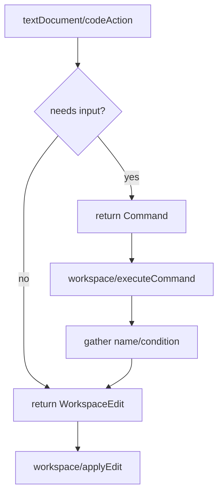

# F17 — Code Actions

> **Status:** Draft
>
> **Version:** 0.1   ·   **Last updated:** 2026-06-24
>
> **Purpose:** The lightbulb menu — quick-fixes derived mechanically from the [F01](F01-diagnostics.md) diagnostic catalog, plus cursor-triggered refactors (extract-to-macro, wrap-in-block/if/for) — all applied as a `WorkspaceEdit`.

> **Depends on:** [constitution](../constitution.md), [F01-diagnostics](F01-diagnostics.md), [E07-data-model](../foundations/E07-data-model.md), [E01-architecture](../foundations/E01-architecture.md)   ·   **Related:** [F02-builtin-registry](F02-builtin-registry.md), [F08-go-to-definition](F08-go-to-definition.md), [ADR-008-code-action-strategy](../decisions/ADR-008-code-action-strategy.md)

> Requirement tag: **ACT**

---

## 1. Purpose & Scope

Code actions are the fixes and refactors behind the editor's lightbulb. When jinja-lsp flags `{{ post_url(post) }}` as an undefined function, the lightbulb offers to import `post_url` from `blog/macros.html` — one click, done. When you select a chunk of markup, it offers to extract it into a macro. When your cursor is on a macro, it offers to rename it everywhere it's used. The whole feature is designed from the diagnostic catalog and the symbol model up ([ADR-008](../decisions/ADR-008-code-action-strategy.md)).

This spec covers:

- **Quick-fixes** tied to specific [F01](F01-diagnostics.md) diagnostic codes (the diagnostic catalog drives the fix catalog).
- **Refactors** triggered by cursor or selection, independent of any diagnostic.
- A **rename** command — cursor-driven, workspace-wide for definitions and scope-local for local variables — delivered via `executeCommand`.
- Applying every change as a `WorkspaceEdit`; refactors that need follow-up input via `workspace/executeCommand`.
- The `CodeActionKind` taxonomy the server reports.

## 2. Non-Goals / Out of Scope

- Defining the diagnostics themselves — owned by [F01-diagnostics](F01-diagnostics.md). This spec consumes that catalog.
- Reflowing or fixing host-language (HTML/SQL/text) — we edit Jinja only (P5).
- The dedicated `textDocument/rename` / `prepareRename` protocol method — we deliver rename as a code-action command (§5.2, REQ-ACT-11) via `executeCommand` instead of advertising the rename protocol method (constitution §4.7).
- Jinja-layer formatting — owned by [F18-formatting](F18-formatting.md) (offered separately, not as a code action).

## 3. Background & Rationale

Code actions are designed from first principles ([ADR-008](../decisions/ADR-008-code-action-strategy.md)). The design principle is *mechanical derivation*: for each diagnostic in the [F01](F01-diagnostics.md) catalog that has an obvious fix, we offer that fix as a quick-fix, so the fix catalog tracks the diagnostic catalog and can't drift. On top of that we add a small set of cursor-triggered refactors that the reference graph and symbol model ([E07](../foundations/E07-data-model.md)) make safe. Every edit is a `WorkspaceEdit`, which the client applies through `workspace/applyEdit` — the capability [ADR-008](../decisions/ADR-008-code-action-strategy.md) re-enables.

## 4. Concepts & Definitions

- **Quick-fix** — a code action that resolves a specific diagnostic. (Canonical definition in [glossary](../glossary.md).)
- **Refactor** — a cursor- or selection-triggered transformation, not bound to a diagnostic.
- **`WorkspaceEdit`** — the protocol object describing text edits (and file creations) the client applies atomically.
- **`executeCommand`** — the follow-up round-trip a refactor uses when it needs input (e.g. a macro name) before producing its edit.

## 5. Detailed Specification

The server advertises `codeActionProvider` (with the kinds in §5.4) and `executeCommandProvider`, and relies on `workspace.applyEdit` ([E01](../foundations/E01-architecture.md)). On `textDocument/codeAction`, the handler receives the cursor range and the diagnostics overlapping it; it returns quick-fixes for those diagnostics (§5.1) and any refactors valid at the range (§5.2). Every action carries either an inline `WorkspaceEdit` or a `command` for the executeCommand path (§5.3).

### 5.1 Quick-fixes (diagnostic-driven)

Each quick-fix is offered only when its triggering diagnostic overlaps the requested range.

**REQ-ACT-01 — Remove unused imports and macros.**

For `JINJA-W203 unused-import` and `JINJA-W202 unused-macro`, offer **"Remove unused …"**. The edit deletes the whole offending construct — the entire `` / `` line for `W203`, the whole `…` region for `W202` — including the trailing newline so no blank line is left behind.

**REQ-ACT-02 — Resolve undefined functions by import or suggestion.**

For `JINJA-E103 undefined-function` where the name matches a macro defined in another template, offer **"Import `<macro>` from `<template>`"** — the edit inserts a `` at the top of the file (after any `extends`), resolving the diagnostic. When no exact match exists but a close one does, additionally offer **"Did you mean `<name>`?"** for each near-match, replacing the call identifier. Near-matches come from the macro/global names in the `WorkspaceIndex` and registry, ranked by edit distance.

**REQ-ACT-03 — Suggest corrections for undefined filters and tests.**

For `JINJA-E102 undefined-filter` and `JINJA-E104 undefined-test`, offer **"Did you mean `<name>`?"** for each close match drawn from the built-in registry ([F02](F02-builtin-registry.md)) — built-in, pack, custom, and hinted filters/tests. The edit replaces the misspelled filter/test name. No match → no action (we don't invent fixes — P4).

**REQ-ACT-04 — Insert a stub for a missing required block.**

For `JINJA-E403 missing-required-block`, offer **"Insert `<block>` block"**. The edit inserts a `` stub into the child template, placed after the `extends` line, indented to match the file.

**REQ-ACT-05 — Create a missing template file.**

For `JINJA-E601 template-does-not-exist`, offer **"Create template `<path>`"**. The `WorkspaceEdit` includes a `CreateFile` operation for the resolved path under the nearest configured templates directory, seeded with an empty (or minimal ``-aware) body. Paths that escape the templates root (`../`) are never offered — they're rejected upstream ([E30](../foundations/E30-extraction-and-indexing.md), §13.1).

**REQ-ACT-06 — Offer fixes for shadowing and duplicates.**

For `JINJA-W305 name-shadowing` and the duplicate codes `JINJA-W301`/`W302`/`W303`/`W304`, offer the appropriate local fix: **"Remove duplicate …"** for a redundant duplicate block/macro/import, and **"Rename to `<suggestion>`"** (a single-occurrence rename of the shadowing binding, *not* a workspace rename) for `W305`. The rename suffixes a disambiguating index (`post` → `post_2`) and rewrites only that binding's local scope.

### 5.2 Refactors (cursor/selection-driven)

Refactors are offered based on the cursor or selection, not on any diagnostic.

**REQ-ACT-07 — Extract selection to a macro.**

When a non-empty selection covers a contiguous run of template nodes, offer **"Extract to macro"**. Because the macro needs a name, this action carries a `command` (not an inline edit): on invocation the client prompts for a name via `executeCommand` (§5.3), then the server returns a `WorkspaceEdit` that (a) appends a `…` containing the selection to the file and (b) replaces the selection with `{{ <name>() }}`. The selection must be well-formed (balanced tags); a selection that splits a tag is not offered (P3 — never produce a corrupt template).

**REQ-ACT-08 — Wrap selection in a block, if, or for.**

When a selection covers a well-formed run of nodes, offer three wrap refactors: **"Wrap in ``"**, **"Wrap in ``"**, and **"Wrap in ``"**. The block wrap prompts for a block name (executeCommand); the `if`/`for` wraps insert a placeholder condition/loop (`` / ``) for the user to fill, with the cursor positioned on the placeholder via the returned edit's selection. Each wrap re-indents the wrapped body one level (consistent with [F18](F18-formatting.md)'s indentation model) without touching host-language bytes outside the wrap (P5).

**REQ-ACT-11 — Rename a symbol (workspace-wide for definitions, scope-local for locals).**

When the cursor is on a renameable symbol, offer **"Rename `<name>`…"**. Two symbol classes are renameable:

- A **macro, block, or import** — at its definition or at any usage. The rename resolves the symbol through the [F09](F09-find-references.md) reference graph and rewrites the declaration plus every reference **across the workspace** (every importing template, every call site, every `` binding).
- A **local variable** — a `` loop variable, or a `` / `` binding — and its uses **within that binding's scope only** ([E07](../foundations/E07-data-model.md)'s `VariableScope`), never beyond it.

Because rename needs the new name, the action carries a `command`: on invocation the client prompts for a name via `executeCommand` (§5.3); the server validates it as a legal Jinja identifier, computes the `WorkspaceEdit` (multi-file for definitions, single-scope for locals), and applies it through `applyEdit`. If the new name already binds in the same scope, the rename is refused with a message rather than producing a shadowing or colliding edit (P3/P4). A cursor on a non-renameable target — a built-in filter/test, a hinted context variable, or host text — offers no rename: we only rename symbols whose definition jinja-lsp owns (P5). This whole-symbol rename is distinct from the single-occurrence disambiguation fix in REQ-ACT-06, which only suffixes one shadowing binding.

### 5.3 Applying edits

Simple actions ship their edit inline; actions needing input use the command round-trip.

**REQ-ACT-09 — `WorkspaceEdit` for direct fixes; `executeCommand` for input.**

A quick-fix with no required input returns its `WorkspaceEdit` directly on the `codeAction` response (or via `codeAction/resolve` for the heavier ones), and the client applies it through `workspace/applyEdit`. A refactor that needs a name or condition (extract-to-macro, wrap-in-block) returns a `Command`; invoking it triggers `workspace/executeCommand`, the server gathers the input, and **then** returns the `WorkspaceEdit` via `applyEdit`. Every resulting edit must be round-trip safe — the file re-parses to a valid tree (P3).

### 5.4 Action kinds

The server tags each action with a standard `CodeActionKind` so editors group and filter them.

**REQ-ACT-10 — Report standard `CodeActionKind`s.**

Quick-fixes are tagged `quickfix`; the three wraps and extract are tagged `refactor.extract` (extract-to-macro, wrap-in-block) and `refactor.rewrite` (wrap-in-if/for) appropriately; the rename command (REQ-ACT-11) is tagged `refactor.rewrite`. Each quick-fix sets `diagnostics` to the diagnostic it resolves so the editor can show it in the problem's context menu. The most directly-applicable fix per diagnostic is marked `isPreferred` (e.g. the import fix for `E103` over the spelling suggestions).

## 6. UI Mockups

### 6.1 Lightbulb menu at an undefined-function diagnostic (editor)

The cursor is on the `post_url` call that `JINJA-E103` flagged; the lightbulb lists its quick-fixes, preferred fix first.

```
templates/blog/post.html
 ┌──────────────────────────────────────────────────────────────────────┐
 │  4 │   <a href="{{ post_url(post) }}">{{ post.title }}</a>            │
 │    │                ~~~~~~~~                                          │
 │    │                ╰─ JINJA-E103 undefined-function: 'post_url'      │
 │    │                                                                  │
 │    │   💡 ╭──────────────────────────────────────────────────────╮   │
 │    │      │  Import `post_url` from "blog/macros.html"    ★       │   │
 │    │      │  Did you mean `post_path`?                            │   │
 │    │      │  ──────────────────────────────────────────────────  │   │
 │    │      │  Extract to macro…                                   │   │
 │    │      ╰──────────────────────────────────────────────────────╯   │
 └──────────────────────────────────────────────────────────────────────┘
   ★ = isPreferred (quickfix)   "Extract to macro…" = refactor (… ⇒ prompts)
```

### 6.2 Quick-fix result (before / after)

Choosing **"Import `post_url`…"** inserts the import after the `extends` line and clears the diagnostic.

```
  before                              after
  ───────────────────────────        ──────────────────────────────────────
             
                   
    {{ post_url(post) }}              
                          {{ post_url(post) }}   ← no longer flagged
                                      
```

### 6.3 Extract-to-macro prompt (executeCommand)

Selecting the `<article>` block and choosing **"Extract to macro…"** prompts for a name before the edit lands.

```
        ┌─ Extract to macro ────────────────────────┐
        │                                            │
        │  Macro name:  [ post_card________________ ]│
        │                                            │
        │                       [ Cancel ]  [ OK ]   │
        └────────────────────────────────────────────┘

  on OK → appends  …
          and replaces the selection with  {{ post_card() }}
```

### 6.4 Rename prompt (executeCommand)

Cursor on the `post_card` macro; **"Rename `post_card`…"** prompts for the new name, then rewrites the definition and every reference workspace-wide.

```
        ┌─ Rename macro ────────────────────────────┐
        │                                            │
        │  New name:  [ article_card______________ ] │
        │                                            │
        │                       [ Cancel ]  [ OK ]   │
        └────────────────────────────────────────────┘

  on OK → rewrites    →  
          and all 3 call sites in post.html + email/digest.html
          (refused if `article_card` already binds in scope)
```

## 7. Visualizations

How the two action paths reach an applied edit.



## 9. Examples & Use Cases

In `starlette-blog`, a developer pastes `{{ post_url(post) }}` into `blog/post.html` but forgets the import, so [F01](F01-diagnostics.md) raises `JINJA-E103`. The lightbulb's preferred fix, **"Import `post_url` from "blog/macros.html"**, inserts `` after the `extends` line and the squiggle vanishes (REQ-ACT-02). Later they decide the `<article>` markup in `post.html` should be reusable: they select it, choose **"Extract to macro…"**, name it `post_card`, and the server appends a `` and swaps the selection for `{{ post_card() }}` (REQ-ACT-07). A week later they rename the macro itself: cursor on `post_card`, **"Rename `post_card`…"**, type `article_card`, and the server rewrites the definition plus all three call sites across `post.html` and `email/digest.html` in one edit (REQ-ACT-11). When they delete the last use of an old ``, `JINJA-W203` fires and **"Remove unused import"** cleans it up (REQ-ACT-01).

## 10. Edge Cases & Failure Modes

- **`E103` name with no macro and no near-match** → only generic actions (no import, no suggestion) — we don't guess (P4).
- **`E601` path escaping the templates root** → no "Create template" action; the path was rejected upstream (§13.1).
- **Selection splitting a tag** (``) → extract/wrap not offered (would corrupt — P3).
- **Multiple diagnostics on one line** → each contributes its own quick-fixes; the menu lists all.
- **Duplicate macro where both look identical** → "Remove duplicate" targets the later definition only.
- **executeCommand cancelled** (empty name) → no edit produced; document unchanged.
- **Action over an inline template region** ([E31](../foundations/E31-inline-templates.md)) → edits map back to host-file coordinates; host bytes outside the Jinja range are untouched (P5).

## 11. Testing

Each quick-fix and refactor is unit-tested on its triggering fixture, asserting the exact `WorkspaceEdit`; the executeCommand path is tested end-to-end.

### 11.1 Scope & coverage

Target: **100% of this feature's behavior.** Every `REQ-ACT-NN` maps to a test; every menu state (§6) and edge case (§10) has a test. See [E17-testing](../foundations/E17-testing.md#2-coverage-policy).

### 11.2 Test plan

| Behavior / scenario | Type | Fixtures | Verifies |
|---|---|---|---|
| Remove unused import / macro deletes the whole construct | unit | [unused-symbols](../foundations/E17-testing.md#5-fixtures-registry) | REQ-ACT-01 |
| `E103` offers import + did-you-mean; edit inserts the from-import | unit | [starlette-blog](../foundations/E17-testing.md#5-fixtures-registry) | REQ-ACT-02 |
| `E102`/`E104` offer registry-ranked suggestions | unit | [undefined-vars](../foundations/E17-testing.md#5-fixtures-registry) | REQ-ACT-03 |
| `E403` inserts a block stub after `extends` | unit | [inheritance](../foundations/E17-testing.md#5-fixtures-registry) | REQ-ACT-04 |
| `E601` emits a `CreateFile`; escaping paths offer nothing | unit | [call-and-paths](../foundations/E17-testing.md#5-fixtures-registry) | REQ-ACT-05 |
| `W305`/`W30x` offer rename/remove | unit | [duplicates](../foundations/E17-testing.md#5-fixtures-registry) | REQ-ACT-06 |
| Extract-to-macro produces macro + call; rejects split selection | unit + e2e | [starlette-blog](../foundations/E17-testing.md#5-fixtures-registry) | REQ-ACT-07 |
| Wrap-in-block/if/for wraps and re-indents the body | unit | [starlette-blog](../foundations/E17-testing.md#5-fixtures-registry) | REQ-ACT-08 |
| Rename a macro rewrites the def + all references workspace-wide; a local var renames in-scope only; collision is refused | unit + e2e | [starlette-blog](../foundations/E17-testing.md#5-fixtures-registry) | REQ-ACT-11 |
| executeCommand round-trip yields a round-trip-safe edit | e2e | [starlette-blog](../foundations/E17-testing.md#5-fixtures-registry) | REQ-ACT-09 |
| Actions carry correct kinds + `isPreferred` | unit | [starlette-blog](../foundations/E17-testing.md#5-fixtures-registry) | REQ-ACT-10 |
| `executeCommand` cancelled (empty name) → document unchanged | unit | [starlette-blog](../foundations/E17-testing.md#5-fixtures-registry) | REQ-ACT-09 |
| Multiple diagnostics on one line each contribute their quick-fixes; an action over an inline-template region maps edits back to host coordinates | unit | [call-and-paths](../foundations/E17-testing.md#5-fixtures-registry) | REQ-ACT-09 |

### 11.3 Fixtures

- Reuses the diagnostic fixtures from [E17-testing](../foundations/E17-testing.md#5-fixtures-registry) — `unused-symbols`, `undefined-vars`, `inheritance`, `call-and-paths`, `duplicates` — so each quick-fix is tested against the same source that triggers its diagnostic, and `starlette-blog` for refactors.

### 11.4 Requirement coverage

| Requirement | Covered by |
|---|---|
| REQ-ACT-01 | remove-unused unit tests |
| REQ-ACT-02 | undefined-function fix unit test |
| REQ-ACT-03 | filter/test suggestion unit test |
| REQ-ACT-04 | required-block stub unit test |
| REQ-ACT-05 | create-template + path-escape unit test |
| REQ-ACT-06 | shadowing/duplicate fix unit tests |
| REQ-ACT-07 | extract-to-macro unit + e2e |
| REQ-ACT-08 | wrap refactor unit tests |
| REQ-ACT-09 | executeCommand round-trip e2e |
| REQ-ACT-10 | action-kind unit test |
| REQ-ACT-11 | rename unit (macro/local/collision) + e2e |

## 12. End-to-End Test Plan

### 12.1 Coverage target

**100% of the feature's user-visible scope** through the `pytest-lsp` LSP-protocol branch ([E29](../foundations/E29-e2e-testing.md#2-coverage-policy)): request `codeAction` at a diagnostic, assert the offered actions, apply one, and assert the resulting document.

### 12.2 Scenarios

| # | Journey | Path | Expected outcome |
|---|---|---|---|
| E2E-01 | `codeAction` at an `E103` diagnostic | happy | offers the import fix (preferred) + did-you-mean; applying inserts the from-import and clears the diagnostic |
| E2E-02 | Apply "Remove unused import" at `W203` | happy | the `import` line is deleted; `W203` clears on re-publish |
| E2E-03 | Extract-to-macro via `executeCommand` | happy | prompt → name → macro appended, selection replaced, tree still valid |
| E2E-04 | `codeAction` at an `E601` with an escaping path | error | no "Create template" action offered |
| E2E-05 | Rename a macro via `executeCommand` | happy | prompt → name → def + every reference rewritten across files; trees still valid |
| E2E-06 | Rename to a name already bound in scope | error | rename refused with a message; document unchanged |

## 13. Non-Functional Requirements

### 13.1 Security & Privacy

- **Access & authorization** — actions edit only files inside the workspace's configured templates roots; the "Create template" action refuses any path that escapes a root via `../` ([E30](../foundations/E30-extraction-and-indexing.md)).
- **Input & validation** — every action reads the syntax tree and index only; nothing is executed (P1). Names supplied via `executeCommand` are validated as legal Jinja identifiers before they enter an edit.
- **Data sensitivity** — edits touch only the user's own templates; nothing leaves the machine.

### 13.2 Accessibility

- **N/A** — the editor renders the lightbulb menu and prompts; jinja-lsp emits protocol data only (constitution §4.6).

### 13.4 Performance & Scale

- **Latency** — `codeAction` reads the in-memory index for the requested range only, so it returns inside the interactive budget; building a `WorkspaceEdit` is cheap relative to applying it (P6).

## 15. Open Questions & Decisions

- **Decided** — quick-fixes derive mechanically from the [F01](F01-diagnostics.md) catalog ([ADR-008](../decisions/ADR-008-code-action-strategy.md)); refactors are cursor/selection-driven; named refactors and rename use `executeCommand`. Rename is delivered as a code-action command (REQ-ACT-11), not the dedicated `textDocument/rename` protocol method (constitution §4.7).
- **OQ-ACT-1** — should "Extract to macro" auto-detect free variables in the selection and add them as macro parameters, or always extract a zero-arg macro for the user to parameterize? Currently zero-arg.

## 16. Cross-References

- **Depends on:** [constitution](../constitution.md) — P3/P5 and the mockup rule; [F01-diagnostics](F01-diagnostics.md) — the catalog every quick-fix derives from; [F09-find-references](F09-find-references.md) — the reference graph the rename command rewrites; [E07-data-model](../foundations/E07-data-model.md) — the symbols and `VariableScope` refactors and rename operate on; [E01-architecture](../foundations/E01-architecture.md) — the `codeActionProvider`/`executeCommandProvider` capabilities; [ADR-008-code-action-strategy](../decisions/ADR-008-code-action-strategy.md) — the code-action strategy.
- **Related:** [F02-builtin-registry](F02-builtin-registry.md) — the names spelling suggestions draw from; [F08-go-to-definition](F08-go-to-definition.md) — resolving where to import from; [F18-formatting](F18-formatting.md) — the indentation model wraps reuse.

## 17. Changelog

- **2026-06-25** — Added the rename command (REQ-ACT-11): cursor-driven, workspace-wide for macro/block/import definitions (via [F09](F09-find-references.md)) and scope-local for local variables, delivered through `executeCommand`. Rename promoted from a suite-wide Non-Goal to a goal landing here.
- **2026-06-24** — Initial draft.
