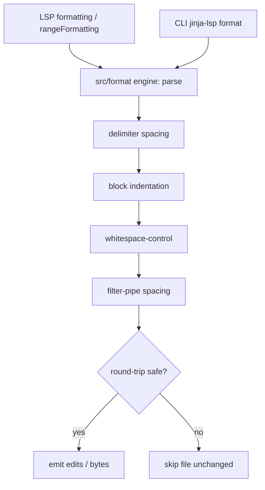

# F18 — Formatting

> **Status:** Draft
>
> **Version:** 0.1   ·   **Last updated:** 2026-06-24
>
> **Purpose:** The Jinja-only formatter — one engine behind two front-ends (the LSP `formatting`/`rangeFormatting` requests and the `jinja-lsp format` CLI) that normalizes delimiter spacing, block indentation, whitespace-control markers, and filter pipes while never touching a host-language byte.

> **Depends on:** [constitution](../constitution.md), [E16-conventions](../foundations/E16-conventions.md), [E01-architecture](../foundations/E01-architecture.md), [E07-data-model](../foundations/E07-data-model.md)   ·   **Related:** [ADR-007-formatting-strategy](../decisions/ADR-007-formatting-strategy.md), [F19-cli-linter](F19-cli-linter.md), [F17-code-actions](F17-code-actions.md)

> Requirement tag: **FMT**

---

## 1. Purpose & Scope

Formatting makes a template look consistent without changing what it renders. We tidy the Jinja layer — `{{x}}` becomes `{{ x }}`, a `` body gets indented under its tag, `x|e` becomes `x | e` — and we leave the surrounding HTML, SQL, or text exactly as the author wrote it. That host-language restraint is the whole point: we own the Jinja layer end-to-end ([ADR-007](../decisions/ADR-007-formatting-strategy.md)), and we don't compete with djLint or Prettier.

This spec covers:

- The four normalization passes: delimiter spacing, block-body indentation, whitespace-control markers, filter-pipe spacing.
- **Round-trip safety** (P3): formatting is idempotent and the output re-parses to an equivalent tree.
- **One engine, two front-ends**: LSP `textDocument/formatting` + `rangeFormatting`, and the `jinja-lsp format` CLI.
- The CLI's flags, in-place/`--check`/`--diff` modes, and exit codes.

## 2. Non-Goals / Out of Scope

- **Reflowing HTML / SQL / host text** — a suite-wide Non-Goal (constitution §4.7); we recommend djLint or Prettier for that ([ADR-007](../decisions/ADR-007-formatting-strategy.md)).
- Diagnostics and the `check` command — owned by [F01-diagnostics](F01-diagnostics.md) / [F19-cli-linter](F19-cli-linter.md).
- Code-action edits — owned by [F17-code-actions](F17-code-actions.md) (formatting is offered as its own request, not as a quick-fix).
- Config discovery mechanics — owned by [E15-app-config](../foundations/E15-app-config.md); this spec consumes the resolved config.

## 3. Background & Rationale

Templates are a sandwich: Jinja delimiters embedded in host text. A formatter that tries to own the whole sandwich either mangles the HTML or duplicates Prettier badly. So we format only the Jinja filling and pass the host bread through byte-for-byte — softening P5 just enough to own Jinja edits without straying into host territory ([ADR-007](../decisions/ADR-007-formatting-strategy.md)). The hard constraint is round-trip safety (P3): a formatter that can corrupt a template is worse than no formatter, so formatting must be idempotent and tree-preserving, and we prove it with exhaustive before/after golden tests. The two-front-end shape mirrors how `check` mirrors diagnostics ([E01](../foundations/E01-architecture.md)) — the LSP request and the CLI command are thin I/O layers over one formatter engine, so they can never disagree.

## 4. Concepts & Definitions

- **Formatter engine** — the single `src/format/` module that turns a parse tree + source into normalized source. Both front-ends call it.
- **Round-trip safe** — formatting an already-formatted file is a no-op, and the output parses to a tree equivalent to the input's. (See P3 in the [constitution](../constitution.md).)
- **Idempotent** — `format(format(x)) == format(x)`.
- **Host-language bytes** — every byte outside a Jinja delimiter; the formatter never moves, trims, or rewrites them (P5).
- **Whitespace-control marker** — the `-` in `` / `{{- … -}}`. (Canonical definition in [glossary](../glossary.md).)

## 5. Detailed Specification

The server advertises `documentFormattingProvider` and `documentRangeFormattingProvider` ([E01](../foundations/E01-architecture.md)); the CLI exposes `jinja-lsp format`. Both call `src/format/` ([E16](../foundations/E16-conventions.md)). The engine parses the source with the same grammar the rest of the pipeline uses, walks the tree, and rewrites only the spans inside Jinja delimiters — emitting a minimal set of `TextEdit`s for the LSP path, or new file bytes for the CLI path.

### 5.1 Delimiter spacing

The engine normalizes the padding just inside every Jinja delimiter to exactly one space.

**REQ-FMT-01 — Normalize delimiter inner spacing to one space.**

Every `{{ … }}`, ``, and `{# … #}` gets exactly one space after the opening delimiter and one before the closing delimiter. So `{{x}}` → `{{ x }}`, `` → ``, `{#note#}` → `{# note #}`. Interior expression spacing is left as the author wrote it except where a later pass (§5.4) normalizes it; the engine only owns the delimiter-adjacent padding here.

### 5.2 Block-body indentation

The engine re-indents the body of each Jinja block one level deeper than its opening tag — relative to that tag, never to the host markup.

**REQ-FMT-02 — Re-indent block bodies relative to the opening tag.**

For each paired tag (`…`, ``, ``, ``, ``, ``, …), lines that are Jinja-tag lines within the body are indented one unit (the configured indent — default two spaces) past the opening tag's indentation; the matching `` aligns back with the opener. Host-language lines inside the body keep their own indentation untouched (P5) — the engine re-indents Jinja tag lines, not the markup between them. Nested blocks compound one level each.

### 5.3 Whitespace-control markers

The engine normalizes spacing *around* the `-` markers without ever adding or removing a marker.

**REQ-FMT-03 — Normalize whitespace-control marker spacing; never add or drop a marker.**

A `` one space after the last token (`` → ``). The engine **never** introduces a `-` where the author didn't write one, and never removes one — doing either would change rendered whitespace and break round-trip equivalence (REQ-FMT-06). It only normalizes the spacing the marker sits in.

### 5.4 Filter-pipe spacing

The engine pads filter pipes and argument separators consistently.

**REQ-FMT-04 — Normalize filter-pipe and `is`-test spacing.**

A filter pipe gets one space on each side: `x|e` → `x | e`, `name|upper|trim` → `name | upper | trim`. A test keyword gets one space on each side: `post is  defined` → `post is defined`. Filter-call argument commas get one space after, none before: `truncate( 20,true )` → `truncate(20, true)`. This pass owns interior expression spacing for pipes, tests, and call args; it leaves other operators alone (we're a formatter, not an expression beautifier).

### 5.5 Host-language untouchability

Whatever sits outside a Jinja delimiter is reproduced byte-for-byte.

**REQ-FMT-05 — Never alter host-language bytes.**

Every byte outside a `{{ }}` / `` / `{# #}` span — HTML tags, SQL, plain text, attribute values, blank lines between markup — is emitted unchanged. The formatter neither reflows, re-wraps, nor re-indents host content (its only interaction with host indentation is reading the opening tag's column to compute Jinja body indentation, §5.2). This is P5 made literal and is the line that separates us from djLint/Prettier ([ADR-007](../decisions/ADR-007-formatting-strategy.md)).

### 5.6 Round-trip safety

The two guarantees that make this formatter safe to run on save.

**REQ-FMT-06 — Idempotent and tree-preserving.**

Two invariants hold for every input:

- **Idempotence** — `format(format(x)) == format(x)`. A formatted file formats to itself.
- **Tree equivalence** — the parse tree of `format(x)` is equivalent to the parse tree of `x` (same nodes, same structure, ignoring the normalized whitespace). Formatting never changes what a template renders.

If, for any input, the engine cannot produce output that satisfies both invariants (e.g. a tree with `ERROR` nodes from invalid syntax), it makes **no change** to that file and reports it as skipped — degrade, don't corrupt (P3, [E16](../foundations/E16-conventions.md)). These invariants are enforced by the golden-test suite (§11).

### 5.7 LSP front-end

The server formats a whole document or a selected range.

**REQ-FMT-07 — `formatting` and `rangeFormatting` over the same engine.**

`textDocument/formatting` runs the engine over the whole document and returns a minimal `TextEdit[]`. `textDocument/rangeFormatting` runs it over the requested range only, snapped outward to whole Jinja constructs so it never produces a partial-tag edit (P3). Both honor the client's `FormattingOptions` (`tabSize`, `insertSpaces`) for the indent unit, falling back to the configured default.

### 5.8 CLI front-end

The `format` command formats files in place, or reports/diffs without writing.

**REQ-FMT-08 — `jinja-lsp format` with optional path, check, and diff modes.**

The command is:

```
jinja-lsp format [PATH] [-c|--config FILE] [--check] [--diff]
```

- `PATH` is an optional positional (a file or directory). When omitted, the command formats every template under the configured/discovered templates directories ([E15](../foundations/E15-app-config.md)) — the same discovery `check` uses.
- `-c|--config FILE` points at an explicit config file instead of discovering one.
- **Default action: in place.** Each changed file is rewritten with its formatted bytes.
- `--check` writes nothing; it reports which files *would* change and exits non-zero — the CI gate.
- `--diff` writes nothing; it prints a unified diff per file to stdout.
- `--check` and `--diff` are read-only and may be combined (diff to stdout, non-zero exit); combining either with the default in-place behavior is what their presence overrides.

**REQ-FMT-09 — Exit codes mirror `check`.**

`0` = nothing to do (every file already formatted); `1` = files changed (in place) or would change (under `--check`/`--diff`); `2` = config or I/O error ([F19](F19-cli-linter.md) uses the same scheme). A parse error on a single file skips that file (REQ-FMT-06) and does not by itself force exit `2` — only config/IO failure does.

## 6. UI Mockups

### 6.1 Before / after — delimiter + indentation normalization

The headline transformation: tight delimiters opened up, the `if` body indented under its tag, the host `<a>`/`<li>` markup left exactly as written.

```
  BEFORE  (templates/blog/post.html)              AFTER
  ────────────────────────────────────────        ────────────────────────────────────────
                                       
  <ul>                                             <ul>
                              
  <li><a href="{{post_url(post)}}">{{post.title|e}}</a></li>
                                                   <li><a href="{{ post_url(post) }}">{{ post.title | e }}</a></li>
                                         
  </ul>                                            </ul>
                                          
```

Note the `<ul>`, `<li>`, and `<a>` lines: host bytes are untouched (P5). Only the Jinja tag lines move and the delimiters/pipes gain their single spaces.

### 6.2 Whitespace-control normalization

The `-` markers are preserved exactly; only the spacing around them is normalized.

```
  before                  after
  ──────────────────      ──────────────────
                
  {{- name|trim -}}       {{- name | trim -}}
```

### 6.3 CLI `--diff` output

`jinja-lsp format --diff blog/post.html` prints a unified diff and exits `1` without writing.

```
$ jinja-lsp format --diff templates/blog/post.html
--- templates/blog/post.html
+++ templates/blog/post.html (formatted)
@@ -1,3 +1,3 @@
-
+
 <ul>
-
+

1 file would be reformatted.            (exit code 1)
```

### 6.4 CLI `--check` output

`jinja-lsp format --check` over the workspace lists candidates and exits non-zero for CI.

```
$ jinja-lsp format --check
would reformat: templates/blog/post.html
would reformat: templates/email/digest.html
2 files would be reformatted, 2 unchanged.     (exit code 1)
```

## 7. Visualizations

One engine, two front-ends, four passes — and the round-trip gate before any write.



## 9. Examples & Use Cases

In `starlette-blog`, a contributor pastes a hastily-written loop into `templates/blog/post.html`: `<li>{{post.title|e}}</li>`, all delimiters tight and unindented. On save, the editor calls `textDocument/formatting`; the engine returns edits that open the delimiters (``), indent the loop body's Jinja tag lines, and space the filter pipe (`{{ post.title | e }}`) — while the `<li>` markup is reproduced byte-for-byte (REQ-FMT-05). The project's CI runs `jinja-lsp format --check`, which finds `email/digest.html` still has `{{request.url}}` and exits `1`, failing the build until someone runs `jinja-lsp format` to fix it in place. Because formatting is idempotent (REQ-FMT-06), running it twice changes nothing the second time.

## 10. Edge Cases & Failure Modes

- **Already-formatted file** → zero edits (LSP) / "unchanged" (CLI), exit `0` — idempotence (REQ-FMT-06).
- **File with a syntax error** (`ERROR` node) → skipped, left byte-for-byte, reported as skipped; does not force exit `2` (P3).
- **Range formatting whose range bisects a tag** → snapped outward to the whole tag so no partial-tag edit is produced (REQ-FMT-07).
- **Author-written ``** → markers kept; spacing normalized; never added or removed (REQ-FMT-03).
- **A blank line of host text inside a block** → preserved exactly; the engine doesn't collapse host whitespace (REQ-FMT-05).
- **Inline template region** ([E31](../foundations/E31-inline-templates.md)) → formatted within its host-file range, edits mapped back to host coordinates; surrounding host code untouched.
- **`--check` and `--diff` together** → diff printed, nothing written, non-zero exit if any file would change.

## 11. Testing

Formatting is tested almost entirely by **before/after golden fixtures** that double as the round-trip and idempotence proof; the two front-ends are tested for parity against the same goldens.

### 11.1 Scope & coverage

Target: **100% of this feature's behavior.** Every `REQ-FMT-NN` maps to a test; every transformation (§6) and edge case (§10) has a golden. The round-trip invariants (REQ-FMT-06) are stressed hardest — they are the safety contract. See [E17-testing](../foundations/E17-testing.md#2-coverage-policy).

### 11.2 Test plan

Golden fixtures live as `<name>.in` / `<name>.out` pairs under the formatter fixture set; each test asserts `format(.in) == .out`, **and** `format(.out) == .out` (idempotence), **and** that the parse trees of `.in` and `.out` are equivalent (tree preservation). Constructs absent from a registered fixture (e.g. a list-form ``, an `` alias, a `` body) are exercised with synthetic inline source strings / `didOpen` documents per [E17 §5](../foundations/E17-testing.md#starlette-blog).

Each row is one concrete `input → expected output` rule. Type is `unit-snapshot` (a single `insta` golden over the engine), `integration` (the real CLI binary against a fixture), or `e2e` (the protocol/binary journey in §12.2).

**Delimiter spacing (§5.1, REQ-FMT-01)**

| # | Input → expected output | Type | Fixtures | Verifies |
|---|---|---|---|---|
| T-01 | `{{x}}` → `{{ x }}` (expression) | unit-snapshot | format-goldens / starlette-blog `post.html` `{{post.title}}` | REQ-FMT-01 |
| T-02 | `` → `` (statement) | unit-snapshot | format-goldens | REQ-FMT-01 |
| T-03 | `{#note#}` → `{# note #}` (comment) | unit-snapshot | format-goldens | REQ-FMT-01 |
| T-04 | `{{  x  }}` (multi-space padding) → `{{ x }}` (collapse to one) | unit-snapshot | format-goldens | REQ-FMT-01 |
| T-05 | Interior expression spacing left alone where §5.4 doesn't own it: `{{ a+b }}` → `{{ a+b }}` (only delimiter padding touched) | unit-snapshot | format-goldens | REQ-FMT-01 |

**Block-body indentation (§5.2, REQ-FMT-02)**

| # | Input → expected output | Type | Fixtures | Verifies |
|---|---|---|---|---|
| T-06 | Flush ``/`` body re-indented one unit; `` re-aligns with opener | unit-snapshot | format-goldens (matches §6.1) | REQ-FMT-02 |
| T-07 | Nested blocks compound one level each (`` > `` > body) | unit-snapshot | starlette-blog `post.html` loop | REQ-FMT-02 |
| T-08 | Indent unit honors config: default 2 spaces; `tabSize=4` yields 4-space body indent | unit-snapshot | format-goldens (two snapshots) | REQ-FMT-02, REQ-FMT-07 |
| T-09 | Host-language lines between Jinja tags keep their own indentation; only Jinja tag lines move (P5) | unit-snapshot | format-goldens (matches §6.1 `<ul>`/`<li>`) | REQ-FMT-02, REQ-FMT-05 |
| T-10 | Opener offset from host column: body indents relative to the tag's column, never the host markup | unit-snapshot | format-goldens | REQ-FMT-02 |

**Whitespace-control markers (§5.3, REQ-FMT-03, §6.2, §10)**

| # | Input → expected output | Type | Fixtures | Verifies |
|---|---|---|---|---|
| T-11 | `` → `` (statement marker spacing; matches §6.2) | unit-snapshot | format-goldens | REQ-FMT-03 |
| T-12 | `{{- name|trim -}}` → `{{- name | trim -}}` (expression marker + pipe; matches §6.2) | unit-snapshot | format-goldens | REQ-FMT-03, REQ-FMT-04 |
| T-13 | One-sided marker `` preserved one-sided; spacing normalized, no marker added | unit-snapshot | format-goldens | REQ-FMT-03 |
| T-14 | Negative: author-written markers never added or dropped — `` stays markerless (no `-` invented) | unit-snapshot | format-goldens | REQ-FMT-03, REQ-FMT-06 |

**Filter-pipe / test / call-arg spacing (§5.4, REQ-FMT-04)**

| # | Input → expected output | Type | Fixtures | Verifies |
|---|---|---|---|---|
| T-15 | `x|e` → `x | e` (single pipe) | unit-snapshot | starlette-blog `post.html` `{{ post.title \| e }}` | REQ-FMT-04 |
| T-16 | `name|upper|trim` → `name | upper | trim` (chained pipes) | unit-snapshot | format-goldens | REQ-FMT-04 |
| T-17 | `post is  defined` → `post is defined` (`is`-test spacing) | unit-snapshot | format-goldens | REQ-FMT-04 |
| T-18 | `truncate( 20,true )` → `truncate(20, true)` (call-arg commas: space after, none before) | unit-snapshot | starlette-blog `post.html` `truncate(60)` | REQ-FMT-04 |
| T-19 | Negative: non-pipe/test operators left alone — `{{ a==b }}` unchanged (formatter, not beautifier) | unit-snapshot | format-goldens | REQ-FMT-04 |

**Host-language untouchability (§5.5, REQ-FMT-05, §10)**

| # | Input → expected output | Type | Fixtures | Verifies |
|---|---|---|---|---|
| T-20 | HTML/SQL/text bytes around delimiters emitted byte-for-byte | unit-snapshot | format-goldens (HTML + SQL pair) | REQ-FMT-05 |
| T-21 | Attribute values inside host tags never trimmed/rewritten (`<a href="  x  ">` preserved) | unit-snapshot | format-goldens | REQ-FMT-05 |
| T-22 | Blank line of host text inside a block preserved exactly; host whitespace not collapsed (§10) | unit-snapshot | format-goldens | REQ-FMT-05 |
| T-23 | Inline template region (E31): only the Jinja span formatted, edits mapped back to host coords, surrounding host code untouched (§10) | integration | call-and-paths (inline) | REQ-FMT-05, REQ-FMT-07 |

**Round-trip safety (§5.6, REQ-FMT-06, §10)**

| # | Input → expected output | Type | Fixtures | Verifies |
|---|---|---|---|---|
| T-24 | Idempotence property: `format(.out) == .out` for every golden `.out` | unit-snapshot (property) | format-goldens (all pairs) | REQ-FMT-06 |
| T-25 | Tree equivalence: parse trees of `.in` and `.out` equal modulo normalized whitespace, for every pair | unit-snapshot (property) | format-goldens (all pairs) | REQ-FMT-06 |
| T-26 | Already-formatted input → zero edits (LSP) / "unchanged" (CLI), exit 0 (§10 idempotence) | integration | format-goldens (`.out` as input) | REQ-FMT-06 |
| T-27 | Syntax-error file (`ERROR` node) → no change, byte-for-byte identical, reported skipped, does not force exit 2 (§10) | integration | syntax-errors | REQ-FMT-06, REQ-FMT-09 |

**LSP front-end (§5.7, REQ-FMT-07, §10)**

| # | Input → expected output | Type | Fixtures | Verifies |
|---|---|---|---|---|
| T-28 | `textDocument/formatting` over whole doc returns minimal `TextEdit[]` matching the golden | e2e | format-goldens / starlette-blog `post.html` | REQ-FMT-07 |
| T-29 | `textDocument/rangeFormatting` over one `` reformats only that construct | e2e | starlette-blog `post.html` | REQ-FMT-07 |
| T-30 | Range bisecting a tag snapped outward to the whole tag — no partial-tag edit produced (§10) | unit-snapshot | format-goldens | REQ-FMT-07 |
| T-31 | `FormattingOptions` honored: `insertSpaces`/`tabSize` set indent unit; falls back to configured default when absent | unit-snapshot | format-goldens | REQ-FMT-07 |

**CLI front-end (§5.8, REQ-FMT-08, §6.3, §6.4, §10)**

| # | Input → expected output | Type | Fixtures | Verifies |
|---|---|---|---|---|
| T-32 | Default in-place: changed file rewritten with formatted bytes | integration | format-goldens | REQ-FMT-08 |
| T-33 | `PATH` omitted → formats every template under discovered templates dirs (same discovery as `check`) | integration | starlette-blog | REQ-FMT-08 |
| T-34 | `PATH` is a file vs a directory — formats just that file / recurses the dir | integration | format-goldens | REQ-FMT-08 |
| T-35 | `-c/--config FILE` uses the explicit config instead of discovery | integration | format-goldens + config | REQ-FMT-08 |
| T-36 | `--check` writes nothing; lists files that would change (matches §6.4 output) | integration | starlette-blog `post.html`, `email/digest.html` | REQ-FMT-08 |
| T-37 | `--diff` writes nothing; prints unified diff per file to stdout (matches §6.3 output) | integration | starlette-blog `post.html` | REQ-FMT-08 |
| T-38 | `--check --diff` together → diff printed, nothing written, non-zero exit if any file would change (§10) | integration | starlette-blog `post.html` | REQ-FMT-08, REQ-FMT-09 |

**CLI exit codes (§5.8, REQ-FMT-09)**

| # | Input → expected output | Type | Fixtures | Verifies |
|---|---|---|---|---|
| T-39 | Exit 0 — every file already formatted (nothing to do), in-place and under `--check` | integration | format-goldens (`.out` corpus) | REQ-FMT-09 |
| T-40 | Exit 1 — files changed in place / would change under `--check`/`--diff` | integration | starlette-blog | REQ-FMT-09 |
| T-41 | Exit 2 — config or I/O error (unreadable config / path escape) | integration | config (invalid) | REQ-FMT-09 |
| T-42 | A per-file parse-error skip alone does NOT force exit 2 (exit reflects only changed/unchanged) | integration | syntax-errors + format-goldens mix | REQ-FMT-09, REQ-FMT-06 |

### 11.3 Fixtures

- **format-goldens** — the `<name>.in`/`<name>.out` corpus exercising every pass and the host-untouchability cases, with at least one pair per `REQ-FMT-0[1-5]`. Reused by the LSP-parity and CLI tests above. Registered in [E17-testing](../foundations/E17-testing.md#5-fixtures-registry).
- Reuses [syntax-errors](../foundations/E17-testing.md#5-fixtures-registry) for the skip-on-error case.

### 11.4 Requirement coverage

| Requirement | Covered by |
|---|---|
| REQ-FMT-01 | T-01–T-05 (delimiter spacing) |
| REQ-FMT-02 | T-06–T-10 (block-body indentation) |
| REQ-FMT-03 | T-11–T-14 (whitespace-control markers) |
| REQ-FMT-04 | T-12, T-15–T-19 (filter-pipe / test / call-arg spacing) |
| REQ-FMT-05 | T-09, T-20–T-23 (host untouchability) |
| REQ-FMT-06 | T-14, T-24–T-27, T-42 (idempotence + tree-equivalence + skip-on-error); E2E-03, E2E-05 |
| REQ-FMT-07 | T-08, T-23, T-28–T-31 (LSP formatting/rangeFormatting + range snap + options); E2E-01, E2E-02 |
| REQ-FMT-08 | T-32–T-38 (CLI in-place / PATH / config / --check / --diff / combined); E2E-03, E2E-04 |
| REQ-FMT-09 | T-27, T-38, T-39–T-42 (exit codes 0/1/2 + skip-doesn't-force-2); E2E-03, E2E-04, E2E-05 |

## 12. End-to-End Test Plan

### 12.1 Coverage target

**100% of the feature's scope, end to end** through both branches ([E29](../foundations/E29-e2e-testing.md#2-coverage-policy)): the LSP `formatting`/`rangeFormatting` journey via `pytest-lsp` asserting the returned edits, and the CLI `format` journey driving the real binary against the `format-goldens` corpus.

### 12.2 Scenarios

Both front-ends (LSP via `pytest-lsp`, CLI driving the real binary) are exercised, happy and negative, with the host-byte safety (P5) and round-trip (REQ-FMT-06) guarantees asserted end to end.

| # | Journey | Path | Expected outcome | Verifies |
|---|---|---|---|---|
| E2E-01 | LSP `textDocument/formatting` on an unformatted `post.html` | happy | returned edits transform it to the golden `.out`; host `<ul>`/`<li>`/`<a>` bytes byte-for-byte unchanged (P5) | REQ-FMT-01, -02, -04, -05, -07 |
| E2E-02 | LSP `textDocument/rangeFormatting` over a range bisecting a single `` | happy | only that construct reformatted; range snapped outward to whole tags, no partial-tag edit | REQ-FMT-07 |
| E2E-03 | CLI `jinja-lsp format` (in place) over the corpus, run twice | happy | first run writes formatted bytes (exit 1); second run a no-op (exit 0) — idempotence | REQ-FMT-06, -08, -09 |
| E2E-04 | CLI `jinja-lsp format --check` over a corpus with one unformatted file | error | lists the file (§6.4), writes nothing, exits 1 | REQ-FMT-08, -09 |
| E2E-05 | CLI `jinja-lsp format` over a file with a syntax error | error | file left byte-for-byte unchanged, reported skipped, no exit-2 from the skip alone | REQ-FMT-06, -09 |
| E2E-06 | CLI `jinja-lsp format --diff` over an unformatted `post.html` | happy | prints the unified diff to stdout (§6.3), writes nothing, exits 1 | REQ-FMT-08, -09 |
| E2E-07 | CLI `jinja-lsp format --check --diff` over a mixed corpus | error | diff printed AND nothing written; exits 1 because a file would change (§10) | REQ-FMT-08, -09 |
| E2E-08 | CLI `jinja-lsp format --check` over an already-formatted corpus | happy | nothing listed, nothing written, exits 0 | REQ-FMT-06, -09 |
| E2E-09 | CLI `jinja-lsp format` with an unreadable/invalid config | error | reports config/IO error, writes nothing, exits 2 | REQ-FMT-09 |
| E2E-10 | LSP `textDocument/formatting` on an inline template region (E31) | happy | only the Jinja span reformatted; edits mapped to host coords; surrounding host code untouched (P5) | REQ-FMT-05, -07 |

## 13. Non-Functional Requirements

### 13.1 Security & Privacy

- **Access & authorization** — the CLI formats only files under the resolved templates roots (or the given `PATH`); it never follows `../` escapes out of a root ([E30](../foundations/E30-extraction-and-indexing.md)).
- **Input & validation** — all template content is untrusted; the engine reads and rewrites the syntax tree only and never executes a template (P1). Invalid syntax is skipped, never coerced.
- **Data sensitivity** — formatting reads and writes only the user's own files; nothing leaves the machine (stdio LSP / local CLI, P2).
- **Integrity** — the round-trip invariants (REQ-FMT-06) are themselves a safety control: an edit that could change rendered output is never emitted.

### 13.2 Accessibility

- **N/A** — the editor renders any formatting UI; the CLI is plain text (constitution §4.6).

### 13.4 Performance & Scale

- **Latency** — `textDocument/formatting` reparses and rewrites one document and returns inside the interactive budget; `rangeFormatting` does even less (P6).
- **Volume & scale** — `jinja-lsp format` over the workspace formats files independently and streams results; it scales with the same discovery budget as the index (< 2 s / 500 templates, [E30](../foundations/E30-extraction-and-indexing.md)).

### 13.5 Observability

- **Logs / traces** — `tracing` spans wrap whole-workspace `format` runs and any skipped-on-error file, so a surprising skip is diagnosable ([E16](../foundations/E16-conventions.md)).

## 15. Open Questions & Decisions

- **Decided** — Jinja-only, host bytes untouched ([ADR-007](../decisions/ADR-007-formatting-strategy.md)); round-trip safety mandatory (P3); one engine behind LSP + CLI; CLI default is in-place with `--check`/`--diff` read-only modes and `check`-parity exit codes.
- **OQ-FMT-1** — should the indent unit default to the client's `FormattingOptions` always, or to a `format.indent` config key when the CLI runs headless? Currently: client options for LSP, configured default (two spaces) for CLI.
- **OQ-FMT-2** — should multi-line expressions inside `{{ … }}` be re-wrapped, or left to the author? Currently left alone (we normalize spacing, not line breaks, to keep tree equivalence trivial).

## 16. Cross-References

- **Depends on:** [constitution](../constitution.md) — P3 round-trip safety and P5 host restraint; [E16-conventions](../foundations/E16-conventions.md) — partial-parse recovery and the never-corrupt rule; [E01-architecture](../foundations/E01-architecture.md) — the formatting capabilities and the one-engine/two-front-end shape; [E07-data-model](../foundations/E07-data-model.md) — the tag structure indentation walks.
- **Related:** [ADR-007-formatting-strategy](../decisions/ADR-007-formatting-strategy.md) — the Jinja-only decision; [F19-cli-linter](F19-cli-linter.md) — the sibling CLI with the same exit-code scheme and discovery; [F17-code-actions](F17-code-actions.md) — shares the indentation model for its wrap refactors.

## 17. Changelog

- **2026-06-24** — Initial draft.
- **2026-06-25** — Expanded §11.2 test plan to concrete per-rule `input → expected output` rows (T-01–T-42) covering every formatting rule, idempotence + tree equivalence, syntax-error skip, range vs whole-document, FormattingOptions/indent-unit, CLI vs LSP paths, all CLI modes (`--check`/`--diff`/combined), exit codes 0/1/2, and host-byte safety; rebuilt §11.4 traceability and expanded §12.2 to E2E-01–E2E-10 (both front-ends, happy + negative, with explicit Path and Verifies).
