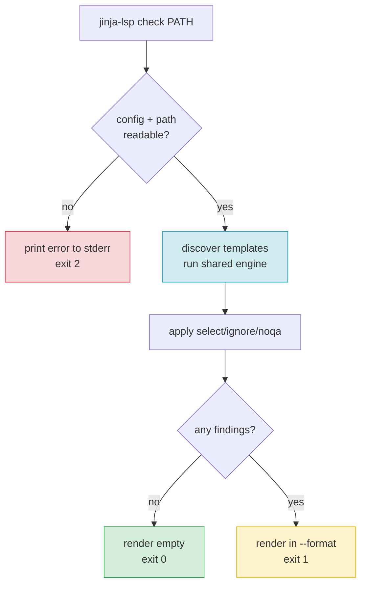

# F19 — CLI Linter

> **Status:** Draft
>
> **Version:** 0.1   ·   **Last updated:** 2026-06-24
>
> **Purpose:** The `jinja-lsp check` command — a one-shot linter that runs the same diagnostic engine as the LSP server and prints findings in one of three formats (rich, compact, json), so the same checks you see in your editor also gate CI.
>
> **Depends on:** [constitution](../constitution.md), [F01-diagnostics](F01-diagnostics.md), [E15-app-config](../foundations/E15-app-config.md), [E30-extraction-and-indexing](../foundations/E30-extraction-and-indexing.md)   ·   **Related:** [E01-architecture](../foundations/E01-architecture.md), [E17-testing](../foundations/E17-testing.md), [E29-e2e-testing](../foundations/E29-e2e-testing.md), [F18-formatting](F18-formatting.md), [F21-release-ci](F21-release-ci.md)

> Requirement tag: **LINT**

---

## 1. Purpose & Scope

`jinja-lsp check` is the editor-free face of the diagnostics engine — point it at a file or a directory and it prints every finding, then exits with a status code your CI can read.

It is not a second linter. It is the *same* linter the LSP server runs, wired to a terminal instead of an editor. Whatever squiggle you see while typing, `check` prints in your shell — same codes, same ranges, same messages (P5's "one engine, three front-ends").

This spec covers:

- The command, its positional `PATH`, and every flag.
- The three output formats — `rich`, `compact`, `json` — each with a worked example.
- The exit-code contract (0 / 1 / 2).
- How `--select` / `--ignore` filter findings, and how they relate to config.
- Parity with the LSP server: one engine, identical output.

## 2. Non-Goals / Out of Scope

- The diagnostic catalog itself — which checks exist and when they fire — owned by [F01-diagnostics](F01-diagnostics.md).
- Config discovery and the `lint.select` / `lint.ignore` config keys — owned by [E15-app-config](../foundations/E15-app-config.md).
- The shared extraction and indexing pipeline — owned by [E30-extraction-and-indexing](../foundations/E30-extraction-and-indexing.md).
- The `jinja-lsp format` command — owned by [F18-formatting](F18-formatting.md).
- Golden-file E2E testing of the json format — owned by [E29-e2e-testing](../foundations/E29-e2e-testing.md) (Branch A).

## 3. Background & Rationale

`jinja-lsp check` offers three output formats from the start, because no single format serves every reader. A rustc-style multi-line report is pleasant for a human at a terminal but impossible to gate CI against — you can't diff it byte-for-byte without scraping ANSI escapes out of a terminal stream, and its multi-line, color-laden shape is fragile under any cosmetic change.

So the default `rich` format is a rustc-style multi-line report; `compact` and `json` are its two siblings. `compact` is a single line per finding that editor problem-matchers and `grep` understand. `json` is structured output whose shape is *identical* to the `expected-diagnostics.json` golden files — which is exactly how the diagnostics engine gets its regression gate (see [E29](../foundations/E29-e2e-testing.md), Branch A).

That's the whole reason `--format` exists: it lets a test diff the linter's output byte-for-byte.

## 4. Concepts & Definitions

- **Diagnostic code** — the `JINJA-<SEV><CLASS><NN>` identifier (e.g. `JINJA-E101`). (Canonical definition in [glossary](../glossary.md).)
- **Slug** — the kebab-case label paired with a code (e.g. `undefined-variable`); an output label, never an input identifier. (Canonical definition in [glossary](../glossary.md).)
- **Class prefix** — a partial code matching a whole class (`JINJA-E1` = all 1xx; `JINJA-W` = all warnings).
- **Format** — one of `rich`, `compact`, `json`; selected with `--format`, default `rich`.

## 5. Detailed Specification

### 5.1 The command

`jinja-lsp check` runs the diagnostics engine over a path and reports the findings.

```
jinja-lsp check [PATH]
                [-c | --config FILE]
                [-v | --verbose]
                [--select CODE...]
                [--ignore CODE...]
                [--format FMT]
```

**REQ-LINT-01 — `PATH` is an optional positional.**

`PATH` may be a single template file or a directory. When it names a directory, `check` scans it for files matching the configured `extensions` ([E15](../foundations/E15-app-config.md)). When `PATH` is omitted, `check` lints the configured `templates` directories (or the zero-config discovered set). A `PATH` outside the workspace is linted in isolation — config still applies, but cross-file checks resolve only against what's reachable from it.

**REQ-LINT-02 — Flags, with `--format` added.**

| Flag | Meaning |
|---|---|
| `-c`, `--config FILE` | Use this config file instead of discovering one ([E15](../foundations/E15-app-config.md)). |
| `-v`, `--verbose` | Emit progress and timing to stderr (`tracing` at INFO); findings still go to stdout. |
| `--select CODE...` | Run only these codes/class-prefixes (overrides config `lint.select` for this run). |
| `--ignore CODE...` | Subtract these codes/class-prefixes from the active set (overrides config `lint.ignore`). |
| `--format FMT` | Output format: `rich` (default), `compact`, or `json`. Selects the output format. |

**REQ-LINT-03 — `--select` / `--ignore` accept a code or class prefix only.**

Both flags take a full code (`JINJA-E101`) or a class prefix (`JINJA-E1` = all 1xx, `JINJA-W` = all warnings) — never a slug (constitution §4.2, [ADR-003](../decisions/ADR-003-diagnostic-code-scheme.md)). This is the same input grammar as the config keys and `noqa`. CLI flags take precedence over the matching config key for that invocation. When the two overlap, `ignore` wins for the overlapping code, mirroring [F01](F01-diagnostics.md) §5.3.

### 5.2 Output formats

`--format` chooses how each finding is rendered; the findings themselves are identical across formats. All three are mocked side by side in §6 over the same two diagnostics so you can compare them directly.

**REQ-LINT-04 — `rich` is the default, rustc-style report.**

A multi-line block per finding: a header line (`code slug: message`), a `-->` location line, a source excerpt with a caret underline marking the primary range, and an optional `= help:` line carrying the suggestion. This is the default human-facing report. It is meant for a human at a terminal and may use color when stdout is a TTY (disabled under `NO_COLOR` or when piped).

**REQ-LINT-05 — `compact` is one line per finding.**

The format is `path:line:col: JINJA-CODE slug: message`. One finding per line, no blank lines, no color. This is the editor-problem-matcher and `grep`-friendly mode.

**REQ-LINT-06 — `json` is a structured array matching the golden-file shape.**

The output is a JSON array of objects, one per finding, with exactly these keys:

```
file, line, col, code, slug, severity, message
```

**REQ-LINT-07 — `json` shape equals `expected-diagnostics.json`.**

The object shape is byte-for-byte the shape of the `expected-diagnostics.json` golden files in [E17](../foundations/E17-testing.md). This is not a coincidence to be maintained by hand — it is the contract that lets [E29](../foundations/E29-e2e-testing.md) Branch A diff `check --format json` against the golden file directly. `file` is workspace-relative (forward slashes), `line` and `col` are 1-based, `severity` is one of `error | warning | info | hint`. Findings are ordered by `file`, then `line`, then `col`.

### 5.3 Exit codes

The exit code is the part CI reads, so it is a strict three-way contract.

**REQ-LINT-08 — Exit codes 0 / 1 / 2.**

| Code | Meaning |
|---|---|
| `0` | Clean — no diagnostics reported after filtering. |
| `1` | One or more diagnostics were reported. |
| `2` | Config or I/O error — bad `--config`, unreadable path, malformed config, unknown `extra`. |

A `2` is about the *run*, not the templates: if `check` can't even start (no readable path, broken config), it fails with `2` and prints the error to stderr in all formats. A clean run with warnings-only still exits `1` — any finding means non-zero. The `json` and `compact` formats print findings to stdout; diagnostics never leak to stderr (so `2>/dev/null` keeps the report intact).

### 5.4 Parity with the LSP server

`check` and the LSP server are the same engine with different I/O.

**REQ-LINT-09 — `check` shares the engine with the LSP server.**

Both call the same extraction → indexing → diagnostics pipeline ([E30](../foundations/E30-extraction-and-indexing.md), [F01](F01-diagnostics.md)). `check` is the I/O layer that walks a path and prints; the server is the I/O layer that answers `publishDiagnostics`. There is no `check`-only check and no server-only check. A diagnostic the server publishes for a file must equal — same code, slug, range, message — the diagnostic `check` prints for that file. This parity is asserted as a test ([F01](F01-diagnostics.md) §11). `noqa` suppression ([F01](F01-diagnostics.md) §5.4) applies identically in both.

## 6. UI Mockups

> The three subsections below render **the same two diagnostics** in `starlette-blog`'s `templates/blog/post.html`: a `JINJA-E101 undefined-variable` (a bare `post` used with no hint) and a `JINJA-W203 unused-import` (an imported `macros` alias never referenced). Compare them line for line.

### 6.1 `--format rich` (default)

The rustc-style report a developer reads at a terminal. Each finding is a multi-line block with a caret underline and an optional help line.

```
$ jinja-lsp check templates/blog/post.html

JINJA-E101 undefined-variable: 'post' is not defined
 --> blog/post.html:4:6
  |
4 | {{ post.title }}
  |    ^^^^
  = help: did you mean `posts`? (in scope)

JINJA-W203 unused-import: 'macros' imported but never used
 --> blog/post.html:1:1
  |
1 | 
  | ^^^^^^^^^^^^^^^^^^^^^^^^^^^^^^^^^^^^^^^^^^

2 problems (1 error, 1 warning)
```

States: clean run prints `No problems found.` and exits `0` · a `2` prints the error to stderr (e.g. `error: config file not found: ./nope.toml`).

### 6.2 `--format compact`

One line per finding — `path:line:col: code slug: message`. Built for editor problem-matchers and `grep`.

```
$ jinja-lsp check templates/blog/post.html --format compact
blog/post.html:4:6: JINJA-E101 undefined-variable: 'post' is not defined
blog/post.html:1:1: JINJA-W203 unused-import: 'macros' imported but never used
```

States: clean run prints nothing to stdout and exits `0`.

### 6.3 `--format json`

A structured array — identical shape to `expected-diagnostics.json` ([E17](../foundations/E17-testing.md)). Built for CI diffs and tooling.

```
$ jinja-lsp check templates/blog/post.html --format json
[
  {"file":"blog/post.html","line":4,"col":6,"code":"JINJA-E101",
   "slug":"undefined-variable","severity":"error","message":"'post' is not defined"},
  {"file":"blog/post.html","line":1,"col":1,"code":"JINJA-W203",
   "slug":"unused-import","severity":"warning","message":"'macros' imported but never used"}
]
```

States: clean run prints `[]` and exits `0`.

## 7. Visualizations

The decision flow from invocation to exit code.



## 8. Data Shapes

A single finding object in `--format json`. This is the contract; it equals the `expected-diagnostics.json` element shape verbatim.

```json
{
  "file": "blog/post.html",
  "line": 4,
  "col": 6,
  "code": "JINJA-E101",
  "slug": "undefined-variable",
  "severity": "error",
  "message": "'post' is not defined"
}
```

## 9. Examples & Use Cases

You're working on `starlette-blog` and want a pre-commit gate. You run `jinja-lsp check` with no path, so it lints the configured `templates` dir. It finds the undefined `post` and the unused `macros` import, prints them in `rich`, and exits `1` — your hook blocks the commit.

In CI you'd rather diff structured output, so the workflow runs `jinja-lsp check --format json templates/ > out.json` and compares against a committed baseline. To silence a known-and-accepted warning class for the whole run, you add `--ignore JINJA-W2` and the unused-import finding drops out, leaving only the error and exit `1`.

## 10. Edge Cases & Failure Modes

- **`PATH` doesn't exist** → exit `2`, error to stderr; stdout stays empty (so `--format json` consumers see no array).
- **`--config` points at a missing or malformed file** → exit `2`; the previous-config fallback is an LSP-only behavior ([E15](../foundations/E15-app-config.md)), not a CLI one.
- **Directory with zero matching files** → clean run, exit `0` (`No problems found.` / `[]`).
- **`--select` and `--ignore` overlap** → `ignore` wins for the overlapping code (mirrors [F01](F01-diagnostics.md) §5.3).
- **Warnings only, no errors** → still exit `1` (any finding is non-zero).
- **A slug passed to `--select`/`--ignore`** (e.g. `--ignore undefined-variable`) → rejected as an invalid filter, exit `2` (slugs are output labels, not input — [ADR-003](../decisions/ADR-003-diagnostic-code-scheme.md)).
- **Output piped (not a TTY)** → `rich` drops color automatically; `compact`/`json` are already color-free.

## 11. Testing

`check` is tested through the golden-file branch — `--format json` over each broken fixture is diffed against its `expected-diagnostics.json` — plus unit tests for flag parsing, format rendering, and exit codes.

### 11.1 Scope & coverage

Target: **100% of this feature's behavior is covered.** Every `REQ-LINT-NN` maps to at least one test; every format (§6) and edge case (§10) has a test. See the policy in [E17-testing](../foundations/E17-testing.md#2-coverage-policy).

### 11.2 Test plan

| Behavior / scenario | Type | Fixtures | Verifies |
|---|---|---|---|
| `PATH` as file vs directory vs omitted | integration | starlette-blog | REQ-LINT-01 |
| Each flag parses and applies | unit | — | REQ-LINT-02 |
| `--select`/`--ignore` by code and class prefix; overlap resolution | unit | starlette-blog | REQ-LINT-03 |
| `rich` renders header + caret + help line | unit (snapshot, `insta`) | undefined-vars | REQ-LINT-04 |
| `compact` is one line per finding, no color | unit (snapshot) | undefined-vars, unused-symbols | REQ-LINT-05 |
| `json` array has the exact 7 keys, ordered | golden (check) | all diagnostic fixtures | REQ-LINT-06 |
| `json` output equals `expected-diagnostics.json` byte-for-byte | golden (check) | all diagnostic fixtures | REQ-LINT-07 |
| Exit 0 / 1 / 2 across clean / findings / bad config | integration | starlette-blog, syntax-errors | REQ-LINT-08 |
| `check` output equals server `publishDiagnostics` | integration | starlette-blog | REQ-LINT-09 |

### 11.3 Fixtures

- All diagnostic fixtures carry an `expected-diagnostics.json` golden file (whose shape this command produces) — registered in [E17-testing](../foundations/E17-testing.md#5-fixtures-registry). `check --format json` is the producer those goldens diff against.

### 11.4 Requirement coverage

| Requirement | Covered by |
|---|---|
| REQ-LINT-01 | path-resolution integration tests |
| REQ-LINT-02 | flag-parsing unit tests |
| REQ-LINT-03 | select/ignore unit tests |
| REQ-LINT-04 | `rich` snapshot test |
| REQ-LINT-05 | `compact` snapshot test |
| REQ-LINT-06 | json-shape golden tests |
| REQ-LINT-07 | golden-file byte-diff tests |
| REQ-LINT-08 | exit-code integration tests |
| REQ-LINT-09 | CLI/server parity test |

## 12. End-to-End Test Plan

The CLI is itself an E2E surface — [E29](../foundations/E29-e2e-testing.md) Branch A runs the real binary against each fixture and diffs `--format json` against the golden file.

### 12.1 Coverage target

**100% of the command's scope, end to end** — the happy path (clean and dirty runs in every format) plus the error paths (bad config, missing path). See the policy in [E29-e2e-testing](../foundations/E29-e2e-testing.md#2-coverage-policy).

### 12.2 Scenarios

| # | Journey | Path | Expected outcome |
|---|---|---|---|
| E2E-01 | `check --format json` over a clean fixture | happy | `[]`, exit `0` |
| E2E-02 | `check --format json` over each broken fixture | happy | output equals `expected-diagnostics.json`, exit `1` |
| E2E-03 | `check --format rich` over a broken fixture | happy | rustc-style block with caret + help, exit `1` |
| E2E-04 | `check --format compact` over a broken fixture | happy | one `path:line:col:` line per finding, exit `1` |
| E2E-05 | `check --config ./missing.toml` | error | error on stderr, exit `2` |
| E2E-06 | `check ./does-not-exist` | error | error on stderr, exit `2` |
| E2E-07 | `check --ignore undefined-variable` (a slug) | error | rejected, exit `2` |

## 13. Non-Functional Requirements

### 13.1 Security & Privacy

- **Access & authorization** — a local CLI run by the developer; no trust boundary beyond the filesystem it reads.
- **Input & validation** — every template is untrusted input read through tree-sitter only and never executed (P1). `PATH` and `--config` are validated; `../` traversal outside the workspace is rejected ([E30](../foundations/E30-extraction-and-indexing.md)).
- **Data sensitivity** — findings quote only the user's own source; `check` makes no network access (the binary has no network surface at all — [ADR-009](../decisions/ADR-009-stdio-only-transport.md)).

### 13.2 Accessibility

N/A — `check` is a plain-text CLI; per constitution §4.6 Accessibility is N/A suite-wide.

### 13.4 Performance & Scale

- **Latency** — a full-directory `check` reuses the workspace index budget: < 2 s for 500 templates ([E30](../foundations/E30-extraction-and-indexing.md), P6). Single-file `check` is dominated by Pass 1 and returns well under that.

### 13.5 Observability

- **Logs / traces** — `-v`/`--verbose` raises `tracing` to INFO on stderr (discovery counts, per-pass timing); the default run is silent except for findings.

## 15. Open Questions & Decisions

- **Decided** — `--format json` is the new flag and its shape is fixed to the golden-file shape ([ADR-003](../decisions/ADR-003-diagnostic-code-scheme.md), [E29](../foundations/E29-e2e-testing.md)).
- **Decided** — slugs are never accepted as `--select`/`--ignore` input (output labels only).

## 16. Cross-References

- **Depends on:** [constitution](../constitution.md) — the code scheme and exit-contract philosophy; [F01-diagnostics](F01-diagnostics.md) — the catalog `check` renders; [E15-app-config](../foundations/E15-app-config.md) — config and `select`/`ignore`; [E30-extraction-and-indexing](../foundations/E30-extraction-and-indexing.md) — the shared engine.
- **Related:** [E01-architecture](../foundations/E01-architecture.md) — one engine, three front-ends; [E17-testing](../foundations/E17-testing.md) — the golden-file shape; [E29-e2e-testing](../foundations/E29-e2e-testing.md) — Branch A diffs this command's json; [F18-formatting](F18-formatting.md) — the sibling `format` command; [F21-release-ci](F21-release-ci.md) — CI runs `check` as a gate.

## 17. Changelog

- **2026-06-24** — Initial draft.
