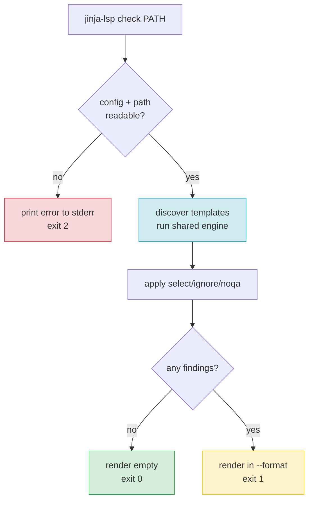

# F19 — CLI Linter

> **Status:** Draft
>
> **Version:** 0.2   ·   **Last updated:** 2026-06-26
>
> **Purpose:** The `jinja-lsp check` command — a one-shot linter that runs the same diagnostic engine as the LSP server and prints findings in one of three formats (rich, compact, json), so the same checks you see in your editor also gate CI.
>
> **Depends on:** [constitution](../constitution.md), [F01-diagnostics](F01-diagnostics.md), [E15-app-config](../foundations/E15-app-config.md), [E30-extraction-and-indexing](../foundations/E30-extraction-and-indexing.md)   ·   **Related:** [E01-architecture](../foundations/E01-architecture.md), [E17-testing](../foundations/E17-testing.md), [E29-e2e-testing](../foundations/E29-e2e-testing.md), [F18-formatting](F18-formatting.md), [F21-release-ci](F21-release-ci.md)

> Requirement tag: **LINT**

---

## 1. Purpose & Scope

`jinja-lsp check` is the editor-free face of the diagnostics engine — point it at a file or a directory and it prints every finding, then exits with a status code your CI can read.

It is not a second linter. It is the *same* linter the LSP server runs, wired to a terminal instead of an editor. Whatever squiggle you see while typing, `check` prints in your shell — same codes, same ranges, same messages (P5's "one engine, three front-ends").

This spec covers:

- The command, its positional `PATH`, and every flag.
- The three output formats — `rich`, `compact`, `json` — each with a worked example.
- The exit-code contract (0 / 1 / 2).
- How `--select` / `--ignore` filter findings, and how they relate to config.
- Parity with the LSP server: one engine, identical output.

## 2. Non-Goals / Out of Scope

- The diagnostic catalog itself — which checks exist and when they fire — owned by [F01-diagnostics](F01-diagnostics.md).
- Config discovery and the `lint.select` / `lint.ignore` config keys — owned by [E15-app-config](../foundations/E15-app-config.md).
- The shared extraction and indexing pipeline — owned by [E30-extraction-and-indexing](../foundations/E30-extraction-and-indexing.md).
- The `jinja-lsp format` command — owned by [F18-formatting](F18-formatting.md).
- Golden-file E2E testing of the json format — owned by [E29-e2e-testing](../foundations/E29-e2e-testing.md) (Branch A).
- **Stdin input.** `check` reads files and directories from the filesystem only — there is no `-`/stdin mode. A finding's `file` field and the cross-file index both need a real on-disk path to resolve (REQ-LINT-09, REQ-LINT-10), which a stdin stream lacks; editors get diagnostics from the LSP server, not by piping into `check`.

## 3. Background & Rationale

`jinja-lsp check` offers three output formats from the start, because no single format serves every reader. A rustc-style multi-line report is pleasant for a human at a terminal but impossible to gate CI against — you can't diff it byte-for-byte without scraping ANSI escapes out of a terminal stream, and its multi-line, color-laden shape is fragile under any cosmetic change.

So the default `rich` format is a rustc-style multi-line report; `compact` and `json` are its two siblings. `compact` is a single line per finding that editor problem-matchers and `grep` understand. `json` is structured output whose shape is *identical* to the `expected-diagnostics.json` golden files — which is exactly how the diagnostics engine gets its regression gate (see [E29](../foundations/E29-e2e-testing.md), Branch A).

That's the whole reason `--format` exists: it lets a test diff the linter's output byte-for-byte.

## 4. Concepts & Definitions

- **Diagnostic code** — the `JINJA-<SEV><CLASS><NN>` identifier (e.g. `JINJA-E101`). (Canonical definition in [glossary](../glossary.md).)
- **Slug** — the kebab-case label paired with a code (e.g. `undefined-variable`); an output label, never an input identifier. (Canonical definition in [glossary](../glossary.md).)
- **Class prefix** — a partial code matching a whole class (`JINJA-E1` = all 1xx; `JINJA-W` = all warnings).
- **Format** — one of `rich`, `compact`, `json`; selected with `--format`, default `rich`.

## 5. Detailed Specification

### 5.1 The command

`jinja-lsp check` runs the diagnostics engine over a path and reports the findings.

```
jinja-lsp check [PATH...]
                [-c | --config FILE]
                [-v | --verbose]
                [--select CODE...]
                [--ignore CODE...]
                [--format FMT]
```

**REQ-LINT-01 — `PATH` is an optional, repeatable positional.**

Each `PATH` may be a single template file or a directory. When it names a directory, `check` scans it for files matching the configured `extensions` ([E15](../foundations/E15-app-config.md)). When `PATH` is omitted, `check` lints the configured `templates` directories (or the zero-config discovered set). A `PATH` outside the workspace is linted in isolation — config still applies, but cross-file checks resolve only against what's reachable from it.

**Multiple positionals are accepted; the shell does the globbing.** `check a.html b.html` and `check templates/**/*.html` both work: the command takes one or more `PATH` arguments and lints their union, de-duplicated, with findings still globally ordered by `file`/`line`/`col` (REQ-LINT-07). `check` does **not** expand glob patterns itself — `**/*.html` is the shell's job, and an unmatched pattern is whatever the shell passes through (typically a literal path that then fails as a nonexistent `PATH`, §10). Directory arguments still filter by configured `extensions`; explicitly-named files are linted as given.

**REQ-LINT-02 — Flags, with `--format` added.**

| Flag | Meaning |
|---|---|
| `-c`, `--config FILE` | Use this config file instead of discovering one ([E15](../foundations/E15-app-config.md)). |
| `-v`, `--verbose` | Emit progress and timing to stderr (`tracing` at INFO); findings still go to stdout. |
| `--select CODE...` | Run only these codes/class-prefixes (overrides config `lint.select` for this run). |
| `--ignore CODE...` | Subtract these codes/class-prefixes from the active set (overrides config `lint.ignore`). |
| `--format FMT` | Output format: `rich` (default), `compact`, or `json`. Selects the output format. |

**REQ-LINT-03 — `--select` / `--ignore` accept a code or class prefix only.**

Both flags take a full code (`JINJA-E101`) or a class prefix (`JINJA-E1` = all 1xx, `JINJA-W` = all warnings) — never a slug (constitution §4.2, [ADR-003](../decisions/ADR-003-diagnostic-code-scheme.md)). This is the same input grammar as the config keys and `noqa`. CLI flags take precedence over the matching config key for that invocation. When the two overlap, `ignore` wins for the overlapping code, mirroring [F01](F01-diagnostics.md) §5.3.

**REQ-LINT-11 — Config discovery is anchored per `PATH` case.**

The discovery *mechanics* (upward search, file name, precedence) are owned by [E15](../foundations/E15-app-config.md); this rule fixes only the **anchor** discovery starts from:

- `--config FILE` given → that file is used; no discovery, anchor irrelevant.
- `PATH` omitted → discovery is anchored at the **current working directory**.
- `PATH` inside the workspace → discovery is anchored at the **workspace root** (the same config the LSP server and `format` would find for those files), so a finding's config is independent of which sub-path you named.
- `PATH` outside the workspace (isolated single file) → discovery is anchored at **that file's own directory**; if none is found, `check` runs zero-config. The CWD is not consulted for an out-of-workspace file.

### 5.2 Output formats

`--format` chooses how each finding is rendered; the findings themselves are identical across formats. All three are mocked side by side in §6 over the same two diagnostics so you can compare them directly.

**REQ-LINT-04 — `rich` is the default, rustc-style report.**

A multi-line block per finding: a header line (`code slug: message`), a `-->` location line, a source excerpt with a caret underline marking the primary range, and an optional `= help:` line carrying the suggestion. This is the default human-facing report. It is meant for a human at a terminal and may use color when stdout is a TTY (disabled under `NO_COLOR` or when piped).

**REQ-LINT-05 — `compact` is one line per finding.**

The format is `path:line:col: JINJA-CODE slug: message`. One finding per line, no blank lines, no color. This is the editor-problem-matcher and `grep`-friendly mode.

**REQ-LINT-06 — `json` is a structured array matching the golden-file shape.**

The output is a JSON array of objects, one per finding, with exactly these keys:

```
file, line, col, code, slug, severity, message
```

**REQ-LINT-07 — `json` shape equals `expected-diagnostics.json`.**

The object shape is byte-for-byte the shape of the `expected-diagnostics.json` golden files in [E17](../foundations/E17-testing.md). This is not a coincidence to be maintained by hand — it is the contract that lets [E29](../foundations/E29-e2e-testing.md) Branch A diff `check --format json` against the golden file directly. The golden identity is asserted on **stdout only**; stderr is excluded from the byte-for-byte comparison, so the non-deterministic `-v` timing/progress lines (§13.5) never break the diff (this is what lets `-v --format json` stay golden-identical — T-13, E2E-13). `file` is the normalized path (REQ-LINT-10), `line` and `col` are 1-based, `severity` is one of `error | warning | info | hint`. Findings are ordered by `file`, then `line`, then `col`.

**REQ-LINT-10 — Paths are normalized identically across all three formats.**

The path printed for a finding is the same string in `rich`, `compact`, and `json` — there is no per-format path rule. A finding inside the workspace prints **workspace-relative with forward slashes**, regardless of how `PATH` was typed (`templates/blog/post.html` and `./templates/blog/post.html` both print `blog/post.html`). A finding in a file **outside** the workspace — the isolated single-file case (REQ-LINT-01) — has no workspace to relativize against, so it prints the path **as the user typed it on the command line** (forward-slashed), neither absolutized nor invented. The ordering key in REQ-LINT-07 sorts on this same normalized string.

### 5.3 Exit codes

The exit code is the part CI reads, so it is a strict three-way contract.

**REQ-LINT-08 — Exit codes 0 / 1 / 2.**

| Code | Meaning |
|---|---|
| `0` | Clean — no diagnostics reported after filtering. |
| `1` | One or more diagnostics were reported. |
| `2` | Config or I/O error — bad `--config`, unreadable path, malformed config, unknown `extra`. |

A `2` is about the *run*, not the templates: if `check` can't even start (no readable path, broken config), it fails with `2` and prints the error to stderr in all formats. A clean run with warnings-only still exits `1` — any finding means non-zero. The `json` and `compact` formats print findings to stdout; diagnostics never leak to stderr (so `2>/dev/null` keeps the report intact).

### 5.4 Parity with the LSP server

`check` and the LSP server are the same engine with different I/O.

**REQ-LINT-09 — `check` shares the engine with the LSP server.**

Both call the same extraction → indexing → diagnostics pipeline ([E30](../foundations/E30-extraction-and-indexing.md), [F01](F01-diagnostics.md)). `check` is the I/O layer that walks a path and prints; the server is the I/O layer that answers `publishDiagnostics`. There is no `check`-only check and no server-only check. A diagnostic the server publishes for a file must equal — same code, slug, range, message — the diagnostic `check` prints for that file. This parity is asserted as a test ([F01](F01-diagnostics.md) §11). `noqa` suppression ([F01](F01-diagnostics.md) §5.4) applies identically in both.

## 6. UI Mockups

> The three subsections below render **the same two diagnostics** in `starlette-blog`'s `templates/blog/post.html`: a `JINJA-E101 undefined-variable` (`post.titel`, a typo of the hinted `post.title` — the same case [F01](F01-diagnostics.md) §5 uses) and a `JINJA-W203 unused-import` (an imported `macros` alias never referenced). Compare them line for line.

### 6.1 `--format rich` (default)

The rustc-style report a developer reads at a terminal. Each finding is a multi-line block with a caret underline and an optional help line.

```
$ jinja-lsp check templates/blog/post.html

JINJA-E101 undefined-variable: 'post.titel' is not defined
 --> blog/post.html:4:9
  |
4 | {{ post.titel }}
  |         ^^^^^
  = help: did you mean `title`?

JINJA-W203 unused-import: 'macros' imported but never used
 --> blog/post.html:1:1
  |
1 | 
  | ^^^^^^^^^^^^^^^^^^^^^^^^^^^^^^^^^^^^^^^^^^

2 problems (1 error, 1 warning)
```

States: clean run prints `No problems found.` and exits `0` · the exit-`2` error state is format-independent and shown once in §6.4.

### 6.2 `--format compact`

One line per finding — `path:line:col: code slug: message`. Built for editor problem-matchers and `grep`.

```
$ jinja-lsp check templates/blog/post.html --format compact
blog/post.html:4:9: JINJA-E101 undefined-variable: 'post.titel' is not defined
blog/post.html:1:1: JINJA-W203 unused-import: 'macros' imported but never used
```

States: clean run prints nothing to stdout and exits `0` · the exit-`2` error state is format-independent and shown once in §6.4.

### 6.3 `--format json`

A structured array — identical shape to `expected-diagnostics.json` ([E17](../foundations/E17-testing.md)). Built for CI diffs and tooling.

```
$ jinja-lsp check templates/blog/post.html --format json
[
  {"file":"blog/post.html","line":4,"col":9,"code":"JINJA-E101",
   "slug":"undefined-variable","severity":"error","message":"'post.titel' is not defined"},
  {"file":"blog/post.html","line":1,"col":1,"code":"JINJA-W203",
   "slug":"unused-import","severity":"warning","message":"'macros' imported but never used"}
]
```

States: clean run prints `[]` and exits `0` · the exit-`2` error state is format-independent and shown once in §6.4.

### 6.4 Exit-`2` error state (format-independent)

The exit-`2` error state does **not** vary by `--format`. The error line is written to **stderr** in one fixed shape regardless of `--format`, and stdout stays empty — no report, no `[]`, no partial array (§5.3, §10). A `json` or `compact` consumer therefore sees nothing on stdout and the same `error:` line on stderr as a `rich` user.

```
$ jinja-lsp check --config ./nope.toml --format json
error: config file not found: ./nope.toml
                                          (stdout empty · exit code 2)
```

### 6.5 Multi-file output

When `check` lints more than one file (a directory or omitted `PATH`), every format simply **concatenates findings in `file`, then `line`, then `col` order** (REQ-LINT-07) — there are no per-file section headers, no banners, no interleaving; each finding already carries its own `file`. `rich` ends with **one** global summary line counting across all files; `compact` and `json` add no summary at all.

```
$ jinja-lsp check templates/

JINJA-E101 undefined-variable: 'post.titel' is not defined
 --> blog/post.html:4:9
  |
4 | {{ post.titel }}
  |         ^^^^^
  = help: did you mean `title`?

JINJA-W203 unused-import: 'request' imported but never used
 --> email/digest.html:2:1
  |
2 | 
  | ^^^^^^^^^^^^^^^^^^^^^^^^^^^^^^^^^^^^^^^^^^

2 problems (1 error, 1 warning) in 2 files
```

States: the summary line counts across every linted file; a clean multi-file run still prints `No problems found.` and exits `0`.

## 7. Visualizations

The decision flow from invocation to exit code.



## 8. Data Shapes

A single finding object in `--format json`. This is the contract; it equals the `expected-diagnostics.json` element shape verbatim.

```json
{
  "file": "blog/post.html",
  "line": 4,
  "col": 9,
  "code": "JINJA-E101",
  "slug": "undefined-variable",
  "severity": "error",
  "message": "'post.titel' is not defined"
}
```

## 9. Examples & Use Cases

You're working on `starlette-blog` and want a pre-commit gate. You run `jinja-lsp check` with no path, so it lints the configured `templates` dir. It finds the `post.titel` typo and the unused `macros` import, prints them in `rich`, and exits `1` — your hook blocks the commit.

In CI you'd rather diff structured output, so the workflow runs `jinja-lsp check --format json templates/ > out.json` and compares against a committed baseline. To silence a known-and-accepted warning class for the whole run, you add `--ignore JINJA-W2` and the unused-import finding drops out, leaving only the error and exit `1`.

## 10. Edge Cases & Failure Modes

- **`PATH` doesn't exist** → exit `2`, error to stderr; stdout stays empty (so `--format json` consumers see no array).
- **`--config` points at a missing or malformed file** → exit `2`; the previous-config fallback is an LSP-only behavior ([E15](../foundations/E15-app-config.md)), not a CLI one.
- **Directory with zero matching files** → clean run, exit `0` (`No problems found.` / `[]`).
- **Finding in a file outside the workspace** → its path can't be made workspace-relative, so it prints **as typed** on the command line (forward-slashed), identically in all three formats (REQ-LINT-10).
- **`--select` and `--ignore` overlap** → `ignore` wins for the overlapping code (mirrors [F01](F01-diagnostics.md) §5.3).
- **Warnings only, no errors** → still exit `1` (any finding is non-zero).
- **A slug passed to `--select`/`--ignore`** (e.g. `--ignore undefined-variable`) → rejected as an invalid filter, exit `2` (slugs are output labels, not input — [ADR-003](../decisions/ADR-003-diagnostic-code-scheme.md)).
- **Output piped (not a TTY)** → `rich` drops color automatically; `compact`/`json` are already color-free.
- **A `noqa`-suppressed finding** → the suppressed code is absent from every format's output exactly as in the server ([F01](F01-diagnostics.md) §5.4); an invalid `noqa` still surfaces its own `JINJA-W107 invalid-noqa` finding, so a file whose only finding is a bad-`noqa` warning still exits `1` (any finding is non-zero, even a warning).

## 11. Testing

`check` is tested through the golden-file branch — `--format json` over each broken fixture is diffed against its `expected-diagnostics.json` — plus unit tests for flag parsing, format rendering, and exit codes.

### 11.1 Scope & coverage

Target: **100% of this feature's behavior is covered.** Every `REQ-LINT-NN` maps to at least one test; every format (§6) and edge case (§10) has a test. See the policy in [E17-testing](../foundations/E17-testing.md#2-coverage-policy).

### 11.2 Test plan

Each row is a concrete invocation (with flags), the fixture it runs against, and the exact expected stdout shape + exit code. Rows are grouped by behavior; every `REQ-LINT-NN`, every flag and combination, all three formats, all three exit codes, the golden identity, `select`/`ignore` filtering, `noqa`, color gating, and every §10 edge and §6 state appears.

| # | Invocation (+ flags) | Type | Fixture | Expected stdout · exit | Verifies |
|---|---|---|---|---|---|
| **PATH resolution (REQ-LINT-01)** ||||||
| T-01 | `check templates/blog/post.html` (single file) | integration | starlette-blog | findings for that one file only · `1` | REQ-LINT-01 |
| T-02 | `check templates/` (directory, scans configured `extensions`) | integration | undefined-vars | findings across all matching files, ordered by file/line/col · `1` | REQ-LINT-01 |
| T-03 | `check` (PATH omitted → lints configured `templates` dirs) | integration | starlette-blog | findings over the discovered set · `1` | REQ-LINT-01 |
| T-04 | `check ../outside/tpl.html` (PATH outside workspace, linted in isolation) | integration | call-and-paths | only checks reachable from it resolve; cross-file refs unresolved · `1` | REQ-LINT-01 |
| T-05 | `check` over a directory with zero matching files (§10) | integration | starlette-blog (empty subdir) | `No problems found.` · `0` | REQ-LINT-01, REQ-LINT-08 |
| T-04b | `check a.html b.html` (multiple positionals) and `check templates/**/*.html` (shell glob) → union linted, de-duplicated, globally ordered | integration | starlette-blog | findings over the union, file/line/col order · `1` | REQ-LINT-01 |
| **Path normalization (REQ-LINT-10)** ||||||
| T-04c | in-workspace finding prints workspace-relative forward-slash path identically in rich / compact / json, regardless of typed `PATH` (`./templates/…` ≡ `templates/…`) | unit (snapshot) | starlette-blog | same `blog/post.html` path in all three formats · `1` | REQ-LINT-10 |
| T-04d | outside-workspace finding prints the path as typed (forward-slashed), not absolutized | integration | call-and-paths | `../outside/tpl.html` printed as typed · `1` | REQ-LINT-10, REQ-LINT-01 |
| **Config-discovery anchor (REQ-LINT-11)** ||||||
| T-04e | anchor per case: omitted → CWD; in-workspace `PATH` → workspace root; outside-workspace → file's own dir (else zero-config) | integration | starlette-blog + call-and-paths | each case discovers the expected config · per-findings | REQ-LINT-11 |
| **Flags (REQ-LINT-02)** ||||||
| T-06 | `--config ./jinja.toml` parses and is honored | unit | — | uses given config, not discovery · n/a | REQ-LINT-02 |
| T-07 | `-v`/`--verbose` raises tracing to INFO on **stderr**; findings still on stdout | integration | undefined-vars | discovery/timing on stderr; findings unchanged on stdout · `1` | REQ-LINT-02 |
| T-08 | `--format`, `--select`, `--ignore` parse with code/prefix args | unit | — | each flag accepted and applied · n/a | REQ-LINT-02 |
| **Select / ignore filtering (REQ-LINT-03)** ||||||
| T-09 | `--select JINJA-E101` (full code) | unit/integration | undefined-vars | only `JINJA-E101` findings kept · `1` | REQ-LINT-03 |
| T-10 | `--select JINJA-E1` (class prefix = all 1xx) | unit/integration | undefined-vars | all 1xx kept, 2xx/3xx dropped · `1` | REQ-LINT-03 |
| T-11 | `--ignore JINJA-W2` (class prefix subtracts) | integration | unused-symbols | all 2xx dropped · `0` if only 2xx remained, else `1` | REQ-LINT-03 |
| T-12 | `--select JINJA-E1 --ignore JINJA-E101` (overlap → ignore wins, §10) | unit | undefined-vars | 1xx kept **except** `JINJA-E101` · `1` | REQ-LINT-03 |
| T-13 | CLI `--select` overrides config `lint.select` for the run | integration | starlette-blog (config sets `lint.select`) | CLI set wins over config · per-findings | REQ-LINT-03 |
| T-14 | CLI `--ignore` overrides config `lint.ignore` for the run | integration | starlette-blog (config sets `lint.ignore`) | CLI set wins over config · per-findings | REQ-LINT-03 |
| **`rich` format (REQ-LINT-04) + color gating + §6 states** ||||||
| T-15 | `--format rich` (default) renders header + `-->` + caret + `= help:` | unit (snapshot, `insta`) | undefined-vars | rustc-style block, trailing `N problems (…)` · `1` | REQ-LINT-04 |
| T-16 | `rich` clean run (§6.1 state) | integration | starlette-blog | `No problems found.` · `0` | REQ-LINT-04, REQ-LINT-08 |
| T-17 | `rich` to a **TTY** → color emitted | unit (snapshot) | undefined-vars | ANSI color present · `1` | REQ-LINT-04 |
| T-18 | `rich` **piped** (not a TTY) → color dropped (§10) | unit (snapshot) | undefined-vars | no ANSI escapes · `1` | REQ-LINT-04 |
| T-19 | `rich` with `NO_COLOR` set, even on a TTY → color dropped (§10) | unit (snapshot) | undefined-vars | no ANSI escapes · `1` | REQ-LINT-04 |
| **`compact` format (REQ-LINT-05) + §6 state** ||||||
| T-20 | `--format compact` → one `path:line:col: CODE slug: message` line per finding, no blank lines, no color | unit (snapshot) | undefined-vars, unused-symbols | one line per finding, color-free · `1` | REQ-LINT-05 |
| T-21 | `compact` clean run (§6.2 state) | integration | starlette-blog | empty stdout · `0` | REQ-LINT-05, REQ-LINT-08 |
| T-21b | multi-file `rich` over a directory (§6.5) → findings concatenated in file/line/col order, one global summary line counting across files | unit (snapshot) | undefined-vars | concatenated blocks + single `N problems (…) in M files` · `1` | REQ-LINT-04 |
| **`json` format (REQ-LINT-06 / 07) + §6 state + golden identity** ||||||
| T-22 | `--format json` array has exactly the 7 keys (`file,line,col,code,slug,severity,message`), ordered by file/line/col | golden (check) | all diagnostic fixtures | well-formed 7-key array · `1` | REQ-LINT-06 |
| T-23 | `--format json` output equals `expected-diagnostics.json` **byte-for-byte** (regression gate) | golden (check) | syntax-errors, undefined-vars, unused-symbols, duplicates, inheritance, call-and-paths | stdout ≡ golden file · `1` | REQ-LINT-07 |
| T-24 | `json` clean run (§6.3 state) | golden (check) | starlette-blog | `[]` ≡ near-empty golden · `0` | REQ-LINT-07, REQ-LINT-08 |
| **Exit codes (REQ-LINT-08) across all formats** ||||||
| T-25 | clean fixture in rich / compact / json → exit `0` | integration | starlette-blog | `No problems found.` / empty / `[]` · `0` | REQ-LINT-08 |
| T-26 | findings present (any format) → exit `1` | integration | syntax-errors | report rendered · `1` | REQ-LINT-08 |
| T-27 | warnings-only, no errors → still exit `1` (§10) | integration | unused-symbols | warning findings rendered · `1` | REQ-LINT-08 |
| T-28 | bad `--config` (missing or malformed; no LSP fallback, §10) → error to **stderr**, stdout empty in every format → exit `2` | integration | config-reload (invalid variant) | `error: …` on stderr; stdout empty (`json` consumers see no array) · `2` | REQ-LINT-08 |
| T-28b | exit-`2` error line is identical across `--format rich`/`compact`/`json` (§6.4, format-independent) | unit (snapshot) | — (`./nope.toml`) | same `error: …` stderr line, empty stdout in all three formats · `2` | REQ-LINT-08 |
| T-29 | nonexistent `PATH` (§10) → error to stderr, stdout empty → exit `2` | integration | — (`./does-not-exist`) | `error: …` on stderr · `2` | REQ-LINT-08 |
| T-30 | slug passed to `--select`/`--ignore` (e.g. `--ignore undefined-variable`, §10) → rejected as invalid filter → exit `2` | unit | — | `error: …` invalid filter on stderr · `2` | REQ-LINT-03, REQ-LINT-08 |
| T-30b | `-` is not a stdin sentinel (§2 non-goal) → treated as a literal path, fails as nonexistent → exit `2` | unit | — (`check -`) | `error: …` on stderr; no stdin read · `2` | REQ-LINT-01, REQ-LINT-08 |
| T-31 | `2>/dev/null` keeps the report intact (diagnostics never leak to stderr) | integration | undefined-vars | findings on stdout survive stderr redirect · `1` | REQ-LINT-08 |
| **Parity + noqa (REQ-LINT-09)** ||||||
| T-32 | `check` finding (code/slug/range/message) equals server `publishDiagnostics` for the same file | integration | starlette-blog | per-finding equality CLI ↔ server · matches | REQ-LINT-09 |
| T-33 | `noqa`-suppressed finding absent from CLI output, identical to server suppression (§10) | integration | undefined-vars | suppressed code not printed in any format · per-findings | REQ-LINT-09 |
| T-34 | invalid `noqa` still surfaces `JINJA-W107 invalid-noqa` in CLI output (§10) | integration | undefined-vars (bad-noqa template) | `JINJA-W107` printed · `1` | REQ-LINT-09 |

### 11.3 Fixtures

- All diagnostic fixtures carry an `expected-diagnostics.json` golden file (whose shape this command produces) — registered in [E17-testing](../foundations/E17-testing.md#5-fixtures-registry). `check --format json` is the producer those goldens diff against.

### 11.4 Requirement coverage

| Requirement | Covered by |
|---|---|
| REQ-LINT-01 | T-01–T-05, T-04b, T-04d, T-30b (file / directory / omitted / outside-workspace / empty-dir / multiple-positionals + glob / `-` not stdin) |
| REQ-LINT-02 | T-06–T-08 (`--config`, `-v`/`--verbose`, `--format`/`--select`/`--ignore` parsing) |
| REQ-LINT-03 | T-09–T-14, T-30 (code, class-prefix, overlap, CLI-over-config precedence, slug rejection) |
| REQ-LINT-04 | T-15–T-19, T-21b (`rich` block + clean state + TTY/pipe/`NO_COLOR` color gating + multi-file concatenation/summary) |
| REQ-LINT-05 | T-20–T-21 (`compact` one-line-per-finding + clean state) |
| REQ-LINT-06 | T-22 (7-key ordered array) |
| REQ-LINT-07 | T-23–T-24 (byte-for-byte golden identity, stdout-only + `[]` clean) |
| REQ-LINT-08 | T-05, T-16, T-21, T-25–T-31, T-28b (exit 0 / 1 / 2 across formats, edges, format-independent error line) |
| REQ-LINT-09 | T-32–T-34 (CLI ↔ server parity + `noqa` suppression + invalid-`noqa`) |
| REQ-LINT-10 | T-04c, T-04d (path normalization identical across formats + outside-workspace as-typed) |
| REQ-LINT-11 | T-04e (config-discovery anchor per `PATH` case) |

## 12. End-to-End Test Plan

The CLI is itself an E2E surface — [E29](../foundations/E29-e2e-testing.md) Branch A runs the real binary against each fixture and diffs `--format json` against the golden file.

### 12.1 Coverage target

**100% of the command's scope, end to end** — the happy path (clean and dirty runs in every format) plus the error paths (bad config, missing path). See the policy in [E29-e2e-testing](../foundations/E29-e2e-testing.md#2-coverage-policy).

### 12.2 Scenarios

Each E2E runs the real binary against a fixture. The happy path covers clean and dirty runs in every format plus the filtering, golden-identity, parity, `noqa`, and color-gating journeys; the error path covers every exit-`2` cause.

| # | Journey | Path | Expected outcome |
|---|---|---|---|
| E2E-01 | `check --format json` over the clean baseline | happy | `[]` ≡ near-empty golden, exit `0` |
| E2E-02 | `check --format json` over each broken fixture | happy | stdout ≡ `expected-diagnostics.json` byte-for-byte, exit `1` |
| E2E-03 | `check --format rich` over a broken fixture | happy | rustc-style block (header + `-->` + caret + `= help:`) and `N problems (…)`, exit `1` |
| E2E-04 | `check --format compact` over a broken fixture | happy | one `path:line:col: CODE slug: message` line per finding, no color, exit `1` |
| E2E-05 | `check --format rich` over the clean baseline | happy | `No problems found.`, exit `0` |
| E2E-06 | `check --format compact` over the clean baseline | happy | empty stdout, exit `0` |
| E2E-07 | `check PATH` as a single file vs. a directory vs. omitted | happy | findings scoped to the file / whole tree / configured `templates` dir, exit `1` |
| E2E-08 | `check --select JINJA-E1` then `--ignore JINJA-W2` over a mixed fixture | happy | only the selected class survives; ignored class drops out, exit `1` (or `0` if nothing remains) |
| E2E-09 | `check --select JINJA-E1 --ignore JINJA-E101` (overlap) over a broken fixture | happy | 1xx survive except `JINJA-E101` (ignore wins), exit `1` |
| E2E-10 | `check --format rich` piped (not a TTY) and again with `NO_COLOR` on a TTY | happy | both emit color-free `rich` output, exit `1` |
| E2E-11 | `check` with warnings-only fixture | happy | warning findings rendered, still exit `1` |
| E2E-12 | `check --format json` then compare to the server's `publishDiagnostics` for the same file | happy | identical code/slug/range/message; `noqa`-suppressed code absent in both, exit `1` |
| E2E-13 | `check -v --format json` over a broken fixture | happy | progress/timing on stderr, golden-identical array on stdout, `2>/dev/null` leaves it intact, exit `1` |
| E2E-14 | `check --config ./missing.toml` | error | error on stderr, stdout empty, exit `2` |
| E2E-15 | `check --config ./malformed.toml` (invalid config variant) | error | error on stderr, stdout empty, exit `2` |
| E2E-16 | `check ./does-not-exist` | error | error on stderr, stdout empty, exit `2` |
| E2E-17 | `check --ignore undefined-variable` (a slug) | error | rejected as invalid filter, error on stderr, exit `2` |
| E2E-18 | `check --select undefined-variable` (a slug) | error | rejected as invalid filter, error on stderr, exit `2` |

## 13. Non-Functional Requirements

### 13.1 Security & Privacy

- **Access & authorization** — a local CLI run by the developer; no trust boundary beyond the filesystem it reads.
- **Input & validation** — every template is untrusted input read through tree-sitter only and never executed (P1). `PATH` and `--config` are validated; `../` traversal outside the workspace is rejected ([E30](../foundations/E30-extraction-and-indexing.md)).
- **Data sensitivity** — findings quote only the user's own source; `check` makes no network access (the binary has no network surface at all — [ADR-009](../decisions/ADR-009-stdio-only-transport.md)).

### 13.2 Accessibility

N/A — `check` is a plain-text CLI; per constitution §4.6 Accessibility is N/A suite-wide.

### 13.4 Performance & Scale

- **Latency** — a full-directory `check` reuses the workspace index budget: < 2 s for 500 templates ([E30](../foundations/E30-extraction-and-indexing.md), P6). Single-file `check` is dominated by Pass 1 and returns well under that.

### 13.5 Observability

- **Logs / traces** — `-v`/`--verbose` raises `tracing` to INFO on stderr (discovery counts, per-pass timing); the default run is silent except for findings.

## 15. Open Questions & Decisions

- **Decided** — `--format json` is the new flag and its shape is fixed to the golden-file shape ([ADR-003](../decisions/ADR-003-diagnostic-code-scheme.md), [E29](../foundations/E29-e2e-testing.md)).
- **Decided** — slugs are never accepted as `--select`/`--ignore` input (output labels only).
- **Decided** — paths are normalized identically across all three formats: workspace-relative forward-slashed inside the workspace, as-typed for the outside-workspace case (REQ-LINT-10).
- **Decided** — no stdin mode; `check` reads paths only (§2 non-goal).
- **Decided** — multiple positionals are accepted; globbing is the shell's job, not the tool's (REQ-LINT-01).
- **Decided** — config-discovery anchor is fixed per `PATH` case (REQ-LINT-11); mechanics stay in [E15](../foundations/E15-app-config.md).

## 16. Cross-References

- **Depends on:** [constitution](../constitution.md) — the code scheme and exit-contract philosophy; [F01-diagnostics](F01-diagnostics.md) — the catalog `check` renders; [E15-app-config](../foundations/E15-app-config.md) — config and `select`/`ignore`; [E30-extraction-and-indexing](../foundations/E30-extraction-and-indexing.md) — the shared engine.
- **Related:** [E01-architecture](../foundations/E01-architecture.md) — one engine, three front-ends; [E17-testing](../foundations/E17-testing.md) — the golden-file shape; [E29-e2e-testing](../foundations/E29-e2e-testing.md) — Branch A diffs this command's json; [F18-formatting](F18-formatting.md) — the sibling `format` command; [F21-release-ci](F21-release-ci.md) — CI runs `check` as a gate.
- **Shared exit contract:** `check` and [F18](F18-formatting.md) `format` share exit code `2` = config or I/O error (F18 §5.8 defines the same scheme). The two commands differ only on the success codes — `check` uses `1` for "findings present", `format` uses `1` for "files changed / would change" — but a `2` means the same thing in both: the run couldn't start, not that the templates were wrong.

## 17. Changelog

- **2026-06-24** — Initial draft.
- **2026-06-25** — Expanded §11.2 to concrete invocation-level rows (T-01–T-34) and §12.2 to E2E-01–E2E-18, covering every format, flag and combination, all three exit codes, the golden-file identity, `select`/`ignore` filtering and overlap, `noqa` suppression and invalid-`noqa`, CLI↔server parity, and `NO_COLOR`/TTY-vs-pipe color gating; rebuilt the §11.4 requirement-coverage map; added the `noqa`/`JINJA-W107` §10 edge.
- **2026-06-26** — Spec-review reconciliation (jinja-lsp-thx, -xay, -nst, -578, -ci5, -4dv, -na4, -33w, -6i3, -zcp): added §6.4 mocking the format-independent exit-`2` error state required by constitution §6 (thx); added REQ-LINT-10 fixing path normalization across all three formats and the outside-workspace as-typed case, with §10 edge and T-04c/T-04d (xay); added a §2 stdin non-goal and T-30b (nst); made `PATH` repeatable with shell-glob semantics in REQ-LINT-01 and T-04b (578); added REQ-LINT-11 fixing the config-discovery anchor per `PATH` case (deferring mechanics to E15) with T-04e (ci5); stated the golden identity is asserted on stdout only in REQ-LINT-07 (4dv); added §6.5 multi-file concatenation/summary rule and mockup with T-21b (na4); reworded the §10 bad-`noqa` edge from "error" to "finding/warning" (33w); aligned the undefined-variable mockups/§8/§9 with the F01 cast — `post.titel` → "did you mean `title`?" (6i3); added a shared-exit-contract cross-reference to F18 in §16 — F18 §5.8 already defines exit `2` = config/IO error, so no F18 edit was needed (zcp). Bumped to 0.2.
