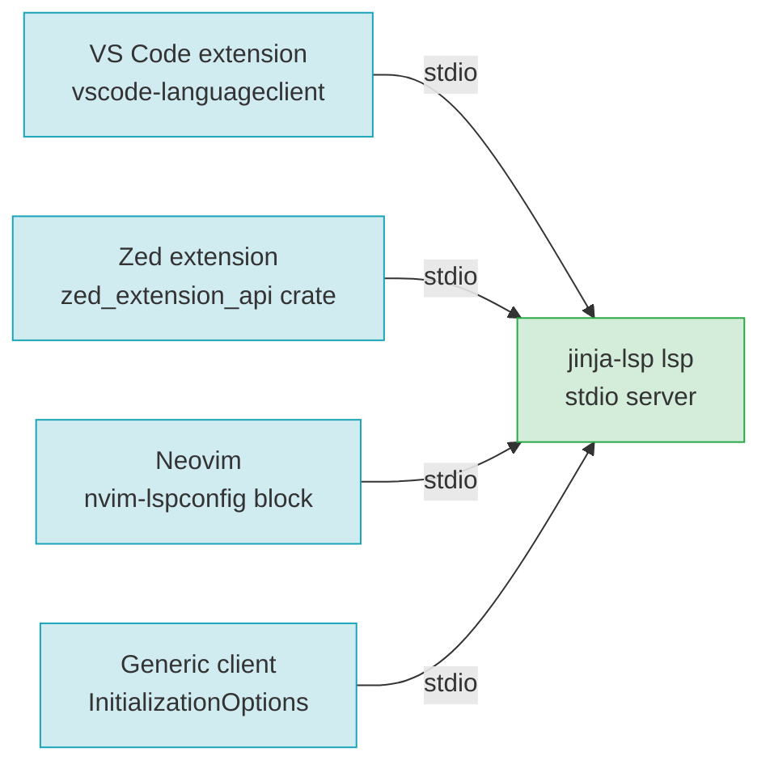

# F20 — Editor Integrations

> **Status:** Draft
>
> **Version:** 0.1   ·   **Last updated:** 2026-06-24
>
> **Purpose:** How each editor talks to the jinja-lsp binary — a VS Code extension, a Zed extension, a documented Neovim setup, and a generic LSP-client recipe — all over the single stdio transport, all configurable through keys that mirror `jinja.toml`.
>
> **Depends on:** [constitution](../constitution.md), [E01-architecture](../foundations/E01-architecture.md), [E15-app-config](../foundations/E15-app-config.md)   ·   **Related:** [F21-release-ci](F21-release-ci.md), [E03-tech-stack](../foundations/E03-tech-stack.md)

> Requirement tag: **EDIT**

---

## 1. Purpose & Scope

jinja-lsp is one binary that speaks standard LSP over stdio. This spec is about the thin shims each editor needs to launch that binary and hand it configuration — nothing more.

That's the whole design: the server owns the logic, and an integration is just *how this editor finds and starts the server* plus *how this editor's settings reach it*. Because every editor uses the same stdio transport ([ADR-009](../decisions/ADR-009-stdio-only-transport.md)), the integrations differ only in packaging.

This spec covers:

- A **VS Code** extension — language client, activation events, settings schema, syntax highlighting.
- A **Zed** extension — a Rust crate that registers the grammar and the language server.
- A **Neovim** setup — a documented `nvim-lspconfig` block, no plugin to publish.
- A **generic LSP-client** recipe — the `InitializationOptions` schema, so any client configures the server without a config file.

## 2. Non-Goals / Out of Scope

- The server's capabilities and protocol conduct — owned by [E01-architecture](../foundations/E01-architecture.md).
- Config keys and their meaning (`templates`, `extras`, `hints`, `lint.*`, …) — owned by [E15-app-config](../foundations/E15-app-config.md). This spec only maps editor settings *onto* those keys.
- Building and publishing the artifacts (marketplace, releases) — owned by [F21-release-ci](F21-release-ci.md).
- Any non-stdio transport — there isn't one ([ADR-009](../decisions/ADR-009-stdio-only-transport.md)).

## 3. Background & Rationale

The Zed extension is a small `zed_extension_api` crate that declares the tree-sitter-jinja grammar and the jinja-lsp language server. Alongside it, jinja-lsp ships integrations for the editors developers actually use.

The guiding rule is that an integration must add *zero* analysis logic. It launches the binary, forwards settings, and gets out of the way. If an integration starts to "know things" about Jinja, that knowledge belongs in the server, not the shim.

Two config delivery paths exist and they coexist. A project with a `jinja.toml` is configured by that file; the editor needs to supply nothing. A project without one (or a user who prefers editor settings) configures the server through LSP `InitializationOptions`, whose schema mirrors the config keys exactly. Same keys, two delivery mechanisms — see §5.5.

## 4. Concepts & Definitions

- **Language client** — the editor-side half of LSP that launches and talks to the server.
- **Activation event** — the VS Code trigger that loads the extension (e.g. opening a `.jinja` file).
- **`InitializationOptions`** — the JSON blob a client sends in the `initialize` request to configure a server without a config file. (Schema in §5.5.)
- **Config file** — `jinja.toml` or `pyproject.toml`'s `[tool.jinja]`. (Canonical definition in [glossary](../glossary.md).)
- **tmLanguage** — the TextMate grammar format VS Code uses for syntax highlighting.

## 5. Detailed Specification

### 5.1 Shared contract — stdio, every editor

Every integration launches the same binary the same way.

**REQ-EDIT-01 — All integrations launch `jinja-lsp lsp` over stdio.**

The server is invoked as `jinja-lsp lsp`; the client communicates over the process's stdin/stdout. There is no TCP/`--http` option to configure ([ADR-009](../decisions/ADR-009-stdio-only-transport.md)). An integration must let the user override the binary path (for a non-`PATH` install) but must default to discovering `jinja-lsp` on `PATH`.

**REQ-EDIT-02 — Configuration reaches the server one of two ways.**

Either a `jinja.toml` / `pyproject.toml` in the workspace (the server discovers it — [E15](../foundations/E15-app-config.md)), **or** the client's `InitializationOptions` (§5.5). When both are present, the config file wins; `InitializationOptions` are the fallback for projects without one. No integration invents its own config format.

### 5.2 VS Code extension

A TypeScript extension that bundles a language client and a settings UI.

**REQ-EDIT-03 — Language client over stdio.**

The extension uses `vscode-languageclient` to spawn `jinja-lsp lsp` and pipe LSP over stdio. The binary path is taken from the `jinja-lsp.server.path` setting, defaulting to `jinja-lsp` on `PATH`. On a missing binary it surfaces a "jinja-lsp not found — install it or set jinja-lsp.server.path" notification rather than failing silently.

**REQ-EDIT-04 — Activation events.**

The extension activates `onLanguage:jinja`, `onLanguage:jinja-html`, and on opening any workspace containing a `jinja.toml`. It does not activate eagerly — an unrelated project pays no cost.

**REQ-EDIT-05 — Settings schema wraps the config keys.**

The extension contributes a `configuration` block whose properties wrap the `jinja.toml` keys one-to-one under a `jinja-lsp.*` namespace, so a user who prefers GUI settings never writes TOML. The mapping is mechanical:

| VS Code setting | `jinja.toml` key |
|---|---|
| `jinja-lsp.templates` | `templates` |
| `jinja-lsp.extensions` | `extensions` |
| `jinja-lsp.extras` | `extras` |
| `jinja-lsp.customBuiltins` | `custom_builtins` |
| `jinja-lsp.hints` | `hints` |
| `jinja-lsp.lint.select` | `lint.select` |
| `jinja-lsp.lint.ignore` | `lint.ignore` |
| `jinja-lsp.server.path` | *(client-only — the binary location)* |

These settings are forwarded as `InitializationOptions` (§5.5) on start and via `workspace/didChangeConfiguration` on change, so a workspace `jinja.toml` still overrides them per REQ-EDIT-02.

**REQ-EDIT-06 — tmLanguage syntax highlighting.**

The extension ships a `jinja.tmLanguage.json` and a language contribution registering the `jinja` / `jinja-html` languages with the usual file extensions (`.html`, `.jinja`, `.jinja2`, `.j2`). This is editor-side colorization only — it is independent of the server's semantic tokens ([F13](F13-semantic-tokens.md) layers on top of it).

### 5.3 Zed extension

A small Rust crate compiled to WASM.

**REQ-EDIT-07 — Rust extension crate registering grammar + server.**

The extension is a `zed_extension_api` crate (`crate-type = ["cdylib"]`) whose `extension.toml` declares the tree-sitter-jinja grammar and the language server. The grammar entry points at the upstream `alex-oleshkevich/tree-sitter-jinja` ([ADR-002](../decisions/ADR-002-tree-sitter-grammar.md)); the `[language_servers.jinja-lsp]` entry names the server and its languages. The crate's `language_server_command` returns `jinja-lsp lsp` over stdio, downloading the release binary if it isn't on `PATH`.

**REQ-EDIT-08 — Server registration and configuration.**

The extension registers `jinja-lsp` for the `Jinja2` language and forwards Zed's `lsp.jinja-lsp.initialization_options` as the server's `InitializationOptions` (§5.5), so Zed users configure the server through `settings.json` when no `jinja.toml` exists.

### 5.4 Neovim — documented `nvim-lspconfig` block

Neovim needs no published plugin; a documented config block is the deliverable.

**REQ-EDIT-09 — Ship a documented `nvim-lspconfig` recipe.**

The docs provide a copy-paste Lua block that registers `jinja-lsp` with `nvim-lspconfig`: the `cmd` (`{ "jinja-lsp", "lsp" }`), the `filetypes`, a `root_dir` keyed on `jinja.toml` / `pyproject.toml` / `.git`, and an `init_options` table mirroring the config keys (§5.5). The block is shown in §6.2 and lives in the repo's README. No code to maintain beyond the snippet.

### 5.5 Generic LSP clients — the `InitializationOptions` schema

Any LSP client can configure the server with no config file by sending `InitializationOptions`.

**REQ-EDIT-10 — `InitializationOptions` mirrors `jinja.toml`.**

The `initializationOptions` object the server accepts in `initialize` has one field per config key, with the same names and types as `jinja.toml` ([E15](../foundations/E15-app-config.md)). The full shape is in §8. The server reads these only when no config file is discovered (REQ-EDIT-02); they are the universal, editor-independent configuration path. This is the same schema every integration above forwards — VS Code settings, Zed `initialization_options`, and Neovim `init_options` all serialize into this one object.

## 6. UI Mockups

### 6.1 VS Code settings panel

What a user sees in **Settings → Extensions → Jinja LSP** — the GUI wrapper over the `jinja.toml` keys (REQ-EDIT-05). Editing any field forwards it to the server.

```
┌─ Settings  ›  Extensions  ›  Jinja LSP ───────────────────────────────┐
│                                                                       │
│  Jinja-lsp › Server: Path                                             │
│  Absolute path to the jinja-lsp binary. Empty = found on PATH.        │
│  [ jinja-lsp                                                       ]   │
│                                                                       │
│  Jinja-lsp › Templates              (maps to  templates)             │
│  Template directories to scan. Use "..." to add auto-discovered.     │
│  [ templates                                          ] [ + Add Item ]│
│                                                                       │
│  Jinja-lsp › Extras                 (maps to  extras)               │
│  Extension packs to activate.                                        │
│  [✔] starlette   [ ] flask   [ ] starlette-babel   [ ] starlette-flash│
│                                                                       │
│  Jinja-lsp › Hints                  (maps to  hints)                │
│  Directories holding user hint files.                                │
│  [ hints                                              ] [ + Add Item ]│
│                                                                       │
│  Jinja-lsp › Lint: Select / Ignore  (maps to  lint.select/ignore)  │
│  Diagnostic codes or class prefixes (e.g. JINJA-E1).                 │
│  select [                       ]   ignore [ JINJA-W203          ]   │
│                                                                       │
│  ⓘ A workspace jinja.toml overrides these settings.                  │
└───────────────────────────────────────────────────────────────────── ┘
```

States: default (all empty → server uses zero-config discovery) · binary-not-found (a notification toast: "jinja-lsp not found — install it or set jinja-lsp.server.path") · workspace-has-config (an info banner; settings become advisory).

### 6.2 Neovim `nvim-lspconfig` snippet

The copy-paste block for `init.lua` (REQ-EDIT-09). `init_options` mirrors the config keys (§5.5).

```lua
-- ~/.config/nvim/init.lua  (or a plugin module)
local lspconfig = require("lspconfig")
local configs   = require("lspconfig.configs")

if not configs.jinja_lsp then
  configs.jinja_lsp = {
    default_config = {
      cmd        = { "jinja-lsp", "lsp" },          -- stdio transport (ADR-009)
      filetypes  = { "jinja", "jinja.html", "htmldjango" },
      root_dir   = lspconfig.util.root_pattern("jinja.toml", "pyproject.toml", ".git"),
      init_options = {                              -- mirrors jinja.toml (E15)
        templates = { "templates", "..." },
        extras    = { "starlette" },
        hints     = { "hints" },
        lint      = { ignore = { "JINJA-W203" } },
      },
    },
  }
end

lspconfig.jinja_lsp.setup({})
```

States: with a workspace `jinja.toml` the file wins and `init_options` are ignored (REQ-EDIT-02) · without one, `init_options` configure the server.

## 7. Visualizations

How each editor reaches the one binary — different shims, one stdio server.



## 8. Data Shapes

The `InitializationOptions` object every integration forwards and the server reads when no config file is found (REQ-EDIT-10). Field names and types mirror `jinja.toml` ([E15](../foundations/E15-app-config.md)).

```json
{
  "templates": ["templates", "..."],
  "extensions": ["html", "jinja", "jinja2", "j2"],
  "extras": ["starlette"],
  "custom_builtins": ["docs/builtins"],
  "hints": ["hints"],
  "lint": {
    "select": [],
    "ignore": ["JINJA-W203"]
  }
}
```

## 9. Examples & Use Cases

A developer on `starlette-blog` opens `templates/blog/post.html` in VS Code. The extension activates `onLanguage:jinja`, spawns `jinja-lsp lsp`, and — because the project has a `jinja.toml` with `extras = ["starlette"]` — the server resolves `request` and the post.html diagnostics light up. The same developer's teammate prefers Zed; the Zed extension launches the identical binary over stdio and they see identical findings.

A third teammate runs Neovim with no `jinja.toml`. They paste the §6.2 block, set `init_options.extras = { "starlette" }`, and the server picks up the Starlette pack through `InitializationOptions` instead of a config file — same result, different delivery (REQ-EDIT-02).

## 10. Edge Cases & Failure Modes

- **Binary not on `PATH` and no override** → VS Code shows a "not found" notification; Zed attempts to download the release binary; Neovim's `cmd` fails and `:LspInfo` reports it.
- **Both `jinja.toml` and editor settings present** → the config file wins; editor settings are ignored (REQ-EDIT-02).
- **Unknown `extra` in editor settings** → forwarded to the server, which reports it as a config error ([E15](../foundations/E15-app-config.md)); the integration doesn't validate config itself.
- **A slug passed in `lint.ignore` via settings** → rejected by the server (slugs aren't input — [ADR-003](../decisions/ADR-003-diagnostic-code-scheme.md)); the integration forwards it verbatim.
- **Editor requests TCP/`--http`** → unsupported; stdio is the only transport ([ADR-009](../decisions/ADR-009-stdio-only-transport.md)).

## 11. Testing

Each integration is tested at its boundary: the extensions through their client harness and a smoke launch of the binary; the documented snippets through a doc-check that the `cmd` and option keys are valid.

### 11.1 Scope & coverage

Target: **100% of this feature's behavior is covered.** Every `REQ-EDIT-NN` maps to at least one test; every surface (§6) and edge case (§10) has a test. See the policy in [E17-testing](../foundations/E17-testing.md#2-coverage-policy).

### 11.2 Test plan

| Behavior / scenario | Type | Fixtures | Verifies |
|---|---|---|---|
| VS Code client spawns the binary and negotiates capabilities | integration | starlette-blog | REQ-EDIT-01, REQ-EDIT-03 |
| Activation fires on `onLanguage:jinja` and on a `jinja.toml` workspace | integration | starlette-blog | REQ-EDIT-04 |
| Settings map to the right `jinja.toml` keys and forward as init options | unit | — | REQ-EDIT-05, REQ-EDIT-10 |
| tmLanguage registers the languages/extensions | unit | — | REQ-EDIT-06 |
| Zed `extension.toml` declares grammar + server; command launches stdio | integration | — | REQ-EDIT-07, REQ-EDIT-08 |
| Neovim snippet's `cmd`/`init_options` keys are valid | doc-check | — | REQ-EDIT-09 |
| `InitializationOptions` shape matches the config schema | unit | — | REQ-EDIT-10 |
| Config file overrides editor settings | integration | starlette-blog, config-reload | REQ-EDIT-02 |

### 11.3 Fixtures

- Reuses the `starlette-blog` workspace fixture ([E17-testing](../foundations/E17-testing.md#5-fixtures-registry)) as the project each editor opens. No integration-local fixtures.

### 11.4 Requirement coverage

| Requirement | Covered by |
|---|---|
| REQ-EDIT-01 | client-spawn integration tests (all editors) |
| REQ-EDIT-02 | config-override integration test |
| REQ-EDIT-03 | VS Code client smoke test |
| REQ-EDIT-04 | activation-event test |
| REQ-EDIT-05 | settings-mapping unit test |
| REQ-EDIT-06 | tmLanguage registration test |
| REQ-EDIT-07 | Zed manifest + launch test |
| REQ-EDIT-08 | Zed registration test |
| REQ-EDIT-09 | Neovim snippet doc-check |
| REQ-EDIT-10 | init-options schema test |

## 12. End-to-End Test Plan

Each editor integration is exercised end to end by launching the real binary through its client and asserting a known diagnostic appears.

### 12.1 Coverage target

**100% of the feature's scope, end to end** — for each integration, a happy launch that yields diagnostics and the binary-not-found error path. See the policy in [E29-e2e-testing](../foundations/E29-e2e-testing.md#2-coverage-policy).

### 12.2 Scenarios

| # | Journey | Path | Expected outcome |
|---|---|---|---|
| E2E-01 | Open `post.html` in VS Code on `starlette-blog` | happy | client negotiates capabilities; `publishDiagnostics` arrives |
| E2E-02 | Open the same file in Zed | happy | identical diagnostics via the Zed extension |
| E2E-03 | Neovim with the documented block | happy | `:LspInfo` shows `jinja_lsp` attached; diagnostics arrive |
| E2E-04 | Generic client sends `InitializationOptions`, no config file | happy | server applies them; Starlette `request` resolves |
| E2E-05 | Binary not on `PATH`, no override | error | VS Code "not found" notification; no crash |

## 13. Non-Functional Requirements

### 13.1 Security & Privacy

- **Access & authorization** — integrations launch a local subprocess over stdio; the trust boundary is the developer's machine. No network listener is ever opened ([ADR-009](../decisions/ADR-009-stdio-only-transport.md)).
- **Input & validation** — editor settings are forwarded to the server as-is; the server validates them ([E15](../foundations/E15-app-config.md)). The binary-path setting is the one client-side input and is used only to spawn the process.
- **Data sensitivity** — nothing leaves the machine; the server has no network access. A downloaded Zed release binary is fetched from the GitHub release ([F21](F21-release-ci.md)) over HTTPS and verified against its published checksum.

### 13.4 Performance & Scale

- **Latency** — integrations add no analysis cost; perceived latency is the server's (completions < 100 ms, index < 2 s / 500 templates — P6). Activation is lazy (REQ-EDIT-04) so unrelated projects pay nothing.

## 15. Open Questions & Decisions

- **Decided** — stdio is the only transport every integration uses ([ADR-009](../decisions/ADR-009-stdio-only-transport.md)).
- **Decided** — the Zed extension is a `zed_extension_api` crate declaring the upstream grammar and the language server ([ADR-002](../decisions/ADR-002-tree-sitter-grammar.md)).
- **OQ-EDIT-1** — whether to publish a standalone Neovim plugin later, or keep the documented block only (currently: documented block only).

## 16. Cross-References

- **Depends on:** [constitution](../constitution.md) — P2/P5 and the visualization rule; [E01-architecture](../foundations/E01-architecture.md) — capabilities and stdio transport; [E15-app-config](../foundations/E15-app-config.md) — the config keys these settings mirror.
- **Related:** [F21-release-ci](F21-release-ci.md) — building and publishing the extensions and binaries; [E03-tech-stack](../foundations/E03-tech-stack.md) — the upstream grammar and `zed_extension_api`.

## 17. Changelog

- **2026-06-24** — Initial draft.
