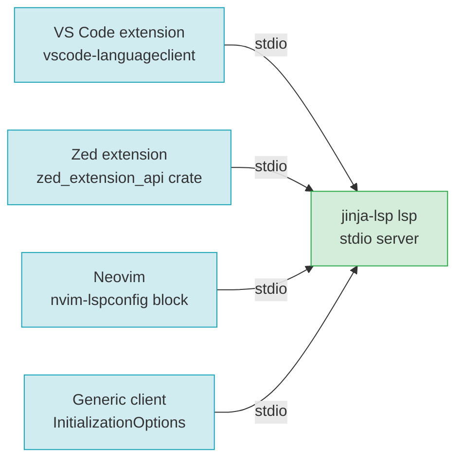

# F20 — Editor Integrations

> **Status:** Approved
>
> **Version:** 0.2   ·   **Last updated:** 2026-06-26
>
> **Purpose:** How each editor talks to the jinja-lsp binary — a VS Code extension, a Zed extension, a documented Neovim setup, and a generic LSP-client recipe — all over the single stdio transport, all configurable through keys that mirror `jinja.toml`.
>
> **Depends on:** [constitution](../constitution.md), [E01-architecture](../foundations/E01-architecture.md), [E15-app-config](../foundations/E15-app-config.md)   ·   **Related:** [F21-release-ci](F21-release-ci.md), [E03-tech-stack](../foundations/E03-tech-stack.md)

> Requirement tag: **EDIT**

---

## 1. Purpose & Scope

jinja-lsp is one binary that speaks standard LSP over stdio. This spec is about the thin shims each editor needs to launch that binary and hand it configuration — nothing more.

That's the whole design: the server owns the logic, and an integration is just *how this editor finds and starts the server* plus *how this editor's settings reach it*. Because every editor uses the same stdio transport ([ADR-009](../decisions/ADR-009-stdio-only-transport.md)), the integrations differ only in packaging.

This spec covers:

- A **VS Code** extension — language client, activation events, settings schema, syntax highlighting.
- A **Zed** extension — a Rust crate that registers the grammar and the language server.
- A **Neovim** setup — a documented `nvim-lspconfig` block, no plugin to publish.
- A **generic LSP-client** recipe — the `InitializationOptions` schema, so any client configures the server without a config file.

## 2. Non-Goals / Out of Scope

- The server's capabilities and protocol conduct — owned by [E01-architecture](../foundations/E01-architecture.md).
- Config keys and their meaning (`templates`, `extras`, `hints`, `lint.*`, …) — owned by [E15-app-config](../foundations/E15-app-config.md). This spec only maps editor settings *onto* those keys.
- Building and publishing the artifacts (marketplace, releases) — owned by [F21-release-ci](F21-release-ci.md).
- Any non-stdio transport — there isn't one ([ADR-009](../decisions/ADR-009-stdio-only-transport.md)).
- **First-class extensions for JetBrains, Sublime Text, and Emacs** — not shipped. Each has an LSP client (the JetBrains LSP API, Sublime's LSP package, Emacs `lsp-mode`/`eglot`), so all three are covered by the generic stdio recipe (§5.5): point the client at `jinja-lsp lsp` and send `InitializationOptions`. We publish no maintained plugin for them — the maintenance cost of three more shims isn't justified while the generic recipe already works. A dedicated plugin can be added later without affecting this spec.
- **A standalone Helix plugin** — Helix is a generic stdio client configured through its own `languages.toml`; it is served by the §5.5 recipe, not a bespoke integration (see T-22 / E2E-09).

## 3. Background & Rationale

The Zed extension is a small `zed_extension_api` crate that declares the tree-sitter-jinja grammar and the jinja-lsp language server. Alongside it, jinja-lsp ships integrations for the editors developers actually use.

The guiding rule is that an integration must add *zero* analysis logic. It launches the binary, forwards settings, and gets out of the way. If an integration starts to "know things" about Jinja, that knowledge belongs in the server, not the shim.

Every integration assumes the `jinja-lsp` binary is reachable. Onboarding therefore starts with one install step before any editor setup: `pip install jinja-lsp` or `uv tool install jinja-lsp` for the Python audience, or `cargo install jinja-lsp` for Rust developers — all the same self-contained binary, no toolchain required for the pip/uv path ([ADR-010](../decisions/ADR-010-pypi-distribution.md), published from the same release as the marketplace and GitHub artifacts — [F21](F21-release-ci.md)). The Zed extension can also fetch the binary itself (REQ-EDIT-12). When the binary is missing the not-found UX (§6.3) repeats these channels, so the install path is documented both up front and at the point of failure.

Two config delivery paths exist and they layer. A project with a `jinja.toml` is configured by that file; the editor needs to supply nothing. On top of that file (or, with no file, on top of the zero-config defaults) the editor's LSP `InitializationOptions` are overlaid, overriding any key they set — so a user can keep a shared `jinja.toml` and still override a key from their editor. The `InitializationOptions` schema mirrors the config keys exactly. Same keys, two delivery mechanisms, file-then-overlay precedence ([E15](../foundations/E15-app-config.md) REQ-CFG-11) — see §5.5.

## 4. Concepts & Definitions

- **Language client** — the editor-side half of LSP that launches and talks to the server.
- **Activation event** — the VS Code trigger that loads the extension (e.g. opening a `.jinja` file).
- **`InitializationOptions`** — the JSON blob a client sends in the `initialize` request to configure a server without a config file. (Schema in §5.5.)
- **Config file** — `jinja.toml` or `pyproject.toml`'s `[tool.jinja]`. (Canonical definition in [glossary](../glossary.md).)
- **tmLanguage** — the TextMate grammar format VS Code uses for syntax highlighting.

## 5. Detailed Specification

### 5.1 Shared contract — stdio, every editor

Every integration launches the same binary the same way.

**REQ-EDIT-01 — All integrations launch `jinja-lsp lsp` over stdio.**

The server is invoked as `jinja-lsp lsp`; the client communicates over the process's stdin/stdout. There is no TCP/`--http` option to configure ([ADR-009](../decisions/ADR-009-stdio-only-transport.md)). An integration must let the user override the binary path (for a non-`PATH` install) but must default to discovering `jinja-lsp` on `PATH`.

**REQ-EDIT-02 — Configuration reaches the server one of two ways.**

A `jinja.toml` / `pyproject.toml` in the workspace (the server discovers it — [E15](../foundations/E15-app-config.md)) and/or the client's `InitializationOptions` (§5.5). When both are present, the file is the base and `InitializationOptions` override it per-key; keys the editor omits keep the file's values ([E15](../foundations/E15-app-config.md) REQ-CFG-11). With no file, the options overlay the zero-config defaults. No integration invents its own config format.

**REQ-EDIT-11 — Canonical LSP languageIds; every shim maps onto them.**

The server treats a buffer as Jinja when the client opens it with one of two **canonical LSP `languageId`s** — the value carried in `textDocument/didOpen`'s `languageId` field, the one source of truth a generic client must target:

| Canonical `languageId` | Meaning |
|---|---|
| `jinja` | a standalone Jinja template (any host language, or none) |
| `jinja-html` | a Jinja template whose host language is HTML |

These two ids are the server's whole vocabulary; it recognizes nothing else. Every editor shim maps its own editor-local filetype/language names **onto** these ids — the editor-side name is cosmetic, but the `languageId` on the wire must be one of the two above. The per-editor mapping is:

| Editor | Editor-local name(s) | → canonical `languageId` |
|---|---|---|
| VS Code | `jinja`, `jinja-html` | `jinja`, `jinja-html` (already canonical) |
| Zed | `Jinja2 (HTML)` (legacy display name) | `jinja-html` |
| Neovim | `htmldjango`, `jinja`, `jinja.html` filetypes | `jinja-html` (HTML hosts), else `jinja` |
| Generic client | — | sends `jinja` / `jinja-html` directly |

A generic client (§5.5) that sends neither id is not recognized as Jinja; this table is the authoritative list it targets.

### 5.2 VS Code extension

A TypeScript extension that bundles a language client and a settings UI.

**REQ-EDIT-03 — Language client over stdio.**

The extension uses `vscode-languageclient` to spawn `jinja-lsp lsp` and pipe LSP over stdio. The binary path is taken from the `jinja-lsp.server.path` setting, defaulting to `jinja-lsp` on `PATH`. On a missing binary it surfaces a "jinja-lsp not found — install with `pip install jinja-lsp`, `uv tool install jinja-lsp`, or `cargo install jinja-lsp`, or set jinja-lsp.server.path" notification (the install channels of [ADR-010](../decisions/ADR-010-pypi-distribution.md) / [F21](F21-release-ci.md)) rather than failing silently. The toast is drawn in §6.3.

**REQ-EDIT-04 — Activation events.**

The extension activates `onLanguage:jinja`, `onLanguage:jinja-html`, and on opening any workspace containing a `jinja.toml`. It does not activate eagerly — an unrelated project pays no cost.

**REQ-EDIT-05 — Settings schema wraps the config keys.**

The extension contributes a `configuration` block whose properties wrap the `jinja.toml` keys one-to-one under a `jinja-lsp.*` namespace, so a user who prefers GUI settings never writes TOML. The mapping is mechanical:

| VS Code setting | `jinja.toml` key |
|---|---|
| `jinja-lsp.templates` | `templates` |
| `jinja-lsp.extensions` | `extensions` |
| `jinja-lsp.extras` | `extras` |
| `jinja-lsp.customBuiltins` | `custom_builtins` |
| `jinja-lsp.hints` | `hints` |
| `jinja-lsp.lint.select` | `lint.select` |
| `jinja-lsp.lint.ignore` | `lint.ignore` |
| `jinja-lsp.server.path` | *(client-only — the binary location)* |

These settings are forwarded as `InitializationOptions` (§5.5) on start and via `workspace/didChangeConfiguration` on change, so a workspace `jinja.toml` still overrides them per REQ-EDIT-02.

**REQ-EDIT-06 — tmLanguage syntax highlighting.**

The extension ships a `jinja.tmLanguage.json` and a language contribution registering the `jinja` / `jinja-html` languages with the usual file extensions (`.html`, `.jinja`, `.jinja2`, `.j2`). This is editor-side colorization only — it is independent of the server's semantic tokens ([F13](F13-semantic-tokens.md) layers on top of it).

### 5.3 Zed extension

A small Rust crate compiled to WASM.

**REQ-EDIT-07 — Rust extension crate registering grammar + server.**

The extension is a `zed_extension_api` crate (`crate-type = ["cdylib"]`) whose `extension.toml` declares the tree-sitter-jinja grammar and the language server. The grammar entry points at the upstream `alex-oleshkevich/tree-sitter-jinja` ([ADR-002](../decisions/ADR-002-tree-sitter-grammar.md)); the `[language_servers.jinja2-lsp]` entry names the server and its languages. The crate's `language_server_command` returns `jinja-lsp lsp` over stdio, falling back to the downloaded release binary (REQ-EDIT-12) when `jinja-lsp` isn't on `PATH`. The Zed language-server id is **`jinja2-lsp`** and the language is **`Jinja2 (HTML)`**, ported verbatim from the legacy manually-created `.zed/settings.json` so existing Zed users' configuration keeps working; the binary itself remains `jinja-lsp`.

**REQ-EDIT-08 — Server registration and configuration.**

The extension registers the `jinja2-lsp` language server for the `Jinja2 (HTML)` language and forwards Zed's `lsp.jinja2-lsp.initialization_options` as the server's `InitializationOptions` (§5.5), so Zed users configure the server through `settings.json` — overlaid on any `jinja.toml` per REQ-EDIT-02.

**REQ-EDIT-12 — Zed downloads and checksum-verifies the release binary when it isn't on `PATH`.**

When `jinja-lsp` isn't on `PATH`, the Zed extension fetches the matching release binary from the GitHub release over HTTPS and **verifies it against its published checksum before launching it** — a downloaded binary whose checksum doesn't match is rejected and never executed. The checksum is the one published alongside the release artifact by [F21](F21-release-ci.md) (the single source of truth for the published checksum); the extension does not compute or trust its own. This is the only network access any integration performs (§13.1); it is a client-side download, not a server transport ([ADR-009](../decisions/ADR-009-stdio-only-transport.md)). VS Code and the documented Neovim block do not auto-download — they surface a not-found notification (REQ-EDIT-03) or a failed `cmd` instead.

### 5.4 Neovim — documented `nvim-lspconfig` block

Neovim needs no published plugin; a documented config block is the deliverable.

**REQ-EDIT-09 — Ship a documented `nvim-lspconfig` recipe.**

The docs provide a copy-paste Lua block that registers `jinja-lsp` with `nvim-lspconfig`: the `cmd` (`{ "jinja-lsp", "lsp" }`), the `filetypes` (Neovim's `jinja` / `jinja.html` / `htmldjango`, which map onto the canonical `languageId`s per REQ-EDIT-11), a `root_dir` keyed on `jinja.toml` / `pyproject.toml` / `.git`, and an `init_options` table mirroring the config keys (§5.5). The block is shown in §6.2 and lives in the repo's README. No code to maintain beyond the snippet.

### 5.5 Generic LSP clients — the `InitializationOptions` schema

Any LSP client can configure the server with no config file by sending `InitializationOptions`.

**REQ-EDIT-10 — `InitializationOptions` mirrors `jinja.toml`.**

A generic client opens its buffer with one of the canonical `languageId`s (`jinja` / `jinja-html`, REQ-EDIT-11) and configures the server with `InitializationOptions`. The `initializationOptions` object the server accepts in `initialize` has one field per config key, with the same names and types as `jinja.toml` ([E15](../foundations/E15-app-config.md)). The full shape is in §8. The server overlays these on top of the discovered config file (or the zero-config defaults), overriding the keys they set (REQ-EDIT-02, [E15](../foundations/E15-app-config.md) REQ-CFG-11); they are the universal, editor-independent configuration path. This is the same schema every integration above forwards — VS Code settings, Zed `initialization_options`, and Neovim `init_options` all serialize into this one object.

## 6. UI Mockups

### 6.1 VS Code settings panel

What a user sees in **Settings → Extensions → Jinja LSP** — the GUI wrapper over the `jinja.toml` keys (REQ-EDIT-05). Editing any field forwards it to the server. Shown here in the **`starlette-blog` configured** state (fields filled in); the default state is every field empty.

```
┌─ Settings  ›  Extensions  ›  Jinja LSP ──────── [ starlette-blog ] ───┐
│                                                                       │
│  Jinja-lsp › Server: Path                                             │
│  Absolute path to the jinja-lsp binary. Empty = found on PATH.        │
│  [ jinja-lsp                                                       ]  │
│                                                                       │
│  Jinja-lsp › Templates              (maps to  templates)              │
│  Template directories to scan. Use "..." to add auto-discovered.      │
│  [ templates                                          ] [ + Add Item ]│
│                                                                       │
│  Jinja-lsp › Extensions             (maps to  extensions)             │
│  File extensions to scan.                                             │
│  [ html ] [ jinja ] [ jinja2 ] [ j2 ]                 [ + Add Item ]  │
│                                                                       │
│  Jinja-lsp › Extras                 (maps to  extras)                 │
│  Extension packs to activate.                                         │
│  [✔] starlette   [ ] flask   [ ] starlette-babel  [ ] starlette-flash │
│                                                                       │
│  Jinja-lsp › Custom Builtins        (maps to  custom_builtins)        │
│  Directories of built-in-format .md docs.                             │
│  [ vendor/jinja-docs                                  ] [ + Add Item ]│
│                                                                       │
│  Jinja-lsp › Hints                  (maps to  hints)                  │
│  Directories holding user hint files.                                 │
│  [ hints                                              ] [ + Add Item ]│
│                                                                       │
│  Jinja-lsp › Lint: Select / Ignore  (maps to  lint.select/ignore)     │
│  Diagnostic codes or class prefixes (e.g. JINJA-E1).                  │
│  select [                       ]   ignore [ JINJA-W203          ]    │
│                                                                       │
│  ⓘ These settings override matching keys in a workspace jinja.toml.   │
└───────────────────────────────────────────────────────────────────── ┘
```

All eight wrapped keys from the §5.2 table appear here — `server.path` (client-only), `templates`, `extensions`, `extras`, `custom_builtins`, `hints`, and `lint.select`/`lint.ignore` — so REQ-EDIT-05's one-to-one wrap is visibly complete; no key is hidden from the GUI.

States: **default** (all fields empty → server uses zero-config discovery) · **`starlette-blog` configured** (shown above) · **binary-not-found** (the toast in §6.3) · **workspace-has-config** (the info banner in §6.4).

### 6.2 Neovim `nvim-lspconfig` snippet

The copy-paste block for `init.lua` (REQ-EDIT-09). `init_options` mirrors the config keys (§5.5).

```lua
-- ~/.config/nvim/init.lua  (or a plugin module)
local lspconfig = require("lspconfig")
local configs   = require("lspconfig.configs")

if not configs.jinja_lsp then
  configs.jinja_lsp = {
    default_config = {
      cmd        = { "jinja-lsp", "lsp" },          -- stdio transport (ADR-009)
      filetypes  = { "jinja", "jinja.html", "htmldjango" },  -- → languageId jinja / jinja-html (REQ-EDIT-11)
      root_dir   = lspconfig.util.root_pattern("jinja.toml", "pyproject.toml", ".git"),
      init_options = {                              -- mirrors jinja.toml (E15)
        templates = { "templates", "..." },
        extras    = { "starlette" },
        hints     = { "hints" },
        lint      = { ignore = { "JINJA-W203" } },
      },
    },
  }
end

lspconfig.jinja_lsp.setup({})
```

States: with a workspace `jinja.toml` the `init_options` override the keys they set on top of the file (REQ-EDIT-02) · without one, `init_options` overlay the zero-config defaults.

### 6.3 Binary-not-found toast

The VS Code notification when neither `PATH` nor `jinja-lsp.server.path` resolves the binary (REQ-EDIT-03, §10, E2E-03). It points at the install channels rather than failing silently.

```
  ┌─ jinja-lsp ─────────────────────────────────────────────[ ✕ ]┐
  │                                                              │
  │  jinja-lsp not found.                                        │
  │                                                              │
  │  Install it:                                                 │
  │    pip install jinja-lsp     uv tool install jinja-lsp       │
  │    cargo install jinja-lsp                                   │
  │  ...or set  jinja-lsp.server.path  to the binary.            │
  │                                                              │
  │          [ Open Settings ]  [ Install Docs ]  [ Dismiss ]    │
  └──────────────────────────────────────────────────────────────┘
```

States: shown once per session on a failed launch; **Install Docs** links the [ADR-010](../decisions/ADR-010-pypi-distribution.md) / [F21](F21-release-ci.md) install page, **Open Settings** jumps to `jinja-lsp.server.path`.

### 6.4 Config-override info banner

The inline banner shown atop the §6.1 settings panel (the **workspace-has-config** state) when a `jinja.toml` is present, so the user knows GUI settings overlay — not replace — the file (REQ-EDIT-02).

```
  ╭──────────────────────────────────────────────────────────────╮
  │  (i) A workspace jinja.toml is in effect. Settings below     │
  │      override matching keys per-key; keys you leave empty    │
  │      keep the file's values.                  [ Open file ]  │
  ╰──────────────────────────────────────────────────────────────╯
```

States: present only when a config file is discovered; absent in the default and `starlette-blog` (no-file) states.

> Zed and Neovim expose no settings GUI of their own — they are configured through `settings.json` (Zed `lsp.jinja2-lsp.initialization_options`) and `init.lua` (`init_options`) respectively, which are config-file surfaces, not rendered UI; their only F20 visual surfaces are the §6.2 snippet and the shared not-found path (a failed `cmd` / `:LspInfo` entry, no toast).

## 7. Visualizations

How each editor reaches the one binary — different shims, one stdio server.



## 8. Data Shapes

The `InitializationOptions` object every integration forwards and the server reads when no config file is found (REQ-EDIT-10). Field names and types mirror `jinja.toml` ([E15](../foundations/E15-app-config.md)).

```json
{
  "templates": ["templates", "..."],
  "extensions": ["html", "jinja", "jinja2", "j2"],
  "extras": ["starlette"],
  "custom_builtins": ["docs/builtins"],
  "hints": ["hints"],
  "lint": {
    "select": [],
    "ignore": ["JINJA-W203"]
  }
}
```

## 9. Examples & Use Cases

A developer on `starlette-blog` opens `templates/blog/post.html` in VS Code. The extension activates `onLanguage:jinja`, spawns `jinja-lsp lsp`, and — because the project has a `jinja.toml` with `extras = ["starlette"]` — the server resolves `request` and the post.html diagnostics light up. The same developer's teammate prefers Zed; the Zed extension launches the identical binary over stdio and they see identical findings.

A third teammate runs Neovim with no `jinja.toml`. They paste the §6.2 block, set `init_options.extras = { "starlette" }`, and the server picks up the Starlette pack through `InitializationOptions` instead of a config file — same result, different delivery (REQ-EDIT-02).

## 10. Edge Cases & Failure Modes

- **Binary not on `PATH` and no override** → VS Code shows the not-found toast (§6.3) pointing at the pip/uv/cargo install channels (ADR-010) and `server.path`; Zed downloads and checksum-verifies the release binary (REQ-EDIT-12); Neovim's `cmd` fails and `:LspInfo` reports it.
- **Both `jinja.toml` and editor settings present** → the file is the base and editor settings override the keys they set; keys they omit keep the file's values (REQ-EDIT-02).
- **Unknown `extra` in editor settings** → forwarded to the server, which reports it as a config error ([E15](../foundations/E15-app-config.md)); the integration doesn't validate config itself.
- **A slug passed in `lint.ignore` via settings** → rejected by the server (slugs aren't input — [ADR-003](../decisions/ADR-003-diagnostic-code-scheme.md)); the integration forwards it verbatim.
- **Editor looks for TCP/`--http`** → no such flag or listener exists, so there is nothing to reject; stdio is the only transport ([ADR-009](../decisions/ADR-009-stdio-only-transport.md)).

## 11. Testing

Each integration is tested at its boundary: the extensions through their client harness and a smoke launch of the binary; the documented snippets through a doc-check that the `cmd` and option keys are valid.

### 11.1 Scope & coverage

Target: **100% of this feature's behavior is covered.** Every `REQ-EDIT-NN` maps to at least one test; every surface (§6) and edge case (§10) has a test. See the policy in [E17-testing](../foundations/E17-testing.md#2-coverage-policy).

### 11.2 Test plan

Rows are grouped by editor so every integration is traced across the same three launch cases — **discovery on `PATH`**, **explicit `server.path` override**, **binary-not-found** — plus its settings→`InitializationOptions` mapping, the shared stdio-only rejection, the §10 edges, and the §6 states. "Editor" cells name the exact shim under test.

| # | Behavior / scenario | Type | Fixtures | Verifies |
|---|---|---|---|---|
| **Shared contract — stdio, every editor** ||||
| T-01 | Every shim's launch command is `jinja-lsp lsp` and pipes LSP over stdin/stdout — no TCP/`--http` argument is emitted by any integration | unit | — | REQ-EDIT-01 |
| T-02 | No `--http`/TCP transport exists to request — the binary exposes no listener flag and the integrations expose no such setting, so stdio is the sole transport with no active rejection path (ADR-009) | unit | — | REQ-EDIT-01 |
| T-03 | Config layers two ways: with a workspace `jinja.toml` present the editor's forwarded settings override the keys they set while unmentioned keys keep the file's values; without a file the forwarded `InitializationOptions` overlay the defaults (REQ-EDIT-02) | integration | starlette-blog, config-reload | REQ-EDIT-02 |
| **VS Code extension** ||||
| T-04 | Discovery on `PATH`: with `jinja-lsp.server.path` empty the client resolves `jinja-lsp` on `PATH`, spawns `jinja-lsp lsp`, and negotiates capabilities on `initialize` | integration | starlette-blog | REQ-EDIT-01, REQ-EDIT-03 |
| T-05 | Explicit override: a non-empty `jinja-lsp.server.path` is used verbatim as the binary location to spawn `jinja-lsp lsp` over stdio | unit | — | REQ-EDIT-01, REQ-EDIT-03 |
| T-06 | Binary-not-found (§6.3 toast, §10): neither `PATH` nor `jinja-lsp.server.path` resolves → the not-found toast is shown listing the pip/uv/cargo install channels (ADR-010) and the `server.path` option; the client does not fail silently or crash | unit | — | REQ-EDIT-03 |
| T-07 | Activation fires `onLanguage:jinja`, `onLanguage:jinja-html`, and on opening a workspace containing `jinja.toml`; it does not activate for an unrelated project | integration | starlette-blog | REQ-EDIT-04 |
| T-08 | Settings map one-to-one onto `jinja.toml` keys (`templates`→`templates`, `extensions`→`extensions`, `extras`→`extras`, `customBuiltins`→`custom_builtins`, `hints`→`hints`, `lint.select`→`lint.select`, `lint.ignore`→`lint.ignore`; `server.path` is client-only) and serialize into the §5.5 `InitializationOptions` | unit | — | REQ-EDIT-05, REQ-EDIT-10 |
| T-09 | Settings are forwarded as `InitializationOptions` on start and re-pushed via `workspace/didChangeConfiguration` on change | unit | — | REQ-EDIT-05 |
| T-10 | §6 default state: all settings empty → no `InitializationOptions` are forced and the server uses zero-config discovery | unit | — | REQ-EDIT-05, REQ-EDIT-10 |
| T-11 | §6.4 workspace-has-config state: a workspace `jinja.toml` is present → the info banner renders noting forwarded settings override matching file keys per-key (REQ-EDIT-02) | integration | starlette-blog | REQ-EDIT-02 |
| T-12 | tmLanguage: `jinja.tmLanguage.json` and the language contribution register the `jinja` / `jinja-html` languages with extensions `.html`, `.jinja`, `.jinja2`, `.j2` | unit | — | REQ-EDIT-06 |
| **Zed extension** ||||
| T-13 | `extension.toml` declares the upstream `alex-oleshkevich/tree-sitter-jinja` grammar (ADR-002) and the `[language_servers.jinja2-lsp]` server (language `Jinja2 (HTML)`) with its languages; the crate is `crate-type = ["cdylib"]` | unit | — | REQ-EDIT-07 |
| T-14 | Discovery on `PATH`: `language_server_command` returns `jinja-lsp lsp` over stdio when the binary is on `PATH` | integration | — | REQ-EDIT-07 |
| T-15 | Binary-not-found (§10, Zed path): when `jinja-lsp` is not on `PATH` the extension downloads the release binary from the GitHub release over HTTPS and verifies it against its F21-published checksum before launching `jinja-lsp lsp` (§13.1) | unit | — | REQ-EDIT-12 |
| T-16 | Checksum mismatch: a downloaded release binary whose checksum does not match the F21-published one is rejected and not launched | unit | — | REQ-EDIT-12 |
| T-17 | Server registration: the extension registers the `jinja2-lsp` language server for the `Jinja2 (HTML)` language (ported from the legacy `.zed/settings.json`) and forwards `lsp.jinja2-lsp.initialization_options` as the server's `InitializationOptions` (§5.5) | unit | — | REQ-EDIT-08 |
| **Neovim — documented `nvim-lspconfig` block** ||||
| T-18 | Discovery / launch: the snippet's `cmd` is `{ "jinja-lsp", "lsp" }` (stdio), `filetypes` and `root_dir` (`jinja.toml` / `pyproject.toml` / `.git`) are valid, and `init_options` keys are valid §5.5 keys | doc-check | — | REQ-EDIT-09 |
| T-19 | Binary-not-found (§10, Neovim path): with `jinja-lsp` absent the `cmd` fails to spawn and `:LspInfo` reports the failure (no override mechanism beyond editing `cmd`) | doc-check | — | REQ-EDIT-09 |
| T-20 | §6 Neovim states: without a workspace `jinja.toml` the `init_options` overlay the defaults; with one they override matching file keys while unmentioned keys keep the file's values (REQ-EDIT-02) | integration | starlette-blog, config-reload | REQ-EDIT-09, REQ-EDIT-02 |
| **Generic LSP client (incl. Helix and any stdio client)** ||||
| T-21 | `InitializationOptions` schema: the object the server accepts in `initialize` has one field per `jinja.toml` key with the same names and types (§8), and is overlaid on the config file/defaults, overriding the keys it sets (REQ-EDIT-02) | unit | — | REQ-EDIT-10 |
| T-22 | A generic stdio client (e.g. Helix, configured with `command = "jinja-lsp"`, `args = ["lsp"]`) launches the server over stdio and configures it purely through `InitializationOptions`, no config file present | integration | — | REQ-EDIT-01, REQ-EDIT-10 |
| **Shared §10 edges — forwarded verbatim, server validates** ||||
| T-23 | Unknown `extra` in editor settings is forwarded unchanged; the server reports the config error (E15); the integration does not validate config | integration | — | REQ-EDIT-05, REQ-EDIT-10 |
| T-24 | A slug passed in `lint.ignore` via settings is forwarded verbatim and rejected by the server (slugs aren't input — ADR-003); the integration does not pre-filter it | integration | — | REQ-EDIT-05, REQ-EDIT-10 |
| **Canonical languageIds — one source of truth** ||||
| T-25 | The server treats a buffer as Jinja only when opened with `languageId` `jinja` or `jinja-html`; each shim's editor-local filetype/language name (VS Code `jinja`/`jinja-html`, Zed `Jinja2 (HTML)`, Neovim `htmldjango`/`jinja`/`jinja.html`) maps onto one of those two ids | unit | — | REQ-EDIT-11 |

### 11.3 Fixtures

- Reuses the `starlette-blog` workspace fixture ([E17-testing](../foundations/E17-testing.md#5-fixtures-registry)) as the project each editor opens. No integration-local fixtures.

### 11.4 Requirement coverage

| Requirement | Covered by |
|---|---|
| REQ-EDIT-01 | T-01, T-02 (stdio-only + TCP rejection); T-04, T-05 (VS Code PATH/override); T-22 (generic client) |
| REQ-EDIT-02 | T-03 (file base + options overlay); T-11 (VS Code banner); T-20 (Neovim) |
| REQ-EDIT-03 | T-04 (PATH spawn + negotiation), T-05 (override), T-06 (not-found notification) |
| REQ-EDIT-04 | T-07 (activation events + lazy non-activation) |
| REQ-EDIT-05 | T-08 (settings→keys mapping), T-09 (forward on start + didChangeConfiguration), T-10 (default state), T-23, T-24 (verbatim forwarding) |
| REQ-EDIT-06 | T-12 (tmLanguage registration) |
| REQ-EDIT-07 | T-13 (manifest), T-14 (PATH launch) |
| REQ-EDIT-08 | T-17 (Zed registration + init options) |
| REQ-EDIT-09 | T-18 (snippet keys), T-19 (not-found path), T-20 (Neovim states) |
| REQ-EDIT-10 | T-08, T-10 (mapping), T-21 (schema), T-22 (generic client), T-23, T-24 (verbatim forwarding) |
| REQ-EDIT-11 | T-25 (canonical languageIds + per-shim mapping) |
| REQ-EDIT-12 | T-15 (download + checksum), T-16 (checksum mismatch) |

## 12. End-to-End Test Plan

Each editor integration is exercised end to end by launching the real binary through its client and asserting a known diagnostic appears.

### 12.1 Coverage target

**100% of the feature's scope, end to end** — for each integration, a happy launch that yields diagnostics and the binary-not-found error path. See the policy in [E29-e2e-testing](../foundations/E29-e2e-testing.md#2-coverage-policy).

### 12.2 Scenarios

Each editor gets a happy launch (binary discovered or overridden → diagnostics) and its negative binary-not-found path, plus the stdio-only contract and the Zed download+checksum journey.

| # | Journey | Path | Expected outcome |
|---|---|---|---|
| E2E-01 | Open `post.html` in VS Code on `starlette-blog`, `jinja-lsp` on `PATH` | happy | client resolves `jinja-lsp` on `PATH`, spawns `jinja-lsp lsp`, negotiates capabilities; `publishDiagnostics` arrives |
| E2E-02 | VS Code with `jinja-lsp.server.path` set to a non-`PATH` install | happy | client spawns the overridden binary over stdio; diagnostics arrive |
| E2E-03 | VS Code: `jinja-lsp` not on `PATH` and no override | error | not-found toast (§6.3) listing the pip/uv/cargo install channels and the `server.path` option; no crash |
| E2E-04 | Open the same file in Zed, `jinja-lsp` on `PATH` | happy | identical diagnostics via the Zed extension over stdio |
| E2E-05 | Zed: `jinja-lsp` not on `PATH` | happy | extension downloads the release binary over HTTPS, verifies its published checksum, launches `jinja-lsp lsp`; diagnostics arrive |
| E2E-06 | Zed: downloaded release binary fails checksum verification | error | the binary is rejected and not launched; the server does not start |
| E2E-07 | Neovim with the documented block, `jinja-lsp` on `PATH` | happy | `:LspInfo` shows `jinja_lsp` attached; diagnostics arrive |
| E2E-08 | Neovim with the documented block, `jinja-lsp` absent | error | `cmd` fails to spawn; `:LspInfo` reports the failure; no crash |
| E2E-09 | Generic stdio client (e.g. Helix) sends `InitializationOptions`, no config file | happy | server applies them over stdio; Starlette `request` resolves |
| E2E-10 | Generic client looks for a TCP/`--http` transport | n/a | none exists — the binary ships no `--http` flag and opens no listener; there is nothing to reject, stdio is the sole transport (ADR-009) |
| E2E-11 | Workspace `jinja.toml` present while editor settings also set | happy | the file is the base; forwarded settings override the keys they set, unmentioned keys keep the file's values (REQ-EDIT-02) |

## 13. Non-Functional Requirements

### 13.1 Security & Privacy

- **Access & authorization** — integrations launch a local subprocess over stdio; the trust boundary is the developer's machine. No network listener is ever opened ([ADR-009](../decisions/ADR-009-stdio-only-transport.md)).
- **Input & validation** — editor settings are forwarded to the server as-is; the server validates them ([E15](../foundations/E15-app-config.md)). The binary-path setting is the one client-side input and is used only to spawn the process.
- **Data sensitivity** — nothing leaves the machine; the server has no network access. A downloaded Zed release binary is fetched from the GitHub release over HTTPS and verified against its [F21](F21-release-ci.md)-published checksum before launch (REQ-EDIT-12) — the one network operation any integration performs.

### 13.4 Performance & Scale

- **Latency** — integrations add no analysis cost; perceived latency is the server's (completions < 100 ms, index < 2 s / 500 templates — P6). Activation is lazy (REQ-EDIT-04) so unrelated projects pay nothing.

### 13.5 Observability

**N/A** — the integrations emit no telemetry, metrics, or trace spans of their own; they are thin shims that launch the binary and forward settings. Suite-wide observability (the `tracing` spans on slow paths, constitution §4.6) lives in the server and is owned by [E16-conventions](../foundations/E16-conventions.md); there is nothing for the editor side to observe.

## 15. Open Questions & Decisions

- **Decided** — stdio is the only transport every integration uses ([ADR-009](../decisions/ADR-009-stdio-only-transport.md)).
- **Decided** — the Zed extension is a `zed_extension_api` crate declaring the upstream grammar and the language server ([ADR-002](../decisions/ADR-002-tree-sitter-grammar.md)).
- **Decided** — no first-class JetBrains, Sublime Text, or Emacs plugin; all three use the generic stdio recipe (§2 Non-Goals).
- **Decided** — `jinja` / `jinja-html` are the canonical LSP `languageId`s every shim maps onto (REQ-EDIT-11).
- **OQ-EDIT-1** — whether to publish a standalone Neovim plugin later, or keep the documented block only (currently: documented block only).

## 16. Cross-References

- **Depends on:** [constitution](../constitution.md) — P2/P5 and the visualization rule; [E01-architecture](../foundations/E01-architecture.md) — capabilities and stdio transport; [E15-app-config](../foundations/E15-app-config.md) — the config keys these settings mirror.
- **Related:** [F21-release-ci](F21-release-ci.md) — building and publishing the extensions and binaries, and the source of the Zed download's published checksum (REQ-EDIT-12); [ADR-010](../decisions/ADR-010-pypi-distribution.md) — the pip/uv install channels surfaced in the not-found UX and onboarding; [E03-tech-stack](../foundations/E03-tech-stack.md) — the upstream grammar and `zed_extension_api`.

## 17. Changelog
- **2026-06-26** — Status: Draft → Approved.

- **2026-06-24** — Initial draft.
- **2026-06-25** — Expanded §11.2 test plan and §12.2 e2e scenarios to full combination coverage: each editor (VS Code, Zed, Neovim, generic/Helix) × {PATH discovery, `server.path` override, binary-not-found} happy + negative, the stdio-only/TCP-rejection contract (ADR-009), the Zed grammar + release-binary download + checksum (and mismatch) path, settings→`InitializationOptions` mapping with `didChangeConfiguration`, capability negotiation, and every §6 state and §10 edge. Rebuilt §11.4 so every REQ-EDIT maps to its concrete test IDs.
- **2026-06-26** — **Config-precedence flip + legacy Zed port.** Reconciled the precedence with [E15](../foundations/E15-app-config.md) REQ-CFG-11 and the legacy server: the config file (or zero-config defaults) is now the **base** and `InitializationOptions` are an **overlay that overrides per-key** — previously the spec said the file wins and options are ignored when a file exists. Updated REQ-EDIT-02/EDIT-10, §1, the §6.1 VS Code banner + states, §6.2 Neovim states, §10, and T-03/T-11/T-20/T-21/E2E-11 accordingly. Ported the legacy manually-created `.zed/settings.json` identifiers into the Zed extension (REQ-EDIT-07/08, T-13/T-17): language-server id **`jinja2-lsp`**, language **`Jinja2 (HTML)`**, settings key `lsp.jinja2-lsp.initialization_options` — the binary stays `jinja-lsp`. Note: the Zed server id now differs from VS Code's `jinja-lsp`; unify if a suite-wide rename is desired.
- **2026-06-26** — **Spec-review batch (v0.2): identifiers, Zed download REQ, GUI completeness, excluded editors, install UX, missing mockups + sections.** Added **REQ-EDIT-11** defining `jinja` / `jinja-html` as the canonical LSP `languageId`s with a per-editor mapping table, and reconciled the Neovim filetypes / VS Code language ids / Zed `Jinja2 (HTML)` onto it (jinja-lsp-z7l, jinja-lsp-8ne; new T-25, §5.5 pointer). Promoted the Zed download+checksum into its own **REQ-EDIT-12**, cross-referencing [F21](F21-release-ci.md) as the source of the published checksum and pulling T-15/T-16 + §13.1 onto it (jinja-lsp-81i). Added `extensions` and `custom_builtins` to the §6.1 settings mockup so all eight wrapped keys are visible (jinja-lsp-2u6). Recorded JetBrains / Sublime / Emacs (and standalone Helix) as §2 Non-Goals — covered by the generic recipe, no maintained plugin (jinja-lsp-svg). Added the pip/uv/cargo install channels ([ADR-010](../decisions/ADR-010-pypi-distribution.md)) to the not-found message (REQ-EDIT-03, T-06, §10, E2E-03) and a §3 onboarding install note (jinja-lsp-i0k). Drew the §6.3 not-found toast and §6.4 config-override banner mockups (jinja-lsp-r7j). Added a §13.5 Observability **N/A** note (jinja-lsp-5qc). Labeled the §6.1 mockup the **`starlette-blog` configured** state with its state list (jinja-lsp-u72). Reworded T-02 / E2E-10 / §10 to "no `--http` flag exists; stdio is the sole transport, nothing to reject" rather than implying an active rejection path (jinja-lsp-xkw). Added [ADR-010](../decisions/ADR-010-pypi-distribution.md) to Related and two §15 Decided entries.
