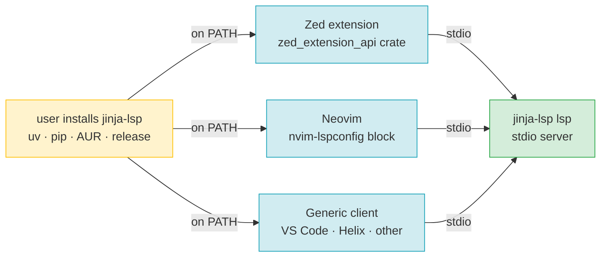

# F20 — Editor Integrations

> **Status:** Approved
>
> **Version:** 0.3   ·   **Last updated:** 2026-08-19
>
> **Purpose:** How each editor talks to the jinja-lsp binary — a Zed extension, a documented Neovim setup, and a generic LSP-client recipe — all over the single stdio transport, all against a **preinstalled** binary, all configurable through keys that mirror `jinja.toml`.
>
> **Depends on:** [constitution](../constitution.md), [E01-architecture](../foundations/E01-architecture.md), [E15-app-config](../foundations/E15-app-config.md)   ·   **Related:** [F21-release-ci](F21-release-ci.md), [E03-tech-stack](../foundations/E03-tech-stack.md), [ADR-011](../decisions/ADR-011-distribution-channels.md)

> Requirement tag: **EDIT**

---

## 1. Purpose & Scope

jinja-lsp is one binary that speaks standard LSP over stdio. This spec is about the thin shims each editor needs to launch that binary and hand it configuration — nothing more.

That's the whole design: the server owns the logic, and an integration is just *how this editor finds and starts the server* plus *how this editor's settings reach it*. Because every editor uses the same stdio transport ([ADR-009](../decisions/ADR-009-stdio-only-transport.md)), the integrations differ only in packaging.

This spec covers:

- A **Zed** extension — a Rust crate that registers the grammar and the language server.
- A **Neovim** setup — a documented `nvim-lspconfig` block, no plugin to publish.
- A **generic LSP-client** recipe — the `InitializationOptions` schema, so any client configures the server without a config file.
- The **preinstalled-binary contract** every integration honors.

## 2. Non-Goals / Out of Scope

- The server's capabilities and protocol conduct — owned by [E01-architecture](../foundations/E01-architecture.md).
- Config keys and their meaning (`templates`, `extras`, `hints`, `lint.*`, …) — owned by [E15-app-config](../foundations/E15-app-config.md). This spec only maps editor settings *onto* those keys.
- Building and publishing the artifacts (releases, the Zed marketplace) — owned by [F21-release-ci](F21-release-ci.md).
- Any non-stdio transport — there isn't one ([ADR-009](../decisions/ADR-009-stdio-only-transport.md)).
- **Installing the server binary.** No integration downloads, fetches, bundles, or installs `jinja-lsp` ([ADR-011](../decisions/ADR-011-distribution-channels.md)) — see REQ-EDIT-13. Installation is the user's step, documented by [F21](F21-release-ci.md).
- **A VS Code extension** — not shipped ([ADR-011](../decisions/ADR-011-distribution-channels.md)). VS Code has a first-class generic LSP client; it is served by the §5.4 recipe like any other stdio client. The TypeScript language client, activation manifest, settings-schema mirror, and `tmLanguage` grammar were a second product to maintain in lockstep with [E15](../foundations/E15-app-config.md) on every change, for no analysis capability the generic recipe lacks.
- **First-class extensions for JetBrains, Sublime Text, and Emacs** — not shipped. Each has an LSP client (the JetBrains LSP API, Sublime's LSP package, Emacs `lsp-mode`/`eglot`), so all three are covered by the generic stdio recipe (§5.4): point the client at `jinja-lsp lsp` and send `InitializationOptions`. We publish no maintained plugin for them — the maintenance cost of three more shims isn't justified while the generic recipe already works. A dedicated plugin can be added later without affecting this spec.
- **A standalone Helix plugin** — Helix is a generic stdio client configured through its own `languages.toml`; it is served by the §5.4 recipe, not a bespoke integration (see T-18 / E2E-07).

## 3. Background & Rationale

The Zed extension is a small `zed_extension_api` crate that declares the tree-sitter-jinja grammar and the jinja-lsp language server. Alongside it, jinja-lsp ships integrations for the editors developers actually use.

The guiding rule is that an integration must add *zero* analysis logic. It launches the binary, forwards settings, and gets out of the way. If an integration starts to "know things" about Jinja, that knowledge belongs in the server, not the shim.

A second rule follows from [ADR-011](../decisions/ADR-011-distribution-channels.md): an integration must add *zero* installation logic either. Every integration assumes the `jinja-lsp` binary is already installed and reachable. Onboarding therefore starts with one install step before any editor setup: `uv tool install jinja-lsp` or `pip install jinja-lsp` for the Python audience, `yay -S jinja-lsp-plus-bin` on Arch, or a binary download from the GitHub release ([F21](F21-release-ci.md)) — all the same self-contained binary, no toolchain required ([ADR-010](../decisions/ADR-010-pypi-distribution.md)). No extension fetches it on the user's behalf: a fetch-and-execute path is the highest-consequence code in an editor shim, and it exists to save a step the user can take once. When the binary is missing, the not-found UX (§6.2) repeats these channels, so the install path is documented both up front and at the point of failure.

Two config delivery paths exist and they layer. A project with a `jinja.toml` is configured by that file; the editor needs to supply nothing. On top of that file (or, with no file, on top of the zero-config defaults) the editor's LSP `InitializationOptions` are overlaid, overriding any key they set — so a user can keep a shared `jinja.toml` and still override a key from their editor. The `InitializationOptions` schema mirrors the config keys exactly. Same keys, two delivery mechanisms, file-then-overlay precedence ([E15](../foundations/E15-app-config.md) REQ-CFG-11) — see §5.4.

## 4. Concepts & Definitions

- **Language client** — the editor-side half of LSP that launches and talks to the server.
- **Preinstalled binary** — a `jinja-lsp` executable the *user* installed, discoverable on `PATH` or named by the client's binary-path setting. The only kind of binary any integration launches (REQ-EDIT-13).
- **`InitializationOptions`** — the JSON blob a client sends in the `initialize` request to configure a server without a config file. (Schema in §5.4.)
- **Config file** — `jinja.toml` or `pyproject.toml`'s `[tool.jinja]`. (Canonical definition in [glossary](../glossary.md).)

## 5. Detailed Specification

### 5.1 Shared contract — stdio, a preinstalled binary, every editor

Every integration launches the same binary the same way, and none of them install it.

**REQ-EDIT-01 — All integrations launch `jinja-lsp lsp` over stdio.**

The server is invoked as `jinja-lsp lsp`; the client communicates over the process's stdin/stdout. There is no TCP/`--http` option to configure ([ADR-009](../decisions/ADR-009-stdio-only-transport.md)). An integration must let the user override the binary path (for a non-`PATH` install) but must default to discovering `jinja-lsp` on `PATH`.

**REQ-EDIT-02 — Configuration reaches the server one of two ways.**

A `jinja.toml` / `pyproject.toml` in the workspace (the server discovers it — [E15](../foundations/E15-app-config.md)) and/or the client's `InitializationOptions` (§5.4). When both are present, the file is the base and `InitializationOptions` override it per-key; keys the editor omits keep the file's values ([E15](../foundations/E15-app-config.md) REQ-CFG-11). With no file, the options overlay the zero-config defaults. No integration invents its own config format.

**REQ-EDIT-13 — The binary is preinstalled; no integration ever fetches it.**

Every integration requires `jinja-lsp` to be installed by the user before the integration can start it. No integration downloads, fetches, bundles, unpacks, or installs the binary, and none performs any network operation whatsoever ([ADR-011](../decisions/ADR-011-distribution-channels.md)) — the whole product, server and shims alike, makes no network access (§13.1).

Resolution order for every integration is exactly two steps:

1. the user's explicit binary-path setting, if set — used verbatim;
2. otherwise `jinja-lsp` discovered on `PATH`.

When neither resolves, the integration **fails with a message** (§6.2) that names the install channels and the releases page, and does not start a server. It does not fall back to any other binary, and it does not attempt a repair. The wording is kept identical across integrations so the failure reads the same in every editor.

**REQ-EDIT-11 — Canonical LSP languageIds; every shim maps onto them.**

The server treats a buffer as Jinja when the client opens it with one of two **canonical LSP `languageId`s** — the value carried in `textDocument/didOpen`'s `languageId` field, the one source of truth a generic client must target:

| Canonical `languageId` | Meaning |
|---|---|
| `jinja` | a standalone Jinja template (any host language, or none) |
| `jinja-html` | a Jinja template whose host language is HTML |

These two ids are the server's whole vocabulary; it recognizes nothing else. Every editor shim maps its own editor-local filetype/language names **onto** these ids — the editor-side name is cosmetic, but the `languageId` on the wire must be one of the two above. The per-editor mapping is:

| Editor | Editor-local name(s) | → canonical `languageId` |
|---|---|---|
| Zed | `Jinja2 (HTML)` (legacy display name) | `jinja-html` |
| Neovim | `htmldjango`, `jinja`, `jinja.html` filetypes | `jinja-html` (HTML hosts), else `jinja` |
| Generic client (incl. VS Code, Helix) | — | sends `jinja` / `jinja-html` directly |

A generic client (§5.4) that sends neither id is not recognized as Jinja; this table is the authoritative list it targets.

### 5.2 Zed extension

A small Rust crate compiled to WASM.

**REQ-EDIT-07 — Rust extension crate registering grammar + server.**

The extension is a `zed_extension_api` crate (`crate-type = ["cdylib"]`) whose `extension.toml` declares the tree-sitter-jinja grammar and the language server. The grammar entry points at the upstream `alex-oleshkevich/tree-sitter-jinja` ([ADR-002](../decisions/ADR-002-tree-sitter-grammar.md)); the `[language_servers.jinja2-lsp]` entry names the server and its languages. The crate's `language_server_command` returns `jinja-lsp lsp` over stdio, resolved per REQ-EDIT-13 — the user's `binary.path` setting, else `worktree.which("jinja-lsp")`, else the not-found error. The Zed language-server id is **`jinja2-lsp`** and the language is **`Jinja2 (HTML)`**, ported verbatim from the legacy manually-created `.zed/settings.json` so existing Zed users' configuration keeps working; the binary itself remains `jinja-lsp`.

The extension is published to the Zed marketplace under the extension id **`jinja-plus`** (the id `jinja-lsp` was already taken); it ships the extension only — never the binary ([ADR-011](../decisions/ADR-011-distribution-channels.md), [F21](F21-release-ci.md) REQ-REL-06).

**REQ-EDIT-08 — Server registration and configuration.**

The extension registers the `jinja2-lsp` language server for the `Jinja2 (HTML)` language and forwards Zed's `lsp.jinja2-lsp.initialization_options` as the server's `InitializationOptions` (§5.4), so Zed users configure the server through `settings.json` — overlaid on any `jinja.toml` per REQ-EDIT-02.

**REQ-EDIT-14 — The WASM sandbox constrains how the extension reads its environment.**

The extension runs in Zed's WASM sandbox, which wires up no host OS syscalls. It must read the environment exclusively through the extension API — `worktree.shell_env()` and `worktree.which()` — and never through `std::env::var`, which compiles but always fails at runtime. The returned `Command` carries `worktree.shell_env()` so GUI launches inherit the user's `PATH`, activated virtualenvs, and toolchain variables.

All three `LspSettings` hooks are implemented — `language_server_command`, `language_server_initialization_options`, and `language_server_workspace_configuration` — each routed through `LspSettings::for_worktree`, so users have a standard way to override the binary path and pass server config even for options the server does not consume yet. The extension is the stable interface; the server can adopt them later.

### 5.3 Neovim — documented `nvim-lspconfig` block

Neovim needs no published plugin; a documented config block is the deliverable.

**REQ-EDIT-09 — Ship a documented `nvim-lspconfig` recipe.**

The docs provide a copy-paste Lua block that registers `jinja-lsp` with `nvim-lspconfig`: the `cmd` (`{ "jinja-lsp", "lsp" }`), the `filetypes` (Neovim's `jinja` / `jinja.html` / `htmldjango`, which map onto the canonical `languageId`s per REQ-EDIT-11), a `root_dir` keyed on `jinja.toml` / `pyproject.toml` / `.git`, and an `init_options` table mirroring the config keys (§5.4). The block is shown in §6.1 and lives in the repo's README. No code to maintain beyond the snippet.

### 5.4 Generic LSP clients — the `InitializationOptions` schema

Any LSP client — VS Code, Helix, JetBrains, Sublime, Emacs, or anything else — configures the server with no config file by sending `InitializationOptions`.

**REQ-EDIT-10 — `InitializationOptions` mirrors `jinja.toml`.**

A generic client opens its buffer with one of the canonical `languageId`s (`jinja` / `jinja-html`, REQ-EDIT-11) and configures the server with `InitializationOptions`. The `initializationOptions` object the server accepts in `initialize` has one field per config key, with the same names and types as `jinja.toml` ([E15](../foundations/E15-app-config.md)). The full shape is in §8. The server overlays these on top of the discovered config file (or the zero-config defaults), overriding the keys they set (REQ-EDIT-02, [E15](../foundations/E15-app-config.md) REQ-CFG-11); they are the universal, editor-independent configuration path. This is the same schema every integration above forwards — Zed `initialization_options` and Neovim `init_options` both serialize into this one object.

## 6. UI Mockups

### 6.1 Neovim `nvim-lspconfig` snippet

The copy-paste block for `init.lua` (REQ-EDIT-09). `init_options` mirrors the config keys (§5.4).

```lua
-- ~/.config/nvim/init.lua  (or a plugin module)
local lspconfig = require("lspconfig")
local configs   = require("lspconfig.configs")

if not configs.jinja_lsp then
  configs.jinja_lsp = {
    default_config = {
      cmd        = { "jinja-lsp", "lsp" },          -- stdio transport (ADR-009); preinstalled (REQ-EDIT-13)
      filetypes  = { "jinja", "jinja.html", "htmldjango" },  -- → languageId jinja / jinja-html (REQ-EDIT-11)
      root_dir   = lspconfig.util.root_pattern("jinja.toml", "pyproject.toml", ".git"),
      init_options = {                              -- mirrors jinja.toml (E15)
        templates = { "templates", "..." },
        extras    = { "starlette" },
        hints     = { "hints" },
        lint      = { ignore = { "JINJA-W203" } },
      },
    },
  }
end

lspconfig.jinja_lsp.setup({})
```

States: with a workspace `jinja.toml` the `init_options` override the keys they set on top of the file (REQ-EDIT-02) · without one, `init_options` overlay the zero-config defaults.

### 6.2 Binary-not-found message

What every integration shows when neither the user's binary-path setting nor `PATH` resolves the binary (REQ-EDIT-13, §10, E2E-03). It names the install channels and the releases page and stops — it never installs anything itself. Zed surfaces this text in its LSP startup logs; a generic client surfaces it as a failed spawn.

```
  jinja-lsp was not found on your PATH.
  This extension does not download it — you must install it manually.
  Repository: https://github.com/alex-oleshkevich/jinja-lsp
  Releases:   https://github.com/alex-oleshkevich/jinja-lsp/releases
```

The wording is identical across integrations (and across the maintainer's other LSP extensions) so the failure reads the same everywhere. Install channels are listed by [F21](F21-release-ci.md) REQ-REL-06: `uv tool install jinja-lsp` / `pip install jinja-lsp`, `yay -S jinja-lsp-plus-bin`, or a release download.

States: emitted once per failed launch attempt; no server process is started.

> Zed and Neovim expose no settings GUI — they are configured through `settings.json` (Zed `lsp.jinja2-lsp.initialization_options`) and `init.lua` (`init_options`) respectively, which are config-file surfaces, not rendered UI. Their only F20 visual surfaces are the §6.1 snippet and the shared not-found message above (a Zed LSP-log entry / a failed `cmd` and `:LspInfo` entry).

## 7. Visualizations

How each editor reaches the one preinstalled binary — different shims, one stdio server, no download path.


```mermaid
flowchart LR
    INS[user installs jinja-lsp<br/>uv · pip · AUR · release]:::pre
    ZED[Zed extension<br/>zed_extension_api crate]:::cli
    NV[Neovim<br/>nvim-lspconfig block]:::cli
    GEN[Generic client<br/>VS Code · Helix · other]:::cli
    SRV[jinja-lsp lsp<br/>stdio server]:::srv
    INS -- on PATH --> ZED
    INS -- on PATH --> NV
    INS -- on PATH --> GEN
    ZED -- stdio --> SRV
    NV -- stdio --> SRV
    GEN -- stdio --> SRV
    classDef cli fill:#d1ecf1,stroke:#17a2b8;
    classDef srv fill:#d4edda,stroke:#28a745;
    classDef pre fill:#fff3cd,stroke:#ffc107;
```

## 8. Data Shapes

The `InitializationOptions` object every integration forwards and the server reads when no config file is found (REQ-EDIT-10). Field names and types mirror `jinja.toml` ([E15](../foundations/E15-app-config.md)).

```json
{
  "templates": ["templates", "..."],
  "extensions": ["html", "jinja", "jinja2", "j2"],
  "extras": ["starlette"],
  "custom_builtins": ["docs/builtins"],
  "hints": ["hints"],
  "lint": {
    "select": [],
    "ignore": ["JINJA-W203"]
  }
}
```

## 9. Examples & Use Cases

A developer on `starlette-blog` runs `uv tool install jinja-lsp`, then opens `templates/blog/post.html` in Zed. The extension finds `jinja-lsp` on `PATH`, spawns `jinja-lsp lsp`, and — because the project has a `jinja.toml` with `extras = ["starlette"]` — the server resolves `request` and the post.html diagnostics light up.

A teammate prefers Neovim with no `jinja.toml`. They install the binary the same way, paste the §6.1 block, set `init_options.extras = { "starlette" }`, and the server picks up the Starlette pack through `InitializationOptions` instead of a config file — same result, different delivery (REQ-EDIT-02).

A third teammate uses VS Code. There is no jinja-lsp extension to install; they point VS Code's generic LSP client at `jinja-lsp lsp` and send the same `InitializationOptions` object (§5.4) — or simply rely on the shared `jinja.toml`, which needs no editor configuration at all.

## 10. Edge Cases & Failure Modes

- **Binary not on `PATH` and no override** → every integration emits the §6.2 not-found message and starts no server (REQ-EDIT-13). Zed logs it in the LSP startup log; Neovim's `cmd` fails and `:LspInfo` reports it; a generic client reports a failed spawn. No integration downloads a replacement.
- **Binary-path setting points at a missing or non-executable file** → the spawn fails and the integration reports it; it does **not** silently fall back to `PATH` discovery, because a user who set the path explicitly meant that binary (REQ-EDIT-13 step 1 is used verbatim).
- **Zed extension installed from the marketplace, binary never installed** → the extension loads and the language is recognized, but the server never starts and the §6.2 message appears in the LSP log. This is the expected onboarding failure ([ADR-011](../decisions/ADR-011-distribution-channels.md) accepts it in exchange for having no fetch path).
- **`std::env::var` used inside the Zed extension** → compiles, always returns `Err` at runtime in the WASM sandbox; the environment must come from `worktree.shell_env()` (REQ-EDIT-14).
- **Both `jinja.toml` and editor settings present** → the file is the base and editor settings override the keys they set; keys they omit keep the file's values (REQ-EDIT-02).
- **Unknown `extra` in editor settings** → forwarded to the server, which reports it as a config error ([E15](../foundations/E15-app-config.md)); the integration doesn't validate config itself.
- **A slug passed in `lint.ignore` via settings** → rejected by the server (slugs aren't input — [ADR-003](../decisions/ADR-003-diagnostic-code-scheme.md)); the integration forwards it verbatim.
- **Editor looks for TCP/`--http`** → no such flag or listener exists, so there is nothing to reject; stdio is the only transport ([ADR-009](../decisions/ADR-009-stdio-only-transport.md)).

## 11. Testing

Each integration is tested at its boundary: the Zed extension through its manifest and command-construction assertions plus a smoke launch of the binary; the documented snippets through a doc-check that the `cmd` and option keys are valid.

### 11.1 Scope & coverage

Target: **100% of this feature's behavior is covered.** Every `REQ-EDIT-NN` maps to at least one test; every surface (§6) and edge case (§10) has a test. See the policy in [E17-testing](../foundations/E17-testing.md#2-coverage-policy).

### 11.2 Test plan

Rows are grouped by editor so every integration is traced across the same three launch cases — **discovery on `PATH`**, **explicit binary-path override**, **binary-not-found** — plus its settings→`InitializationOptions` mapping, the shared stdio-only and no-download contracts, the §10 edges, and the §6 states. "Editor" cells name the exact shim under test.

| # | Behavior / scenario | Type | Fixtures | Verifies |
|---|---|---|---|---|
| **Shared contract — stdio, preinstalled binary, every editor** ||||
| T-01 | Every shim's launch command is `jinja-lsp lsp` and pipes LSP over stdin/stdout — no TCP/`--http` argument is emitted by any integration | unit | — | REQ-EDIT-01 |
| T-02 | No `--http`/TCP transport exists to request — the binary exposes no listener flag and the integrations expose no such setting, so stdio is the sole transport with no active rejection path (ADR-009) | unit | — | REQ-EDIT-01 |
| T-03 | Config layers two ways: with a workspace `jinja.toml` present the editor's forwarded settings override the keys they set while unmentioned keys keep the file's values; without a file the forwarded `InitializationOptions` overlay the defaults (REQ-EDIT-02) | integration | starlette-blog, config-reload | REQ-EDIT-02 |
| T-04 | No integration source contains a download, fetch, HTTP, or archive-extraction path, and none references a release-asset URL (structural assertion over the extension crate) | unit | — | REQ-EDIT-13 |
| T-05 | Resolution order is exactly two steps: an explicit binary-path setting is used verbatim; otherwise `PATH` discovery; there is no third fallback | unit | — | REQ-EDIT-13 |
| T-06 | Binary-not-found: neither the path setting nor `PATH` resolves → the §6.2 message is emitted naming the install channels and releases page, and no server process is started | unit | — | REQ-EDIT-13 |
| T-07 | An explicit binary-path setting pointing at a missing/non-executable file fails without falling back to `PATH` (§10) | unit | — | REQ-EDIT-13 |
| **Zed extension** ||||
| T-08 | `extension.toml` declares the upstream `alex-oleshkevich/tree-sitter-jinja` grammar (ADR-002) and the `[language_servers.jinja2-lsp]` server (language `Jinja2 (HTML)`) with its languages; the crate is `crate-type = ["cdylib"]`; the extension id is `jinja-plus` | unit | — | REQ-EDIT-07 |
| T-09 | Discovery on `PATH`: `language_server_command` returns `jinja-lsp lsp` over stdio via `worktree.which` when the binary is on `PATH` | integration | — | REQ-EDIT-07, REQ-EDIT-13 |
| T-10 | Explicit override: a `binary.path` in `LspSettings` is used verbatim as the command, with `binary.arguments` defaulting to `["lsp"]` | unit | — | REQ-EDIT-07, REQ-EDIT-13 |
| T-11 | Not-found: `worktree.which` returning nothing produces the §6.2 message verbatim (identical wording across the maintainer's LSP extensions) and no command | unit | — | REQ-EDIT-13 |
| T-12 | Server registration: the extension registers the `jinja2-lsp` language server for the `Jinja2 (HTML)` language (ported from the legacy `.zed/settings.json`) and forwards `lsp.jinja2-lsp.initialization_options` as the server's `InitializationOptions` (§5.4) | unit | — | REQ-EDIT-08 |
| T-13 | WASM-sandbox conduct: the extension source contains no `std::env::var`; the returned `Command` carries `worktree.shell_env()`; all three `LspSettings` hooks are implemented and routed through `LspSettings::for_worktree` | unit | — | REQ-EDIT-14 |
| **Neovim — documented `nvim-lspconfig` block** ||||
| T-14 | Discovery / launch: the snippet's `cmd` is `{ "jinja-lsp", "lsp" }` (stdio), `filetypes` and `root_dir` (`jinja.toml` / `pyproject.toml` / `.git`) are valid, and `init_options` keys are valid §5.4 keys | doc-check | — | REQ-EDIT-09 |
| T-15 | Binary-not-found (§10, Neovim path): with `jinja-lsp` absent the `cmd` fails to spawn and `:LspInfo` reports the failure (no override mechanism beyond editing `cmd`) | doc-check | — | REQ-EDIT-09, REQ-EDIT-13 |
| T-16 | §6 Neovim states: without a workspace `jinja.toml` the `init_options` overlay the defaults; with one they override matching file keys while unmentioned keys keep the file's values (REQ-EDIT-02) | integration | starlette-blog, config-reload | REQ-EDIT-09, REQ-EDIT-02 |
| **Generic LSP client (incl. VS Code, Helix, and any stdio client)** ||||
| T-17 | `InitializationOptions` schema: the object the server accepts in `initialize` has one field per `jinja.toml` key with the same names and types (§8), and is overlaid on the config file/defaults, overriding the keys it sets (REQ-EDIT-02) | unit | — | REQ-EDIT-10 |
| T-18 | A generic stdio client (e.g. Helix, configured with `command = "jinja-lsp"`, `args = ["lsp"]`) launches the server over stdio and configures it purely through `InitializationOptions`, no config file present | integration | — | REQ-EDIT-01, REQ-EDIT-10 |
| **Shared §10 edges — forwarded verbatim, server validates** ||||
| T-19 | Unknown `extra` in editor settings is forwarded unchanged; the server reports the config error (E15); the integration does not validate config | integration | — | REQ-EDIT-10 |
| T-20 | A slug passed in `lint.ignore` via settings is forwarded verbatim and rejected by the server (slugs aren't input — ADR-003); the integration does not pre-filter it | integration | — | REQ-EDIT-10 |
| **Canonical languageIds — one source of truth** ||||
| T-21 | The server treats a buffer as Jinja only when opened with `languageId` `jinja` or `jinja-html`; each shim's editor-local filetype/language name (Zed `Jinja2 (HTML)`, Neovim `htmldjango`/`jinja`/`jinja.html`, generic client direct) maps onto one of those two ids | unit | — | REQ-EDIT-11 |

### 11.3 Fixtures

- Reuses the `starlette-blog` workspace fixture ([E17-testing](../foundations/E17-testing.md#5-fixtures-registry)) as the project each editor opens. No integration-local fixtures.

### 11.4 Requirement coverage

| Requirement | Covered by |
|---|---|
| REQ-EDIT-01 | T-01, T-02 (stdio-only + no TCP); T-09 (Zed PATH launch); T-18 (generic client) |
| REQ-EDIT-02 | T-03 (file base + options overlay); T-16 (Neovim states) |
| REQ-EDIT-07 | T-08 (manifest + extension id), T-09 (PATH launch), T-10 (path override) |
| REQ-EDIT-08 | T-12 (Zed registration + init options) |
| REQ-EDIT-09 | T-14 (snippet keys), T-15 (not-found path), T-16 (Neovim states) |
| REQ-EDIT-10 | T-17 (schema), T-18 (generic client), T-19, T-20 (verbatim forwarding) |
| REQ-EDIT-11 | T-21 (canonical languageIds + per-shim mapping) |
| REQ-EDIT-13 | T-04 (no download path), T-05 (two-step resolution), T-06 (not-found message), T-07 (explicit path no fallback), T-11 (Zed message), T-15 (Neovim path) |
| REQ-EDIT-14 | T-13 (no `std::env::var`, `shell_env`, all three `LspSettings` hooks) |

**Retired requirements** ([ADR-011](../decisions/ADR-011-distribution-channels.md)) — numbers are retired, not reused: **REQ-EDIT-03**, **REQ-EDIT-04**, **REQ-EDIT-05**, **REQ-EDIT-06** (VS Code extension: language client, activation events, settings schema, tmLanguage), **REQ-EDIT-12** (Zed downloads and checksum-verifies the release binary).

## 12. End-to-End Test Plan

Each editor integration is exercised end to end by launching the real binary through its client and asserting a known diagnostic appears.

### 12.1 Coverage target

**100% of the feature's scope, end to end** — for each integration, a happy launch that yields diagnostics and the binary-not-found error path. See the policy in [E29-e2e-testing](../foundations/E29-e2e-testing.md#2-coverage-policy).

### 12.2 Scenarios

Each editor gets a happy launch (binary discovered or overridden → diagnostics) and its negative binary-not-found path, plus the stdio-only and no-download contracts.

| # | Journey | Path | Expected outcome |
|---|---|---|---|
| E2E-01 | Open `post.html` in Zed on `starlette-blog`, `jinja-lsp` preinstalled on `PATH` | happy | extension resolves the binary via `worktree.which`, spawns `jinja-lsp lsp`, negotiates capabilities; `publishDiagnostics` arrives |
| E2E-02 | Zed with `lsp.jinja2-lsp.binary.path` set to a non-`PATH` install | happy | extension spawns the overridden binary over stdio; diagnostics arrive |
| E2E-03 | Zed: `jinja-lsp` not installed and no override | error | §6.2 not-found message in the LSP startup log; no server process; **no download attempted** |
| E2E-04 | Neovim with the documented block, `jinja-lsp` preinstalled | happy | `:LspInfo` shows `jinja_lsp` attached; diagnostics arrive |
| E2E-05 | Neovim with the documented block, `jinja-lsp` absent | error | `cmd` fails to spawn; `:LspInfo` reports the failure; no crash |
| E2E-06 | Generic stdio client sends `InitializationOptions`, no config file | happy | server applies them over stdio; Starlette `request` resolves |
| E2E-07 | Generic client (Helix) configured via its own `languages.toml` | happy | server attaches over stdio; identical diagnostics to Zed/Neovim |
| E2E-08 | Generic client looks for a TCP/`--http` transport | n/a | none exists — the binary ships no `--http` flag and opens no listener; there is nothing to reject, stdio is the sole transport (ADR-009) |
| E2E-09 | Workspace `jinja.toml` present while editor settings also set | happy | the file is the base; forwarded settings override the keys they set, unmentioned keys keep the file's values (REQ-EDIT-02) |
| E2E-10 | Network is unavailable entirely (offline machine, binary preinstalled) | happy | every integration works unchanged — no integration performs any network operation (REQ-EDIT-13, §13.1) |

## 13. Non-Functional Requirements

### 13.1 Security & Privacy

- **Access & authorization** — integrations launch a local subprocess over stdio; the trust boundary is the developer's machine. No network listener is ever opened ([ADR-009](../decisions/ADR-009-stdio-only-transport.md)).
- **Input & validation** — editor settings are forwarded to the server as-is; the server validates them ([E15](../foundations/E15-app-config.md)). The binary-path setting is the one client-side input and is used only to spawn the process.
- **Data sensitivity** — nothing leaves the machine, with no exceptions. No integration performs any network operation: there is no binary download, no update check, and no telemetry ([ADR-011](../decisions/ADR-011-distribution-channels.md), REQ-EDIT-13). The server has no network access of its own ([ADR-009](../decisions/ADR-009-stdio-only-transport.md)). Artifact integrity is a *release-time* concern verified by the user or their package manager against the checksums and provenance attestations [F21](F21-release-ci.md) publishes — not something an extension does at launch.

### 13.4 Performance & Scale

- **Latency** — integrations add no analysis cost; perceived latency is the server's (completions < 100 ms, index < 2 s / 500 templates — P6). Nothing is fetched at startup, so first-launch time is a process spawn.

### 13.5 Observability

**N/A** — the integrations emit no telemetry, metrics, or trace spans of their own; they are thin shims that launch the binary and forward settings. Suite-wide observability (the `tracing` spans on slow paths, constitution §4.6) lives in the server and is owned by [E16-conventions](../foundations/E16-conventions.md); there is nothing for the editor side to observe.

## 15. Open Questions & Decisions

- **Decided** — stdio is the only transport every integration uses ([ADR-009](../decisions/ADR-009-stdio-only-transport.md)).
- **Decided** — the Zed extension is a `zed_extension_api` crate declaring the upstream grammar and the language server ([ADR-002](../decisions/ADR-002-tree-sitter-grammar.md)).
- **Decided** — the binary is preinstalled; no integration ever downloads it ([ADR-011](../decisions/ADR-011-distribution-channels.md), REQ-EDIT-13).
- **Decided** — no VS Code extension; VS Code is served by the generic stdio recipe ([ADR-011](../decisions/ADR-011-distribution-channels.md), §2 Non-Goals).
- **Decided** — no first-class JetBrains, Sublime Text, or Emacs plugin; all three use the generic stdio recipe (§2 Non-Goals).
- **Decided** — `jinja` / `jinja-html` are the canonical LSP `languageId`s every shim maps onto (REQ-EDIT-11).
- **OQ-EDIT-1** — whether to publish a standalone Neovim plugin later, or keep the documented block only (currently: documented block only).
- **OQ-EDIT-2** — whether to document a ready-made VS Code generic-LSP-client recipe in the README (as we do for Neovim and Helix), now that no extension ships (currently: not documented).

## 16. Cross-References

- **Depends on:** [constitution](../constitution.md) — P2/P5 and the visualization rule; [E01-architecture](../foundations/E01-architecture.md) — capabilities and stdio transport; [E15-app-config](../foundations/E15-app-config.md) — the config keys these settings mirror; [ADR-011](../decisions/ADR-011-distribution-channels.md) — the preinstalled-binary contract and the dropped VS Code extension.
- **Related:** [F21-release-ci](F21-release-ci.md) — building and publishing the extension and binaries, and the install channels the not-found message names; [ADR-010](../decisions/ADR-010-pypi-distribution.md) — the pip/uv install channels surfaced in the not-found UX and onboarding; [E03-tech-stack](../foundations/E03-tech-stack.md) — the upstream grammar and `zed_extension_api`.

## 17. Changelog
- **2026-08-19** — **v0.3: VS Code dropped, Zed auto-download dropped, preinstalled-binary contract added** ([ADR-011](../decisions/ADR-011-distribution-channels.md)). Retired **REQ-EDIT-03/04/05/06** (the whole VS Code extension — language client, activation events, settings schema, tmLanguage) and **REQ-EDIT-12** (Zed downloads and checksum-verifies the release binary); those numbers are retired, not reused. Added **REQ-EDIT-13** (the binary is preinstalled; two-step resolution — explicit path, then `PATH`; no integration ever fetches it; the shared not-found message) and **REQ-EDIT-14** (WASM-sandbox conduct: no `std::env::var`, `worktree.shell_env()` on the returned command, all three `LspSettings` hooks). Rewrote §1/§2/§3/§4, the §5.1 shared contract, the §5.2 Zed section (marketplace id `jinja-plus`, ships the extension only), §7 (the diagram now shows the user install step feeding every shim), §9, §10, §13.1 ("nothing leaves the machine" now holds without an exception clause), and §15. Replaced the VS Code settings-panel, not-found-toast, and config-banner mockups with the single shared §6.2 not-found message. Rebuilt §11.2/§11.4 and §12.2 around the three remaining integrations, adding structural no-download assertions (T-04..T-07) and an offline-machine journey (E2E-10). VS Code, Helix, JetBrains, Sublime, and Emacs are now all one row: generic stdio clients.
- **2026-06-26** — Status: Draft → Approved.

- **2026-06-24** — Initial draft.
- **2026-06-25** — Expanded §11.2 test plan and §12.2 e2e scenarios to full combination coverage: each editor (VS Code, Zed, Neovim, generic/Helix) × {PATH discovery, `server.path` override, binary-not-found} happy + negative, the stdio-only/TCP-rejection contract (ADR-009), the Zed grammar + release-binary download + checksum (and mismatch) path, settings→`InitializationOptions` mapping with `didChangeConfiguration`, capability negotiation, and every §6 state and §10 edge. Rebuilt §11.4 so every REQ-EDIT maps to its concrete test IDs.
- **2026-06-26** — **Config-precedence flip + legacy Zed port.** Reconciled the precedence with [E15](../foundations/E15-app-config.md) REQ-CFG-11 and the legacy server: the config file (or zero-config defaults) is now the **base** and `InitializationOptions` are an **overlay that overrides per-key** — previously the spec said the file wins and options are ignored when a file exists. Updated REQ-EDIT-02/EDIT-10, §1, the §6.1 VS Code banner + states, §6.2 Neovim states, §10, and T-03/T-11/T-20/T-21/E2E-11 accordingly. Ported the legacy manually-created `.zed/settings.json` identifiers into the Zed extension (REQ-EDIT-07/08, T-13/T-17): language-server id **`jinja2-lsp`**, language **`Jinja2 (HTML)`**, settings key `lsp.jinja2-lsp.initialization_options` — the binary stays `jinja-lsp`. Note: the Zed server id now differs from VS Code's `jinja-lsp`; unify if a suite-wide rename is desired.
- **2026-06-26** — **Spec-review batch (v0.2): identifiers, Zed download REQ, GUI completeness, excluded editors, install UX, missing mockups + sections.** Added **REQ-EDIT-11** defining `jinja` / `jinja-html` as the canonical LSP `languageId`s with a per-editor mapping table, and reconciled the Neovim filetypes / VS Code language ids / Zed `Jinja2 (HTML)` onto it (jinja-lsp-z7l, jinja-lsp-8ne; new T-25, §5.5 pointer). Promoted the Zed download+checksum into its own **REQ-EDIT-12**, cross-referencing [F21](F21-release-ci.md) as the source of the published checksum and pulling T-15/T-16 + §13.1 onto it (jinja-lsp-81i). Added `extensions` and `custom_builtins` to the §6.1 settings mockup so all eight wrapped keys are visible (jinja-lsp-2u6). Recorded JetBrains / Sublime / Emacs (and standalone Helix) as §2 Non-Goals — covered by the generic recipe, no maintained plugin (jinja-lsp-svg). Added the pip/uv/cargo install channels ([ADR-010](../decisions/ADR-010-pypi-distribution.md)) to the not-found message (REQ-EDIT-03, T-06, §10, E2E-03) and a §3 onboarding install note (jinja-lsp-i0k). Drew the §6.3 not-found toast and §6.4 config-override banner mockups (jinja-lsp-r7j). Added a §13.5 Observability **N/A** note (jinja-lsp-5qc). Labeled the §6.1 mockup the **`starlette-blog` configured** state with its state list (jinja-lsp-u72). Reworded T-02 / E2E-10 / §10 to "no `--http` flag exists; stdio is the sole transport, nothing to reject" rather than implying an active rejection path (jinja-lsp-xkw). Added [ADR-010](../decisions/ADR-010-pypi-distribution.md) to Related and two §15 Decided entries.
