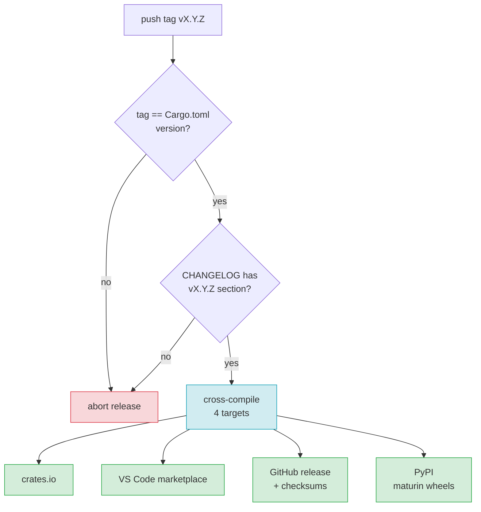

# F21 — Release & CI

> **Status:** Draft
>
> **Version:** 0.2   ·   **Last updated:** 2026-06-26
>
> **Purpose:** The continuous-integration pipeline and the release process — what runs on every push (lint, Rust tests with golden fixtures, the Python LSP-protocol E2E), the cross-compiled binaries we ship, where we distribute them, and the SemVer/CHANGELOG/tag discipline that keeps releases honest.
>
> **Depends on:** [constitution](../constitution.md), [E03-tech-stack](../foundations/E03-tech-stack.md), [E17-testing](../foundations/E17-testing.md), [E29-e2e-testing](../foundations/E29-e2e-testing.md)   ·   **Related:** [F19-cli-linter](F19-cli-linter.md), [F20-editor-integrations](F20-editor-integrations.md)

> Requirement tag: **REL**

---

## 1. Purpose & Scope

This spec is how the project stays shippable. Every push runs the same gates — formatting, lints, the Rust test suite with its golden fixtures, and the Python LSP-protocol E2E — and every tagged release produces signed, cross-compiled binaries and publishes them to the four places users get the tool.

The throughline is *no surprises at release time*. If `main` is green, a release is mechanical: the gates already ran, the artifacts already build, and the version is already in lockstep with the tag. Releases are cut **on demand at maintainer discretion** — there is no fixed schedule; consumers that auto-track (the Zed binary fetch, marketplace updates) pull whatever the latest published tag is.

This spec covers:

- The CI jobs: lint (clippy + rustfmt), Rust tests (cargo nextest, incl. golden `check` fixtures), and the Python E2E job (`pytest-lsp`).
- The release artifacts: cross-compiled binaries for four targets.
- Distribution: crates.io, **PyPI** (maturin wheels), the VS Code marketplace, and GitHub releases.
- Versioning discipline: SemVer, a per-release CHANGELOG, and the tag↔`Cargo.toml` version gate.

## 2. Non-Goals / Out of Scope

- The test *content* — what the golden fixtures and `pytest-lsp` cases assert — owned by [E17-testing](../foundations/E17-testing.md) and [E29-e2e-testing](../foundations/E29-e2e-testing.md).
- The editor extensions themselves — owned by [F20-editor-integrations](F20-editor-integrations.md); this spec only builds and publishes them.
- The tech-stack choices (Rust edition, dep versions) — owned by [E03-tech-stack](../foundations/E03-tech-stack.md).
- **Intel (x86_64) macOS prebuilt binaries** — we ship only `aarch64-apple-darwin` (REQ-REL-05). Apple Silicon is the forward-looking default and Intel Macs are EOL hardware; Intel users `cargo install jinja-lsp` (which builds natively for their host) rather than downloading a prebuilt. Revisit as a MINOR release if demand warrants.

## 3. Background & Rationale

The diagnostics engine has two distinct E2E branches ([E29](../foundations/E29-e2e-testing.md)), and CI must run both. Branch A is pure Rust — `cargo nextest` invokes `jinja-lsp check --format json` against each fixture and diffs the golden file. Branch B is the only Python in the repo — a `pytest-lsp` suite that drives the real stdio binary through the LSP handshake. They test different things (the catalog vs. the protocol), so they're separate jobs.

Cross-compilation matters because the binary is the product ([ADR-001](../decisions/ADR-001-language-and-runtime.md)): a single self-contained executable with no runtime dependency. We ship it for the platforms developers actually run, so nobody has to compile from source.

The version gate exists because a tag that disagrees with `Cargo.toml` is a footgun — crates.io would publish the wrong number, and the GitHub release would mislabel the binaries. CI refuses to release on a mismatch.

## 4. Concepts & Definitions

- **CI gate** — a job that must pass before merge; a red gate blocks the PR.
- **Golden fixture** — a fixture directory with an `expected-diagnostics.json` that `check --format json` is diffed against ([E29](../foundations/E29-e2e-testing.md) Branch A). (Canonical definition in [glossary](../glossary.md).)
- **`pytest-lsp`** — the LSP-client test fixture driving the real stdio binary ([E29](../foundations/E29-e2e-testing.md) Branch B).
- **Target triple** — a Rust cross-compilation target, e.g. `aarch64-apple-darwin`.
- **SemVer** — semantic versioning: `MAJOR.MINOR.PATCH`.

## 5. Detailed Specification

### 5.1 CI — what runs on every push and PR

Three jobs gate every change; all must be green to merge.

**REQ-REL-01 — Lint gate: clippy + rustfmt.**

A job runs `cargo fmt --check` and `cargo clippy --all-targets -- -D warnings`. Any formatting drift or clippy warning fails the gate. This is the cheapest job and runs first.

**REQ-REL-02 — Rust test gate: `cargo nextest`, including golden fixtures.**

A job runs `cargo nextest run` across unit, integration, and the golden `check` fixtures ([E29](../foundations/E29-e2e-testing.md) Branch A). The golden tests invoke the built binary with `check --format json` against each fixture and diff against `expected-diagnostics.json`; a diff fails the job and prints the unified diff. Goldens are updated deliberately with `UPDATE_FIXTURES=1`, never in CI.

**REQ-REL-03 — Python E2E gate: `pytest-lsp`.**

A separate job sets up Python (`setup-python`), installs `pytest` + `pytest-lsp` + `lsprotocol`, builds the binary, and runs the `tests/e2e/` suite ([E29](../foundations/E29-e2e-testing.md) Branch B). This drives the real `jinja-lsp lsp` stdio server through the LSP handshake — capability negotiation, `didOpen` → `publishDiagnostics`, `completion`, `hover`, `definition`. It is the only Python in the repo and the only job that needs a Python toolchain.

**REQ-REL-04 — The matrix runs on three host OSes.**

The lint and Rust-test gates run on Linux, macOS, and Windows runners so platform-specific path and line-ending bugs surface in CI, not in a user's editor. The Python E2E job runs on Linux (the binary is the same; one host is enough to exercise the protocol).

### 5.2 Release artifacts — cross-compiled binaries

A tagged release builds the binary for four targets.

**REQ-REL-05 — Four cross-compiled targets.**

Each release builds `jinja-lsp` for:

| Platform | Target triple |
|---|---|
| Linux x86_64 | `x86_64-unknown-linux-gnu` |
| Linux aarch64 | `aarch64-unknown-linux-gnu` |
| macOS arm64 | `aarch64-apple-darwin` |
| Windows x86_64 | `x86_64-pc-windows-msvc` |

Each artifact is a self-contained binary (no runtime dependency — [ADR-001](../decisions/ADR-001-language-and-runtime.md)), packaged as a `.tar.gz` (or `.zip` on Windows) with an accompanying SHA-256 checksum.

The `aarch64-unknown-linux-gnu` target is cross-compiled from the x86_64 Linux runner with `cross` (Docker-based), not native ARM runners or QEMU emulation of the test suite. Both `-gnu` Linux `.tar.gz` binaries link against a **glibc 2.28 baseline** (matching the manylinux 2_28 floor REQ-REL-10 sets for the wheels), so the raw downloads and the wheels share one minimum-glibc contract; the `cross` image is pinned to that baseline.

**REQ-REL-11 — Reproducible release builds: `--locked` against a committed `Cargo.lock`.**

`Cargo.lock` is committed to the repo and CI runs a check that fails if it is stale (`cargo update --locked --workspace` produces no diff). Every release and dry-run build passes `--locked`, so a transitive dependency bump can never silently change a released binary — a dep update is a deliberate, reviewed `Cargo.lock` change, consistent with the reproducibility ADR-002 leans on.

**REQ-REL-12 — crates.io publish vendors the git-pinned grammar dependency.**

The tree-sitter Jinja grammar is a git-pinned dependency ([ADR-002](../decisions/ADR-002-tree-sitter-grammar.md)), and `cargo publish` rejects crates with git dependencies. The crates.io release therefore publishes the grammar as a regular versioned dependency: the release job either (a) consumes an upstream-published `tree-sitter-jinja` crate at the pinned version, or (b) publishes a vendored grammar crate under our namespace first and depends on that by version. The git pin remains the source of truth for local/CI builds via `[patch.crates-io]`; only the crates.io channel substitutes the published version. The pinned revision and the published version must name the same grammar commit (asserted in the release job), so the crate users `cargo install` is built from the same grammar as every other channel.

**REQ-REL-13 — Signed provenance for release artifacts.**

Each release attaches **build provenance attestations** for every binary and wheel via GitHub artifact attestations (`actions/attest-build-provenance`, SLSA-style), and the `SHA256SUMS` file is itself signed (cosign / `gh attestation`). The checksum proves integrity; the attestation proves the artifact was built by this repo's release workflow from the tagged commit — so a downloader can verify *origin*, not just that the bytes match a checksum an attacker could have rewritten alongside the binary. The Zed extension's auto-download (REQ-EDIT-07, [F20](F20-editor-integrations.md)) verifies the attestation/signature, not only the digest. Signing key handling is specified in §13.1.

**REQ-REL-10 — Platform wheels via maturin.**

Each release also builds a Python wheel per target with `maturin` (PyO3/maturin-action, manylinux 2_28), bundling the prebuilt `jinja-lsp` binary as the wheel's entry point. The wheel carries no Python code and adds no runtime Python dependency — it is the same self-contained binary ([ADR-001](../decisions/ADR-001-language-and-runtime.md)), delivered through pip/uv ([ADR-010](../decisions/ADR-010-pypi-distribution.md)).

### 5.3 Distribution

Releases go to four channels, each serving a different consumer.

**REQ-REL-06 — Four distribution channels.**

| Channel | What ships | Consumed by |
|---|---|---|
| crates.io | the `jinja-lsp` crate | `cargo install jinja-lsp` users |
| PyPI | platform wheels (the bundled binary) | `pip install jinja-lsp` / `uv tool install jinja-lsp` users |
| VS Code marketplace | the VS Code extension ([F20](F20-editor-integrations.md)) | VS Code users |
| GitHub releases | the four cross-compiled binaries + checksums | direct downloads, the Zed extension's binary fetch ([F20](F20-editor-integrations.md)) |

A release publishes to all four from the same tag. The Zed extension's auto-download (REQ-EDIT-07) pulls from the GitHub release and verifies the signed checksum/attestation (REQ-REL-13). The `publish-pypi` job uploads the wheels via OIDC trusted publishing (`uv publish`), so no long-lived PyPI token is stored.

**REQ-REL-14 — Publish ordering.**

The four channels are not published in parallel; they have a build→publish topology. The release runs in stages: (1) the version + CHANGELOG gates and the cross-compile of all four binaries; (2) the maturin wheels, which bundle those binaries and therefore depend on stage 1; (3) the publish steps. Within publish, crates.io goes first (it resolves and uploads the source crate, REQ-REL-12), then the GitHub release (binaries + signed checksums), then PyPI (wheels), then the marketplace. A stage fails the whole release before the next begins; the partial-publish recovery (§10) applies only across the immutable publish steps, where ordering makes "which channels already published" deterministic.

### 5.4 Versioning discipline

Versions are SemVer, every release has a CHANGELOG entry, and the tag must match `Cargo.toml`.

**REQ-REL-07 — SemVer (policy, not a gated check).**

The version is `MAJOR.MINOR.PATCH`. A new diagnostic code, a new config key, or a new LSP capability is a MINOR bump; a breaking change to the config schema or the json output shape is a MAJOR bump; a fix is a PATCH. This is a **maintainer policy enforced at review**, not an automatable gate — CI cannot tell a MAJOR-worthy change shipped as PATCH. It is recorded here for discipline, and its non-enforceability is noted in §11.1; a future "breaking-change label" gate is an open question (OQ-REL-2).

**REQ-REL-08 — A CHANGELOG entry per release.**

`CHANGELOG.md` (Keep-a-Changelog style) gets a dated section per version, grouping Added / Changed / Fixed. The release job refuses to publish if the tag's version has no CHANGELOG section.

**REQ-REL-09 — Tag ↔ `Cargo.toml` version gate.**

The release is triggered by a `vMAJOR.MINOR.PATCH` tag. **Pre-release/RC tags are out of scope:** the version gate's regex matches only a strict `vMAJOR.MINOR.PATCH`, so a `v0.4.0-rc.1` tag does not trigger a release (it is ignored, not aborted) — there is no RC channel. A CI step asserts the tag's version equals `Cargo.toml`'s `package.version`; a mismatch fails the release before anything is published, so crates.io and the GitHub release can never disagree on the number. The gate also covers `pyproject.toml`: maturin reads the version *dynamically* from `Cargo.toml` (`dynamic = ["version"]`), so the wheel version is derived from `Cargo.toml` and cannot drift independently — PyPI and crates.io can never disagree on the number either.

## 6. UI Mockups

### 6.1 CI status — pull-request checks

The check list a contributor sees on a PR. All four must be green to merge (REQ-REL-01..04).

```
┌─ Checks — #142 Add JINJA-W107 invalid-noqa ───────────────────────────┐
│                                                                       │
│  ✔  lint            clippy + rustfmt                       12s        │
│  ✔  test (linux)    cargo nextest · 318 tests · 9 golden  1m 04s      │
│  ✔  test (macos)    cargo nextest · 318 tests             1m 22s      │
│  ✔  test (windows)  cargo nextest · 318 tests             2m 11s      │
│  ✔  e2e (pytest-lsp) 14 protocol journeys                  48s        │
│                                                                       │
│  All checks have passed — 5 successful                  [ Merge ▾ ]   │
└───────────────────────────────────────────────────────────────────── ┘
```

States: pending (spinners) · failing (a red ✘ with "Details" linking the job log; merge blocked) · golden-diff failure (the test job's log shows a unified diff of actual vs `expected-diagnostics.json`).

### 6.2 Release artifact table — a published GitHub release

What a tagged release publishes (REQ-REL-05, REQ-REL-06). Each binary ships with its checksum, and the `SHA256SUMS` is signed with a build-provenance attestation (REQ-REL-13).

```
┌─ Release  v0.4.0 ─────────────────────────────────────────────────────┐
│  Tagged v0.4.0 · Cargo.toml 0.4.0  ✔ version gate passed              │
│                                                                       │
│  Artifact                                       Target        Size    │
│  ───────────────────────────────────────────────────────────────────│
│  jinja-lsp-v0.4.0-x86_64-linux.tar.gz           linux x86_64   4.1 MB │
│  jinja-lsp-v0.4.0-aarch64-linux.tar.gz          linux aarch64  3.9 MB │
│  jinja-lsp-v0.4.0-aarch64-macos.tar.gz          macos arm64    3.8 MB │
│  jinja-lsp-v0.4.0-x86_64-windows.zip            windows x86_64 4.3 MB │
│  jinja_lsp-0.4.0-cp3-none-*.whl  (wheels, 4 targets)  maturin  ~4 MB  │
│  SHA256SUMS                                      checksums      1 KB  │
│                                                                       │
│  Also published →  crates.io 0.4.0 · PyPI 0.4.0 · VS Code marketplace 0.4.0 │
└───────────────────────────────────────────────────────────────────── ┘
```

States: drafting (artifacts uploading) · published (all four channels confirmed) · version-gate failure (release aborted before publish; "tag v0.4.0 ≠ Cargo.toml 0.3.9").

## 7. Visualizations

The release pipeline from tag to four channels — gated on the version check.



## 8. Data Shapes

A CHANGELOG section per release (REQ-REL-08), Keep-a-Changelog style. The release job parses it to confirm the tag's version is present.

```markdown
## [0.4.0] - 2026-06-24

### Added
- `JINJA-W107 invalid-noqa` — a `noqa` referencing a non-existent code now warns.

### Changed
- `check` gained `--format {rich,compact,json}` (default `rich`).

### Fixed
- E601 no longer fires on ``.
```

The root `pyproject.toml` (REQ-REL-10) configures maturin as the build backend; the wheel bundles the Rust binary and reads its version dynamically from `Cargo.toml`.

```toml
# pyproject.toml  (maturin build backend — wheels bundle the Rust binary)
[project]
name = "jinja-lsp"
dynamic = ["version"]          # read from Cargo.toml by maturin
description = "Language server for Jinja templates"
readme = "README.md"
license = { text = "MIT" }
requires-python = ">=3.8"

[build-system]
requires = ["maturin>=1.5"]
build-backend = "maturin"

[tool.maturin]
binaries = ["jinja-lsp"]
```

## 9. Examples & Use Cases

A contributor opens a PR adding `JINJA-W107`. CI runs the four gates (§6.1): clippy/rustfmt, the Rust suite on three OSes with the golden fixtures, and the `pytest-lsp` E2E. The golden job catches that a new fixture's `expected-diagnostics.json` was forgotten and fails with a unified diff. The contributor adds the golden, the gates go green, and the PR merges.

Later a maintainer cuts `v0.4.0`. They bump `Cargo.toml` to `0.4.0`, add the §8 CHANGELOG section, and push the tag. The version gate confirms `0.4.0 == 0.4.0`, the CHANGELOG section exists, the four binaries cross-compile, the maturin wheels build, and the release publishes to crates.io, PyPI, the marketplace, and GitHub releases at once (§6.2). The Zed extension's next launch downloads the new Linux binary and checks it against `SHA256SUMS`.

## 10. Edge Cases & Failure Modes

- **Tag ≠ `Cargo.toml` version** → release aborts before publishing anything (REQ-REL-09); no partial release.
- **No CHANGELOG section for the tag** → release aborts (REQ-REL-08).
- **A golden fixture is stale** → the Rust gate fails with a unified diff; goldens are updated locally with `UPDATE_FIXTURES=1`, never in CI (REQ-REL-02).
- **One target fails to cross-compile** → the whole release fails; we don't ship a partial set of binaries.
- **A wheel target fails to build** → the whole release fails; we don't ship a partial wheel set (mirrors the binary rule).
- **crates.io publish succeeds but the marketplace push fails** → the release is marked incomplete; crates.io publishes are immutable, so the next attempt bumps PATCH rather than re-publishing the same version.
- **PyPI publish succeeds but another channel fails** → the release is marked incomplete; PyPI is immutable like crates.io, so a re-attempt bumps PATCH.
- **A flaky `pytest-lsp` timeout** → the E2E job is retried once; a second failure blocks merge (we don't ignore protocol flakes).
- **A published release is found broken post-publish** → because every channel is immutable, the fix is forward: bump PATCH and re-release (§10, above). For a release that is actively harmful (corrupt binary, wrong artifact), the bad version is additionally *yanked* — `cargo yank` on crates.io, the PyPI "yank release" action, deprecate/unpublish the marketplace version, and mark the GitHub release as not-latest / delete its assets — so resolvers stop selecting it while existing pins keep working. Yanking does not delete the version (the number stays burned); the superseding PATCH is the actual remedy. This is the rollback story for versioned releases (constitution §4.6; see §14).
- **macOS Gatekeeper on the downloaded darwin binary** → the prebuilt `aarch64-apple-darwin` binary is **not codesigned or notarized**; macOS quarantines downloaded-and-unsigned executables, so a user who downloads the `.tar.gz` (or whom Zed auto-fetches) must clear quarantine (`xattr -d com.apple.quarantine`) or right-click→Open once. The `cargo install` and `pip`/`uv` paths are exempt (the binary isn't quarantine-flagged). Codesigning + notarization (requires an Apple Developer ID) is **out of scope** for now and tracked as OQ-REL-3; the user impact is the manual quarantine-clear above.

## 11. Testing

CI is tested by being CI — its correctness is observable on every PR. Beyond that, the version gate and CHANGELOG check have unit tests, and a dry-run release workflow exercises cross-compilation without publishing.

### 11.1 Scope & coverage

Target: **100% of this feature's automatable behavior is covered.** Every `REQ-REL-NN` maps to at least one test or an asserted CI step; every state in §6 and edge case in §10 has a test. See the policy in [E17-testing](../foundations/E17-testing.md#2-coverage-policy).

Two items are explicitly **out-of-gate** and excluded from the automatable target: REQ-REL-07 (SemVer) is a review-time maintainer policy with no CI check (a MAJOR-worthy change shipped as PATCH cannot be detected automatically), and E2E-05 (install-from-PyPI) is a *post-publish* smoke test that cannot run against the pre-publish dry-run. Both are tracked below but do not count toward the gated coverage.

### 11.2 Test plan

Rows are CI-step assertions, unit tests (version/CHANGELOG gates), and dry-run release-workflow E2Es. The Rust gate diffs the diagnostic fixtures' goldens ([E17](../foundations/E17-testing.md#5-fixtures-registry) §5).

**Lint gate (REQ-REL-01) — clippy + rustfmt, per OS**

| Behavior / scenario | Type | Fixtures | Verifies |
|---|---|---|---|
| Lint gate passes (clean fmt + clippy) on Linux | CI step | — | REQ-REL-01, REQ-REL-04 |
| Lint gate passes on macOS | CI step | — | REQ-REL-01, REQ-REL-04 |
| Lint gate passes on Windows | CI step | — | REQ-REL-01, REQ-REL-04 |
| Lint gate fails on `cargo fmt --check` drift (red ✘, merge blocked) | CI step | — | REQ-REL-01 |
| Lint gate fails on a clippy warning (`-D warnings`) | CI step | — | REQ-REL-01 |
| Lint gate runs first / is the cheapest job (ordering) | CI config | — | REQ-REL-01 |

**Rust test gate (REQ-REL-02) — nextest + golden fixtures, per OS**

| Behavior / scenario | Type | Fixtures | Verifies |
|---|---|---|---|
| Rust gate passes: `cargo nextest run` (unit + integration + golden) on Linux | CI step | all diagnostic fixtures | REQ-REL-02, REQ-REL-04 |
| Rust gate passes on macOS (path/line-ending parity) | CI step | all diagnostic fixtures | REQ-REL-02, REQ-REL-04 |
| Rust gate passes on Windows (path/line-ending parity) | CI step | all diagnostic fixtures | REQ-REL-02, REQ-REL-04 |
| Golden `check --format json` diff matches `expected-diagnostics.json` (green) | CI step | all diagnostic fixtures | REQ-REL-02 |
| Stale golden → job fails, prints unified diff inline (§6.1 golden-diff failure state) | CI step | a deliberately stale fixture | REQ-REL-02 |
| Goldens are never auto-updated in CI (`UPDATE_FIXTURES=1` unset → diff fails, not rewrites) | CI step | a stale fixture | REQ-REL-02 |

**Python E2E gate (REQ-REL-03) — pytest-lsp on Linux**

| Behavior / scenario | Type | Fixtures | Verifies |
|---|---|---|---|
| pytest-lsp gate passes: handshake, didOpen→publishDiagnostics, completion, hover, definition | CI step | starlette-blog | REQ-REL-03, REQ-REL-04 |
| pytest-lsp runs only on Linux (one host exercises the protocol) | CI config | — | REQ-REL-03, REQ-REL-04 |
| Flaky pytest-lsp timeout retried once, then passes (transient flake absorbed) | CI step | starlette-blog | REQ-REL-03 |
| pytest-lsp fails twice (retry-once exhausted) → merge blocked | CI step | starlette-blog | REQ-REL-03 |

**OS matrix (REQ-REL-04)**

| Behavior / scenario | Type | Fixtures | Verifies |
|---|---|---|---|
| Lint + Rust gates fan out across Linux/macOS/Windows runners; e2e on Linux only | CI config | — | REQ-REL-04 |
| All five PR checks green → "All checks have passed", Merge enabled (§6.1 passing state) | dry-run e2e | — | REQ-REL-04, REQ-REL-01, REQ-REL-02, REQ-REL-03 |
| A red gate → merge blocked, "Details" links the job log (§6.1 failing state) | dry-run e2e | — | REQ-REL-04 |
| Pending checks render as spinners (§6.1 pending state) | dry-run e2e | — | REQ-REL-04 |

**Cross-compiled binary targets (REQ-REL-05) — four targets, dry run**

| Behavior / scenario | Type | Fixtures | Verifies |
|---|---|---|---|
| `x86_64-unknown-linux-gnu` binary builds; packaged `.tar.gz` + SHA-256 | dry-run e2e | — | REQ-REL-05 |
| `aarch64-unknown-linux-gnu` binary builds; packaged `.tar.gz` + SHA-256 | dry-run e2e | — | REQ-REL-05 |
| `aarch64-apple-darwin` binary builds; packaged `.tar.gz` + SHA-256 | dry-run e2e | — | REQ-REL-05 |
| `x86_64-pc-windows-msvc` binary builds; packaged `.zip` + SHA-256 | dry-run e2e | — | REQ-REL-05 |
| `SHA256SUMS` produced for all four artifacts | dry-run e2e | — | REQ-REL-05 |
| One target fails to cross-compile → whole release fails, no partial binary set (§10) | dry-run e2e | — | REQ-REL-05 |

**maturin wheel targets (REQ-REL-10) — one wheel per target, dry run**

| Behavior / scenario | Type | Fixtures | Verifies |
|---|---|---|---|
| Wheel builds for `x86_64-unknown-linux-gnu` (manylinux 2_28), bundles the binary | dry-run e2e | — | REQ-REL-10 |
| Wheel builds for `aarch64-unknown-linux-gnu`, bundles the binary | dry-run e2e | — | REQ-REL-10 |
| Wheel builds for `aarch64-apple-darwin`, bundles the binary | dry-run e2e | — | REQ-REL-10 |
| Wheel builds for `x86_64-pc-windows-msvc`, bundles the binary | dry-run e2e | — | REQ-REL-10 |
| Wheel carries no Python code / no added runtime dependency | dry-run e2e | — | REQ-REL-10 |
| One wheel target fails to build → whole release fails, no partial wheel set (§10) | dry-run e2e | — | REQ-REL-10 |

**Reproducible builds & cross-compile baseline (REQ-REL-11, REQ-REL-05)**

| Behavior / scenario | Type | Fixtures | Verifies |
|---|---|---|---|
| `Cargo.lock` is committed; stale-lock check fails on an un-updated lock | CI step | — | REQ-REL-11 |
| Release/dry-run builds pass `--locked` (a lock-needing dep change fails, not silently resolves) | CI step | — | REQ-REL-11 |
| `aarch64-unknown-linux-gnu` built via `cross`; both `-gnu` binaries link ≤ glibc 2.28 | dry-run e2e | — | REQ-REL-11, REQ-REL-05 |

**Grammar git-dep → crates.io (REQ-REL-12)**

| Behavior / scenario | Type | Fixtures | Verifies |
|---|---|---|---|
| crates.io publish substitutes the published grammar version for the git pin (no git dep in the published crate) | dry-run e2e | — | REQ-REL-12 |
| Pinned grammar revision and published grammar version name the same commit (assertion) | unit | — | REQ-REL-12 |
| `[patch.crates-io]` keeps local/CI builds on the git pin | CI step | — | REQ-REL-12 |

**Signed provenance (REQ-REL-13)**

| Behavior / scenario | Type | Fixtures | Verifies |
|---|---|---|---|
| Each binary + wheel gets a build-provenance attestation; `SHA256SUMS` is signed | dry-run e2e | — | REQ-REL-13 |
| Verifying an artifact against a tampered attestation/signature fails (origin, not just digest) | dry-run e2e | — | REQ-REL-13 |

**Publish ordering (REQ-REL-14)**

| Behavior / scenario | Type | Fixtures | Verifies |
|---|---|---|---|
| Stages run binaries → wheels → publish; wheels depend on the built binaries | dry-run e2e | — | REQ-REL-14 |
| Publish order crates.io → GitHub release → PyPI → marketplace; a failed stage aborts before the next | dry-run e2e | — | REQ-REL-14 |

**Yank / rollback (§10)**

| Behavior / scenario | Type | Fixtures | Verifies |
|---|---|---|---|
| A broken published version is yanked (cargo yank / PyPI yank / marketplace deprecate / GitHub un-latest); superseding PATCH is the remedy | dry-run e2e | — | §10 yank path |

**Distribution channels (REQ-REL-06) — four channels from one tag, dry run**

| Behavior / scenario | Type | Fixtures | Verifies |
|---|---|---|---|
| Publish crates.io (`jinja-lsp` crate) from the tag (`--dry-run`) | dry-run e2e | — | REQ-REL-06 |
| Publish PyPI wheels via OIDC trusted publishing (`uv publish`, no stored token, `--dry-run`) | dry-run e2e | — | REQ-REL-06 |
| Publish VS Code marketplace extension from the tag (`--dry-run`) | dry-run e2e | — | REQ-REL-06 |
| Publish GitHub release (four binaries + checksums) from the tag (`--dry-run`) | dry-run e2e | — | REQ-REL-06 |
| All four channels published from the same tag → "published" (§6.2 published state) | dry-run e2e | — | REQ-REL-06 |
| Artifacts uploading → "drafting" state (§6.2 drafting state) | dry-run e2e | — | REQ-REL-06 |
| crates.io succeeds but marketplace push fails → release incomplete; re-attempt bumps PATCH (immutable) (§10) | dry-run e2e | — | REQ-REL-06 |
| PyPI succeeds but another channel fails → release incomplete; re-attempt bumps PATCH (immutable) (§10) | dry-run e2e | — | REQ-REL-06 |

**Versioning discipline (REQ-REL-07/08/09)**

| Behavior / scenario | Type | Fixtures | Verifies |
|---|---|---|---|
| SemVer bump rules: new code/key/capability → MINOR; schema/json break → MAJOR; fix → PATCH (maintainer policy, review-only — not a gated check; §11.1) | review (policy) | — | REQ-REL-07 |
| RC/pre-release tag (`v0.4.0-rc.1`) does not trigger a release (strict regex, ignored not aborted) | unit | — | REQ-REL-09 |
| Version gate passes: tag `vX.Y.Z` == `Cargo.toml` `package.version` | unit | — | REQ-REL-09 |
| Version gate: `pyproject.toml` derives version dynamically from `Cargo.toml` (wheel cannot drift) | unit | — | REQ-REL-09 |
| Tag ≠ `Cargo.toml` → gate fails, release aborts before any publish (§6.2 version-gate failure; §10) | unit | — | REQ-REL-09 |
| CHANGELOG gate passes: tag's version has a dated section | unit | — | REQ-REL-08 |
| Missing CHANGELOG section for the tag → release aborts (§10) | unit | — | REQ-REL-08 |

### 11.3 Fixtures

- Reuses the diagnostic fixtures and their `expected-diagnostics.json` goldens ([E17-testing](../foundations/E17-testing.md#5-fixtures-registry)) — the Rust gate diffs them. No release-local fixtures.

### 11.4 Requirement coverage

| Requirement | Covered by |
|---|---|
| REQ-REL-01 | lint-gate CI steps (pass per OS + fmt-drift + clippy-warning + ordering) |
| REQ-REL-02 | nextest + golden CI steps (pass per OS + golden-diff + no-CI-update) |
| REQ-REL-03 | pytest-lsp CI steps (pass + Linux-only + retry-once flake + double-fail) |
| REQ-REL-04 | matrix CI config + §6.1 PR-check states (pending/passing/failing) |
| REQ-REL-05 | cross-compile dry-run (four targets + checksums + one-target-fail abort) |
| REQ-REL-06 | publish dry-run (four channels from one tag + drafting/published states + partial-publish aborts) |
| REQ-REL-07 | SemVer maintainer policy (review-only; out-of-gate per §11.1) |
| REQ-REL-08 | CHANGELOG-gate unit tests (pass + missing-section abort) |
| REQ-REL-09 | version-gate unit tests (pass + pyproject-derives + mismatch abort) |
| REQ-REL-10 | maturin wheel-build dry-run (four wheel targets + no-Python-code + one-wheel-fail abort) |
| REQ-REL-11 | committed-`Cargo.lock` + stale-lock check + `--locked` builds + cross/glibc-2.28 baseline |
| REQ-REL-12 | crates.io grammar-version substitution + same-commit assertion + `[patch.crates-io]` local builds |
| REQ-REL-13 | per-artifact attestation + signed `SHA256SUMS` + tampered-signature-fails |
| REQ-REL-14 | staged binaries→wheels→publish + publish ordering + stage-abort |

## 12. End-to-End Test Plan

The release pipeline is exercised end to end by a dry-run workflow that cross-compiles all targets and runs the publish steps in `--dry-run` mode, asserting artifacts and version gates without touching the registries.

### 12.1 Coverage target

**100% of the release scope's automatable behavior, end to end** — the happy release (gate passes, four binaries + wheels, four channels) plus each abort path (version mismatch, missing CHANGELOG, target build failure). The pre-publish dry-run exercises everything that can run without touching registries; the one post-publish journey (E2E-05, install-from-PyPI) is a separate smoke test (§11.1) since it cannot run pre-publish. See the policy in [E29-e2e-testing](../foundations/E29-e2e-testing.md#2-coverage-policy).

### 12.2 Scenarios

| # | Journey | Path | Expected outcome |
|---|---|---|---|
| E2E-01 | PR with all five checks (lint + Rust×3 OS + e2e) green | happy | "All checks have passed", Merge enabled (§6.1 passing) |
| E2E-02 | Push a matching tag with a CHANGELOG entry (full dry-run release) | happy | version + CHANGELOG gates pass; four binaries + four wheels build; crates.io, PyPI, marketplace, GitHub release all published from the one tag (§6.2 published) |
| E2E-03 | Dry-run cross-compile of all four targets + checksums | happy | four `.tar.gz`/`.zip` artifacts + `SHA256SUMS` produced |
| E2E-04 | Dry-run maturin wheel build for all four targets | happy | four binary-bundling wheels built; no Python code/runtime dep |
| E2E-05 | `pip install jinja-lsp` on a supported platform (**post-publish smoke** — against TestPyPI or a locally-built wheel via `--find-links`, not the pre-publish dry-run) | happy (post-publish) | resolves the right platform wheel; the binary lands on PATH |
| E2E-06 | Flaky pytest-lsp timeout retried once, then green | happy | E2E gate passes after one retry; merge enabled |
| E2E-07 | Push a tag that mismatches `Cargo.toml` | error | version gate fails; release aborts before any publish (§6.2 version-gate failure) |
| E2E-08 | Push a tag with no CHANGELOG section | error | CHANGELOG gate fails; release aborts before any publish |
| E2E-09 | One cross-compile target fails to build | error | whole release fails; no partial binary set published |
| E2E-10 | One maturin wheel target fails to build | error | whole release fails; no partial wheel set published |
| E2E-11 | crates.io publishes but the marketplace push fails | error | release marked incomplete; immutable channels, re-attempt bumps PATCH |
| E2E-12 | PyPI publishes but another channel fails | error | release marked incomplete; immutable channels, re-attempt bumps PATCH |
| E2E-13 | Stale golden fixture in a PR | error | Rust gate fails with a unified diff inline (§6.1 golden-diff failure); never auto-updated in CI |
| E2E-14 | pytest-lsp fails twice (retry-once exhausted) | error | E2E gate stays red; merge blocked |
| E2E-15 | Dry-run signed provenance: attestation per binary/wheel + signed `SHA256SUMS`; tampered signature rejected | happy | artifacts carry verifiable origin, not just a digest (REQ-REL-13) |
| E2E-16 | A published version is found broken → yank across channels + superseding PATCH | error | bad version yanked everywhere; pins keep working; PATCH is the remedy (§10, §14) |

## 13. Non-Functional Requirements

### 13.1 Security & Privacy

- **Access & authorization** — PyPI publishes via OIDC trusted publishing (no stored token, REQ-REL-06). The marketplace publish uses a token held as a CI secret, scoped publish-only (least-privilege, not an account-wide PAT), rotated on a fixed schedule and immediately on any suspected exposure; it is never echoed to logs. crates.io currently uses a publish-only token under the same rotation policy; migrating crates.io to its OIDC trusted publishing (now supported) is a follow-up (OQ-REL-4) that would remove the last long-lived registry secret.
- **Signing & provenance** — release signing (REQ-REL-13) uses **keyless signing** (Sigstore/cosign with the workflow's OIDC identity) so there is no long-lived private signing key to store or rotate; the trust root is the repo's GitHub OIDC identity, and verification checks the attestation was produced by this repo's release workflow. If a custom key is ever introduced, it lives in the CI secret store with the same rotation policy as the marketplace token, never in the repo.
- **Input & validation** — released binaries ship with SHA-256 checksums (`SHA256SUMS`, itself signed — REQ-REL-13) so downloaders — including the Zed extension's auto-fetch ([F20](F20-editor-integrations.md)) — can verify both integrity (digest) and origin (attestation), not just integrity. The build runs from a tagged, immutable commit.
- **Data sensitivity** — no user data is involved; CI handles only source and tokens. Tokens live in the CI secret store, not the repo.

### 13.4 Performance & Scale

- **Latency** — the lint gate returns in well under a minute (cheapest first); the full PR check set targets under ~5 minutes wall-clock via parallel matrix jobs, so contributors aren't blocked.

### 13.5 Observability

- **Logs / traces** — each job streams its log to the PR check; golden-diff failures print the unified diff inline so the cause is visible without downloading artifacts.
- **Alerts & health** — healthy = `main` is green and the latest tag published to all four channels; a failed publish marks the release incomplete (§10).

## 14. Rollout & Migration

Releases are versioned and immutable; there is no flag/ramp surface. Rollout *is* the release: a tag publishes to all four channels (§5.3), and rollback is forward — bump PATCH, and yank the bad version where it is actively harmful (cargo yank / PyPI yank / marketplace deprecate / GitHub un-latest). Full detail is in §10 (yank/rollback edge); this section exists because the constitution (§4.6) names F21 the owner of the versioned-release story.

## 15. Open Questions & Decisions

- **Decided** — the LSP-protocol E2E uses `pytest-lsp`; we do not hand-roll a client harness ([E29](../foundations/E29-e2e-testing.md)).
- **Decided** — four cross-compile targets (REQ-REL-05); more can be added as MINOR releases.
- **Decided** — jinja-lsp ships to PyPI as maturin wheels bundling the binary ([ADR-010](../decisions/ADR-010-pypi-distribution.md)); pip/uv is a delivery vehicle, not a runtime dependency.
- **Decided** — releases are cut on demand at maintainer discretion; no fixed cadence (§1).
- **Decided** — Intel (x86_64) macOS prebuilts are a Non-Goal; Intel users `cargo install` (§2).
- **Decided** — crates.io publishes the grammar as a versioned dependency (git pin via `[patch.crates-io]` for local/CI builds), since `cargo publish` rejects git deps (REQ-REL-12, [ADR-002](../decisions/ADR-002-tree-sitter-grammar.md)).
- **OQ-REL-1** — whether to also publish prebuilt binaries to a Homebrew tap (currently: GitHub releases + `cargo install` only).
- **OQ-REL-2** — whether to add an enforceable SemVer check (e.g. a "breaking-change" PR-label gate); SemVer is review-only policy today (REQ-REL-07).
- **OQ-REL-3** — whether to codesign + notarize the `aarch64-apple-darwin` binary (needs an Apple Developer ID); currently out of scope, users clear quarantine manually (§10).
- **OQ-REL-4** — whether to migrate crates.io publishing to OIDC trusted publishing (now supported), removing the last long-lived registry token (§13.1).

## 16. Cross-References

- **Depends on:** [constitution](../constitution.md) — the single-binary, one-engine principles; [E03-tech-stack](../foundations/E03-tech-stack.md) — toolchain and dep versions; [E17-testing](../foundations/E17-testing.md) — the golden fixtures the Rust gate diffs; [E29-e2e-testing](../foundations/E29-e2e-testing.md) — the two E2E branches CI runs; [ADR-010-pypi-distribution](../decisions/ADR-010-pypi-distribution.md) — PyPI distribution via maturin wheels; [ADR-002-tree-sitter-grammar](../decisions/ADR-002-tree-sitter-grammar.md) — the git-pinned grammar dependency the crates.io publish must vendor (REQ-REL-12).
- **Related:** [F19-cli-linter](F19-cli-linter.md) — `check` is the gate the golden tests drive; [F20-editor-integrations](F20-editor-integrations.md) — the extensions and binaries this pipeline builds and ships.

## 17. Changelog

- **2026-06-26** — Spec-review pass (beads jinja-lsp-68i, -2t4, -v4s, -ebz, -x7d, -9ne, -f4f, -si7, -cr7, -b40, -1y4, -ops, -rwf, -hfh, -bfl): added REQ-REL-11 (`--locked`/committed `Cargo.lock`, cross/glibc-2.28 baseline), REQ-REL-12 (crates.io vendors the git-pinned grammar — ADR-002), REQ-REL-13 (signed build-provenance attestations backing the "signed binaries" header claim), REQ-REL-14 (build→publish ordering); reclassified REQ-REL-07 SemVer as review-only policy and softened the coverage claim to "100% of automatable behavior"; marked E2E-05 as a post-publish smoke; added the yank/rollback path and §14 Rollout note, macOS Gatekeeper/notarization edge, and pre-release-tag clarification; recorded Intel-macOS as a §2 Non-Goal and the release-on-demand cadence; documented signing-key handling and marketplace token rotation/least-privilege in §13.1; new OQ-REL-2..4; coverage tables and cross-refs updated.
- **2026-06-25** — Expanded §11.2 test plan and §12.2 E2E scenarios to full combinatorial coverage: every gate × OS, every binary + wheel target, all four channels from one tag, version/CHANGELOG gates pass+abort, retry-once flake, golden-diff and partial-publish paths; §11.4 lists each REQ-REL once.
- **2026-06-25** — Added PyPI as a fourth distribution channel (maturin wheels, ADR-010).
- **2026-06-24** — Initial draft.
