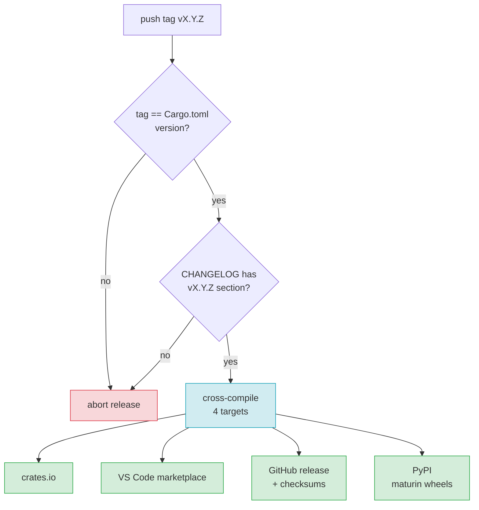

# F21 — Release & CI

> **Status:** Draft
>
> **Version:** 0.1   ·   **Last updated:** 2026-06-24
>
> **Purpose:** The continuous-integration pipeline and the release process — what runs on every push (lint, Rust tests with golden fixtures, the Python LSP-protocol E2E), the cross-compiled binaries we ship, where we distribute them, and the SemVer/CHANGELOG/tag discipline that keeps releases honest.
>
> **Depends on:** [constitution](../constitution.md), [E03-tech-stack](../foundations/E03-tech-stack.md), [E17-testing](../foundations/E17-testing.md), [E29-e2e-testing](../foundations/E29-e2e-testing.md)   ·   **Related:** [F19-cli-linter](F19-cli-linter.md), [F20-editor-integrations](F20-editor-integrations.md)

> Requirement tag: **REL**

---

## 1. Purpose & Scope

This spec is how the project stays shippable. Every push runs the same gates — formatting, lints, the Rust test suite with its golden fixtures, and the Python LSP-protocol E2E — and every tagged release produces signed, cross-compiled binaries and publishes them to the four places users get the tool.

The throughline is *no surprises at release time*. If `main` is green, a release is mechanical: the gates already ran, the artifacts already build, and the version is already in lockstep with the tag.

This spec covers:

- The CI jobs: lint (clippy + rustfmt), Rust tests (cargo nextest, incl. golden `check` fixtures), and the Python E2E job (`pytest-lsp`).
- The release artifacts: cross-compiled binaries for four targets.
- Distribution: crates.io, **PyPI** (maturin wheels), the VS Code marketplace, and GitHub releases.
- Versioning discipline: SemVer, a per-release CHANGELOG, and the tag↔`Cargo.toml` version gate.

## 2. Non-Goals / Out of Scope

- The test *content* — what the golden fixtures and `pytest-lsp` cases assert — owned by [E17-testing](../foundations/E17-testing.md) and [E29-e2e-testing](../foundations/E29-e2e-testing.md).
- The editor extensions themselves — owned by [F20-editor-integrations](F20-editor-integrations.md); this spec only builds and publishes them.
- The tech-stack choices (Rust edition, dep versions) — owned by [E03-tech-stack](../foundations/E03-tech-stack.md).

## 3. Background & Rationale

The diagnostics engine has two distinct E2E branches ([E29](../foundations/E29-e2e-testing.md)), and CI must run both. Branch A is pure Rust — `cargo nextest` invokes `jinja-lsp check --format json` against each fixture and diffs the golden file. Branch B is the only Python in the repo — a `pytest-lsp` suite that drives the real stdio binary through the LSP handshake. They test different things (the catalog vs. the protocol), so they're separate jobs.

Cross-compilation matters because the binary is the product ([ADR-001](../decisions/ADR-001-language-and-runtime.md)): a single self-contained executable with no runtime dependency. We ship it for the platforms developers actually run, so nobody has to compile from source.

The version gate exists because a tag that disagrees with `Cargo.toml` is a footgun — crates.io would publish the wrong number, and the GitHub release would mislabel the binaries. CI refuses to release on a mismatch.

## 4. Concepts & Definitions

- **CI gate** — a job that must pass before merge; a red gate blocks the PR.
- **Golden fixture** — a fixture directory with an `expected-diagnostics.json` that `check --format json` is diffed against ([E29](../foundations/E29-e2e-testing.md) Branch A). (Canonical definition in [glossary](../glossary.md).)
- **`pytest-lsp`** — the LSP-client test fixture driving the real stdio binary ([E29](../foundations/E29-e2e-testing.md) Branch B).
- **Target triple** — a Rust cross-compilation target, e.g. `aarch64-apple-darwin`.
- **SemVer** — semantic versioning: `MAJOR.MINOR.PATCH`.

## 5. Detailed Specification

### 5.1 CI — what runs on every push and PR

Three jobs gate every change; all must be green to merge.

**REQ-REL-01 — Lint gate: clippy + rustfmt.**

A job runs `cargo fmt --check` and `cargo clippy --all-targets -- -D warnings`. Any formatting drift or clippy warning fails the gate. This is the cheapest job and runs first.

**REQ-REL-02 — Rust test gate: `cargo nextest`, including golden fixtures.**

A job runs `cargo nextest run` across unit, integration, and the golden `check` fixtures ([E29](../foundations/E29-e2e-testing.md) Branch A). The golden tests invoke the built binary with `check --format json` against each fixture and diff against `expected-diagnostics.json`; a diff fails the job and prints the unified diff. Goldens are updated deliberately with `UPDATE_FIXTURES=1`, never in CI.

**REQ-REL-03 — Python E2E gate: `pytest-lsp`.**

A separate job sets up Python (`setup-python`), installs `pytest` + `pytest-lsp` + `lsprotocol`, builds the binary, and runs the `tests/e2e/` suite ([E29](../foundations/E29-e2e-testing.md) Branch B). This drives the real `jinja-lsp lsp` stdio server through the LSP handshake — capability negotiation, `didOpen` → `publishDiagnostics`, `completion`, `hover`, `definition`. It is the only Python in the repo and the only job that needs a Python toolchain.

**REQ-REL-04 — The matrix runs on three host OSes.**

The lint and Rust-test gates run on Linux, macOS, and Windows runners so platform-specific path and line-ending bugs surface in CI, not in a user's editor. The Python E2E job runs on Linux (the binary is the same; one host is enough to exercise the protocol).

### 5.2 Release artifacts — cross-compiled binaries

A tagged release builds the binary for four targets.

**REQ-REL-05 — Four cross-compiled targets.**

Each release builds `jinja-lsp` for:

| Platform | Target triple |
|---|---|
| Linux x86_64 | `x86_64-unknown-linux-gnu` |
| Linux aarch64 | `aarch64-unknown-linux-gnu` |
| macOS arm64 | `aarch64-apple-darwin` |
| Windows x86_64 | `x86_64-pc-windows-msvc` |

Each artifact is a self-contained binary (no runtime dependency — [ADR-001](../decisions/ADR-001-language-and-runtime.md)), packaged as a `.tar.gz` (or `.zip` on Windows) with an accompanying SHA-256 checksum.

**REQ-REL-10 — Platform wheels via maturin.**

Each release also builds a Python wheel per target with `maturin` (PyO3/maturin-action, manylinux 2_28), bundling the prebuilt `jinja-lsp` binary as the wheel's entry point. The wheel carries no Python code and adds no runtime Python dependency — it is the same self-contained binary ([ADR-001](../decisions/ADR-001-language-and-runtime.md)), delivered through pip/uv ([ADR-010](../decisions/ADR-010-pypi-distribution.md)).

### 5.3 Distribution

Releases go to four channels, each serving a different consumer.

**REQ-REL-06 — Four distribution channels.**

| Channel | What ships | Consumed by |
|---|---|---|
| crates.io | the `jinja-lsp` crate | `cargo install jinja-lsp` users |
| PyPI | platform wheels (the bundled binary) | `pip install jinja-lsp` / `uv tool install jinja-lsp` users |
| VS Code marketplace | the VS Code extension ([F20](F20-editor-integrations.md)) | VS Code users |
| GitHub releases | the four cross-compiled binaries + checksums | direct downloads, the Zed extension's binary fetch ([F20](F20-editor-integrations.md)) |

A release publishes to all four from the same tag. The Zed extension's auto-download (REQ-EDIT-07) pulls from the GitHub release and verifies the checksum. The `publish-pypi` job uploads the wheels via OIDC trusted publishing (`uv publish`), so no long-lived PyPI token is stored. A release publishes all four channels from the same tag.

### 5.4 Versioning discipline

Versions are SemVer, every release has a CHANGELOG entry, and the tag must match `Cargo.toml`.

**REQ-REL-07 — SemVer.**

The version is `MAJOR.MINOR.PATCH`. A new diagnostic code, a new config key, or a new LSP capability is a MINOR bump; a breaking change to the config schema or the json output shape is a MAJOR bump; a fix is a PATCH.

**REQ-REL-08 — A CHANGELOG entry per release.**

`CHANGELOG.md` (Keep-a-Changelog style) gets a dated section per version, grouping Added / Changed / Fixed. The release job refuses to publish if the tag's version has no CHANGELOG section.

**REQ-REL-09 — Tag ↔ `Cargo.toml` version gate.**

The release is triggered by a `vMAJOR.MINOR.PATCH` tag. A CI step asserts the tag's version equals `Cargo.toml`'s `package.version`; a mismatch fails the release before anything is published, so crates.io and the GitHub release can never disagree on the number. The gate also covers `pyproject.toml`: maturin reads the version *dynamically* from `Cargo.toml` (`dynamic = ["version"]`), so the wheel version is derived from `Cargo.toml` and cannot drift independently — PyPI and crates.io can never disagree on the number either.

## 6. UI Mockups

### 6.1 CI status — pull-request checks

The check list a contributor sees on a PR. All four must be green to merge (REQ-REL-01..04).

```
┌─ Checks — #142 Add JINJA-W107 invalid-noqa ───────────────────────────┐
│                                                                       │
│  ✔  lint            clippy + rustfmt                       12s        │
│  ✔  test (linux)    cargo nextest · 318 tests · 9 golden  1m 04s      │
│  ✔  test (macos)    cargo nextest · 318 tests             1m 22s      │
│  ✔  test (windows)  cargo nextest · 318 tests             2m 11s      │
│  ✔  e2e (pytest-lsp) 14 protocol journeys                  48s        │
│                                                                       │
│  All checks have passed — 5 successful                  [ Merge ▾ ]   │
└───────────────────────────────────────────────────────────────────── ┘
```

States: pending (spinners) · failing (a red ✘ with "Details" linking the job log; merge blocked) · golden-diff failure (the test job's log shows a unified diff of actual vs `expected-diagnostics.json`).

### 6.2 Release artifact table — a published GitHub release

What a tagged release publishes (REQ-REL-05, REQ-REL-06). Each binary ships with its checksum.

```
┌─ Release  v0.4.0 ─────────────────────────────────────────────────────┐
│  Tagged v0.4.0 · Cargo.toml 0.4.0  ✔ version gate passed              │
│                                                                       │
│  Artifact                                       Target        Size    │
│  ───────────────────────────────────────────────────────────────────│
│  jinja-lsp-v0.4.0-x86_64-linux.tar.gz           linux x86_64   4.1 MB │
│  jinja-lsp-v0.4.0-aarch64-linux.tar.gz          linux aarch64  3.9 MB │
│  jinja-lsp-v0.4.0-aarch64-macos.tar.gz          macos arm64    3.8 MB │
│  jinja-lsp-v0.4.0-x86_64-windows.zip            windows x86_64 4.3 MB │
│  jinja_lsp-0.4.0-cp3-none-*.whl  (wheels, 4 targets)  maturin  ~4 MB  │
│  SHA256SUMS                                      checksums      1 KB  │
│                                                                       │
│  Also published →  crates.io 0.4.0 · PyPI 0.4.0 · VS Code marketplace 0.4.0 │
└───────────────────────────────────────────────────────────────────── ┘
```

States: drafting (artifacts uploading) · published (all four channels confirmed) · version-gate failure (release aborted before publish; "tag v0.4.0 ≠ Cargo.toml 0.3.9").

## 7. Visualizations

The release pipeline from tag to four channels — gated on the version check.



## 8. Data Shapes

A CHANGELOG section per release (REQ-REL-08), Keep-a-Changelog style. The release job parses it to confirm the tag's version is present.

```markdown
## [0.4.0] - 2026-06-24

### Added
- `JINJA-W107 invalid-noqa` — a `noqa` referencing a non-existent code now warns.

### Changed
- `check` gained `--format {rich,compact,json}` (default `rich`).

### Fixed
- E601 no longer fires on ``.
```

The root `pyproject.toml` (REQ-REL-10) configures maturin as the build backend; the wheel bundles the Rust binary and reads its version dynamically from `Cargo.toml`.

```toml
# pyproject.toml  (maturin build backend — wheels bundle the Rust binary)
[project]
name = "jinja-lsp"
dynamic = ["version"]          # read from Cargo.toml by maturin
description = "Language server for Jinja templates"
readme = "README.md"
license = { text = "MIT" }
requires-python = ">=3.8"

[build-system]
requires = ["maturin>=1.5"]
build-backend = "maturin"

[tool.maturin]
binaries = ["jinja-lsp"]
```

## 9. Examples & Use Cases

A contributor opens a PR adding `JINJA-W107`. CI runs the four gates (§6.1): clippy/rustfmt, the Rust suite on three OSes with the golden fixtures, and the `pytest-lsp` E2E. The golden job catches that a new fixture's `expected-diagnostics.json` was forgotten and fails with a unified diff. The contributor adds the golden, the gates go green, and the PR merges.

Later a maintainer cuts `v0.4.0`. They bump `Cargo.toml` to `0.4.0`, add the §8 CHANGELOG section, and push the tag. The version gate confirms `0.4.0 == 0.4.0`, the CHANGELOG section exists, the four binaries cross-compile, the maturin wheels build, and the release publishes to crates.io, PyPI, the marketplace, and GitHub releases at once (§6.2). The Zed extension's next launch downloads the new Linux binary and checks it against `SHA256SUMS`.

## 10. Edge Cases & Failure Modes

- **Tag ≠ `Cargo.toml` version** → release aborts before publishing anything (REQ-REL-09); no partial release.
- **No CHANGELOG section for the tag** → release aborts (REQ-REL-08).
- **A golden fixture is stale** → the Rust gate fails with a unified diff; goldens are updated locally with `UPDATE_FIXTURES=1`, never in CI (REQ-REL-02).
- **One target fails to cross-compile** → the whole release fails; we don't ship a partial set of binaries.
- **A wheel target fails to build** → the whole release fails; we don't ship a partial wheel set (mirrors the binary rule).
- **crates.io publish succeeds but the marketplace push fails** → the release is marked incomplete; crates.io publishes are immutable, so the next attempt bumps PATCH rather than re-publishing the same version.
- **PyPI publish succeeds but another channel fails** → the release is marked incomplete; PyPI is immutable like crates.io, so a re-attempt bumps PATCH.
- **A flaky `pytest-lsp` timeout** → the E2E job is retried once; a second failure blocks merge (we don't ignore protocol flakes).

## 11. Testing

CI is tested by being CI — its correctness is observable on every PR. Beyond that, the version gate and CHANGELOG check have unit tests, and a dry-run release workflow exercises cross-compilation without publishing.

### 11.1 Scope & coverage

Target: **100% of this feature's behavior is covered.** Every `REQ-REL-NN` maps to at least one test or an asserted CI step; every state in §6 and edge case in §10 has a test. See the policy in [E17-testing](../foundations/E17-testing.md#2-coverage-policy).

### 11.2 Test plan

| Behavior / scenario | Type | Fixtures | Verifies |
|---|---|---|---|
| Lint gate fails on rustfmt drift / clippy warning | CI step | — | REQ-REL-01 |
| Rust gate runs nextest + golden diffs | CI step | all diagnostic fixtures | REQ-REL-02 |
| Python E2E gate drives the stdio binary | CI step | starlette-blog | REQ-REL-03 |
| Matrix runs on Linux/macOS/Windows | CI config | — | REQ-REL-04 |
| All four targets cross-compile (dry run) | CI step | — | REQ-REL-05 |
| All target wheels build via maturin (dry run) | CI step | — | REQ-REL-10 |
| Publish to all four channels from one tag | CI step (dry run) | — | REQ-REL-06 |
| SemVer bump rules documented and applied | review | — | REQ-REL-07 |
| Missing CHANGELOG section aborts release | unit | — | REQ-REL-08 |
| Tag ≠ Cargo.toml aborts release | unit | — | REQ-REL-09 |

### 11.3 Fixtures

- Reuses the diagnostic fixtures and their `expected-diagnostics.json` goldens ([E17-testing](../foundations/E17-testing.md#5-fixtures-registry)) — the Rust gate diffs them. No release-local fixtures.

### 11.4 Requirement coverage

| Requirement | Covered by |
|---|---|
| REQ-REL-01 | lint-gate CI step |
| REQ-REL-02 | nextest + golden CI step |
| REQ-REL-03 | pytest-lsp CI step |
| REQ-REL-04 | matrix CI config check |
| REQ-REL-05 | cross-compile dry-run |
| REQ-REL-06 | publish dry-run |
| REQ-REL-07 | SemVer policy review |
| REQ-REL-08 | CHANGELOG-gate unit test |
| REQ-REL-09 | version-gate unit test |
| REQ-REL-10 | maturin wheel-build dry-run |

## 12. End-to-End Test Plan

The release pipeline is exercised end to end by a dry-run workflow that cross-compiles all targets and runs the publish steps in `--dry-run` mode, asserting artifacts and version gates without touching the registries.

### 12.1 Coverage target

**100% of the release scope, end to end** — the happy release (gate passes, four binaries + wheels, four channels) plus each abort path (version mismatch, missing CHANGELOG, target build failure). See the policy in [E29-e2e-testing](../foundations/E29-e2e-testing.md#2-coverage-policy).

### 12.2 Scenarios

| # | Journey | Path | Expected outcome |
|---|---|---|---|
| E2E-01 | Push a matching tag with a CHANGELOG entry | happy | gates pass, four binaries + wheels built, four channels published |
| E2E-02 | PR with all gates green | happy | merge enabled |
| E2E-07 | `pip install jinja-lsp` on a supported platform | happy | resolves the right platform wheel; the binary lands on PATH |
| E2E-03 | Push a tag that mismatches `Cargo.toml` | error | release aborts before publish |
| E2E-04 | Tag with no CHANGELOG section | error | release aborts |
| E2E-05 | One cross-compile target fails | error | whole release fails; nothing published |
| E2E-06 | Stale golden fixture in a PR | error | Rust gate fails with a unified diff |

## 13. Non-Functional Requirements

### 13.1 Security & Privacy

- **Access & authorization** — publishing requires registry tokens (crates.io, marketplace) held as CI secrets, scoped to publish-only and never echoed to logs.
- **Input & validation** — released binaries ship with SHA-256 checksums (`SHA256SUMS`) so downloaders — including the Zed extension's auto-fetch ([F20](F20-editor-integrations.md)) — can verify integrity. The build runs from a tagged, immutable commit.
- **Data sensitivity** — no user data is involved; CI handles only source and tokens. Tokens live in the CI secret store, not the repo.

### 13.4 Performance & Scale

- **Latency** — the lint gate returns in well under a minute (cheapest first); the full PR check set targets under ~5 minutes wall-clock via parallel matrix jobs, so contributors aren't blocked.

### 13.5 Observability

- **Logs / traces** — each job streams its log to the PR check; golden-diff failures print the unified diff inline so the cause is visible without downloading artifacts.
- **Alerts & health** — healthy = `main` is green and the latest tag published to all four channels; a failed publish marks the release incomplete (§10).

## 15. Open Questions & Decisions

- **Decided** — the LSP-protocol E2E uses `pytest-lsp`; we do not hand-roll a client harness ([E29](../foundations/E29-e2e-testing.md)).
- **Decided** — four cross-compile targets (REQ-REL-05); more can be added as MINOR releases.
- **Decided** — jinja-lsp ships to PyPI as maturin wheels bundling the binary ([ADR-010](../decisions/ADR-010-pypi-distribution.md)); pip/uv is a delivery vehicle, not a runtime dependency.
- **OQ-REL-1** — whether to also publish prebuilt binaries to a Homebrew tap (currently: GitHub releases + `cargo install` only).

## 16. Cross-References

- **Depends on:** [constitution](../constitution.md) — the single-binary, one-engine principles; [E03-tech-stack](../foundations/E03-tech-stack.md) — toolchain and dep versions; [E17-testing](../foundations/E17-testing.md) — the golden fixtures the Rust gate diffs; [E29-e2e-testing](../foundations/E29-e2e-testing.md) — the two E2E branches CI runs; [ADR-010-pypi-distribution](../decisions/ADR-010-pypi-distribution.md) — PyPI distribution via maturin wheels.
- **Related:** [F19-cli-linter](F19-cli-linter.md) — `check` is the gate the golden tests drive; [F20-editor-integrations](F20-editor-integrations.md) — the extensions and binaries this pipeline builds and ships.

## 17. Changelog

- **2026-06-25** — Added PyPI as a fourth distribution channel (maturin wheels, ADR-010).
- **2026-06-24** — Initial draft.
