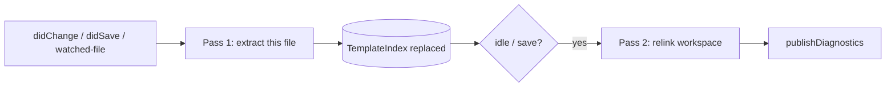
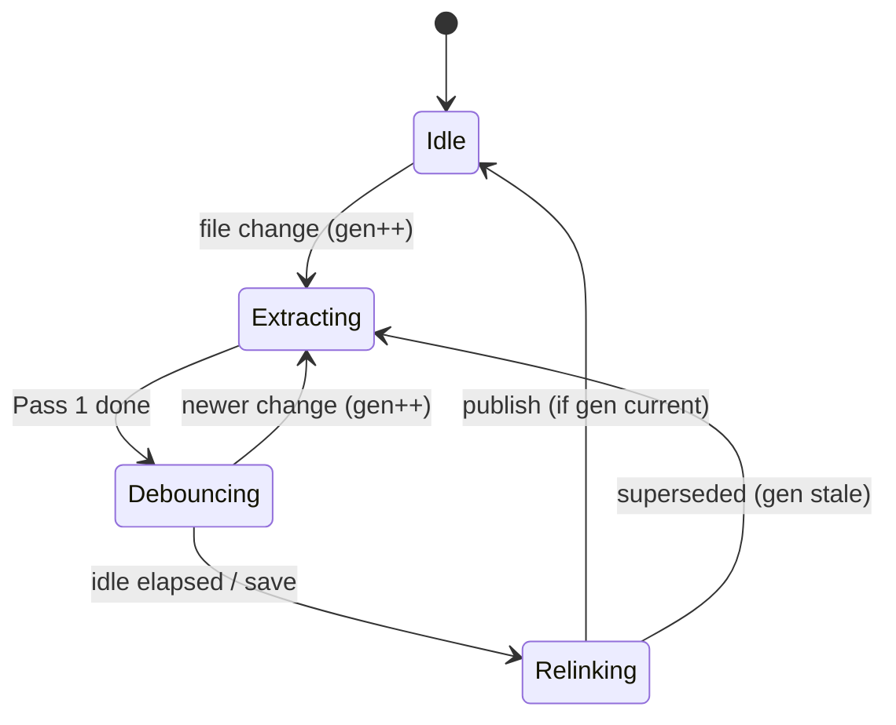

# E01 — Architecture

> **Status:** Draft
>
> **Version:** 0.1   ·   **Last updated:** 2026-06-24
>
> **Purpose:** The system shape of jinja-lsp — one binary with three front-ends over a two-pass pipeline, pure-function feature dispatch, and the LSP protocol contract every feature wires into.

> **Depends on:** [constitution](../constitution.md)   ·   **Related:** [E02-folder-structure](E02-folder-structure.md), [E07-data-model](E07-data-model.md), [E30-extraction-and-indexing](E30-extraction-and-indexing.md)

> Requirement tag: **ARCH**

---

## 1. Purpose & Scope

jinja-lsp is one Rust binary that does three jobs from one analysis pipeline. This spec defines that shape: how the binary is structured, how a change to a file flows through extraction and relinking, how feature handlers stay pure, and which LSP capabilities the server declares.

This spec covers:

- The process model — one binary, three front-ends (`lsp`, `check`, `format`).
- The two-pass pipeline — per-file extraction and debounced workspace relink.
- The document lifecycle and watched-files dispatch.
- Pure-function feature dispatch.
- The declared LSP server capabilities and protocol conduct.

## 2. Non-Goals / Out of Scope

- Concrete index and symbol types — owned by [E07-data-model](E07-data-model.md).
- The tree-sitter queries and discovery rules — owned by [E30-extraction-and-indexing](E30-extraction-and-indexing.md).
- Module/file layout — owned by [E02-folder-structure](E02-folder-structure.md).
- Per-feature behavior — owned by the `F##` specs.

## 3. Background & Rationale

A specialist LSP and a CLI linter want the same answers from the same templates. If they compute those answers separately, they drift, and a `check` failure in CI won't match what the editor shows. So jinja-lsp has **one engine** and treats the server, linter, and formatter as thin I/O shells over it. That single decision — engine in the middle, front-ends at the edges — shapes everything below.

## 4. Concepts & Definitions

- **Front-end** — one of the three I/O shells (`lsp`, `check`, `format`) over the shared pipeline.
- **Pass 1 / Pass 2** — extraction and relink. (Canonical definitions in [glossary](../glossary.md).)
- **Feature handler** — a pure function answering one LSP request from the index.

## 5. Detailed Specification

### 5.1 Process model & front-ends

One binary exposes three `clap` subcommands, all reading the same config discovery and the same extraction/indexing pipeline.

**REQ-ARCH-01 — One binary, three front-ends.**

The binary is `jinja-lsp`. Its subcommands are `lsp` (the tower-lsp server), `check` (the CLI linter — [F19](../features/F19-cli-linter.md)), and `format` (the CLI formatter — [F18](../features/F18-formatting.md)). A subcommand is only an I/O layer: it never contains analysis logic that the others lack. `lsp` is the default subcommand when none is given.

**REQ-ARCH-02 — stdio transport only.**

The server speaks LSP over stdio. stdio is the only transport; there is no alternate listener (ADR-009). All logging goes to stderr or a file via `tracing` — never stdout, which carries JSON-RPC.

### 5.2 The two-pass pipeline

Analysis happens in two passes so per-file edits stay cheap and cross-file work is batched.

**REQ-ARCH-03 — Pass 1 extracts one file.**

On every document change, Pass 1 reparses that one file with tree-sitter and re-extracts its facts into a fresh `TemplateIndex` ([E07](E07-data-model.md)), replacing the old one atomically. Pass 1 is CPU-bound and runs under `spawn_blocking`. It never touches other files.

**REQ-ARCH-04 — Pass 2 relinks the workspace.**

Pass 2 resolves cross-template references (extends/include/import chains) and computes cross-file diagnostics. It is **debounced** (coalescing rapid edits) and guarded by a generation counter so a stale relink never overwrites a newer one. Pass 2 runs after an idle interval and on save.

### 5.3 Document lifecycle & watched files

**REQ-ARCH-05 — Document lifecycle.**

The server handles `didOpen`, `didChange` (full sync), `didSave`, and `didClose`. Open and change update the in-memory document and trigger Pass 1; save additionally triggers Pass 2. `didClose` keeps the file in the index — it may still be referenced by other templates.

**REQ-ARCH-06 — Watched-files dispatch is the single on-disk entry point.**

The server registers `workspace/didChangeWatchedFiles` for the config file, hint files, and template files. A single dispatcher routes each change to the right invalidation: config → reload + relink ([E15](E15-app-config.md)), hint file → registry reload ([F04](../features/F04-user-hints.md)), template → Pass 1 + relink. Config/hint files are detected **before** the template branch and never fed to Pass 1. Open buffers override watcher events for the same URI.

### 5.4 Pure-function feature dispatch

**REQ-ARCH-07 — Feature handlers are pure reads.**

Each LSP feature is a pure function `(index snapshot, params) → response`. Handlers never parse, never mutate shared state, and never block on Pass 2. This is what lets features be added independently (M3/M4) without touching the pipeline.

### 5.5 Declared capabilities

**REQ-ARCH-08 — Capability declaration matches the feature set.**

The `initialize` response declares exactly the providers backed by a feature spec, and `initialize` returns immediately — the initial workspace scan runs in the background under `workDoneProgress`.

| Capability | Feature |
|---|---|
| `textDocumentSync` (full + save) | E01 |
| `completionProvider` (+ `resolveProvider`, trigger chars) | [F05](../features/F05-completions.md) |
| `hoverProvider` | [F06](../features/F06-hover.md) |
| `signatureHelpProvider` (triggers `(` `,`) | [F07](../features/F07-signature-help.md) |
| `definitionProvider` | [F08](../features/F08-go-to-definition.md) |
| `referencesProvider` | [F09](../features/F09-find-references.md) |
| `documentSymbolProvider` + `workspaceSymbolProvider` | [F10](../features/F10-symbols.md) |
| `documentHighlightProvider` | [F11](../features/F11-document-highlight.md) |
| `foldingRangeProvider` | [F12](../features/F12-folding-range.md) |
| `semanticTokensProvider` (full + range, legend) | [F13](../features/F13-semantic-tokens.md) |
| `inlayHintProvider` (+ resolve) | [F14](../features/F14-inlay-hints.md) |
| `codeLensProvider` (+ resolve) | [F15](../features/F15-code-lens.md) |
| `callHierarchyProvider` | [F16](../features/F16-call-hierarchy.md) |
| `codeActionProvider` (+ resolve) + `executeCommandProvider` | [F17](../features/F17-code-actions.md) |
| `documentFormattingProvider` + `documentRangeFormattingProvider` | [F18](../features/F18-formatting.md) |

### 5.6 Protocol conduct

These are cheap to build in and expensive to retrofit:

- **Push *and* pull diagnostics** — publish after every relink, including an explicit *empty* publish when a finding clears, and always on open. Pull-mode (`textDocument/diagnostic`) reads the same stored, already-filtered results.
- **Serialize notifications per URI** so out-of-order `didChange` can't corrupt the buffer.
- **No stale data** — every edit atomically replaces that file's facts and re-resolves dependent cross-file references.
- **Fire `inlayHint/refresh` and `codeLens/refresh`** after a relink so editors re-pull derived UI.

## 7. Visualizations

The relink generation guard, as a state machine:

## 10. Edge Cases & Failure Modes

- **Rapid edits during relink** → the generation counter discards the superseded relink; only the newest result publishes.
- **Config change mid-edit** → config reload takes precedence and forces a full relink; the previous valid config is retained if the new one fails to parse ([E15](E15-app-config.md)).
- **Unparseable file** → tree-sitter still yields a tree; Pass 1 extracts what it can and records a `JINJA-E001` syntax error (P3).
- **Watcher event for an open buffer** → ignored in favor of the in-memory document.

## 11. Testing

This foundation is verified by integration tests over fixture workspaces plus protocol-conformance journeys in the E2E suite.

### 11.1 Scope & coverage

Target: **100% of this spec's behavior is covered.** Every `REQ-ARCH-NN` maps to at least one test. See the policy in [E17-testing](E17-testing.md#2-coverage-policy).

### 11.2 Test plan

| Behavior / scenario | Type | Fixtures | Verifies |
|---|---|---|---|
| `check` and `lsp` report identical findings for one workspace | integration | starlette-blog | REQ-ARCH-01 |
| Logging never writes to stdout | integration | starlette-blog | REQ-ARCH-02 |
| Editing one file re-extracts only that file | integration | starlette-blog | REQ-ARCH-03 |
| Rapid edits coalesce; only newest relink publishes | e2e (pytest-lsp) | starlette-blog | REQ-ARCH-04 |
| `didSave` triggers a relink; `didClose` keeps the file indexed | e2e (pytest-lsp) | starlette-blog | REQ-ARCH-05 |
| Editing config triggers reload+relink, not Pass 1 on the TOML | e2e (pytest-lsp) | config-reload | REQ-ARCH-06 |
| Empty publish on open; empty publish when a finding clears | e2e (pytest-lsp) | starlette-blog | REQ-ARCH-06 |
| Declared capabilities match the implemented providers | e2e (pytest-lsp) | starlette-blog | REQ-ARCH-08 |

### 11.4 Requirement coverage

| Requirement | Covered by |
|---|---|
| REQ-ARCH-01 | check/server parity test |
| REQ-ARCH-02 | stdout-cleanliness test |
| REQ-ARCH-03 | single-file re-extraction test |
| REQ-ARCH-04 | debounce + generation-guard test |
| REQ-ARCH-05 | lifecycle e2e |
| REQ-ARCH-06 | watched-files dispatch e2e |
| REQ-ARCH-07 | covered transitively by every feature's pure-read tests |
| REQ-ARCH-08 | capability-declaration e2e |

## 12. End-to-End Test Plan

The protocol-conformance journeys in [E29-e2e-testing](E29-e2e-testing.md) exercise this spec end to end via `pytest-lsp`.

### 12.1 Coverage target

**100% of the lifecycle and protocol behavior**, happy path and the error/race paths in §10.

### 12.2 Scenarios

| # | Journey | Path | Expected outcome |
|---|---|---|---|
| E2E-01 | Open a clean workspace | happy | each opened file gets a (possibly empty) publish |
| E2E-02 | Two rapid `didChange` events | race | applied in order; one coalesced relink |
| E2E-03 | Edit config file | happy | reload + relink, no Pass 1 on the TOML |
| E2E-04 | Fix the last finding in a file | happy | an empty publish clears the squiggle |

## 13. Non-Functional Requirements

### 13.1 Security & Privacy

- **Access & authorization** — local process; no auth boundary. Reads only files under the workspace and configured/sidecar locations.
- **Input & validation** — all template input is untrusted; tree-sitter parsing is memory-safe and never executes content (P1).
- **Data sensitivity** — none beyond the user's own source; nothing leaves the machine. No network access at all (stdio only).

### 13.4 Performance & Scale

- **Latency** — feature handlers return in < 100 ms (P6); Pass 1 for a single file is well under that.
- **Volume & scale** — full index rebuild < 2 s for 500 templates (verified against the `large-workspace` fixture in [E30](E30-extraction-and-indexing.md)).
- **Load** — debounced relink keeps CPU bounded under rapid editing.

### 13.5 Observability

- **Logs / traces** — `tracing` spans wrap Pass 1, Pass 2, and config reload; emitted to stderr/file ([E16](E16-conventions.md)). No metrics backend.

## 16. Cross-References

- **Depends on:** [constitution](../constitution.md) — principles P1, P2, P5, P6.
- **Related:** [E02-folder-structure](E02-folder-structure.md) — where these layers live; [E07-data-model](E07-data-model.md) — the index types; [E30-extraction-and-indexing](E30-extraction-and-indexing.md) — what the passes run; [E15-app-config](E15-app-config.md) — config reload; [E16-conventions](E16-conventions.md) — error handling & tracing.

## 17. Changelog

- **2026-06-26** — Marked `codeActionProvider` as `(+ resolve)`, matching the `codeAction/resolve` path F17 relies on (REQ-ACT-09) and the other resolve-capable providers (jinja-lsp-bv6).
- **2026-06-24** — Initial draft: three front-ends, two-pass pipeline, lifecycle, watched-files dispatch, capability set, protocol conduct.
