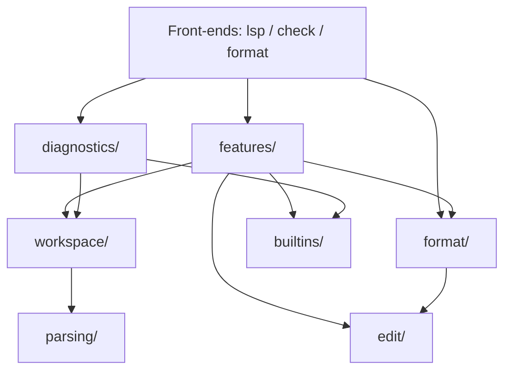

# E02 — Folder Structure

> **Status:** Approved
>
> **Version:** 0.1   ·   **Last updated:** 2026-06-24
>
> **Purpose:** Where every piece of jinja-lsp lives on disk — the module layout under `src/`, what each module owns, and the downward-dependency rule that keeps foundations from ever importing features.

> **Depends on:** [constitution](../constitution.md), [E01-architecture](E01-architecture.md)   ·   **Related:** [E03-tech-stack](E03-tech-stack.md), [E07-data-model](E07-data-model.md), [E30-extraction-and-indexing](E30-extraction-and-indexing.md)

> Requirement tag: **FOLD**

---

## 1. Purpose & Scope

This spec is the map of the codebase. It says which directory owns each concern, so a contributor knows where a change belongs before they open an editor, and a reviewer can spot a misplaced import at a glance.

This spec covers:

- The module layout under `src/` and what each module owns.
- The full LSP handler list under `src/features/`.
- The downward-dependency rule and how the layers stack.

## 2. Non-Goals / Out of Scope

- The runtime behavior of each layer — owned by [E01-architecture](E01-architecture.md).
- The concrete types each module manipulates — owned by [E07-data-model](E07-data-model.md).
- The crates each module pulls in — owned by [E03-tech-stack](E03-tech-stack.md).
- Per-feature behavior — owned by the `F##` specs.

## 3. Background & Rationale

A specialist LSP grows by accretion: a new check here, a new handler there. Without a layout rule, the checks start reaching into the handlers, the handlers start parsing, and within a few months the "one engine, three front-ends" promise of [E01](E01-architecture.md) is gone. So the structure encodes the architecture physically. Each architectural layer is a directory, and the dependency rule is mechanical enough to enforce in review (and, later, with a lint).

## 4. Concepts & Definitions

- **Layer** — a top-level directory under `src/` with a single responsibility.
- **Front-end** — one of the three I/O shells, named by their subcommands `lsp`/`check`/`format` and implemented by `server.rs` / `linter/` / `format/` (routed from `main.rs`); see [E01](E01-architecture.md).
- **Handler** — one feature's pure-read function module under `src/features/`.

## 5. Detailed Specification

### 5.1 Top-level layout

Everything ships from one crate. The top of `src/` holds the binary entry, the three front-ends, and the shared state and config types; everything deeper is a layer.

The tree below is the canonical layout. Read it top-down: entry and front-ends first, then the analysis layers, then the feature handlers that read them.

```
src/
  main.rs              # binary entry + clap CLI dispatch (E01 REQ-ARCH-01)
  server.rs            # tower-lsp backend; stdio transport (E01 REQ-ARCH-02)
  state.rs             # shared workspace state held by the server
  config.rs            # config types + discovery (E15)
  parsing/             # tree-sitter wrapper + .scm queries (E30)
  workspace/           # TemplateIndex, WorkspaceIndex, symbols, discovery (E07, E30, E31)
  diagnostics/
    checks/            # one module per check (20 modules) + syntax handling (F01)
  builtins/            # registry, embedded-doc loader, custom-builtins loader, hint loader (F02–F04)
  features/            # one module per LSP handler (see 5.3)
  edit/                # shared WorkspaceEdit / TextEdit builders (F17, F18)
  format/              # the Jinja-only formatter engine (F18)
  linter/              # CLI orchestration + output formatters (F19)
```

**REQ-FOLD-01 — One crate, layered modules.**

jinja-lsp is a single binary crate. The entry point is `src/main.rs`, which parses the CLI with `clap` and dispatches to one of the three front-ends. The `lsp` subcommand starts `server.rs`; `check` and `format` call into `linter/` and `format/` respectively. No analysis logic lives in `main.rs` — it only routes.

### 5.2 The analysis layers

The analysis layers are where facts are produced and read. They stack from raw parsing at the bottom to feature responses at the top.

**REQ-FOLD-02 — `parsing/` wraps tree-sitter.**

`src/parsing/` owns the tree-sitter integration: loading the block and inline grammars, compiling the `.scm` query files, and exposing a typed cursor over parse results. The 17 `.scm` query files live here. Nothing above `parsing/` touches tree-sitter directly — they consume the symbols it extracts. See [E30](E30-extraction-and-indexing.md).

**REQ-FOLD-03 — `workspace/` holds the index and symbols.**

`src/workspace/` owns the `TemplateIndex` and `WorkspaceIndex` types ([E07](E07-data-model.md)), the symbol structs, template discovery and path resolution ([E30](E30-extraction-and-indexing.md)), and inline-range detection ([E31](E31-inline-templates.md)). It may read `parsing/`; it never reads anything above itself.

**REQ-FOLD-04 — `diagnostics/checks/` is one module per check.**

`src/diagnostics/checks/` holds one module per check — 20 modules, mapping to the 20 non-syntax codes — plus syntax-error handling in the diagnostics engine itself. Each module is a pure read of a `TemplateIndex` or `WorkspaceIndex`. The catalog of checks lives in [F01](../features/F01-diagnostics.md).

**REQ-FOLD-05 — `builtins/` is the registry and its loaders.**

`src/builtins/` owns the unified registry ([F02](../features/F02-builtin-registry.md)), the `include_str!()` embedded-doc loader, the extension packs ([F03](../features/F03-extension-packs.md)), the `custom_builtins` disk loader, and the user-hint loader ([F04](../features/F04-user-hints.md)).

### 5.3 The feature handlers

Every interactive LSP feature is exactly one module under `src/features/`, named after the request it serves. This makes the M3/M4 feature roadmap a checklist of files to add.

**REQ-FOLD-06 — One handler module per feature.**

`src/features/` contains these modules, each a pure-read handler ([E01](E01-architecture.md#54-pure-function-feature-dispatch)):

| Module | Feature |
|---|---|
| `completions` | [F05](../features/F05-completions.md) |
| `hover` | [F06](../features/F06-hover.md) |
| `signature_help` | [F07](../features/F07-signature-help.md) |
| `definition` | [F08](../features/F08-go-to-definition.md) |
| `references` | [F09](../features/F09-find-references.md) |
| `symbols` | [F10](../features/F10-symbols.md) |
| `document_highlight` | [F11](../features/F11-document-highlight.md) |
| `folding` | [F12](../features/F12-folding-range.md) |
| `semantic_tokens` | [F13](../features/F13-semantic-tokens.md) |
| `inlay_hints` | [F14](../features/F14-inlay-hints.md) |
| `code_lens` | [F15](../features/F15-code-lens.md) |
| `call_hierarchy` | [F16](../features/F16-call-hierarchy.md) |
| `code_actions` | [F17](../features/F17-code-actions.md) |
| `formatting` | [F18](../features/F18-formatting.md) |

### 5.4 The edit and format layers

Code actions and formatting both emit `WorkspaceEdit`s, so the machinery to build them is shared rather than duplicated in each handler.

**REQ-FOLD-07 — `edit/` and `format/` are shared engines.**

`src/edit/` holds the `WorkspaceEdit`/`TextEdit` builders used by both code actions ([F17](../features/F17-code-actions.md)) and formatting ([F18](../features/F18-formatting.md)). `src/format/` holds the Jinja-only formatter engine — the single implementation both the LSP `formatting` handler and the `jinja-lsp format` CLI front-end call. `src/linter/` holds the `check` orchestration and the rich/compact/json output formatters ([F19](../features/F19-cli-linter.md)).

### 5.5 The downward-dependency rule

The whole layout exists to make one rule physically obvious: dependencies flow down, never up. This is the engineering principle "dependencies flow downward" from the constitution, made concrete.

**REQ-FOLD-08 — Dependencies flow downward only.**

`features/` may import `workspace/`, `builtins/`, `edit/`, and `format/`. `diagnostics/` may import `workspace/` and `builtins/`. `workspace/` may import `parsing/`. **Nothing imports `features/`.** A foundation module that reaches up into a feature is a layering violation and is rejected in review. The three front-ends (`lsp` via `server.rs`, `check` via `linter/`, `format` via `format/`, all routed from `main.rs`) sit at the top and may call into any layer below.

## 7. Visualizations

The layers, drawn as a dependency stack — arrows point from a layer to what it may import:



## 10. Edge Cases & Failure Modes

- **A check needs another check's output** → it reads the shared `WorkspaceIndex`, never the other check module directly; checks don't import siblings.
- **A new feature needs a new edit shape** → the shape goes in `edit/`, not in the handler, so [F17](../features/F17-code-actions.md) and [F18](../features/F18-formatting.md) stay the only edit producers.
- **A tempting upward import** (a `workspace/` helper wanting a feature type) → the type moves down to `workspace/` or `E07`; the dependency never reverses.

## 11. Testing

This foundation is verified structurally: a layering test asserts the dependency rule, and the module map is checked against the implemented tree.

### 11.1 Scope & coverage

Target: **100% of this spec's behavior is covered.** Every `REQ-FOLD-NN` maps to at least one test. See the policy in [E17-testing](E17-testing.md#2-coverage-policy).

### 11.2 Test plan

| Behavior / scenario | Type | Fixtures | Verifies |
|---|---|---|---|
| No module under `workspace/`/`parsing/`/`diagnostics/` imports `features/` | unit (source-graph assertion) | — | REQ-FOLD-08 |
| Every feature in E01's capability table has a `features/` module | unit | — | REQ-FOLD-06 |
| `format/` is called by both the LSP handler and the CLI front-end | integration | [starlette-blog](E17-testing.md#starlette-blog) | REQ-FOLD-07 |

### 11.4 Requirement coverage

| Requirement | Covered by |
|---|---|
| REQ-FOLD-01 | CLI-dispatch test |
| REQ-FOLD-02 | parsing-isolation test |
| REQ-FOLD-03 | workspace-ownership test |
| REQ-FOLD-04 | check-module-count test |
| REQ-FOLD-05 | registry-location test |
| REQ-FOLD-06 | handler-module map test |
| REQ-FOLD-07 | shared-engine test |
| REQ-FOLD-08 | layering source-graph assertion |

## 13. Non-Functional Requirements

### 13.1 Security & Privacy

- **Access & authorization** — layout only; no runtime trust boundary. The `builtins/` loaders read only configured/sidecar locations ([E15](E15-app-config.md)).
- **Input & validation** — none introduced here; the layers below validate their own inputs.
- **Data sensitivity** — none.

## 16. Cross-References

- **Depends on:** [constitution](../constitution.md) — the "dependencies flow downward" and "one engine, three front-ends" principles; [E01-architecture](E01-architecture.md) — the layers this gives a home to.
- **Related:** [E03-tech-stack](E03-tech-stack.md) — the crates each layer uses; [E07-data-model](E07-data-model.md) — the types `workspace/` owns; [E30-extraction-and-indexing](E30-extraction-and-indexing.md) — what `parsing/` and `workspace/` run; [E31-inline-templates](E31-inline-templates.md) — inline-range detection in `workspace/`; [F01-diagnostics](../features/F01-diagnostics.md) — the `diagnostics/checks/` catalog.

## 17. Changelog
- **2026-06-26** — Status: Draft → Approved.

- **2026-06-24** — Initial draft: `src/` module layout, the full feature-handler list, and the downward-dependency rule.
- **2026-06-24** — Corrected the check-module count to 20 non-syntax codes (was 18; the two new codes W106/W107 were uncounted).
