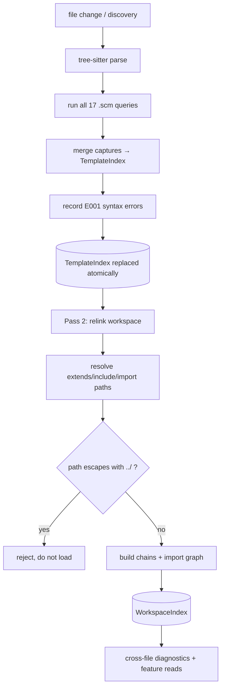

# E30 — Extraction & Indexing

> **Status:** Draft
>
> **Version:** 0.1   ·   **Last updated:** 2026-06-24
>
> **Purpose:** How facts get into the index — the 17 tree-sitter queries, the per-file extraction pipeline, template discovery, the workspace relink, path resolution, and the performance budget that realizes P6.

> **Depends on:** [constitution](../constitution.md), [E01-architecture](E01-architecture.md), [E07-data-model](E07-data-model.md)   ·   **Related:** [E03-tech-stack](E03-tech-stack.md), [E15-app-config](E15-app-config.md), [E16-conventions](E16-conventions.md), [E31-inline-templates](E31-inline-templates.md)

> Requirement tag: **EXTR**

---

## 1. Purpose & Scope

This foundation owns everything between a parse tree and a populated index. The tree-sitter queries run here, the per-file `TemplateIndex` is built here, templates are discovered here, and the cross-file `WorkspaceIndex` is relinked here. The document *lifecycle* and *watched-files routing* live in [E01](E01-architecture.md); this spec owns what those events feed into.

This spec covers:

- The 17 `.scm` tree-sitter queries.
- The per-file extraction pipeline.
- Template discovery (consuming [E15](E15-app-config.md) for `templates`/`extensions`).
- The workspace relink.
- Template path resolution (and `../` rejection).
- Multi-folder workspaces.
- The < 2 s / 500-template performance budget.

## 2. Non-Goals / Out of Scope

- The symbol and index *types* produced — owned by [E07-data-model](E07-data-model.md).
- The lifecycle events that trigger extraction — owned by [E01-architecture](E01-architecture.md).
- `templates`/`extensions` *resolution rules* — owned by [E15-app-config](E15-app-config.md); this spec consumes the result.
- Inline-region *detection* — owned by [E31-inline-templates](E31-inline-templates.md); this spec indexes what it produces.

## 3. Background & Rationale

Extraction is how jinja-lsp turns syntax into knowledge. Each Jinja construct — a macro, a block, a `for` loop — has a tree-sitter query that captures its named nodes and maps them to the symbol structs of [E07](E07-data-model.md). Run all 17 queries over one file and you have its `TemplateIndex`. Discover every template, extract each, then resolve the links between them, and you have the `WorkspaceIndex` that every feature reads. The whole thing must finish fast — 500 templates in under two seconds — because P6 says the server is only good if it's invisible.

## 4. Concepts & Definitions

- **`.scm` query** — a tree-sitter S-expression query capturing named nodes for one construct.
- **Extraction** — running the queries over one file's tree to build its `TemplateIndex`. (Pass 1; see [E01](E01-architecture.md).)
- **Relink** — resolving cross-template references into the `WorkspaceIndex`. (Pass 2.)
- **Template discovery** — finding the template files to index, from the configured directories.

## 5. Detailed Specification

### 5.1 The 17 queries

Each language construct has exactly one query file. One query, one construct, one mapping to a symbol type — the same one-source-of-truth discipline the rest of the suite follows.

**REQ-EXTR-01 — Seventeen `.scm` query files, one per construct.**

The `src/parsing/` layer ([E02](E02-folder-structure.md)) holds 17 query files. Each captures the named nodes of one construct and maps them to a symbol type in [E07](E07-data-model.md):

| Query | Captures | Produces |
|---|---|---|
| `macros` | `` | `MacroDefinition` |
| `params` | macro parameter list | `Parameter`s on a macro |
| `blocks` | `` (+ `scoped`/`required`) | `BlockDefinition` |
| `set` | `` | `VariableDefinition` (Template/scope) |
| `set_unpacking` | `` | multiple `VariableDefinition`s |
| `set_block` | `…` | `VariableDefinition` |
| `for` | `` | `VariableDefinition` (ForLoop) + `loop` |
| `for_unpacking` | `` | multiple ForLoop `VariableDefinition`s |
| `with` | `` | `VariableDefinition` (With) |
| `trans` | `` | `VariableDefinition` (Trans) |
| `extends` | `` | `TemplateReference` (Extends) |
| `includes` | `` (+ `ignore missing`) | `TemplateReference` (Include) |
| `imports` | `` | `ImportAlias` + `TemplateReference` |
| `from_imports` | `` | `FromImport` + `TemplateReference` |
| `import_names` | the names in a `from … import` | `ImportedName`s |
| `caller_args` | `` / `caller()` args | `VariableDefinition` (CallBlock) |
| `references` | identifier / attribute / filter / function / test uses | `Reference`s |

**REQ-EXTR-02 — Queries are verified against the upstream grammar.**

The node-type names in the queries must match the upstream grammar's node types ([E03](E03-tech-stack.md)). A query that captures nothing because a node name drifted produces *empty* facts, not an error — so each query has a fixture test asserting it captures (REQ-EXTR-02 is the regression gate against silent drift).

### 5.2 The per-file extraction pipeline

Extraction is a fixed sequence: parse once, run every query, merge into one index. It runs per file, on every change (Pass 1).

**REQ-EXTR-03 — Extract = parse once, run all queries, merge.**

For one file, extraction parses the source once with tree-sitter, runs all 17 queries over the resulting tree, and merges their captures into a single fresh `TemplateIndex` ([E07](E07-data-model.md)). Syntax errors from the parse are recorded as `JINJA-E001`. Per [E16](E16-conventions.md), a query failing on one node logs and skips it — extraction continues. The new `TemplateIndex` replaces the old one atomically ([E01](E01-architecture.md)).

### 5.3 Template discovery

Before anything is extracted, the set of template files must be found. That set comes from the configured directories.

**REQ-EXTR-04 — Discover templates from the resolved config.**

Template discovery scans the `templates` directories — including the zero-config fallback dirs and the `"..."` sentinel expansion — for files whose extension matches the `extensions` config. [E15](E15-app-config.md) is the single source of truth for resolving `templates` and `extensions`; this spec consumes the resolved lists and does not reinterpret them.

**REQ-EXTR-05 — Inline regions index like standalone files.**

Templates discovered as inline regions ([E31](E31-inline-templates.md)) are indexed into the same `TemplateIndex`/`WorkspaceIndex` as standalone files. Downstream of discovery, there is no distinction — every feature (F01–F18) works uniformly regardless of whether a template came from a `.html` file or a `render_template_string("…")` call.

### 5.4 The workspace relink

After every file has a `TemplateIndex`, the cross-file links are resolved into the `WorkspaceIndex`. This is Pass 2.

**REQ-EXTR-06 — Relink resolves the cross-template graph.**

After extraction, the relink resolves each `TemplateReference` (`extends`/`include`/`import`/`from`) to its target `TemplateIndex`, builds the import graph (consumed by `JINJA-E404 recursive-import`), and assembles the template chains ([E07](E07-data-model.md#55-the-template-chain)). The relink is debounced and generation-guarded ([E01](E01-architecture.md#52-the-two-pass-pipeline)); on a single-file change, only that file is re-extracted before the relink re-runs.

### 5.5 Path resolution & `../` rejection

A template path in `extends`/`include`/`import` resolves relative to a configured templates directory, and may not escape it.

**REQ-EXTR-07 — Resolve relative to templates dirs; reject `../` escapes.**

A template reference path resolves relative to the nearest configured templates directory. A path that escapes a templates directory with `..` is **rejected** — it is not resolved and does not load anything outside the configured tree. This is the path-traversal defense from the constitution's §4.6 security posture.

### 5.6 Multi-folder workspaces

An LSP client can open several root folders. Each is indexed independently.

**REQ-EXTR-08 — Each workspace folder owns its own `WorkspaceIndex`.**

Each workspace folder has its own config discovery and its own `WorkspaceIndex`. Cross-folder references are **not** resolved — a `` in folder A pointing at a template in folder B does not link. This keeps each folder's analysis self-contained and predictable.

### 5.7 Performance budget

The whole pipeline has a hard latency target, and it is tested, not assumed.

**REQ-EXTR-09 — Full index rebuild < 2 s for 500 templates.**

A full workspace index rebuild completes in **under 2 seconds for 500 templates**, realizing constitution P6. This is verified against the [`large-workspace`](E17-testing.md#large-workspace) fixture. Pass 1 runs under `spawn_blocking` so a heavy parse never stalls the async runtime ([E01](E01-architecture.md)).

## 7. Visualizations

The extraction → relink pipeline, from a file change to a published result:

## 9. Examples & Use Cases

Indexing `starlette-blog`: discovery finds `base.html`, `blog/post.html`, `blog/macros.html`, and `email/digest.html` under `templates/`. Each is parsed and run through the 17 queries — `blocks` captures the `content` overrides in `post.html` and `digest.html`, `macros` captures `post_url`/`comment_card` in `macros.html`, `extends` captures both children's `base.html` links, `from_imports` captures `post.html`'s and `digest.html`'s pull from `macros.html`. Relink then resolves each `extends` to `base.html` (`post.html`'s chain is `[blog/post.html, base.html]`) and each `from`-import to `macros.html`, so go-to-definition on `post_url` in `digest.html` lands in `macros.html`.

## 10. Edge Cases & Failure Modes

- **A query node-type drifted from the upstream grammar** → empty captures, no error; the per-query fixture test (REQ-EXTR-02) catches it.
- **``** → rejected by path resolution (REQ-EXTR-07); not loaded.
- **`` where `x` is absent** → resolved as missing but silent (`ignore_missing`, [E07](E07-data-model.md)); no `JINJA-E601`.
- **Cross-folder `extends`** → unresolved (REQ-EXTR-08); the reference stays dangling, the chain stops.
- **A 500-template workspace** → rebuild stays under 2 s (REQ-EXTR-09); over budget is a perf regression, caught by the `large-workspace` timing test.

## 11. Testing

This foundation is verified by per-query extraction tests, relink integration tests, and the `large-workspace` performance test.

### 11.1 Scope & coverage

Target: **100% of this spec's behavior is covered.** Every `REQ-EXTR-NN` maps to at least one test. See the policy in [E17-testing](E17-testing.md#2-coverage-policy).

### 11.2 Test plan

| Behavior / scenario | Type | Fixtures | Verifies |
|---|---|---|---|
| Each of the 17 queries captures its construct | unit | [starlette-blog](E17-testing.md#starlette-blog) | REQ-EXTR-01, REQ-EXTR-02 |
| One file's index = parse + all queries merged | unit | [starlette-blog](E17-testing.md#starlette-blog) | REQ-EXTR-03 |
| Discovery scans the resolved templates dirs | integration | [starlette-blog](E17-testing.md#starlette-blog) | REQ-EXTR-04 |
| Inline regions index identically to files | integration | [call-and-paths](E17-testing.md#call-and-paths) | REQ-EXTR-05 |
| Relink resolves extends/import targets | integration | [inheritance](E17-testing.md#inheritance) | REQ-EXTR-06 |
| `../` escape path is rejected | unit | [call-and-paths](E17-testing.md#call-and-paths) | REQ-EXTR-07 |
| Cross-folder references stay unresolved | integration | [large-workspace](E17-testing.md#large-workspace) | REQ-EXTR-08 |
| 500-template rebuild under 2 s | performance | [large-workspace](E17-testing.md#large-workspace) | REQ-EXTR-09 |

### 11.4 Requirement coverage

| Requirement | Covered by |
|---|---|
| REQ-EXTR-01 | per-query capture tests |
| REQ-EXTR-02 | grammar-drift regression tests |
| REQ-EXTR-03 | extraction-pipeline test |
| REQ-EXTR-04 | discovery test |
| REQ-EXTR-05 | inline-uniformity test |
| REQ-EXTR-06 | relink test |
| REQ-EXTR-07 | path-traversal rejection test |
| REQ-EXTR-08 | multi-folder isolation test |
| REQ-EXTR-09 | large-workspace timing test |

## 13. Non-Functional Requirements

### 13.1 Security & Privacy

- **Access & authorization** — discovery and resolution stay within the configured templates directories; `../` escapes are rejected (REQ-EXTR-07). No network access (P1).
- **Input & validation** — all template content is untrusted; parsing is memory-safe and never executes it. Path traversal is the primary threat, mitigated by REQ-EXTR-07.
- **Data sensitivity** — none beyond the user's source.

### 13.4 Performance & Scale

- **Latency** — single-file re-extraction is well under the 100 ms handler budget; the full rebuild meets the < 2 s / 500-template budget (REQ-EXTR-09, P6).
- **Volume & scale** — verified against the 500-template `large-workspace` fixture; Pass 1 runs off the async runtime via `spawn_blocking`.

### 13.5 Observability

- **Logs / traces** — the Pass 2 relink and large-file parses carry `tracing` spans ([E16](E16-conventions.md)).

## 16. Cross-References

- **Depends on:** [constitution](../constitution.md) — P3, P6, §4.6 security posture; [E01-architecture](E01-architecture.md) — the two-pass pipeline and lifecycle; [E07-data-model](E07-data-model.md) — the symbol/index types produced.
- **Related:** [E03-tech-stack](E03-tech-stack.md) — the grammar and `.scm` queries; [E15-app-config](E15-app-config.md) — `templates`/`extensions` resolution; [E16-conventions](E16-conventions.md) — extraction recovery and tracing; [E31-inline-templates](E31-inline-templates.md) — inline-region detection feeding discovery.

## 17. Changelog

- **2026-06-24** — Initial draft: the 17 `.scm` queries, the extraction pipeline, discovery, the relink, `../`-rejecting path resolution, multi-folder isolation, and the < 2 s / 500-template budget.
- **2026-06-24** — Cast example: `digest.html` extends `base.html` (overrides `content`) alongside its `from`-import, matching F09/F15's two-child inheritance examples.
